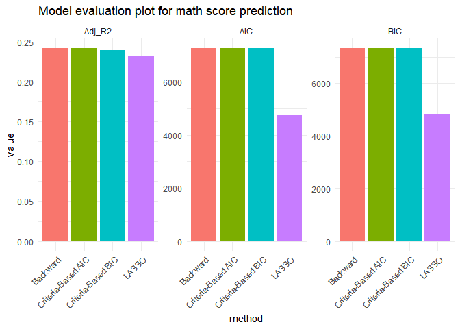

modeling
================
Yuhao Chang, Yonghao Yu
2024-12-15

``` r
library(readr)
library(MASS)      
library(glmnet)     
```

    ## 载入需要的程序包：Matrix

    ## Loaded glmnet 4.1-8

``` r
library(tidyverse) 
```

    ## ── Attaching core tidyverse packages ──────────────────────── tidyverse 2.0.0 ──
    ## ✔ dplyr     1.1.4     ✔ purrr     1.0.2
    ## ✔ forcats   1.0.0     ✔ stringr   1.5.1
    ## ✔ ggplot2   3.5.1     ✔ tibble    3.2.1
    ## ✔ lubridate 1.9.3     ✔ tidyr     1.3.1

    ## ── Conflicts ────────────────────────────────────────── tidyverse_conflicts() ──
    ## ✖ tidyr::expand() masks Matrix::expand()
    ## ✖ dplyr::filter() masks stats::filter()
    ## ✖ dplyr::lag()    masks stats::lag()
    ## ✖ tidyr::pack()   masks Matrix::pack()
    ## ✖ dplyr::select() masks MASS::select()
    ## ✖ tidyr::unpack() masks Matrix::unpack()
    ## ℹ Use the conflicted package (<http://conflicted.r-lib.org/>) to force all conflicts to become errors

``` r
library(lmtest)   
```

    ## Warning: 程序包'lmtest'是用R版本4.4.2 来建造的

    ## 载入需要的程序包：zoo

    ## Warning: 程序包'zoo'是用R版本4.4.2 来建造的

    ## 
    ## 载入程序包：'zoo'
    ## 
    ## The following objects are masked from 'package:base':
    ## 
    ##     as.Date, as.Date.numeric

``` r
library(car)
```

    ## 载入需要的程序包：carData
    ## 
    ## 载入程序包：'car'
    ## 
    ## The following object is masked from 'package:dplyr':
    ## 
    ##     recode
    ## 
    ## The following object is masked from 'package:purrr':
    ## 
    ##     some

``` r
library(ggplot2)
```

``` r
model_data=read_csv("./data/data_cleaned.csv") |>
  janitor::clean_names()
```

    ## Rows: 902 Columns: 30
    ## ── Column specification ────────────────────────────────────────────────────────
    ## Delimiter: ","
    ## dbl (30): Gender, EthnicGroupgroup A, EthnicGroupgroup B, EthnicGroupgroup C...
    ## 
    ## ℹ Use `spec()` to retrieve the full column specification for this data.
    ## ℹ Specify the column types or set `show_col_types = FALSE` to quiet this message.

``` r
str(model_data)
```

    ## spc_tbl_ [902 × 30] (S3: spec_tbl_df/tbl_df/tbl/data.frame)
    ##  $ gender                       : num [1:902] 0 0 0 1 1 0 0 1 1 1 ...
    ##  $ ethnic_groupgroup_a          : num [1:902] 0 0 0 1 0 0 0 0 0 0 ...
    ##  $ ethnic_groupgroup_b          : num [1:902] 0 0 1 0 0 1 1 1 0 0 ...
    ##  $ ethnic_groupgroup_c          : num [1:902] 0 1 0 0 1 0 0 0 0 1 ...
    ##  $ ethnic_groupgroup_d          : num [1:902] 0 0 0 0 0 0 0 0 1 0 ...
    ##  $ ethnic_groupgroup_e          : num [1:902] 0 0 0 0 0 0 0 0 0 0 ...
    ##  $ parent_educassociates_degree : num [1:902] 0 0 0 1 0 1 0 0 0 1 ...
    ##  $ parent_educbachelors_degree  : num [1:902] 1 0 0 0 0 0 0 0 0 0 ...
    ##  $ parent_educhigh_school       : num [1:902] 0 0 0 0 0 0 0 0 1 0 ...
    ##  $ parent_educmasters_degree    : num [1:902] 0 0 1 0 0 0 0 0 0 0 ...
    ##  $ parent_educsome_college      : num [1:902] 0 1 0 0 1 0 1 1 0 0 ...
    ##  $ parent_educsome_high_school  : num [1:902] 0 0 0 0 0 0 0 0 0 0 ...
    ##  $ lunch_type                   : num [1:902] 1 1 1 0 1 1 1 0 0 1 ...
    ##  $ test_prep                    : num [1:902] 1 0 1 1 1 1 1 1 1 1 ...
    ##  $ parent_marital_statusdivorced: num [1:902] 0 0 0 0 0 0 0 0 0 0 ...
    ##  $ parent_marital_statusmarried : num [1:902] 1 1 0 1 1 1 0 1 0 0 ...
    ##  $ parent_marital_statussingle  : num [1:902] 0 0 1 0 0 0 0 0 1 0 ...
    ##  $ parent_marital_statuswidowed : num [1:902] 0 0 0 0 0 0 1 0 0 0 ...
    ##  $ practice_sportnever          : num [1:902] 0 0 0 1 0 0 1 0 0 0 ...
    ##  $ practice_sportregularly      : num [1:902] 1 0 0 0 0 1 0 0 0 0 ...
    ##  $ practice_sportsometimes      : num [1:902] 0 1 1 0 1 0 0 1 1 1 ...
    ##  $ is_first_child               : num [1:902] 1 1 1 1 1 1 1 1 1 1 ...
    ##  $ nr_siblings                  : num [1:902] 3 0 4 1 0 1 1 1 3 1 ...
    ##  $ transport_means              : num [1:902] 1 0 1 0 1 1 1 1 1 1 ...
    ##  $ wkly_study_hours_5           : num [1:902] 1 0 1 0 0 0 0 0 0 0 ...
    ##  $ wkly_study_hours_10          : num [1:902] 0 0 0 0 0 0 0 1 1 0 ...
    ##  $ wkly_study_hours10_may       : num [1:902] 0 1 0 1 1 1 1 0 0 1 ...
    ##  $ math_score                   : num [1:902] 71 69 87 45 76 73 85 41 65 58 ...
    ##  $ reading_score                : num [1:902] 71 90 93 56 78 84 93 43 64 54 ...
    ##  $ writing_score                : num [1:902] 74 88 91 42 75 79 89 39 68 52 ...
    ##  - attr(*, "spec")=
    ##   .. cols(
    ##   ..   Gender = col_double(),
    ##   ..   `EthnicGroupgroup A` = col_double(),
    ##   ..   `EthnicGroupgroup B` = col_double(),
    ##   ..   `EthnicGroupgroup C` = col_double(),
    ##   ..   `EthnicGroupgroup D` = col_double(),
    ##   ..   `EthnicGroupgroup E` = col_double(),
    ##   ..   `ParentEducassociate's degree` = col_double(),
    ##   ..   `ParentEducbachelor's degree` = col_double(),
    ##   ..   `ParentEduchigh school` = col_double(),
    ##   ..   `ParentEducmaster's degree` = col_double(),
    ##   ..   `ParentEducsome college` = col_double(),
    ##   ..   `ParentEducsome high school` = col_double(),
    ##   ..   LunchType = col_double(),
    ##   ..   TestPrep = col_double(),
    ##   ..   ParentMaritalStatusdivorced = col_double(),
    ##   ..   ParentMaritalStatusmarried = col_double(),
    ##   ..   ParentMaritalStatussingle = col_double(),
    ##   ..   ParentMaritalStatuswidowed = col_double(),
    ##   ..   PracticeSportnever = col_double(),
    ##   ..   PracticeSportregularly = col_double(),
    ##   ..   PracticeSportsometimes = col_double(),
    ##   ..   IsFirstChild = col_double(),
    ##   ..   NrSiblings = col_double(),
    ##   ..   TransportMeans = col_double(),
    ##   ..   `WklyStudyHours< 5` = col_double(),
    ##   ..   `WklyStudyHours> 10` = col_double(),
    ##   ..   `WklyStudyHours10-May` = col_double(),
    ##   ..   MathScore = col_double(),
    ##   ..   ReadingScore = col_double(),
    ##   ..   WritingScore = col_double()
    ##   .. )
    ##  - attr(*, "problems")=<externalptr>

# Mathscore

## backward elimination

``` r
X <- model_data %>%
  select(-math_score, -reading_score, -writing_score)  
y <- model_data$math_score  

# The initial full-variable model
full_model <- lm(math_score ~ ., data = model_data[, c(colnames(X), "math_score")])

# backward elimination
backward_model <- stepAIC(full_model, direction = "backward")
```

    ## Start:  AIC=4739.83
    ## math_score ~ gender + ethnic_groupgroup_a + ethnic_groupgroup_b + 
    ##     ethnic_groupgroup_c + ethnic_groupgroup_d + ethnic_groupgroup_e + 
    ##     parent_educassociates_degree + parent_educbachelors_degree + 
    ##     parent_educhigh_school + parent_educmasters_degree + parent_educsome_college + 
    ##     parent_educsome_high_school + lunch_type + test_prep + parent_marital_statusdivorced + 
    ##     parent_marital_statusmarried + parent_marital_statussingle + 
    ##     parent_marital_statuswidowed + practice_sportnever + practice_sportregularly + 
    ##     practice_sportsometimes + is_first_child + nr_siblings + 
    ##     transport_means + wkly_study_hours_5 + wkly_study_hours_10 + 
    ##     wkly_study_hours10_may
    ## 
    ##                                 Df Sum of Sq    RSS    AIC
    ## - is_first_child                 1       0.1 162321 4737.8
    ## - parent_educsome_high_school    1       0.1 162321 4737.8
    ## - wkly_study_hours_10            1       0.1 162321 4737.8
    ## - parent_marital_statusdivorced  1       1.2 162322 4737.8
    ## - ethnic_groupgroup_b            1       1.2 162322 4737.8
    ## - ethnic_groupgroup_c            1       2.2 162323 4737.8
    ## - parent_marital_statussingle    1       2.3 162324 4737.8
    ## - practice_sportsometimes        1       5.3 162327 4737.9
    ## - wkly_study_hours10_may         1      16.4 162338 4737.9
    ## - transport_means                1      19.7 162341 4737.9
    ## - practice_sportnever            1      21.1 162342 4737.9
    ## - practice_sportregularly        1      22.4 162344 4738.0
    ## - test_prep                      1      45.6 162367 4738.1
    ## - parent_educhigh_school         1      58.1 162379 4738.2
    ## - ethnic_groupgroup_a            1      65.4 162387 4738.2
    ## - nr_siblings                    1      80.4 162402 4738.3
    ## - parent_marital_statuswidowed   1     324.8 162646 4739.6
    ## <none>                                       162321 4739.8
    ## - parent_marital_statusmarried   1     383.1 162704 4740.0
    ## - ethnic_groupgroup_d            1     462.2 162783 4740.4
    ## - parent_educsome_college        1     511.1 162832 4740.7
    ## - wkly_study_hours_5             1     567.1 162888 4741.0
    ## - parent_educassociates_degree   1     844.1 163165 4742.5
    ## - parent_educmasters_degree      1    1156.2 163477 4744.2
    ## - parent_educbachelors_degree    1    1205.9 163527 4744.5
    ## - ethnic_groupgroup_e            1    2832.4 165154 4753.4
    ## - gender                         1    5943.3 168265 4770.3
    ## - lunch_type                     1   24939.5 187261 4866.7
    ## 
    ## Step:  AIC=4737.83
    ## math_score ~ gender + ethnic_groupgroup_a + ethnic_groupgroup_b + 
    ##     ethnic_groupgroup_c + ethnic_groupgroup_d + ethnic_groupgroup_e + 
    ##     parent_educassociates_degree + parent_educbachelors_degree + 
    ##     parent_educhigh_school + parent_educmasters_degree + parent_educsome_college + 
    ##     parent_educsome_high_school + lunch_type + test_prep + parent_marital_statusdivorced + 
    ##     parent_marital_statusmarried + parent_marital_statussingle + 
    ##     parent_marital_statuswidowed + practice_sportnever + practice_sportregularly + 
    ##     practice_sportsometimes + nr_siblings + transport_means + 
    ##     wkly_study_hours_5 + wkly_study_hours_10 + wkly_study_hours10_may
    ## 
    ##                                 Df Sum of Sq    RSS    AIC
    ## - parent_educsome_high_school    1       0.1 162321 4735.8
    ## - wkly_study_hours_10            1       0.1 162321 4735.8
    ## - parent_marital_statusdivorced  1       1.2 162323 4735.8
    ## - ethnic_groupgroup_b            1       1.2 162323 4735.8
    ## - ethnic_groupgroup_c            1       2.2 162324 4735.8
    ## - parent_marital_statussingle    1       2.3 162324 4735.8
    ## - practice_sportsometimes        1       5.4 162327 4735.9
    ## - wkly_study_hours10_may         1      16.4 162338 4735.9
    ## - transport_means                1      19.7 162341 4735.9
    ## - practice_sportnever            1      21.1 162342 4735.9
    ## - practice_sportregularly        1      22.4 162344 4736.0
    ## - test_prep                      1      45.5 162367 4736.1
    ## - parent_educhigh_school         1      58.1 162379 4736.2
    ## - ethnic_groupgroup_a            1      65.7 162387 4736.2
    ## - nr_siblings                    1      80.4 162402 4736.3
    ## - parent_marital_statuswidowed   1     324.8 162646 4737.6
    ## <none>                                       162321 4737.8
    ## - parent_marital_statusmarried   1     384.0 162705 4738.0
    ## - ethnic_groupgroup_d            1     462.4 162784 4738.4
    ## - parent_educsome_college        1     511.1 162832 4738.7
    ## - wkly_study_hours_5             1     567.1 162888 4739.0
    ## - parent_educassociates_degree   1     844.9 163166 4740.5
    ## - parent_educmasters_degree      1    1156.2 163478 4742.2
    ## - parent_educbachelors_degree    1    1207.1 163528 4742.5
    ## - ethnic_groupgroup_e            1    2832.7 165154 4751.4
    ## - gender                         1    5950.2 168271 4768.3
    ## - lunch_type                     1   24987.4 187309 4865.0
    ## 
    ## Step:  AIC=4735.83
    ## math_score ~ gender + ethnic_groupgroup_a + ethnic_groupgroup_b + 
    ##     ethnic_groupgroup_c + ethnic_groupgroup_d + ethnic_groupgroup_e + 
    ##     parent_educassociates_degree + parent_educbachelors_degree + 
    ##     parent_educhigh_school + parent_educmasters_degree + parent_educsome_college + 
    ##     lunch_type + test_prep + parent_marital_statusdivorced + 
    ##     parent_marital_statusmarried + parent_marital_statussingle + 
    ##     parent_marital_statuswidowed + practice_sportnever + practice_sportregularly + 
    ##     practice_sportsometimes + nr_siblings + transport_means + 
    ##     wkly_study_hours_5 + wkly_study_hours_10 + wkly_study_hours10_may
    ## 
    ##                                 Df Sum of Sq    RSS    AIC
    ## - wkly_study_hours_10            1       0.1 162321 4733.8
    ## - parent_marital_statusdivorced  1       1.2 162323 4733.8
    ## - ethnic_groupgroup_b            1       1.2 162323 4733.8
    ## - ethnic_groupgroup_c            1       2.2 162324 4733.8
    ## - parent_marital_statussingle    1       2.3 162324 4733.8
    ## - practice_sportsometimes        1       5.4 162327 4733.9
    ## - wkly_study_hours10_may         1      16.4 162338 4733.9
    ## - transport_means                1      19.6 162341 4733.9
    ## - practice_sportnever            1      21.1 162342 4733.9
    ## - practice_sportregularly        1      22.4 162344 4734.0
    ## - test_prep                      1      45.5 162367 4734.1
    ## - ethnic_groupgroup_a            1      65.7 162387 4734.2
    ## - nr_siblings                    1      80.8 162402 4734.3
    ## - parent_educhigh_school         1     131.5 162453 4734.6
    ## - parent_marital_statuswidowed   1     324.8 162646 4735.6
    ## <none>                                       162321 4735.8
    ## - parent_marital_statusmarried   1     384.1 162705 4736.0
    ## - ethnic_groupgroup_d            1     462.8 162784 4736.4
    ## - wkly_study_hours_5             1     567.1 162888 4737.0
    ## - parent_educsome_college        1    1299.4 163621 4741.0
    ## - parent_educmasters_degree      1    1899.0 164220 4744.3
    ## - parent_educassociates_degree   1    2112.0 164433 4745.5
    ## - parent_educbachelors_degree    1    2437.7 164759 4747.3
    ## - ethnic_groupgroup_e            1    2836.3 165158 4749.5
    ## - gender                         1    5970.1 168291 4766.4
    ## - lunch_type                     1   24991.6 187313 4863.0
    ## 
    ## Step:  AIC=4733.83
    ## math_score ~ gender + ethnic_groupgroup_a + ethnic_groupgroup_b + 
    ##     ethnic_groupgroup_c + ethnic_groupgroup_d + ethnic_groupgroup_e + 
    ##     parent_educassociates_degree + parent_educbachelors_degree + 
    ##     parent_educhigh_school + parent_educmasters_degree + parent_educsome_college + 
    ##     lunch_type + test_prep + parent_marital_statusdivorced + 
    ##     parent_marital_statusmarried + parent_marital_statussingle + 
    ##     parent_marital_statuswidowed + practice_sportnever + practice_sportregularly + 
    ##     practice_sportsometimes + nr_siblings + transport_means + 
    ##     wkly_study_hours_5 + wkly_study_hours10_may
    ## 
    ##                                 Df Sum of Sq    RSS    AIC
    ## - parent_marital_statusdivorced  1       1.2 162323 4731.8
    ## - ethnic_groupgroup_b            1       1.2 162323 4731.8
    ## - ethnic_groupgroup_c            1       2.2 162324 4731.8
    ## - parent_marital_statussingle    1       2.4 162324 4731.8
    ## - practice_sportsometimes        1       5.5 162327 4731.9
    ## - transport_means                1      19.6 162341 4731.9
    ## - practice_sportnever            1      21.0 162343 4731.9
    ## - practice_sportregularly        1      22.6 162344 4732.0
    ## - test_prep                      1      45.4 162367 4732.1
    ## - wkly_study_hours10_may         1      54.1 162376 4732.1
    ## - ethnic_groupgroup_a            1      65.8 162387 4732.2
    ## - nr_siblings                    1      80.8 162402 4732.3
    ## - parent_educhigh_school         1     131.6 162453 4732.6
    ## - parent_marital_statuswidowed   1     324.7 162646 4733.6
    ## <none>                                       162321 4733.8
    ## - parent_marital_statusmarried   1     384.2 162706 4734.0
    ## - ethnic_groupgroup_d            1     462.8 162784 4734.4
    ## - parent_educsome_college        1    1299.4 163621 4739.0
    ## - wkly_study_hours_5             1    1742.2 164064 4741.5
    ## - parent_educmasters_degree      1    1904.9 164226 4742.4
    ## - parent_educassociates_degree   1    2113.9 164435 4743.5
    ## - parent_educbachelors_degree    1    2437.6 164759 4745.3
    ## - ethnic_groupgroup_e            1    2836.3 165158 4747.5
    ## - gender                         1    5970.0 168292 4764.4
    ## - lunch_type                     1   25027.5 187349 4861.2
    ## 
    ## Step:  AIC=4731.84
    ## math_score ~ gender + ethnic_groupgroup_a + ethnic_groupgroup_b + 
    ##     ethnic_groupgroup_c + ethnic_groupgroup_d + ethnic_groupgroup_e + 
    ##     parent_educassociates_degree + parent_educbachelors_degree + 
    ##     parent_educhigh_school + parent_educmasters_degree + parent_educsome_college + 
    ##     lunch_type + test_prep + parent_marital_statusmarried + parent_marital_statussingle + 
    ##     parent_marital_statuswidowed + practice_sportnever + practice_sportregularly + 
    ##     practice_sportsometimes + nr_siblings + transport_means + 
    ##     wkly_study_hours_5 + wkly_study_hours10_may
    ## 
    ##                                Df Sum of Sq    RSS    AIC
    ## - ethnic_groupgroup_b           1       1.1 162324 4729.8
    ## - ethnic_groupgroup_c           1       2.3 162325 4729.9
    ## - practice_sportsometimes       1       5.4 162328 4729.9
    ## - parent_marital_statussingle   1      14.9 162338 4729.9
    ## - transport_means               1      19.6 162342 4729.9
    ## - practice_sportnever           1      21.2 162344 4730.0
    ## - practice_sportregularly       1      22.3 162345 4730.0
    ## - test_prep                     1      46.3 162369 4730.1
    ## - wkly_study_hours10_may        1      53.8 162376 4730.1
    ## - ethnic_groupgroup_a           1      66.2 162389 4730.2
    ## - nr_siblings                   1      80.9 162404 4730.3
    ## - parent_educhigh_school        1     131.6 162454 4730.6
    ## <none>                                      162323 4731.8
    ## - ethnic_groupgroup_d           1     461.7 162784 4732.4
    ## - parent_marital_statuswidowed  1     464.9 162788 4732.4
    ## - parent_educsome_college       1    1302.2 163625 4737.0
    ## - parent_marital_statusmarried  1    1352.5 163675 4737.3
    ## - wkly_study_hours_5            1    1741.0 164064 4739.5
    ## - parent_educmasters_degree     1    1904.6 164227 4740.4
    ## - parent_educassociates_degree  1    2118.2 164441 4741.5
    ## - parent_educbachelors_degree   1    2447.4 164770 4743.3
    ## - ethnic_groupgroup_e           1    2842.3 165165 4745.5
    ## - gender                        1    5970.7 168293 4762.4
    ## - lunch_type                    1   25044.3 187367 4859.3
    ## 
    ## Step:  AIC=4729.85
    ## math_score ~ gender + ethnic_groupgroup_a + ethnic_groupgroup_c + 
    ##     ethnic_groupgroup_d + ethnic_groupgroup_e + parent_educassociates_degree + 
    ##     parent_educbachelors_degree + parent_educhigh_school + parent_educmasters_degree + 
    ##     parent_educsome_college + lunch_type + test_prep + parent_marital_statusmarried + 
    ##     parent_marital_statussingle + parent_marital_statuswidowed + 
    ##     practice_sportnever + practice_sportregularly + practice_sportsometimes + 
    ##     nr_siblings + transport_means + wkly_study_hours_5 + wkly_study_hours10_may
    ## 
    ##                                Df Sum of Sq    RSS    AIC
    ## - practice_sportsometimes       1       5.4 162329 4727.9
    ## - ethnic_groupgroup_c           1      14.3 162338 4727.9
    ## - parent_marital_statussingle   1      15.2 162339 4727.9
    ## - transport_means               1      19.7 162343 4728.0
    ## - practice_sportnever           1      21.3 162345 4728.0
    ## - practice_sportregularly       1      22.3 162346 4728.0
    ## - test_prep                     1      46.2 162370 4728.1
    ## - wkly_study_hours10_may        1      53.1 162377 4728.1
    ## - nr_siblings                   1      80.4 162404 4728.3
    ## - parent_educhigh_school        1     131.1 162455 4728.6
    ## - ethnic_groupgroup_a           1     136.1 162460 4728.6
    ## <none>                                      162324 4729.8
    ## - parent_marital_statuswidowed  1     463.8 162788 4730.4
    ## - ethnic_groupgroup_d           1    1069.7 163393 4733.8
    ## - parent_educsome_college       1    1302.0 163626 4735.1
    ## - parent_marital_statusmarried  1    1353.4 163677 4735.3
    ## - wkly_study_hours_5            1    1740.1 164064 4737.5
    ## - parent_educmasters_degree     1    1904.3 164228 4738.4
    ## - parent_educassociates_degree  1    2121.3 164445 4739.6
    ## - parent_educbachelors_degree   1    2447.8 164772 4741.3
    ## - ethnic_groupgroup_e           1    5552.4 167876 4758.2
    ## - gender                        1    5970.2 168294 4760.4
    ## - lunch_type                    1   25050.6 187374 4857.3
    ## 
    ## Step:  AIC=4727.88
    ## math_score ~ gender + ethnic_groupgroup_a + ethnic_groupgroup_c + 
    ##     ethnic_groupgroup_d + ethnic_groupgroup_e + parent_educassociates_degree + 
    ##     parent_educbachelors_degree + parent_educhigh_school + parent_educmasters_degree + 
    ##     parent_educsome_college + lunch_type + test_prep + parent_marital_statusmarried + 
    ##     parent_marital_statussingle + parent_marital_statuswidowed + 
    ##     practice_sportnever + practice_sportregularly + nr_siblings + 
    ##     transport_means + wkly_study_hours_5 + wkly_study_hours10_may
    ## 
    ##                                Df Sum of Sq    RSS    AIC
    ## - ethnic_groupgroup_c           1      13.6 162343 4726.0
    ## - parent_marital_statussingle   1      15.8 162345 4726.0
    ## - transport_means               1      20.3 162349 4726.0
    ## - test_prep                     1      45.2 162374 4726.1
    ## - wkly_study_hours10_may        1      52.6 162382 4726.2
    ## - nr_siblings                   1      79.6 162409 4726.3
    ## - practice_sportregularly       1      83.5 162413 4726.3
    ## - parent_educhigh_school        1     130.5 162460 4726.6
    ## - ethnic_groupgroup_a           1     135.2 162464 4726.6
    ## - practice_sportnever           1     296.4 162626 4727.5
    ## <none>                                      162329 4727.9
    ## - parent_marital_statuswidowed  1     460.9 162790 4728.4
    ## - ethnic_groupgroup_d           1    1069.7 163399 4731.8
    ## - parent_educsome_college       1    1297.4 163626 4733.1
    ## - parent_marital_statusmarried  1    1350.4 163679 4733.3
    ## - wkly_study_hours_5            1    1734.9 164064 4735.5
    ## - parent_educmasters_degree     1    1902.7 164232 4736.4
    ## - parent_educassociates_degree  1    2120.2 164449 4737.6
    ## - parent_educbachelors_degree   1    2458.3 164787 4739.4
    ## - ethnic_groupgroup_e           1    5548.1 167877 4756.2
    ## - gender                        1    5965.8 168295 4758.4
    ## - lunch_type                    1   25072.0 187401 4855.4
    ## 
    ## Step:  AIC=4725.95
    ## math_score ~ gender + ethnic_groupgroup_a + ethnic_groupgroup_d + 
    ##     ethnic_groupgroup_e + parent_educassociates_degree + parent_educbachelors_degree + 
    ##     parent_educhigh_school + parent_educmasters_degree + parent_educsome_college + 
    ##     lunch_type + test_prep + parent_marital_statusmarried + parent_marital_statussingle + 
    ##     parent_marital_statuswidowed + practice_sportnever + practice_sportregularly + 
    ##     nr_siblings + transport_means + wkly_study_hours_5 + wkly_study_hours10_may
    ## 
    ##                                Df Sum of Sq    RSS    AIC
    ## - parent_marital_statussingle   1      16.2 162359 4724.0
    ## - transport_means               1      24.4 162367 4724.1
    ## - test_prep                     1      46.3 162389 4724.2
    ## - wkly_study_hours10_may        1      56.0 162399 4724.3
    ## - nr_siblings                   1      77.8 162421 4724.4
    ## - practice_sportregularly       1      86.3 162429 4724.4
    ## - ethnic_groupgroup_a           1     122.0 162465 4724.6
    ## - parent_educhigh_school        1     132.4 162475 4724.7
    ## - practice_sportnever           1     292.1 162635 4725.6
    ## <none>                                      162343 4726.0
    ## - parent_marital_statuswidowed  1     474.5 162817 4726.6
    ## - parent_educsome_college       1    1292.2 163635 4731.1
    ## - parent_marital_statusmarried  1    1353.7 163696 4731.4
    ## - ethnic_groupgroup_d           1    1660.3 164003 4733.1
    ## - wkly_study_hours_5            1    1730.8 164074 4733.5
    ## - parent_educmasters_degree     1    1890.0 164233 4734.4
    ## - parent_educassociates_degree  1    2118.0 164461 4735.6
    ## - parent_educbachelors_degree   1    2448.4 164791 4737.5
    ## - gender                        1    5975.6 168318 4756.6
    ## - ethnic_groupgroup_e           1    7055.3 169398 4762.3
    ## - lunch_type                    1   25069.9 187413 4853.5
    ## 
    ## Step:  AIC=4724.04
    ## math_score ~ gender + ethnic_groupgroup_a + ethnic_groupgroup_d + 
    ##     ethnic_groupgroup_e + parent_educassociates_degree + parent_educbachelors_degree + 
    ##     parent_educhigh_school + parent_educmasters_degree + parent_educsome_college + 
    ##     lunch_type + test_prep + parent_marital_statusmarried + parent_marital_statuswidowed + 
    ##     practice_sportnever + practice_sportregularly + nr_siblings + 
    ##     transport_means + wkly_study_hours_5 + wkly_study_hours10_may
    ## 
    ##                                Df Sum of Sq    RSS    AIC
    ## - transport_means               1      25.7 162385 4722.2
    ## - test_prep                     1      44.0 162403 4722.3
    ## - wkly_study_hours10_may        1      58.4 162417 4722.4
    ## - nr_siblings                   1      79.9 162439 4722.5
    ## - practice_sportregularly       1      89.8 162449 4722.5
    ## - ethnic_groupgroup_a           1     124.8 162484 4722.7
    ## - parent_educhigh_school        1     136.2 162495 4722.8
    ## - practice_sportnever           1     294.9 162654 4723.7
    ## <none>                                      162359 4724.0
    ## - parent_marital_statuswidowed  1     460.2 162819 4724.6
    ## - parent_educsome_college       1    1283.6 163643 4729.1
    ## - ethnic_groupgroup_d           1    1652.6 164012 4731.2
    ## - wkly_study_hours_5            1    1729.4 164088 4731.6
    ## - parent_educmasters_degree     1    1888.4 164247 4732.5
    ## - parent_marital_statusmarried  1    1905.0 164264 4732.6
    ## - parent_educassociates_degree  1    2109.0 164468 4733.7
    ## - parent_educbachelors_degree   1    2446.3 164805 4735.5
    ## - gender                        1    5964.1 168323 4754.6
    ## - ethnic_groupgroup_e           1    7048.8 169408 4760.4
    ## - lunch_type                    1   25129.2 187488 4851.8
    ## 
    ## Step:  AIC=4722.18
    ## math_score ~ gender + ethnic_groupgroup_a + ethnic_groupgroup_d + 
    ##     ethnic_groupgroup_e + parent_educassociates_degree + parent_educbachelors_degree + 
    ##     parent_educhigh_school + parent_educmasters_degree + parent_educsome_college + 
    ##     lunch_type + test_prep + parent_marital_statusmarried + parent_marital_statuswidowed + 
    ##     practice_sportnever + practice_sportregularly + nr_siblings + 
    ##     wkly_study_hours_5 + wkly_study_hours10_may
    ## 
    ##                                Df Sum of Sq    RSS    AIC
    ## - test_prep                     1      50.1 162435 4720.5
    ## - wkly_study_hours10_may        1      58.4 162443 4720.5
    ## - nr_siblings                   1      84.3 162469 4720.7
    ## - practice_sportregularly       1      87.8 162472 4720.7
    ## - ethnic_groupgroup_a           1     124.3 162509 4720.9
    ## - parent_educhigh_school        1     136.1 162521 4720.9
    ## - practice_sportnever           1     307.5 162692 4721.9
    ## <none>                                      162385 4722.2
    ## - parent_marital_statuswidowed  1     455.3 162840 4722.7
    ## - parent_educsome_college       1    1272.2 163657 4727.2
    ## - ethnic_groupgroup_d           1    1656.4 164041 4729.3
    ## - wkly_study_hours_5            1    1753.6 164138 4729.9
    ## - parent_educmasters_degree     1    1901.1 164286 4730.7
    ## - parent_marital_statusmarried  1    1925.3 164310 4730.8
    ## - parent_educassociates_degree  1    2126.8 164511 4731.9
    ## - parent_educbachelors_degree   1    2452.2 164837 4733.7
    ## - gender                        1    5942.5 168327 4752.6
    ## - ethnic_groupgroup_e           1    7157.2 169542 4759.1
    ## - lunch_type                    1   25106.1 187491 4849.9
    ## 
    ## Step:  AIC=4720.46
    ## math_score ~ gender + ethnic_groupgroup_a + ethnic_groupgroup_d + 
    ##     ethnic_groupgroup_e + parent_educassociates_degree + parent_educbachelors_degree + 
    ##     parent_educhigh_school + parent_educmasters_degree + parent_educsome_college + 
    ##     lunch_type + parent_marital_statusmarried + parent_marital_statuswidowed + 
    ##     practice_sportnever + practice_sportregularly + nr_siblings + 
    ##     wkly_study_hours_5 + wkly_study_hours10_may
    ## 
    ##                                Df Sum of Sq    RSS    AIC
    ## - wkly_study_hours10_may        1      66.8 162502 4718.8
    ## - nr_siblings                   1      80.2 162515 4718.9
    ## - practice_sportregularly       1      86.6 162521 4718.9
    ## - ethnic_groupgroup_a           1     121.7 162556 4719.1
    ## - parent_educhigh_school        1     136.5 162571 4719.2
    ## - practice_sportnever           1     297.3 162732 4720.1
    ## <none>                                      162435 4720.5
    ## - parent_marital_statuswidowed  1     461.0 162896 4721.0
    ## - parent_educsome_college       1    1255.8 163691 4725.4
    ## - ethnic_groupgroup_d           1    1683.3 164118 4727.8
    ## - wkly_study_hours_5            1    1805.9 164241 4728.4
    ## - parent_educmasters_degree     1    1896.7 164331 4728.9
    ## - parent_marital_statusmarried  1    1926.5 164361 4729.1
    ## - parent_educassociates_degree  1    2118.9 164554 4730.2
    ## - parent_educbachelors_degree   1    2483.7 164918 4732.1
    ## - gender                        1    5935.4 168370 4750.8
    ## - ethnic_groupgroup_e           1    7200.2 169635 4757.6
    ## - lunch_type                    1   25198.0 187633 4848.5
    ## 
    ## Step:  AIC=4718.83
    ## math_score ~ gender + ethnic_groupgroup_a + ethnic_groupgroup_d + 
    ##     ethnic_groupgroup_e + parent_educassociates_degree + parent_educbachelors_degree + 
    ##     parent_educhigh_school + parent_educmasters_degree + parent_educsome_college + 
    ##     lunch_type + parent_marital_statusmarried + parent_marital_statuswidowed + 
    ##     practice_sportnever + practice_sportregularly + nr_siblings + 
    ##     wkly_study_hours_5
    ## 
    ##                                Df Sum of Sq    RSS    AIC
    ## - practice_sportregularly       1      81.6 162583 4717.3
    ## - nr_siblings                   1      85.0 162587 4717.3
    ## - ethnic_groupgroup_a           1     117.9 162620 4717.5
    ## - parent_educhigh_school        1     134.0 162636 4717.6
    ## - practice_sportnever           1     309.7 162811 4718.6
    ## <none>                                      162502 4718.8
    ## - parent_marital_statuswidowed  1     448.0 162950 4719.3
    ## - parent_educsome_college       1    1295.6 163797 4724.0
    ## - ethnic_groupgroup_d           1    1737.6 164239 4726.4
    ## - parent_educmasters_degree     1    1896.0 164398 4727.3
    ## - parent_marital_statusmarried  1    1917.3 164419 4727.4
    ## - parent_educassociates_degree  1    2153.7 164655 4728.7
    ## - wkly_study_hours_5            1    2393.1 164895 4730.0
    ## - parent_educbachelors_degree   1    2519.6 165021 4730.7
    ## - gender                        1    5979.1 168481 4749.4
    ## - ethnic_groupgroup_e           1    7347.2 169849 4756.7
    ## - lunch_type                    1   25144.3 187646 4846.6
    ## 
    ## Step:  AIC=4717.29
    ## math_score ~ gender + ethnic_groupgroup_a + ethnic_groupgroup_d + 
    ##     ethnic_groupgroup_e + parent_educassociates_degree + parent_educbachelors_degree + 
    ##     parent_educhigh_school + parent_educmasters_degree + parent_educsome_college + 
    ##     lunch_type + parent_marital_statusmarried + parent_marital_statuswidowed + 
    ##     practice_sportnever + nr_siblings + wkly_study_hours_5
    ## 
    ##                                Df Sum of Sq    RSS    AIC
    ## - nr_siblings                   1      80.6 162664 4715.7
    ## - ethnic_groupgroup_a           1     120.4 162704 4716.0
    ## - parent_educhigh_school        1     127.8 162711 4716.0
    ## <none>                                      162583 4717.3
    ## - practice_sportnever           1     435.0 163018 4717.7
    ## - parent_marital_statuswidowed  1     474.8 163058 4717.9
    ## - parent_educsome_college       1    1327.1 163910 4722.6
    ## - ethnic_groupgroup_d           1    1729.6 164313 4724.8
    ## - parent_educmasters_degree     1    1866.3 164449 4725.6
    ## - parent_marital_statusmarried  1    1898.9 164482 4725.8
    ## - parent_educassociates_degree  1    2197.8 164781 4727.4
    ## - wkly_study_hours_5            1    2368.9 164952 4728.3
    ## - parent_educbachelors_degree   1    2519.0 165102 4729.2
    ## - gender                        1    5984.5 168568 4747.9
    ## - ethnic_groupgroup_e           1    7412.4 169996 4755.5
    ## - lunch_type                    1   25101.7 187685 4844.8
    ## 
    ## Step:  AIC=4715.73
    ## math_score ~ gender + ethnic_groupgroup_a + ethnic_groupgroup_d + 
    ##     ethnic_groupgroup_e + parent_educassociates_degree + parent_educbachelors_degree + 
    ##     parent_educhigh_school + parent_educmasters_degree + parent_educsome_college + 
    ##     lunch_type + parent_marital_statusmarried + parent_marital_statuswidowed + 
    ##     practice_sportnever + wkly_study_hours_5
    ## 
    ##                                Df Sum of Sq    RSS    AIC
    ## - ethnic_groupgroup_a           1     113.6 162777 4714.4
    ## - parent_educhigh_school        1     120.9 162785 4714.4
    ## <none>                                      162664 4715.7
    ## - practice_sportnever           1     439.5 163103 4716.2
    ## - parent_marital_statuswidowed  1     496.4 163160 4716.5
    ## - parent_educsome_college       1    1343.2 164007 4721.2
    ## - ethnic_groupgroup_d           1    1723.0 164387 4723.2
    ## - parent_educmasters_degree     1    1851.0 164515 4723.9
    ## - parent_marital_statusmarried  1    1917.0 164581 4724.3
    ## - parent_educassociates_degree  1    2204.9 164869 4725.9
    ## - wkly_study_hours_5            1    2415.0 165079 4727.0
    ## - parent_educbachelors_degree   1    2508.8 165173 4727.5
    ## - gender                        1    5945.6 168609 4746.1
    ## - ethnic_groupgroup_e           1    7451.7 170115 4754.1
    ## - lunch_type                    1   25032.8 187697 4842.8
    ## 
    ## Step:  AIC=4714.36
    ## math_score ~ gender + ethnic_groupgroup_d + ethnic_groupgroup_e + 
    ##     parent_educassociates_degree + parent_educbachelors_degree + 
    ##     parent_educhigh_school + parent_educmasters_degree + parent_educsome_college + 
    ##     lunch_type + parent_marital_statusmarried + parent_marital_statuswidowed + 
    ##     practice_sportnever + wkly_study_hours_5
    ## 
    ##                                Df Sum of Sq    RSS    AIC
    ## - parent_educhigh_school        1     117.3 162895 4713.0
    ## <none>                                      162777 4714.4
    ## - practice_sportnever           1     451.4 163229 4714.9
    ## - parent_marital_statuswidowed  1     532.5 163310 4715.3
    ## - parent_educsome_college       1    1367.7 164145 4719.9
    ## - parent_educmasters_degree     1    1876.6 164654 4722.7
    ## - parent_marital_statusmarried  1    1948.7 164726 4723.1
    ## - ethnic_groupgroup_d           1    2013.8 164791 4723.5
    ## - parent_educassociates_degree  1    2284.9 165062 4724.9
    ## - wkly_study_hours_5            1    2342.2 165120 4725.2
    ## - parent_educbachelors_degree   1    2556.4 165334 4726.4
    ## - gender                        1    5866.0 168643 4744.3
    ## - ethnic_groupgroup_e           1    7975.9 170753 4755.5
    ## - lunch_type                    1   25176.9 187954 4842.1
    ## 
    ## Step:  AIC=4713.01
    ## math_score ~ gender + ethnic_groupgroup_d + ethnic_groupgroup_e + 
    ##     parent_educassociates_degree + parent_educbachelors_degree + 
    ##     parent_educmasters_degree + parent_educsome_college + lunch_type + 
    ##     parent_marital_statusmarried + parent_marital_statuswidowed + 
    ##     practice_sportnever + wkly_study_hours_5
    ## 
    ##                                Df Sum of Sq    RSS    AIC
    ## <none>                                      162895 4713.0
    ## - practice_sportnever           1     422.5 163317 4713.3
    ## - parent_marital_statuswidowed  1     518.8 163413 4713.9
    ## - parent_marital_statusmarried  1    1913.4 164808 4721.5
    ## - ethnic_groupgroup_d           1    2056.7 164951 4722.3
    ## - parent_educsome_college       1    2266.4 165161 4723.5
    ## - wkly_study_hours_5            1    2331.4 165226 4723.8
    ## - parent_educmasters_degree     1    2369.4 165264 4724.0
    ## - parent_educbachelors_degree   1    3502.7 166397 4730.2
    ## - parent_educassociates_degree  1    3560.0 166455 4730.5
    ## - gender                        1    5837.2 168732 4742.8
    ## - ethnic_groupgroup_e           1    8004.6 170899 4754.3
    ## - lunch_type                    1   25198.9 188094 4840.8

``` r
summary(backward_model)
```

    ## 
    ## Call:
    ## lm(formula = math_score ~ gender + ethnic_groupgroup_d + ethnic_groupgroup_e + 
    ##     parent_educassociates_degree + parent_educbachelors_degree + 
    ##     parent_educmasters_degree + parent_educsome_college + lunch_type + 
    ##     parent_marital_statusmarried + parent_marital_statuswidowed + 
    ##     practice_sportnever + wkly_study_hours_5, data = model_data[, 
    ##     c(colnames(X), "math_score")])
    ## 
    ## Residuals:
    ##     Min      1Q  Median      3Q     Max 
    ## -50.541  -8.921   0.415   9.359  33.770 
    ## 
    ## Coefficients:
    ##                              Estimate Std. Error t value Pr(>|t|)    
    ## (Intercept)                   50.5405     1.2250  41.259  < 2e-16 ***
    ## gender                         5.1147     0.9062   5.644 2.23e-08 ***
    ## ethnic_groupgroup_d            3.5837     1.0697   3.350 0.000841 ***
    ## ethnic_groupgroup_e            9.1909     1.3906   6.609 6.64e-11 ***
    ## parent_educassociates_degree   5.3674     1.2177   4.408 1.17e-05 ***
    ## parent_educbachelors_degree    6.7823     1.5512   4.372 1.38e-05 ***
    ## parent_educmasters_degree      7.2468     2.0152   3.596 0.000341 ***
    ## parent_educsome_college        4.2344     1.2040   3.517 0.000459 ***
    ## lunch_type                    11.1061     0.9471  11.727  < 2e-16 ***
    ## parent_marital_statusmarried   2.9939     0.9265   3.231 0.001277 ** 
    ## parent_marital_statuswidowed   4.8097     2.8584   1.683 0.092791 .  
    ## practice_sportnever           -2.1389     1.4087  -1.518 0.129270    
    ## wkly_study_hours_5            -3.6573     1.0253  -3.567 0.000380 ***
    ## ---
    ## Signif. codes:  0 '***' 0.001 '**' 0.01 '*' 0.05 '.' 0.1 ' ' 1
    ## 
    ## Residual standard error: 13.54 on 889 degrees of freedom
    ## Multiple R-squared:  0.2525, Adjusted R-squared:  0.2424 
    ## F-statistic: 25.03 on 12 and 889 DF,  p-value: < 2.2e-16

## criteria-based

``` r
# Perform stepwise selection based on AIC using stepAIC
aic_model <- stepAIC(full_model, direction = "both", k = 2)  
```

    ## Start:  AIC=4739.83
    ## math_score ~ gender + ethnic_groupgroup_a + ethnic_groupgroup_b + 
    ##     ethnic_groupgroup_c + ethnic_groupgroup_d + ethnic_groupgroup_e + 
    ##     parent_educassociates_degree + parent_educbachelors_degree + 
    ##     parent_educhigh_school + parent_educmasters_degree + parent_educsome_college + 
    ##     parent_educsome_high_school + lunch_type + test_prep + parent_marital_statusdivorced + 
    ##     parent_marital_statusmarried + parent_marital_statussingle + 
    ##     parent_marital_statuswidowed + practice_sportnever + practice_sportregularly + 
    ##     practice_sportsometimes + is_first_child + nr_siblings + 
    ##     transport_means + wkly_study_hours_5 + wkly_study_hours_10 + 
    ##     wkly_study_hours10_may
    ## 
    ##                                 Df Sum of Sq    RSS    AIC
    ## - is_first_child                 1       0.1 162321 4737.8
    ## - parent_educsome_high_school    1       0.1 162321 4737.8
    ## - wkly_study_hours_10            1       0.1 162321 4737.8
    ## - parent_marital_statusdivorced  1       1.2 162322 4737.8
    ## - ethnic_groupgroup_b            1       1.2 162322 4737.8
    ## - ethnic_groupgroup_c            1       2.2 162323 4737.8
    ## - parent_marital_statussingle    1       2.3 162324 4737.8
    ## - practice_sportsometimes        1       5.3 162327 4737.9
    ## - wkly_study_hours10_may         1      16.4 162338 4737.9
    ## - transport_means                1      19.7 162341 4737.9
    ## - practice_sportnever            1      21.1 162342 4737.9
    ## - practice_sportregularly        1      22.4 162344 4738.0
    ## - test_prep                      1      45.6 162367 4738.1
    ## - parent_educhigh_school         1      58.1 162379 4738.2
    ## - ethnic_groupgroup_a            1      65.4 162387 4738.2
    ## - nr_siblings                    1      80.4 162402 4738.3
    ## - parent_marital_statuswidowed   1     324.8 162646 4739.6
    ## <none>                                       162321 4739.8
    ## - parent_marital_statusmarried   1     383.1 162704 4740.0
    ## - ethnic_groupgroup_d            1     462.2 162783 4740.4
    ## - parent_educsome_college        1     511.1 162832 4740.7
    ## - wkly_study_hours_5             1     567.1 162888 4741.0
    ## - parent_educassociates_degree   1     844.1 163165 4742.5
    ## - parent_educmasters_degree      1    1156.2 163477 4744.2
    ## - parent_educbachelors_degree    1    1205.9 163527 4744.5
    ## - ethnic_groupgroup_e            1    2832.4 165154 4753.4
    ## - gender                         1    5943.3 168265 4770.3
    ## - lunch_type                     1   24939.5 187261 4866.7
    ## 
    ## Step:  AIC=4737.83
    ## math_score ~ gender + ethnic_groupgroup_a + ethnic_groupgroup_b + 
    ##     ethnic_groupgroup_c + ethnic_groupgroup_d + ethnic_groupgroup_e + 
    ##     parent_educassociates_degree + parent_educbachelors_degree + 
    ##     parent_educhigh_school + parent_educmasters_degree + parent_educsome_college + 
    ##     parent_educsome_high_school + lunch_type + test_prep + parent_marital_statusdivorced + 
    ##     parent_marital_statusmarried + parent_marital_statussingle + 
    ##     parent_marital_statuswidowed + practice_sportnever + practice_sportregularly + 
    ##     practice_sportsometimes + nr_siblings + transport_means + 
    ##     wkly_study_hours_5 + wkly_study_hours_10 + wkly_study_hours10_may
    ## 
    ##                                 Df Sum of Sq    RSS    AIC
    ## - parent_educsome_high_school    1       0.1 162321 4735.8
    ## - wkly_study_hours_10            1       0.1 162321 4735.8
    ## - parent_marital_statusdivorced  1       1.2 162323 4735.8
    ## - ethnic_groupgroup_b            1       1.2 162323 4735.8
    ## - ethnic_groupgroup_c            1       2.2 162324 4735.8
    ## - parent_marital_statussingle    1       2.3 162324 4735.8
    ## - practice_sportsometimes        1       5.4 162327 4735.9
    ## - wkly_study_hours10_may         1      16.4 162338 4735.9
    ## - transport_means                1      19.7 162341 4735.9
    ## - practice_sportnever            1      21.1 162342 4735.9
    ## - practice_sportregularly        1      22.4 162344 4736.0
    ## - test_prep                      1      45.5 162367 4736.1
    ## - parent_educhigh_school         1      58.1 162379 4736.2
    ## - ethnic_groupgroup_a            1      65.7 162387 4736.2
    ## - nr_siblings                    1      80.4 162402 4736.3
    ## - parent_marital_statuswidowed   1     324.8 162646 4737.6
    ## <none>                                       162321 4737.8
    ## - parent_marital_statusmarried   1     384.0 162705 4738.0
    ## - ethnic_groupgroup_d            1     462.4 162784 4738.4
    ## - parent_educsome_college        1     511.1 162832 4738.7
    ## - wkly_study_hours_5             1     567.1 162888 4739.0
    ## + is_first_child                 1       0.1 162321 4739.8
    ## - parent_educassociates_degree   1     844.9 163166 4740.5
    ## - parent_educmasters_degree      1    1156.2 163478 4742.2
    ## - parent_educbachelors_degree    1    1207.1 163528 4742.5
    ## - ethnic_groupgroup_e            1    2832.7 165154 4751.4
    ## - gender                         1    5950.2 168271 4768.3
    ## - lunch_type                     1   24987.4 187309 4865.0
    ## 
    ## Step:  AIC=4735.83
    ## math_score ~ gender + ethnic_groupgroup_a + ethnic_groupgroup_b + 
    ##     ethnic_groupgroup_c + ethnic_groupgroup_d + ethnic_groupgroup_e + 
    ##     parent_educassociates_degree + parent_educbachelors_degree + 
    ##     parent_educhigh_school + parent_educmasters_degree + parent_educsome_college + 
    ##     lunch_type + test_prep + parent_marital_statusdivorced + 
    ##     parent_marital_statusmarried + parent_marital_statussingle + 
    ##     parent_marital_statuswidowed + practice_sportnever + practice_sportregularly + 
    ##     practice_sportsometimes + nr_siblings + transport_means + 
    ##     wkly_study_hours_5 + wkly_study_hours_10 + wkly_study_hours10_may
    ## 
    ##                                 Df Sum of Sq    RSS    AIC
    ## - wkly_study_hours_10            1       0.1 162321 4733.8
    ## - parent_marital_statusdivorced  1       1.2 162323 4733.8
    ## - ethnic_groupgroup_b            1       1.2 162323 4733.8
    ## - ethnic_groupgroup_c            1       2.2 162324 4733.8
    ## - parent_marital_statussingle    1       2.3 162324 4733.8
    ## - practice_sportsometimes        1       5.4 162327 4733.9
    ## - wkly_study_hours10_may         1      16.4 162338 4733.9
    ## - transport_means                1      19.6 162341 4733.9
    ## - practice_sportnever            1      21.1 162342 4733.9
    ## - practice_sportregularly        1      22.4 162344 4734.0
    ## - test_prep                      1      45.5 162367 4734.1
    ## - ethnic_groupgroup_a            1      65.7 162387 4734.2
    ## - nr_siblings                    1      80.8 162402 4734.3
    ## - parent_educhigh_school         1     131.5 162453 4734.6
    ## - parent_marital_statuswidowed   1     324.8 162646 4735.6
    ## <none>                                       162321 4735.8
    ## - parent_marital_statusmarried   1     384.1 162705 4736.0
    ## - ethnic_groupgroup_d            1     462.8 162784 4736.4
    ## - wkly_study_hours_5             1     567.1 162888 4737.0
    ## + parent_educsome_high_school    1       0.1 162321 4737.8
    ## + is_first_child                 1       0.1 162321 4737.8
    ## - parent_educsome_college        1    1299.4 163621 4741.0
    ## - parent_educmasters_degree      1    1899.0 164220 4744.3
    ## - parent_educassociates_degree   1    2112.0 164433 4745.5
    ## - parent_educbachelors_degree    1    2437.7 164759 4747.3
    ## - ethnic_groupgroup_e            1    2836.3 165158 4749.5
    ## - gender                         1    5970.1 168291 4766.4
    ## - lunch_type                     1   24991.6 187313 4863.0
    ## 
    ## Step:  AIC=4733.83
    ## math_score ~ gender + ethnic_groupgroup_a + ethnic_groupgroup_b + 
    ##     ethnic_groupgroup_c + ethnic_groupgroup_d + ethnic_groupgroup_e + 
    ##     parent_educassociates_degree + parent_educbachelors_degree + 
    ##     parent_educhigh_school + parent_educmasters_degree + parent_educsome_college + 
    ##     lunch_type + test_prep + parent_marital_statusdivorced + 
    ##     parent_marital_statusmarried + parent_marital_statussingle + 
    ##     parent_marital_statuswidowed + practice_sportnever + practice_sportregularly + 
    ##     practice_sportsometimes + nr_siblings + transport_means + 
    ##     wkly_study_hours_5 + wkly_study_hours10_may
    ## 
    ##                                 Df Sum of Sq    RSS    AIC
    ## - parent_marital_statusdivorced  1       1.2 162323 4731.8
    ## - ethnic_groupgroup_b            1       1.2 162323 4731.8
    ## - ethnic_groupgroup_c            1       2.2 162324 4731.8
    ## - parent_marital_statussingle    1       2.4 162324 4731.8
    ## - practice_sportsometimes        1       5.5 162327 4731.9
    ## - transport_means                1      19.6 162341 4731.9
    ## - practice_sportnever            1      21.0 162343 4731.9
    ## - practice_sportregularly        1      22.6 162344 4732.0
    ## - test_prep                      1      45.4 162367 4732.1
    ## - wkly_study_hours10_may         1      54.1 162376 4732.1
    ## - ethnic_groupgroup_a            1      65.8 162387 4732.2
    ## - nr_siblings                    1      80.8 162402 4732.3
    ## - parent_educhigh_school         1     131.6 162453 4732.6
    ## - parent_marital_statuswidowed   1     324.7 162646 4733.6
    ## <none>                                       162321 4733.8
    ## - parent_marital_statusmarried   1     384.2 162706 4734.0
    ## - ethnic_groupgroup_d            1     462.8 162784 4734.4
    ## + wkly_study_hours_10            1       0.1 162321 4735.8
    ## + is_first_child                 1       0.1 162321 4735.8
    ## + parent_educsome_high_school    1       0.1 162321 4735.8
    ## - parent_educsome_college        1    1299.4 163621 4739.0
    ## - wkly_study_hours_5             1    1742.2 164064 4741.5
    ## - parent_educmasters_degree      1    1904.9 164226 4742.4
    ## - parent_educassociates_degree   1    2113.9 164435 4743.5
    ## - parent_educbachelors_degree    1    2437.6 164759 4745.3
    ## - ethnic_groupgroup_e            1    2836.3 165158 4747.5
    ## - gender                         1    5970.0 168292 4764.4
    ## - lunch_type                     1   25027.5 187349 4861.2
    ## 
    ## Step:  AIC=4731.84
    ## math_score ~ gender + ethnic_groupgroup_a + ethnic_groupgroup_b + 
    ##     ethnic_groupgroup_c + ethnic_groupgroup_d + ethnic_groupgroup_e + 
    ##     parent_educassociates_degree + parent_educbachelors_degree + 
    ##     parent_educhigh_school + parent_educmasters_degree + parent_educsome_college + 
    ##     lunch_type + test_prep + parent_marital_statusmarried + parent_marital_statussingle + 
    ##     parent_marital_statuswidowed + practice_sportnever + practice_sportregularly + 
    ##     practice_sportsometimes + nr_siblings + transport_means + 
    ##     wkly_study_hours_5 + wkly_study_hours10_may
    ## 
    ##                                 Df Sum of Sq    RSS    AIC
    ## - ethnic_groupgroup_b            1       1.1 162324 4729.8
    ## - ethnic_groupgroup_c            1       2.3 162325 4729.9
    ## - practice_sportsometimes        1       5.4 162328 4729.9
    ## - parent_marital_statussingle    1      14.9 162338 4729.9
    ## - transport_means                1      19.6 162342 4729.9
    ## - practice_sportnever            1      21.2 162344 4730.0
    ## - practice_sportregularly        1      22.3 162345 4730.0
    ## - test_prep                      1      46.3 162369 4730.1
    ## - wkly_study_hours10_may         1      53.8 162376 4730.1
    ## - ethnic_groupgroup_a            1      66.2 162389 4730.2
    ## - nr_siblings                    1      80.9 162404 4730.3
    ## - parent_educhigh_school         1     131.6 162454 4730.6
    ## <none>                                       162323 4731.8
    ## - ethnic_groupgroup_d            1     461.7 162784 4732.4
    ## - parent_marital_statuswidowed   1     464.9 162788 4732.4
    ## + parent_marital_statusdivorced  1       1.2 162321 4733.8
    ## + wkly_study_hours_10            1       0.1 162323 4733.8
    ## + parent_educsome_high_school    1       0.1 162323 4733.8
    ## + is_first_child                 1       0.0 162323 4733.8
    ## - parent_educsome_college        1    1302.2 163625 4737.0
    ## - parent_marital_statusmarried   1    1352.5 163675 4737.3
    ## - wkly_study_hours_5             1    1741.0 164064 4739.5
    ## - parent_educmasters_degree      1    1904.6 164227 4740.4
    ## - parent_educassociates_degree   1    2118.2 164441 4741.5
    ## - parent_educbachelors_degree    1    2447.4 164770 4743.3
    ## - ethnic_groupgroup_e            1    2842.3 165165 4745.5
    ## - gender                         1    5970.7 168293 4762.4
    ## - lunch_type                     1   25044.3 187367 4859.3
    ## 
    ## Step:  AIC=4729.85
    ## math_score ~ gender + ethnic_groupgroup_a + ethnic_groupgroup_c + 
    ##     ethnic_groupgroup_d + ethnic_groupgroup_e + parent_educassociates_degree + 
    ##     parent_educbachelors_degree + parent_educhigh_school + parent_educmasters_degree + 
    ##     parent_educsome_college + lunch_type + test_prep + parent_marital_statusmarried + 
    ##     parent_marital_statussingle + parent_marital_statuswidowed + 
    ##     practice_sportnever + practice_sportregularly + practice_sportsometimes + 
    ##     nr_siblings + transport_means + wkly_study_hours_5 + wkly_study_hours10_may
    ## 
    ##                                 Df Sum of Sq    RSS    AIC
    ## - practice_sportsometimes        1       5.4 162329 4727.9
    ## - ethnic_groupgroup_c            1      14.3 162338 4727.9
    ## - parent_marital_statussingle    1      15.2 162339 4727.9
    ## - transport_means                1      19.7 162343 4728.0
    ## - practice_sportnever            1      21.3 162345 4728.0
    ## - practice_sportregularly        1      22.3 162346 4728.0
    ## - test_prep                      1      46.2 162370 4728.1
    ## - wkly_study_hours10_may         1      53.1 162377 4728.1
    ## - nr_siblings                    1      80.4 162404 4728.3
    ## - parent_educhigh_school         1     131.1 162455 4728.6
    ## - ethnic_groupgroup_a            1     136.1 162460 4728.6
    ## <none>                                       162324 4729.8
    ## - parent_marital_statuswidowed   1     463.8 162788 4730.4
    ## + ethnic_groupgroup_b            1       1.1 162323 4731.8
    ## + parent_marital_statusdivorced  1       1.1 162323 4731.8
    ## + parent_educsome_high_school    1       0.1 162324 4731.8
    ## + wkly_study_hours_10            1       0.1 162324 4731.8
    ## + is_first_child                 1       0.0 162324 4731.8
    ## - ethnic_groupgroup_d            1    1069.7 163393 4733.8
    ## - parent_educsome_college        1    1302.0 163626 4735.1
    ## - parent_marital_statusmarried   1    1353.4 163677 4735.3
    ## - wkly_study_hours_5             1    1740.1 164064 4737.5
    ## - parent_educmasters_degree      1    1904.3 164228 4738.4
    ## - parent_educassociates_degree   1    2121.3 164445 4739.6
    ## - parent_educbachelors_degree    1    2447.8 164772 4741.3
    ## - ethnic_groupgroup_e            1    5552.4 167876 4758.2
    ## - gender                         1    5970.2 168294 4760.4
    ## - lunch_type                     1   25050.6 187374 4857.3
    ## 
    ## Step:  AIC=4727.88
    ## math_score ~ gender + ethnic_groupgroup_a + ethnic_groupgroup_c + 
    ##     ethnic_groupgroup_d + ethnic_groupgroup_e + parent_educassociates_degree + 
    ##     parent_educbachelors_degree + parent_educhigh_school + parent_educmasters_degree + 
    ##     parent_educsome_college + lunch_type + test_prep + parent_marital_statusmarried + 
    ##     parent_marital_statussingle + parent_marital_statuswidowed + 
    ##     practice_sportnever + practice_sportregularly + nr_siblings + 
    ##     transport_means + wkly_study_hours_5 + wkly_study_hours10_may
    ## 
    ##                                 Df Sum of Sq    RSS    AIC
    ## - ethnic_groupgroup_c            1      13.6 162343 4726.0
    ## - parent_marital_statussingle    1      15.8 162345 4726.0
    ## - transport_means                1      20.3 162349 4726.0
    ## - test_prep                      1      45.2 162374 4726.1
    ## - wkly_study_hours10_may         1      52.6 162382 4726.2
    ## - nr_siblings                    1      79.6 162409 4726.3
    ## - practice_sportregularly        1      83.5 162413 4726.3
    ## - parent_educhigh_school         1     130.5 162460 4726.6
    ## - ethnic_groupgroup_a            1     135.2 162464 4726.6
    ## - practice_sportnever            1     296.4 162626 4727.5
    ## <none>                                       162329 4727.9
    ## - parent_marital_statuswidowed   1     460.9 162790 4728.4
    ## + practice_sportsometimes        1       5.4 162324 4729.8
    ## + ethnic_groupgroup_b            1       1.1 162328 4729.9
    ## + parent_marital_statusdivorced  1       1.0 162328 4729.9
    ## + wkly_study_hours_10            1       0.2 162329 4729.9
    ## + parent_educsome_high_school    1       0.1 162329 4729.9
    ## + is_first_child                 1       0.0 162329 4729.9
    ## - ethnic_groupgroup_d            1    1069.7 163399 4731.8
    ## - parent_educsome_college        1    1297.4 163626 4733.1
    ## - parent_marital_statusmarried   1    1350.4 163679 4733.3
    ## - wkly_study_hours_5             1    1734.9 164064 4735.5
    ## - parent_educmasters_degree      1    1902.7 164232 4736.4
    ## - parent_educassociates_degree   1    2120.2 164449 4737.6
    ## - parent_educbachelors_degree    1    2458.3 164787 4739.4
    ## - ethnic_groupgroup_e            1    5548.1 167877 4756.2
    ## - gender                         1    5965.8 168295 4758.4
    ## - lunch_type                     1   25072.0 187401 4855.4
    ## 
    ## Step:  AIC=4725.95
    ## math_score ~ gender + ethnic_groupgroup_a + ethnic_groupgroup_d + 
    ##     ethnic_groupgroup_e + parent_educassociates_degree + parent_educbachelors_degree + 
    ##     parent_educhigh_school + parent_educmasters_degree + parent_educsome_college + 
    ##     lunch_type + test_prep + parent_marital_statusmarried + parent_marital_statussingle + 
    ##     parent_marital_statuswidowed + practice_sportnever + practice_sportregularly + 
    ##     nr_siblings + transport_means + wkly_study_hours_5 + wkly_study_hours10_may
    ## 
    ##                                 Df Sum of Sq    RSS    AIC
    ## - parent_marital_statussingle    1      16.2 162359 4724.0
    ## - transport_means                1      24.4 162367 4724.1
    ## - test_prep                      1      46.3 162389 4724.2
    ## - wkly_study_hours10_may         1      56.0 162399 4724.3
    ## - nr_siblings                    1      77.8 162421 4724.4
    ## - practice_sportregularly        1      86.3 162429 4724.4
    ## - ethnic_groupgroup_a            1     122.0 162465 4724.6
    ## - parent_educhigh_school         1     132.4 162475 4724.7
    ## - practice_sportnever            1     292.1 162635 4725.6
    ## <none>                                       162343 4726.0
    ## - parent_marital_statuswidowed   1     474.5 162817 4726.6
    ## + ethnic_groupgroup_c            1      13.6 162329 4727.9
    ## + ethnic_groupgroup_b            1      12.5 162330 4727.9
    ## + practice_sportsometimes        1       4.7 162338 4727.9
    ## + parent_marital_statusdivorced  1       1.0 162342 4727.9
    ## + wkly_study_hours_10            1       0.2 162343 4727.9
    ## + parent_educsome_high_school    1       0.1 162343 4728.0
    ## + is_first_child                 1       0.0 162343 4728.0
    ## - parent_educsome_college        1    1292.2 163635 4731.1
    ## - parent_marital_statusmarried   1    1353.7 163696 4731.4
    ## - ethnic_groupgroup_d            1    1660.3 164003 4733.1
    ## - wkly_study_hours_5             1    1730.8 164074 4733.5
    ## - parent_educmasters_degree      1    1890.0 164233 4734.4
    ## - parent_educassociates_degree   1    2118.0 164461 4735.6
    ## - parent_educbachelors_degree    1    2448.4 164791 4737.5
    ## - gender                         1    5975.6 168318 4756.6
    ## - ethnic_groupgroup_e            1    7055.3 169398 4762.3
    ## - lunch_type                     1   25069.9 187413 4853.5
    ## 
    ## Step:  AIC=4724.04
    ## math_score ~ gender + ethnic_groupgroup_a + ethnic_groupgroup_d + 
    ##     ethnic_groupgroup_e + parent_educassociates_degree + parent_educbachelors_degree + 
    ##     parent_educhigh_school + parent_educmasters_degree + parent_educsome_college + 
    ##     lunch_type + test_prep + parent_marital_statusmarried + parent_marital_statuswidowed + 
    ##     practice_sportnever + practice_sportregularly + nr_siblings + 
    ##     transport_means + wkly_study_hours_5 + wkly_study_hours10_may
    ## 
    ##                                 Df Sum of Sq    RSS    AIC
    ## - transport_means                1      25.7 162385 4722.2
    ## - test_prep                      1      44.0 162403 4722.3
    ## - wkly_study_hours10_may         1      58.4 162417 4722.4
    ## - nr_siblings                    1      79.9 162439 4722.5
    ## - practice_sportregularly        1      89.8 162449 4722.5
    ## - ethnic_groupgroup_a            1     124.8 162484 4722.7
    ## - parent_educhigh_school         1     136.2 162495 4722.8
    ## - practice_sportnever            1     294.9 162654 4723.7
    ## <none>                                       162359 4724.0
    ## - parent_marital_statuswidowed   1     460.2 162819 4724.6
    ## + parent_marital_statussingle    1      16.2 162343 4726.0
    ## + parent_marital_statusdivorced  1      14.2 162345 4726.0
    ## + ethnic_groupgroup_c            1      14.0 162345 4726.0
    ## + ethnic_groupgroup_b            1      13.3 162346 4726.0
    ## + practice_sportsometimes        1       5.3 162354 4726.0
    ## + wkly_study_hours_10            1       0.3 162359 4726.0
    ## + parent_educsome_high_school    1       0.1 162359 4726.0
    ## + is_first_child                 1       0.0 162359 4726.0
    ## - parent_educsome_college        1    1283.6 163643 4729.1
    ## - ethnic_groupgroup_d            1    1652.6 164012 4731.2
    ## - wkly_study_hours_5             1    1729.4 164088 4731.6
    ## - parent_educmasters_degree      1    1888.4 164247 4732.5
    ## - parent_marital_statusmarried   1    1905.0 164264 4732.6
    ## - parent_educassociates_degree   1    2109.0 164468 4733.7
    ## - parent_educbachelors_degree    1    2446.3 164805 4735.5
    ## - gender                         1    5964.1 168323 4754.6
    ## - ethnic_groupgroup_e            1    7048.8 169408 4760.4
    ## - lunch_type                     1   25129.2 187488 4851.8
    ## 
    ## Step:  AIC=4722.18
    ## math_score ~ gender + ethnic_groupgroup_a + ethnic_groupgroup_d + 
    ##     ethnic_groupgroup_e + parent_educassociates_degree + parent_educbachelors_degree + 
    ##     parent_educhigh_school + parent_educmasters_degree + parent_educsome_college + 
    ##     lunch_type + test_prep + parent_marital_statusmarried + parent_marital_statuswidowed + 
    ##     practice_sportnever + practice_sportregularly + nr_siblings + 
    ##     wkly_study_hours_5 + wkly_study_hours10_may
    ## 
    ##                                 Df Sum of Sq    RSS    AIC
    ## - test_prep                      1      50.1 162435 4720.5
    ## - wkly_study_hours10_may         1      58.4 162443 4720.5
    ## - nr_siblings                    1      84.3 162469 4720.7
    ## - practice_sportregularly        1      87.8 162472 4720.7
    ## - ethnic_groupgroup_a            1     124.3 162509 4720.9
    ## - parent_educhigh_school         1     136.1 162521 4720.9
    ## - practice_sportnever            1     307.5 162692 4721.9
    ## <none>                                       162385 4722.2
    ## - parent_marital_statuswidowed   1     455.3 162840 4722.7
    ## + transport_means                1      25.7 162359 4724.0
    ## + ethnic_groupgroup_c            1      18.3 162366 4724.1
    ## + parent_marital_statussingle    1      17.5 162367 4724.1
    ## + ethnic_groupgroup_b            1      16.9 162368 4724.1
    ## + parent_marital_statusdivorced  1      15.2 162369 4724.1
    ## + practice_sportsometimes        1       5.9 162379 4724.2
    ## + parent_educsome_high_school    1       0.1 162385 4724.2
    ## + wkly_study_hours_10            1       0.1 162385 4724.2
    ## + is_first_child                 1       0.0 162385 4724.2
    ## - parent_educsome_college        1    1272.2 163657 4727.2
    ## - ethnic_groupgroup_d            1    1656.4 164041 4729.3
    ## - wkly_study_hours_5             1    1753.6 164138 4729.9
    ## - parent_educmasters_degree      1    1901.1 164286 4730.7
    ## - parent_marital_statusmarried   1    1925.3 164310 4730.8
    ## - parent_educassociates_degree   1    2126.8 164511 4731.9
    ## - parent_educbachelors_degree    1    2452.2 164837 4733.7
    ## - gender                         1    5942.5 168327 4752.6
    ## - ethnic_groupgroup_e            1    7157.2 169542 4759.1
    ## - lunch_type                     1   25106.1 187491 4849.9
    ## 
    ## Step:  AIC=4720.46
    ## math_score ~ gender + ethnic_groupgroup_a + ethnic_groupgroup_d + 
    ##     ethnic_groupgroup_e + parent_educassociates_degree + parent_educbachelors_degree + 
    ##     parent_educhigh_school + parent_educmasters_degree + parent_educsome_college + 
    ##     lunch_type + parent_marital_statusmarried + parent_marital_statuswidowed + 
    ##     practice_sportnever + practice_sportregularly + nr_siblings + 
    ##     wkly_study_hours_5 + wkly_study_hours10_may
    ## 
    ##                                 Df Sum of Sq    RSS    AIC
    ## - wkly_study_hours10_may         1      66.8 162502 4718.8
    ## - nr_siblings                    1      80.2 162515 4718.9
    ## - practice_sportregularly        1      86.6 162521 4718.9
    ## - ethnic_groupgroup_a            1     121.7 162556 4719.1
    ## - parent_educhigh_school         1     136.5 162571 4719.2
    ## - practice_sportnever            1     297.3 162732 4720.1
    ## <none>                                       162435 4720.5
    ## - parent_marital_statuswidowed   1     461.0 162896 4721.0
    ## + test_prep                      1      50.1 162385 4722.2
    ## + transport_means                1      31.7 162403 4722.3
    ## + ethnic_groupgroup_c            1      20.2 162415 4722.4
    ## + ethnic_groupgroup_b            1      18.2 162417 4722.4
    ## + parent_marital_statusdivorced  1      15.1 162420 4722.4
    ## + parent_marital_statussingle    1      15.1 162420 4722.4
    ## + practice_sportsometimes        1       4.8 162430 4722.4
    ## + parent_educsome_high_school    1       0.0 162435 4722.5
    ## + wkly_study_hours_10            1       0.0 162435 4722.5
    ## + is_first_child                 1       0.0 162435 4722.5
    ## - parent_educsome_college        1    1255.8 163691 4725.4
    ## - ethnic_groupgroup_d            1    1683.3 164118 4727.8
    ## - wkly_study_hours_5             1    1805.9 164241 4728.4
    ## - parent_educmasters_degree      1    1896.7 164331 4728.9
    ## - parent_marital_statusmarried   1    1926.5 164361 4729.1
    ## - parent_educassociates_degree   1    2118.9 164554 4730.2
    ## - parent_educbachelors_degree    1    2483.7 164918 4732.1
    ## - gender                         1    5935.4 168370 4750.8
    ## - ethnic_groupgroup_e            1    7200.2 169635 4757.6
    ## - lunch_type                     1   25198.0 187633 4848.5
    ## 
    ## Step:  AIC=4718.83
    ## math_score ~ gender + ethnic_groupgroup_a + ethnic_groupgroup_d + 
    ##     ethnic_groupgroup_e + parent_educassociates_degree + parent_educbachelors_degree + 
    ##     parent_educhigh_school + parent_educmasters_degree + parent_educsome_college + 
    ##     lunch_type + parent_marital_statusmarried + parent_marital_statuswidowed + 
    ##     practice_sportnever + practice_sportregularly + nr_siblings + 
    ##     wkly_study_hours_5
    ## 
    ##                                 Df Sum of Sq    RSS    AIC
    ## - practice_sportregularly        1      81.6 162583 4717.3
    ## - nr_siblings                    1      85.0 162587 4717.3
    ## - ethnic_groupgroup_a            1     117.9 162620 4717.5
    ## - parent_educhigh_school         1     134.0 162636 4717.6
    ## - practice_sportnever            1     309.7 162811 4718.6
    ## <none>                                       162502 4718.8
    ## - parent_marital_statuswidowed   1     448.0 162950 4719.3
    ## + wkly_study_hours10_may         1      66.8 162435 4720.5
    ## + test_prep                      1      58.5 162443 4720.5
    ## + wkly_study_hours_10            1      50.6 162451 4720.6
    ## + transport_means                1      32.3 162469 4720.7
    ## + ethnic_groupgroup_c            1      24.8 162477 4720.7
    ## + ethnic_groupgroup_b            1      19.1 162482 4720.7
    ## + parent_marital_statussingle    1      17.4 162484 4720.7
    ## + parent_marital_statusdivorced  1      16.2 162485 4720.7
    ## + practice_sportsometimes        1       4.2 162497 4720.8
    ## + parent_educsome_high_school    1       0.0 162502 4720.8
    ## + is_first_child                 1       0.0 162502 4720.8
    ## - parent_educsome_college        1    1295.6 163797 4724.0
    ## - ethnic_groupgroup_d            1    1737.6 164239 4726.4
    ## - parent_educmasters_degree      1    1896.0 164398 4727.3
    ## - parent_marital_statusmarried   1    1917.3 164419 4727.4
    ## - parent_educassociates_degree   1    2153.7 164655 4728.7
    ## - wkly_study_hours_5             1    2393.1 164895 4730.0
    ## - parent_educbachelors_degree    1    2519.6 165021 4730.7
    ## - gender                         1    5979.1 168481 4749.4
    ## - ethnic_groupgroup_e            1    7347.2 169849 4756.7
    ## - lunch_type                     1   25144.3 187646 4846.6
    ## 
    ## Step:  AIC=4717.29
    ## math_score ~ gender + ethnic_groupgroup_a + ethnic_groupgroup_d + 
    ##     ethnic_groupgroup_e + parent_educassociates_degree + parent_educbachelors_degree + 
    ##     parent_educhigh_school + parent_educmasters_degree + parent_educsome_college + 
    ##     lunch_type + parent_marital_statusmarried + parent_marital_statuswidowed + 
    ##     practice_sportnever + nr_siblings + wkly_study_hours_5
    ## 
    ##                                 Df Sum of Sq    RSS    AIC
    ## - nr_siblings                    1      80.6 162664 4715.7
    ## - ethnic_groupgroup_a            1     120.4 162704 4716.0
    ## - parent_educhigh_school         1     127.8 162711 4716.0
    ## <none>                                       162583 4717.3
    ## - practice_sportnever            1     435.0 163018 4717.7
    ## - parent_marital_statuswidowed   1     474.8 163058 4717.9
    ## + practice_sportregularly        1      81.6 162502 4718.8
    ## + practice_sportsometimes        1      66.1 162517 4718.9
    ## + wkly_study_hours10_may         1      61.9 162521 4718.9
    ## + test_prep                      1      56.9 162526 4719.0
    ## + wkly_study_hours_10            1      50.1 162533 4719.0
    ## + transport_means                1      30.0 162553 4719.1
    ## + ethnic_groupgroup_c            1      28.0 162555 4719.1
    ## + ethnic_groupgroup_b            1      21.7 162561 4719.2
    ## + parent_marital_statussingle    1      20.7 162562 4719.2
    ## + parent_marital_statusdivorced  1      17.0 162566 4719.2
    ## + parent_educsome_high_school    1       0.3 162583 4719.3
    ## + is_first_child                 1       0.2 162583 4719.3
    ## - parent_educsome_college        1    1327.1 163910 4722.6
    ## - ethnic_groupgroup_d            1    1729.6 164313 4724.8
    ## - parent_educmasters_degree      1    1866.3 164449 4725.6
    ## - parent_marital_statusmarried   1    1898.9 164482 4725.8
    ## - parent_educassociates_degree   1    2197.8 164781 4727.4
    ## - wkly_study_hours_5             1    2368.9 164952 4728.3
    ## - parent_educbachelors_degree    1    2519.0 165102 4729.2
    ## - gender                         1    5984.5 168568 4747.9
    ## - ethnic_groupgroup_e            1    7412.4 169996 4755.5
    ## - lunch_type                     1   25101.7 187685 4844.8
    ## 
    ## Step:  AIC=4715.73
    ## math_score ~ gender + ethnic_groupgroup_a + ethnic_groupgroup_d + 
    ##     ethnic_groupgroup_e + parent_educassociates_degree + parent_educbachelors_degree + 
    ##     parent_educhigh_school + parent_educmasters_degree + parent_educsome_college + 
    ##     lunch_type + parent_marital_statusmarried + parent_marital_statuswidowed + 
    ##     practice_sportnever + wkly_study_hours_5
    ## 
    ##                                 Df Sum of Sq    RSS    AIC
    ## - ethnic_groupgroup_a            1     113.6 162777 4714.4
    ## - parent_educhigh_school         1     120.9 162785 4714.4
    ## <none>                                       162664 4715.7
    ## - practice_sportnever            1     439.5 163103 4716.2
    ## - parent_marital_statuswidowed   1     496.4 163160 4716.5
    ## + nr_siblings                    1      80.6 162583 4717.3
    ## + practice_sportregularly        1      77.2 162587 4717.3
    ## + wkly_study_hours10_may         1      66.5 162597 4717.4
    ## + practice_sportsometimes        1      63.0 162601 4717.4
    ## + wkly_study_hours_10            1      57.8 162606 4717.4
    ## + test_prep                      1      52.8 162611 4717.4
    ## + transport_means                1      34.5 162629 4717.5
    ## + ethnic_groupgroup_c            1      25.9 162638 4717.6
    ## + parent_marital_statussingle    1      23.3 162640 4717.6
    ## + parent_marital_statusdivorced  1      19.2 162645 4717.6
    ## + ethnic_groupgroup_b            1      18.7 162645 4717.6
    ## + is_first_child                 1       0.3 162663 4717.7
    ## + parent_educsome_high_school    1       0.0 162664 4717.7
    ## - parent_educsome_college        1    1343.2 164007 4721.2
    ## - ethnic_groupgroup_d            1    1723.0 164387 4723.2
    ## - parent_educmasters_degree      1    1851.0 164515 4723.9
    ## - parent_marital_statusmarried   1    1917.0 164581 4724.3
    ## - parent_educassociates_degree   1    2204.9 164869 4725.9
    ## - wkly_study_hours_5             1    2415.0 165079 4727.0
    ## - parent_educbachelors_degree    1    2508.8 165173 4727.5
    ## - gender                         1    5945.6 168609 4746.1
    ## - ethnic_groupgroup_e            1    7451.7 170115 4754.1
    ## - lunch_type                     1   25032.8 187697 4842.8
    ## 
    ## Step:  AIC=4714.36
    ## math_score ~ gender + ethnic_groupgroup_d + ethnic_groupgroup_e + 
    ##     parent_educassociates_degree + parent_educbachelors_degree + 
    ##     parent_educhigh_school + parent_educmasters_degree + parent_educsome_college + 
    ##     lunch_type + parent_marital_statusmarried + parent_marital_statuswidowed + 
    ##     practice_sportnever + wkly_study_hours_5
    ## 
    ##                                 Df Sum of Sq    RSS    AIC
    ## - parent_educhigh_school         1     117.3 162895 4713.0
    ## <none>                                       162777 4714.4
    ## - practice_sportnever            1     451.4 163229 4714.9
    ## - parent_marital_statuswidowed   1     532.5 163310 4715.3
    ## + ethnic_groupgroup_a            1     113.6 162664 4715.7
    ## + practice_sportregularly        1      79.6 162698 4715.9
    ## + nr_siblings                    1      73.9 162704 4716.0
    ## + practice_sportsometimes        1      65.3 162712 4716.0
    ## + wkly_study_hours10_may         1      62.6 162715 4716.0
    ## + wkly_study_hours_10            1      54.1 162723 4716.1
    ## + test_prep                      1      50.2 162727 4716.1
    ## + ethnic_groupgroup_b            1      47.4 162730 4716.1
    ## + transport_means                1      33.4 162744 4716.2
    ## + parent_marital_statussingle    1      26.4 162751 4716.2
    ## + parent_marital_statusdivorced  1      20.4 162757 4716.2
    ## + is_first_child                 1       0.8 162777 4716.4
    ## + ethnic_groupgroup_c            1       0.6 162777 4716.4
    ## + parent_educsome_high_school    1       0.0 162777 4716.4
    ## - parent_educsome_college        1    1367.7 164145 4719.9
    ## - parent_educmasters_degree      1    1876.6 164654 4722.7
    ## - parent_marital_statusmarried   1    1948.7 164726 4723.1
    ## - ethnic_groupgroup_d            1    2013.8 164791 4723.5
    ## - parent_educassociates_degree   1    2284.9 165062 4724.9
    ## - wkly_study_hours_5             1    2342.2 165120 4725.2
    ## - parent_educbachelors_degree    1    2556.4 165334 4726.4
    ## - gender                         1    5866.0 168643 4744.3
    ## - ethnic_groupgroup_e            1    7975.9 170753 4755.5
    ## - lunch_type                     1   25176.9 187954 4842.1
    ## 
    ## Step:  AIC=4713.01
    ## math_score ~ gender + ethnic_groupgroup_d + ethnic_groupgroup_e + 
    ##     parent_educassociates_degree + parent_educbachelors_degree + 
    ##     parent_educmasters_degree + parent_educsome_college + lunch_type + 
    ##     parent_marital_statusmarried + parent_marital_statuswidowed + 
    ##     practice_sportnever + wkly_study_hours_5
    ## 
    ##                                 Df Sum of Sq    RSS    AIC
    ## <none>                                       162895 4713.0
    ## - practice_sportnever            1     422.5 163317 4713.3
    ## - parent_marital_statuswidowed   1     518.8 163413 4713.9
    ## + parent_educhigh_school         1     117.3 162777 4714.4
    ## + ethnic_groupgroup_a            1     110.0 162785 4714.4
    ## + practice_sportregularly        1      74.0 162821 4714.6
    ## + parent_educsome_high_school    1      68.1 162827 4714.6
    ## + nr_siblings                    1      67.4 162827 4714.6
    ## + practice_sportsometimes        1      60.8 162834 4714.7
    ## + wkly_study_hours10_may         1      60.3 162834 4714.7
    ## + wkly_study_hours_10            1      51.4 162843 4714.7
    ## + test_prep                      1      50.7 162844 4714.7
    ## + ethnic_groupgroup_b            1      47.0 162848 4714.8
    ## + transport_means                1      33.3 162861 4714.8
    ## + parent_marital_statussingle    1      30.4 162864 4714.8
    ## + parent_marital_statusdivorced  1      23.5 162871 4714.9
    ## + ethnic_groupgroup_c            1       1.1 162894 4715.0
    ## + is_first_child                 1       0.3 162894 4715.0
    ## - parent_marital_statusmarried   1    1913.4 164808 4721.5
    ## - ethnic_groupgroup_d            1    2056.7 164951 4722.3
    ## - parent_educsome_college        1    2266.4 165161 4723.5
    ## - wkly_study_hours_5             1    2331.4 165226 4723.8
    ## - parent_educmasters_degree      1    2369.4 165264 4724.0
    ## - parent_educbachelors_degree    1    3502.7 166397 4730.2
    ## - parent_educassociates_degree   1    3560.0 166455 4730.5
    ## - gender                         1    5837.2 168732 4742.8
    ## - ethnic_groupgroup_e            1    8004.6 170899 4754.3
    ## - lunch_type                     1   25198.9 188094 4840.8

``` r
summary(aic_model)
```

    ## 
    ## Call:
    ## lm(formula = math_score ~ gender + ethnic_groupgroup_d + ethnic_groupgroup_e + 
    ##     parent_educassociates_degree + parent_educbachelors_degree + 
    ##     parent_educmasters_degree + parent_educsome_college + lunch_type + 
    ##     parent_marital_statusmarried + parent_marital_statuswidowed + 
    ##     practice_sportnever + wkly_study_hours_5, data = model_data[, 
    ##     c(colnames(X), "math_score")])
    ## 
    ## Residuals:
    ##     Min      1Q  Median      3Q     Max 
    ## -50.541  -8.921   0.415   9.359  33.770 
    ## 
    ## Coefficients:
    ##                              Estimate Std. Error t value Pr(>|t|)    
    ## (Intercept)                   50.5405     1.2250  41.259  < 2e-16 ***
    ## gender                         5.1147     0.9062   5.644 2.23e-08 ***
    ## ethnic_groupgroup_d            3.5837     1.0697   3.350 0.000841 ***
    ## ethnic_groupgroup_e            9.1909     1.3906   6.609 6.64e-11 ***
    ## parent_educassociates_degree   5.3674     1.2177   4.408 1.17e-05 ***
    ## parent_educbachelors_degree    6.7823     1.5512   4.372 1.38e-05 ***
    ## parent_educmasters_degree      7.2468     2.0152   3.596 0.000341 ***
    ## parent_educsome_college        4.2344     1.2040   3.517 0.000459 ***
    ## lunch_type                    11.1061     0.9471  11.727  < 2e-16 ***
    ## parent_marital_statusmarried   2.9939     0.9265   3.231 0.001277 ** 
    ## parent_marital_statuswidowed   4.8097     2.8584   1.683 0.092791 .  
    ## practice_sportnever           -2.1389     1.4087  -1.518 0.129270    
    ## wkly_study_hours_5            -3.6573     1.0253  -3.567 0.000380 ***
    ## ---
    ## Signif. codes:  0 '***' 0.001 '**' 0.01 '*' 0.05 '.' 0.1 ' ' 1
    ## 
    ## Residual standard error: 13.54 on 889 degrees of freedom
    ## Multiple R-squared:  0.2525, Adjusted R-squared:  0.2424 
    ## F-statistic: 25.03 on 12 and 889 DF,  p-value: < 2.2e-16

``` r
# Perform stepwise selection based on BIC using stepAIC
bic_model <- stepAIC(full_model, direction = "both", k = log(nrow(model_data)))   
```

    ## Start:  AIC=4874.36
    ## math_score ~ gender + ethnic_groupgroup_a + ethnic_groupgroup_b + 
    ##     ethnic_groupgroup_c + ethnic_groupgroup_d + ethnic_groupgroup_e + 
    ##     parent_educassociates_degree + parent_educbachelors_degree + 
    ##     parent_educhigh_school + parent_educmasters_degree + parent_educsome_college + 
    ##     parent_educsome_high_school + lunch_type + test_prep + parent_marital_statusdivorced + 
    ##     parent_marital_statusmarried + parent_marital_statussingle + 
    ##     parent_marital_statuswidowed + practice_sportnever + practice_sportregularly + 
    ##     practice_sportsometimes + is_first_child + nr_siblings + 
    ##     transport_means + wkly_study_hours_5 + wkly_study_hours_10 + 
    ##     wkly_study_hours10_may
    ## 
    ##                                 Df Sum of Sq    RSS    AIC
    ## - is_first_child                 1       0.1 162321 4867.6
    ## - parent_educsome_high_school    1       0.1 162321 4867.6
    ## - wkly_study_hours_10            1       0.1 162321 4867.6
    ## - parent_marital_statusdivorced  1       1.2 162322 4867.6
    ## - ethnic_groupgroup_b            1       1.2 162322 4867.6
    ## - ethnic_groupgroup_c            1       2.2 162323 4867.6
    ## - parent_marital_statussingle    1       2.3 162324 4867.6
    ## - practice_sportsometimes        1       5.3 162327 4867.6
    ## - wkly_study_hours10_may         1      16.4 162338 4867.6
    ## - transport_means                1      19.7 162341 4867.7
    ## - practice_sportnever            1      21.1 162342 4867.7
    ## - practice_sportregularly        1      22.4 162344 4867.7
    ## - test_prep                      1      45.6 162367 4867.8
    ## - parent_educhigh_school         1      58.1 162379 4867.9
    ## - ethnic_groupgroup_a            1      65.4 162387 4867.9
    ## - nr_siblings                    1      80.4 162402 4868.0
    ## - parent_marital_statuswidowed   1     324.8 162646 4869.4
    ## - parent_marital_statusmarried   1     383.1 162704 4869.7
    ## - ethnic_groupgroup_d            1     462.2 162783 4870.1
    ## - parent_educsome_college        1     511.1 162832 4870.4
    ## - wkly_study_hours_5             1     567.1 162888 4870.7
    ## - parent_educassociates_degree   1     844.1 163165 4872.2
    ## - parent_educmasters_degree      1    1156.2 163477 4874.0
    ## - parent_educbachelors_degree    1    1205.9 163527 4874.2
    ## <none>                                       162321 4874.4
    ## - ethnic_groupgroup_e            1    2832.4 165154 4883.2
    ## - gender                         1    5943.3 168265 4900.0
    ## - lunch_type                     1   24939.5 187261 4996.5
    ## 
    ## Step:  AIC=4867.56
    ## math_score ~ gender + ethnic_groupgroup_a + ethnic_groupgroup_b + 
    ##     ethnic_groupgroup_c + ethnic_groupgroup_d + ethnic_groupgroup_e + 
    ##     parent_educassociates_degree + parent_educbachelors_degree + 
    ##     parent_educhigh_school + parent_educmasters_degree + parent_educsome_college + 
    ##     parent_educsome_high_school + lunch_type + test_prep + parent_marital_statusdivorced + 
    ##     parent_marital_statusmarried + parent_marital_statussingle + 
    ##     parent_marital_statuswidowed + practice_sportnever + practice_sportregularly + 
    ##     practice_sportsometimes + nr_siblings + transport_means + 
    ##     wkly_study_hours_5 + wkly_study_hours_10 + wkly_study_hours10_may
    ## 
    ##                                 Df Sum of Sq    RSS    AIC
    ## - parent_educsome_high_school    1       0.1 162321 4860.8
    ## - wkly_study_hours_10            1       0.1 162321 4860.8
    ## - parent_marital_statusdivorced  1       1.2 162323 4860.8
    ## - ethnic_groupgroup_b            1       1.2 162323 4860.8
    ## - ethnic_groupgroup_c            1       2.2 162324 4860.8
    ## - parent_marital_statussingle    1       2.3 162324 4860.8
    ## - practice_sportsometimes        1       5.4 162327 4860.8
    ## - wkly_study_hours10_may         1      16.4 162338 4860.8
    ## - transport_means                1      19.7 162341 4860.9
    ## - practice_sportnever            1      21.1 162342 4860.9
    ## - practice_sportregularly        1      22.4 162344 4860.9
    ## - test_prep                      1      45.5 162367 4861.0
    ## - parent_educhigh_school         1      58.1 162379 4861.1
    ## - ethnic_groupgroup_a            1      65.7 162387 4861.1
    ## - nr_siblings                    1      80.4 162402 4861.2
    ## - parent_marital_statuswidowed   1     324.8 162646 4862.6
    ## - parent_marital_statusmarried   1     384.0 162705 4862.9
    ## - ethnic_groupgroup_d            1     462.4 162784 4863.3
    ## - parent_educsome_college        1     511.1 162832 4863.6
    ## - wkly_study_hours_5             1     567.1 162888 4863.9
    ## - parent_educassociates_degree   1     844.9 163166 4865.4
    ## - parent_educmasters_degree      1    1156.2 163478 4867.2
    ## - parent_educbachelors_degree    1    1207.1 163528 4867.4
    ## <none>                                       162321 4867.6
    ## + is_first_child                 1       0.1 162321 4874.4
    ## - ethnic_groupgroup_e            1    2832.7 165154 4876.4
    ## - gender                         1    5950.2 168271 4893.2
    ## - lunch_type                     1   24987.4 187309 4989.9
    ## 
    ## Step:  AIC=4860.75
    ## math_score ~ gender + ethnic_groupgroup_a + ethnic_groupgroup_b + 
    ##     ethnic_groupgroup_c + ethnic_groupgroup_d + ethnic_groupgroup_e + 
    ##     parent_educassociates_degree + parent_educbachelors_degree + 
    ##     parent_educhigh_school + parent_educmasters_degree + parent_educsome_college + 
    ##     lunch_type + test_prep + parent_marital_statusdivorced + 
    ##     parent_marital_statusmarried + parent_marital_statussingle + 
    ##     parent_marital_statuswidowed + practice_sportnever + practice_sportregularly + 
    ##     practice_sportsometimes + nr_siblings + transport_means + 
    ##     wkly_study_hours_5 + wkly_study_hours_10 + wkly_study_hours10_may
    ## 
    ##                                 Df Sum of Sq    RSS    AIC
    ## - wkly_study_hours_10            1       0.1 162321 4853.9
    ## - parent_marital_statusdivorced  1       1.2 162323 4854.0
    ## - ethnic_groupgroup_b            1       1.2 162323 4854.0
    ## - ethnic_groupgroup_c            1       2.2 162324 4854.0
    ## - parent_marital_statussingle    1       2.3 162324 4854.0
    ## - practice_sportsometimes        1       5.4 162327 4854.0
    ## - wkly_study_hours10_may         1      16.4 162338 4854.0
    ## - transport_means                1      19.6 162341 4854.1
    ## - practice_sportnever            1      21.1 162342 4854.1
    ## - practice_sportregularly        1      22.4 162344 4854.1
    ## - test_prep                      1      45.5 162367 4854.2
    ## - ethnic_groupgroup_a            1      65.7 162387 4854.3
    ## - nr_siblings                    1      80.8 162402 4854.4
    ## - parent_educhigh_school         1     131.5 162453 4854.7
    ## - parent_marital_statuswidowed   1     324.8 162646 4855.8
    ## - parent_marital_statusmarried   1     384.1 162705 4856.1
    ## - ethnic_groupgroup_d            1     462.8 162784 4856.5
    ## - wkly_study_hours_5             1     567.1 162888 4857.1
    ## <none>                                       162321 4860.8
    ## - parent_educsome_college        1    1299.4 163621 4861.1
    ## - parent_educmasters_degree      1    1899.0 164220 4864.4
    ## - parent_educassociates_degree   1    2112.0 164433 4865.6
    ## - parent_educbachelors_degree    1    2437.7 164759 4867.4
    ## + parent_educsome_high_school    1       0.1 162321 4867.6
    ## + is_first_child                 1       0.1 162321 4867.6
    ## - ethnic_groupgroup_e            1    2836.3 165158 4869.6
    ## - gender                         1    5970.1 168291 4886.5
    ## - lunch_type                     1   24991.6 187313 4983.1
    ## 
    ## Step:  AIC=4853.95
    ## math_score ~ gender + ethnic_groupgroup_a + ethnic_groupgroup_b + 
    ##     ethnic_groupgroup_c + ethnic_groupgroup_d + ethnic_groupgroup_e + 
    ##     parent_educassociates_degree + parent_educbachelors_degree + 
    ##     parent_educhigh_school + parent_educmasters_degree + parent_educsome_college + 
    ##     lunch_type + test_prep + parent_marital_statusdivorced + 
    ##     parent_marital_statusmarried + parent_marital_statussingle + 
    ##     parent_marital_statuswidowed + practice_sportnever + practice_sportregularly + 
    ##     practice_sportsometimes + nr_siblings + transport_means + 
    ##     wkly_study_hours_5 + wkly_study_hours10_may
    ## 
    ##                                 Df Sum of Sq    RSS    AIC
    ## - parent_marital_statusdivorced  1       1.2 162323 4847.2
    ## - ethnic_groupgroup_b            1       1.2 162323 4847.2
    ## - ethnic_groupgroup_c            1       2.2 162324 4847.2
    ## - parent_marital_statussingle    1       2.4 162324 4847.2
    ## - practice_sportsometimes        1       5.5 162327 4847.2
    ## - transport_means                1      19.6 162341 4847.3
    ## - practice_sportnever            1      21.0 162343 4847.3
    ## - practice_sportregularly        1      22.6 162344 4847.3
    ## - test_prep                      1      45.4 162367 4847.4
    ## - wkly_study_hours10_may         1      54.1 162376 4847.4
    ## - ethnic_groupgroup_a            1      65.8 162387 4847.5
    ## - nr_siblings                    1      80.8 162402 4847.6
    ## - parent_educhigh_school         1     131.6 162453 4847.9
    ## - parent_marital_statuswidowed   1     324.7 162646 4848.9
    ## - parent_marital_statusmarried   1     384.2 162706 4849.3
    ## - ethnic_groupgroup_d            1     462.8 162784 4849.7
    ## <none>                                       162321 4853.9
    ## - parent_educsome_college        1    1299.4 163621 4854.3
    ## - wkly_study_hours_5             1    1742.2 164064 4856.8
    ## - parent_educmasters_degree      1    1904.9 164226 4857.7
    ## - parent_educassociates_degree   1    2113.9 164435 4858.8
    ## - parent_educbachelors_degree    1    2437.6 164759 4860.6
    ## + wkly_study_hours_10            1       0.1 162321 4860.8
    ## + is_first_child                 1       0.1 162321 4860.8
    ## + parent_educsome_high_school    1       0.1 162321 4860.8
    ## - ethnic_groupgroup_e            1    2836.3 165158 4862.8
    ## - gender                         1    5970.0 168292 4879.7
    ## - lunch_type                     1   25027.5 187349 4976.5
    ## 
    ## Step:  AIC=4847.15
    ## math_score ~ gender + ethnic_groupgroup_a + ethnic_groupgroup_b + 
    ##     ethnic_groupgroup_c + ethnic_groupgroup_d + ethnic_groupgroup_e + 
    ##     parent_educassociates_degree + parent_educbachelors_degree + 
    ##     parent_educhigh_school + parent_educmasters_degree + parent_educsome_college + 
    ##     lunch_type + test_prep + parent_marital_statusmarried + parent_marital_statussingle + 
    ##     parent_marital_statuswidowed + practice_sportnever + practice_sportregularly + 
    ##     practice_sportsometimes + nr_siblings + transport_means + 
    ##     wkly_study_hours_5 + wkly_study_hours10_may
    ## 
    ##                                 Df Sum of Sq    RSS    AIC
    ## - ethnic_groupgroup_b            1       1.1 162324 4840.4
    ## - ethnic_groupgroup_c            1       2.3 162325 4840.4
    ## - practice_sportsometimes        1       5.4 162328 4840.4
    ## - parent_marital_statussingle    1      14.9 162338 4840.4
    ## - transport_means                1      19.6 162342 4840.5
    ## - practice_sportnever            1      21.2 162344 4840.5
    ## - practice_sportregularly        1      22.3 162345 4840.5
    ## - test_prep                      1      46.3 162369 4840.6
    ## - wkly_study_hours10_may         1      53.8 162376 4840.6
    ## - ethnic_groupgroup_a            1      66.2 162389 4840.7
    ## - nr_siblings                    1      80.9 162404 4840.8
    ## - parent_educhigh_school         1     131.6 162454 4841.1
    ## - ethnic_groupgroup_d            1     461.7 162784 4842.9
    ## - parent_marital_statuswidowed   1     464.9 162788 4842.9
    ## <none>                                       162323 4847.2
    ## - parent_educsome_college        1    1302.2 163625 4847.6
    ## - parent_marital_statusmarried   1    1352.5 163675 4847.8
    ## - wkly_study_hours_5             1    1741.0 164064 4850.0
    ## - parent_educmasters_degree      1    1904.6 164227 4850.9
    ## - parent_educassociates_degree   1    2118.2 164441 4852.0
    ## - parent_educbachelors_degree    1    2447.4 164770 4853.8
    ## + parent_marital_statusdivorced  1       1.2 162321 4853.9
    ## + wkly_study_hours_10            1       0.1 162323 4854.0
    ## + parent_educsome_high_school    1       0.1 162323 4854.0
    ## + is_first_child                 1       0.0 162323 4854.0
    ## - ethnic_groupgroup_e            1    2842.3 165165 4856.0
    ## - gender                         1    5970.7 168293 4872.9
    ## - lunch_type                     1   25044.3 187367 4969.8
    ## 
    ## Step:  AIC=4840.35
    ## math_score ~ gender + ethnic_groupgroup_a + ethnic_groupgroup_c + 
    ##     ethnic_groupgroup_d + ethnic_groupgroup_e + parent_educassociates_degree + 
    ##     parent_educbachelors_degree + parent_educhigh_school + parent_educmasters_degree + 
    ##     parent_educsome_college + lunch_type + test_prep + parent_marital_statusmarried + 
    ##     parent_marital_statussingle + parent_marital_statuswidowed + 
    ##     practice_sportnever + practice_sportregularly + practice_sportsometimes + 
    ##     nr_siblings + transport_means + wkly_study_hours_5 + wkly_study_hours10_may
    ## 
    ##                                 Df Sum of Sq    RSS    AIC
    ## - practice_sportsometimes        1       5.4 162329 4833.6
    ## - ethnic_groupgroup_c            1      14.3 162338 4833.6
    ## - parent_marital_statussingle    1      15.2 162339 4833.6
    ## - transport_means                1      19.7 162343 4833.7
    ## - practice_sportnever            1      21.3 162345 4833.7
    ## - practice_sportregularly        1      22.3 162346 4833.7
    ## - test_prep                      1      46.2 162370 4833.8
    ## - wkly_study_hours10_may         1      53.1 162377 4833.8
    ## - nr_siblings                    1      80.4 162404 4834.0
    ## - parent_educhigh_school         1     131.1 162455 4834.3
    ## - ethnic_groupgroup_a            1     136.1 162460 4834.3
    ## - parent_marital_statuswidowed   1     463.8 162788 4836.1
    ## - ethnic_groupgroup_d            1    1069.7 163393 4839.5
    ## <none>                                       162324 4840.4
    ## - parent_educsome_college        1    1302.0 163626 4840.8
    ## - parent_marital_statusmarried   1    1353.4 163677 4841.0
    ## - wkly_study_hours_5             1    1740.1 164064 4843.2
    ## - parent_educmasters_degree      1    1904.3 164228 4844.1
    ## - parent_educassociates_degree   1    2121.3 164445 4845.3
    ## - parent_educbachelors_degree    1    2447.8 164772 4847.0
    ## + ethnic_groupgroup_b            1       1.1 162323 4847.2
    ## + parent_marital_statusdivorced  1       1.1 162323 4847.2
    ## + parent_educsome_high_school    1       0.1 162324 4847.2
    ## + wkly_study_hours_10            1       0.1 162324 4847.2
    ## + is_first_child                 1       0.0 162324 4847.2
    ## - ethnic_groupgroup_e            1    5552.4 167876 4863.9
    ## - gender                         1    5970.2 168294 4866.1
    ## - lunch_type                     1   25050.6 187374 4963.0
    ## 
    ## Step:  AIC=4833.58
    ## math_score ~ gender + ethnic_groupgroup_a + ethnic_groupgroup_c + 
    ##     ethnic_groupgroup_d + ethnic_groupgroup_e + parent_educassociates_degree + 
    ##     parent_educbachelors_degree + parent_educhigh_school + parent_educmasters_degree + 
    ##     parent_educsome_college + lunch_type + test_prep + parent_marital_statusmarried + 
    ##     parent_marital_statussingle + parent_marital_statuswidowed + 
    ##     practice_sportnever + practice_sportregularly + nr_siblings + 
    ##     transport_means + wkly_study_hours_5 + wkly_study_hours10_may
    ## 
    ##                                 Df Sum of Sq    RSS    AIC
    ## - ethnic_groupgroup_c            1      13.6 162343 4826.8
    ## - parent_marital_statussingle    1      15.8 162345 4826.9
    ## - transport_means                1      20.3 162349 4826.9
    ## - test_prep                      1      45.2 162374 4827.0
    ## - wkly_study_hours10_may         1      52.6 162382 4827.1
    ## - nr_siblings                    1      79.6 162409 4827.2
    ## - practice_sportregularly        1      83.5 162413 4827.2
    ## - parent_educhigh_school         1     130.5 162460 4827.5
    ## - ethnic_groupgroup_a            1     135.2 162464 4827.5
    ## - practice_sportnever            1     296.4 162626 4828.4
    ## - parent_marital_statuswidowed   1     460.9 162790 4829.3
    ## - ethnic_groupgroup_d            1    1069.7 163399 4832.7
    ## <none>                                       162329 4833.6
    ## - parent_educsome_college        1    1297.4 163626 4834.0
    ## - parent_marital_statusmarried   1    1350.4 163679 4834.2
    ## - wkly_study_hours_5             1    1734.9 164064 4836.4
    ## - parent_educmasters_degree      1    1902.7 164232 4837.3
    ## - parent_educassociates_degree   1    2120.2 164449 4838.5
    ## - parent_educbachelors_degree    1    2458.3 164787 4840.3
    ## + practice_sportsometimes        1       5.4 162324 4840.4
    ## + ethnic_groupgroup_b            1       1.1 162328 4840.4
    ## + parent_marital_statusdivorced  1       1.0 162328 4840.4
    ## + wkly_study_hours_10            1       0.2 162329 4840.4
    ## + parent_educsome_high_school    1       0.1 162329 4840.4
    ## + is_first_child                 1       0.0 162329 4840.4
    ## - ethnic_groupgroup_e            1    5548.1 167877 4857.1
    ## - gender                         1    5965.8 168295 4859.3
    ## - lunch_type                     1   25072.0 187401 4956.3
    ## 
    ## Step:  AIC=4826.85
    ## math_score ~ gender + ethnic_groupgroup_a + ethnic_groupgroup_d + 
    ##     ethnic_groupgroup_e + parent_educassociates_degree + parent_educbachelors_degree + 
    ##     parent_educhigh_school + parent_educmasters_degree + parent_educsome_college + 
    ##     lunch_type + test_prep + parent_marital_statusmarried + parent_marital_statussingle + 
    ##     parent_marital_statuswidowed + practice_sportnever + practice_sportregularly + 
    ##     nr_siblings + transport_means + wkly_study_hours_5 + wkly_study_hours10_may
    ## 
    ##                                 Df Sum of Sq    RSS    AIC
    ## - parent_marital_statussingle    1      16.2 162359 4820.1
    ## - transport_means                1      24.4 162367 4820.2
    ## - test_prep                      1      46.3 162389 4820.3
    ## - wkly_study_hours10_may         1      56.0 162399 4820.4
    ## - nr_siblings                    1      77.8 162421 4820.5
    ## - practice_sportregularly        1      86.3 162429 4820.5
    ## - ethnic_groupgroup_a            1     122.0 162465 4820.7
    ## - parent_educhigh_school         1     132.4 162475 4820.8
    ## - practice_sportnever            1     292.1 162635 4821.7
    ## - parent_marital_statuswidowed   1     474.5 162817 4822.7
    ## <none>                                       162343 4826.8
    ## - parent_educsome_college        1    1292.2 163635 4827.2
    ## - parent_marital_statusmarried   1    1353.7 163696 4827.5
    ## - ethnic_groupgroup_d            1    1660.3 164003 4829.2
    ## - wkly_study_hours_5             1    1730.8 164074 4829.6
    ## - parent_educmasters_degree      1    1890.0 164233 4830.5
    ## - parent_educassociates_degree   1    2118.0 164461 4831.7
    ## - parent_educbachelors_degree    1    2448.4 164791 4833.5
    ## + ethnic_groupgroup_c            1      13.6 162329 4833.6
    ## + ethnic_groupgroup_b            1      12.5 162330 4833.6
    ## + practice_sportsometimes        1       4.7 162338 4833.6
    ## + parent_marital_statusdivorced  1       1.0 162342 4833.6
    ## + wkly_study_hours_10            1       0.2 162343 4833.7
    ## + parent_educsome_high_school    1       0.1 162343 4833.7
    ## + is_first_child                 1       0.0 162343 4833.7
    ## - gender                         1    5975.6 168318 4852.6
    ## - ethnic_groupgroup_e            1    7055.3 169398 4858.4
    ## - lunch_type                     1   25069.9 187413 4949.6
    ## 
    ## Step:  AIC=4820.13
    ## math_score ~ gender + ethnic_groupgroup_a + ethnic_groupgroup_d + 
    ##     ethnic_groupgroup_e + parent_educassociates_degree + parent_educbachelors_degree + 
    ##     parent_educhigh_school + parent_educmasters_degree + parent_educsome_college + 
    ##     lunch_type + test_prep + parent_marital_statusmarried + parent_marital_statuswidowed + 
    ##     practice_sportnever + practice_sportregularly + nr_siblings + 
    ##     transport_means + wkly_study_hours_5 + wkly_study_hours10_may
    ## 
    ##                                 Df Sum of Sq    RSS    AIC
    ## - transport_means                1      25.7 162385 4813.5
    ## - test_prep                      1      44.0 162403 4813.6
    ## - wkly_study_hours10_may         1      58.4 162417 4813.7
    ## - nr_siblings                    1      79.9 162439 4813.8
    ## - practice_sportregularly        1      89.8 162449 4813.8
    ## - ethnic_groupgroup_a            1     124.8 162484 4814.0
    ## - parent_educhigh_school         1     136.2 162495 4814.1
    ## - practice_sportnever            1     294.9 162654 4815.0
    ## - parent_marital_statuswidowed   1     460.2 162819 4815.9
    ## <none>                                       162359 4820.1
    ## - parent_educsome_college        1    1283.6 163643 4820.4
    ## - ethnic_groupgroup_d            1    1652.6 164012 4822.5
    ## - wkly_study_hours_5             1    1729.4 164088 4822.9
    ## - parent_educmasters_degree      1    1888.4 164247 4823.8
    ## - parent_marital_statusmarried   1    1905.0 164264 4823.9
    ## - parent_educassociates_degree   1    2109.0 164468 4825.0
    ## - parent_educbachelors_degree    1    2446.3 164805 4826.8
    ## + parent_marital_statussingle    1      16.2 162343 4826.8
    ## + parent_marital_statusdivorced  1      14.2 162345 4826.9
    ## + ethnic_groupgroup_c            1      14.0 162345 4826.9
    ## + ethnic_groupgroup_b            1      13.3 162346 4826.9
    ## + practice_sportsometimes        1       5.3 162354 4826.9
    ## + wkly_study_hours_10            1       0.3 162359 4826.9
    ## + parent_educsome_high_school    1       0.1 162359 4826.9
    ## + is_first_child                 1       0.0 162359 4826.9
    ## - gender                         1    5964.1 168323 4845.9
    ## - ethnic_groupgroup_e            1    7048.8 169408 4851.7
    ## - lunch_type                     1   25129.2 187488 4943.1
    ## 
    ## Step:  AIC=4813.47
    ## math_score ~ gender + ethnic_groupgroup_a + ethnic_groupgroup_d + 
    ##     ethnic_groupgroup_e + parent_educassociates_degree + parent_educbachelors_degree + 
    ##     parent_educhigh_school + parent_educmasters_degree + parent_educsome_college + 
    ##     lunch_type + test_prep + parent_marital_statusmarried + parent_marital_statuswidowed + 
    ##     practice_sportnever + practice_sportregularly + nr_siblings + 
    ##     wkly_study_hours_5 + wkly_study_hours10_may
    ## 
    ##                                 Df Sum of Sq    RSS    AIC
    ## - test_prep                      1      50.1 162435 4806.9
    ## - wkly_study_hours10_may         1      58.4 162443 4807.0
    ## - nr_siblings                    1      84.3 162469 4807.1
    ## - practice_sportregularly        1      87.8 162472 4807.2
    ## - ethnic_groupgroup_a            1     124.3 162509 4807.4
    ## - parent_educhigh_school         1     136.1 162521 4807.4
    ## - practice_sportnever            1     307.5 162692 4808.4
    ## - parent_marital_statuswidowed   1     455.3 162840 4809.2
    ## <none>                                       162385 4813.5
    ## - parent_educsome_college        1    1272.2 163657 4813.7
    ## - ethnic_groupgroup_d            1    1656.4 164041 4815.8
    ## - wkly_study_hours_5             1    1753.6 164138 4816.4
    ## - parent_educmasters_degree      1    1901.1 164286 4817.2
    ## - parent_marital_statusmarried   1    1925.3 164310 4817.3
    ## - parent_educassociates_degree   1    2126.8 164511 4818.4
    ## + transport_means                1      25.7 162359 4820.1
    ## + ethnic_groupgroup_c            1      18.3 162366 4820.2
    ## + parent_marital_statussingle    1      17.5 162367 4820.2
    ## + ethnic_groupgroup_b            1      16.9 162368 4820.2
    ## - parent_educbachelors_degree    1    2452.2 164837 4820.2
    ## + parent_marital_statusdivorced  1      15.2 162369 4820.2
    ## + practice_sportsometimes        1       5.9 162379 4820.2
    ## + parent_educsome_high_school    1       0.1 162385 4820.3
    ## + wkly_study_hours_10            1       0.1 162385 4820.3
    ## + is_first_child                 1       0.0 162385 4820.3
    ## - gender                         1    5942.5 168327 4839.1
    ## - ethnic_groupgroup_e            1    7157.2 169542 4845.6
    ## - lunch_type                     1   25106.1 187491 4936.3
    ## 
    ## Step:  AIC=4806.95
    ## math_score ~ gender + ethnic_groupgroup_a + ethnic_groupgroup_d + 
    ##     ethnic_groupgroup_e + parent_educassociates_degree + parent_educbachelors_degree + 
    ##     parent_educhigh_school + parent_educmasters_degree + parent_educsome_college + 
    ##     lunch_type + parent_marital_statusmarried + parent_marital_statuswidowed + 
    ##     practice_sportnever + practice_sportregularly + nr_siblings + 
    ##     wkly_study_hours_5 + wkly_study_hours10_may
    ## 
    ##                                 Df Sum of Sq    RSS    AIC
    ## - wkly_study_hours10_may         1      66.8 162502 4800.5
    ## - nr_siblings                    1      80.2 162515 4800.6
    ## - practice_sportregularly        1      86.6 162521 4800.6
    ## - ethnic_groupgroup_a            1     121.7 162556 4800.8
    ## - parent_educhigh_school         1     136.5 162571 4800.9
    ## - practice_sportnever            1     297.3 162732 4801.8
    ## - parent_marital_statuswidowed   1     461.0 162896 4802.7
    ## <none>                                       162435 4806.9
    ## - parent_educsome_college        1    1255.8 163691 4807.1
    ## - ethnic_groupgroup_d            1    1683.3 164118 4809.4
    ## - wkly_study_hours_5             1    1805.9 164241 4810.1
    ## - parent_educmasters_degree      1    1896.7 164331 4810.6
    ## - parent_marital_statusmarried   1    1926.5 164361 4810.8
    ## - parent_educassociates_degree   1    2118.9 164554 4811.8
    ## + test_prep                      1      50.1 162385 4813.5
    ## + transport_means                1      31.7 162403 4813.6
    ## + ethnic_groupgroup_c            1      20.2 162415 4813.6
    ## + ethnic_groupgroup_b            1      18.2 162417 4813.6
    ## + parent_marital_statusdivorced  1      15.1 162420 4813.7
    ## + parent_marital_statussingle    1      15.1 162420 4813.7
    ## + practice_sportsometimes        1       4.8 162430 4813.7
    ## + parent_educsome_high_school    1       0.0 162435 4813.7
    ## + wkly_study_hours_10            1       0.0 162435 4813.7
    ## + is_first_child                 1       0.0 162435 4813.7
    ## - parent_educbachelors_degree    1    2483.7 164918 4813.8
    ## - gender                         1    5935.4 168370 4832.5
    ## - ethnic_groupgroup_e            1    7200.2 169635 4839.3
    ## - lunch_type                     1   25198.0 187633 4930.2
    ## 
    ## Step:  AIC=4800.51
    ## math_score ~ gender + ethnic_groupgroup_a + ethnic_groupgroup_d + 
    ##     ethnic_groupgroup_e + parent_educassociates_degree + parent_educbachelors_degree + 
    ##     parent_educhigh_school + parent_educmasters_degree + parent_educsome_college + 
    ##     lunch_type + parent_marital_statusmarried + parent_marital_statuswidowed + 
    ##     practice_sportnever + practice_sportregularly + nr_siblings + 
    ##     wkly_study_hours_5
    ## 
    ##                                 Df Sum of Sq    RSS    AIC
    ## - practice_sportregularly        1      81.6 162583 4794.2
    ## - nr_siblings                    1      85.0 162587 4794.2
    ## - ethnic_groupgroup_a            1     117.9 162620 4794.4
    ## - parent_educhigh_school         1     134.0 162636 4794.5
    ## - practice_sportnever            1     309.7 162811 4795.4
    ## - parent_marital_statuswidowed   1     448.0 162950 4796.2
    ## <none>                                       162502 4800.5
    ## - parent_educsome_college        1    1295.6 163797 4800.9
    ## - ethnic_groupgroup_d            1    1737.6 164239 4803.3
    ## - parent_educmasters_degree      1    1896.0 164398 4804.2
    ## - parent_marital_statusmarried   1    1917.3 164419 4804.3
    ## - parent_educassociates_degree   1    2153.7 164655 4805.6
    ## - wkly_study_hours_5             1    2393.1 164895 4806.9
    ## + wkly_study_hours10_may         1      66.8 162435 4806.9
    ## + test_prep                      1      58.5 162443 4807.0
    ## + wkly_study_hours_10            1      50.6 162451 4807.0
    ## + transport_means                1      32.3 162469 4807.1
    ## + ethnic_groupgroup_c            1      24.8 162477 4807.2
    ## + ethnic_groupgroup_b            1      19.1 162482 4807.2
    ## + parent_marital_statussingle    1      17.4 162484 4807.2
    ## + parent_marital_statusdivorced  1      16.2 162485 4807.2
    ## + practice_sportsometimes        1       4.2 162497 4807.3
    ## + parent_educsome_high_school    1       0.0 162502 4807.3
    ## + is_first_child                 1       0.0 162502 4807.3
    ## - parent_educbachelors_degree    1    2519.6 165021 4807.6
    ## - gender                         1    5979.1 168481 4826.3
    ## - ethnic_groupgroup_e            1    7347.2 169849 4833.6
    ## - lunch_type                     1   25144.3 187646 4923.5
    ## 
    ## Step:  AIC=4794.16
    ## math_score ~ gender + ethnic_groupgroup_a + ethnic_groupgroup_d + 
    ##     ethnic_groupgroup_e + parent_educassociates_degree + parent_educbachelors_degree + 
    ##     parent_educhigh_school + parent_educmasters_degree + parent_educsome_college + 
    ##     lunch_type + parent_marital_statusmarried + parent_marital_statuswidowed + 
    ##     practice_sportnever + nr_siblings + wkly_study_hours_5
    ## 
    ##                                 Df Sum of Sq    RSS    AIC
    ## - nr_siblings                    1      80.6 162664 4787.8
    ## - ethnic_groupgroup_a            1     120.4 162704 4788.0
    ## - parent_educhigh_school         1     127.8 162711 4788.1
    ## - practice_sportnever            1     435.0 163018 4789.8
    ## - parent_marital_statuswidowed   1     474.8 163058 4790.0
    ## <none>                                       162583 4794.2
    ## - parent_educsome_college        1    1327.1 163910 4794.7
    ## - ethnic_groupgroup_d            1    1729.6 164313 4796.9
    ## - parent_educmasters_degree      1    1866.3 164449 4797.7
    ## - parent_marital_statusmarried   1    1898.9 164482 4797.8
    ## - parent_educassociates_degree   1    2197.8 164781 4799.5
    ## - wkly_study_hours_5             1    2368.9 164952 4800.4
    ## + practice_sportregularly        1      81.6 162502 4800.5
    ## + practice_sportsometimes        1      66.1 162517 4800.6
    ## + wkly_study_hours10_may         1      61.9 162521 4800.6
    ## + test_prep                      1      56.9 162526 4800.6
    ## + wkly_study_hours_10            1      50.1 162533 4800.7
    ## + transport_means                1      30.0 162553 4800.8
    ## + ethnic_groupgroup_c            1      28.0 162555 4800.8
    ## + ethnic_groupgroup_b            1      21.7 162561 4800.8
    ## + parent_marital_statussingle    1      20.7 162562 4800.8
    ## + parent_marital_statusdivorced  1      17.0 162566 4800.9
    ## + parent_educsome_high_school    1       0.3 162583 4801.0
    ## + is_first_child                 1       0.2 162583 4801.0
    ## - parent_educbachelors_degree    1    2519.0 165102 4801.2
    ## - gender                         1    5984.5 168568 4820.0
    ## - ethnic_groupgroup_e            1    7412.4 169996 4827.6
    ## - lunch_type                     1   25101.7 187685 4916.9
    ## 
    ## Step:  AIC=4787.8
    ## math_score ~ gender + ethnic_groupgroup_a + ethnic_groupgroup_d + 
    ##     ethnic_groupgroup_e + parent_educassociates_degree + parent_educbachelors_degree + 
    ##     parent_educhigh_school + parent_educmasters_degree + parent_educsome_college + 
    ##     lunch_type + parent_marital_statusmarried + parent_marital_statuswidowed + 
    ##     practice_sportnever + wkly_study_hours_5
    ## 
    ##                                 Df Sum of Sq    RSS    AIC
    ## - ethnic_groupgroup_a            1     113.6 162777 4781.6
    ## - parent_educhigh_school         1     120.9 162785 4781.7
    ## - practice_sportnever            1     439.5 163103 4783.4
    ## - parent_marital_statuswidowed   1     496.4 163160 4783.7
    ## <none>                                       162664 4787.8
    ## - parent_educsome_college        1    1343.2 164007 4788.4
    ## - ethnic_groupgroup_d            1    1723.0 164387 4790.5
    ## - parent_educmasters_degree      1    1851.0 164515 4791.2
    ## - parent_marital_statusmarried   1    1917.0 164581 4791.6
    ## - parent_educassociates_degree   1    2204.9 164869 4793.1
    ## + nr_siblings                    1      80.6 162583 4794.2
    ## + practice_sportregularly        1      77.2 162587 4794.2
    ## + wkly_study_hours10_may         1      66.5 162597 4794.2
    ## + practice_sportsometimes        1      63.0 162601 4794.3
    ## + wkly_study_hours_10            1      57.8 162606 4794.3
    ## - wkly_study_hours_5             1    2415.0 165079 4794.3
    ## + test_prep                      1      52.8 162611 4794.3
    ## + transport_means                1      34.5 162629 4794.4
    ## + ethnic_groupgroup_c            1      25.9 162638 4794.5
    ## + parent_marital_statussingle    1      23.3 162640 4794.5
    ## + parent_marital_statusdivorced  1      19.2 162645 4794.5
    ## + ethnic_groupgroup_b            1      18.7 162645 4794.5
    ## + is_first_child                 1       0.3 162663 4794.6
    ## + parent_educsome_high_school    1       0.0 162664 4794.6
    ## - parent_educbachelors_degree    1    2508.8 165173 4794.8
    ## - gender                         1    5945.6 168609 4813.4
    ## - ethnic_groupgroup_e            1    7451.7 170115 4821.4
    ## - lunch_type                     1   25032.8 187697 4910.1
    ## 
    ## Step:  AIC=4781.63
    ## math_score ~ gender + ethnic_groupgroup_d + ethnic_groupgroup_e + 
    ##     parent_educassociates_degree + parent_educbachelors_degree + 
    ##     parent_educhigh_school + parent_educmasters_degree + parent_educsome_college + 
    ##     lunch_type + parent_marital_statusmarried + parent_marital_statuswidowed + 
    ##     practice_sportnever + wkly_study_hours_5
    ## 
    ##                                 Df Sum of Sq    RSS    AIC
    ## - parent_educhigh_school         1     117.3 162895 4775.5
    ## - practice_sportnever            1     451.4 163229 4777.3
    ## - parent_marital_statuswidowed   1     532.5 163310 4777.8
    ## <none>                                       162777 4781.6
    ## - parent_educsome_college        1    1367.7 164145 4782.4
    ## - parent_educmasters_degree      1    1876.6 164654 4785.2
    ## - parent_marital_statusmarried   1    1948.7 164726 4785.6
    ## - ethnic_groupgroup_d            1    2013.8 164791 4785.9
    ## - parent_educassociates_degree   1    2284.9 165062 4787.4
    ## - wkly_study_hours_5             1    2342.2 165120 4787.7
    ## + ethnic_groupgroup_a            1     113.6 162664 4787.8
    ## + practice_sportregularly        1      79.6 162698 4788.0
    ## + nr_siblings                    1      73.9 162704 4788.0
    ## + practice_sportsometimes        1      65.3 162712 4788.1
    ## + wkly_study_hours10_may         1      62.6 162715 4788.1
    ## + wkly_study_hours_10            1      54.1 162723 4788.1
    ## + test_prep                      1      50.2 162727 4788.2
    ## + ethnic_groupgroup_b            1      47.4 162730 4788.2
    ## + transport_means                1      33.4 162744 4788.2
    ## + parent_marital_statussingle    1      26.4 162751 4788.3
    ## + parent_marital_statusdivorced  1      20.4 162757 4788.3
    ## + is_first_child                 1       0.8 162777 4788.4
    ## + ethnic_groupgroup_c            1       0.6 162777 4788.4
    ## + parent_educsome_high_school    1       0.0 162777 4788.4
    ## - parent_educbachelors_degree    1    2556.4 165334 4788.9
    ## - gender                         1    5866.0 168643 4806.8
    ## - ethnic_groupgroup_e            1    7975.9 170753 4818.0
    ## - lunch_type                     1   25176.9 187954 4904.5
    ## 
    ## Step:  AIC=4775.47
    ## math_score ~ gender + ethnic_groupgroup_d + ethnic_groupgroup_e + 
    ##     parent_educassociates_degree + parent_educbachelors_degree + 
    ##     parent_educmasters_degree + parent_educsome_college + lunch_type + 
    ##     parent_marital_statusmarried + parent_marital_statuswidowed + 
    ##     practice_sportnever + wkly_study_hours_5
    ## 
    ##                                 Df Sum of Sq    RSS    AIC
    ## - practice_sportnever            1     422.5 163317 4771.0
    ## - parent_marital_statuswidowed   1     518.8 163413 4771.5
    ## <none>                                       162895 4775.5
    ## - parent_marital_statusmarried   1    1913.4 164808 4779.2
    ## - ethnic_groupgroup_d            1    2056.7 164951 4780.0
    ## - parent_educsome_college        1    2266.4 165161 4781.1
    ## - wkly_study_hours_5             1    2331.4 165226 4781.5
    ## + parent_educhigh_school         1     117.3 162777 4781.6
    ## + ethnic_groupgroup_a            1     110.0 162785 4781.7
    ## - parent_educmasters_degree      1    2369.4 165264 4781.7
    ## + practice_sportregularly        1      74.0 162821 4781.9
    ## + parent_educsome_high_school    1      68.1 162827 4781.9
    ## + nr_siblings                    1      67.4 162827 4781.9
    ## + practice_sportsometimes        1      60.8 162834 4781.9
    ## + wkly_study_hours10_may         1      60.3 162834 4781.9
    ## + wkly_study_hours_10            1      51.4 162843 4782.0
    ## + test_prep                      1      50.7 162844 4782.0
    ## + ethnic_groupgroup_b            1      47.0 162848 4782.0
    ## + transport_means                1      33.3 162861 4782.1
    ## + parent_marital_statussingle    1      30.4 162864 4782.1
    ## + parent_marital_statusdivorced  1      23.5 162871 4782.1
    ## + ethnic_groupgroup_c            1       1.1 162894 4782.3
    ## + is_first_child                 1       0.3 162894 4782.3
    ## - parent_educbachelors_degree    1    3502.7 166397 4787.9
    ## - parent_educassociates_degree   1    3560.0 166455 4788.2
    ## - gender                         1    5837.2 168732 4800.4
    ## - ethnic_groupgroup_e            1    8004.6 170899 4811.9
    ## - lunch_type                     1   25198.9 188094 4898.4
    ## 
    ## Step:  AIC=4771
    ## math_score ~ gender + ethnic_groupgroup_d + ethnic_groupgroup_e + 
    ##     parent_educassociates_degree + parent_educbachelors_degree + 
    ##     parent_educmasters_degree + parent_educsome_college + lunch_type + 
    ##     parent_marital_statusmarried + parent_marital_statuswidowed + 
    ##     wkly_study_hours_5
    ## 
    ##                                 Df Sum of Sq    RSS    AIC
    ## - parent_marital_statuswidowed   1     513.2 163830 4767.0
    ## <none>                                       163317 4771.0
    ## - parent_marital_statusmarried   1    1921.3 165238 4774.7
    ## + practice_sportnever            1     422.5 162895 4775.5
    ## - ethnic_groupgroup_d            1    2077.2 165394 4775.6
    ## - parent_educmasters_degree      1    2247.2 165564 4776.5
    ## - parent_educsome_college        1    2284.2 165601 4776.7
    ## + practice_sportregularly        1     193.9 163123 4776.7
    ## + ethnic_groupgroup_a            1     121.9 163195 4777.1
    ## + parent_educhigh_school         1      88.3 163229 4777.3
    ## + nr_siblings                    1      71.9 163245 4777.4
    ## + wkly_study_hours10_may         1      71.7 163245 4777.4
    ## - wkly_study_hours_5             1    2412.0 165729 4777.4
    ## + wkly_study_hours_10            1      55.5 163262 4777.5
    ## + parent_educsome_high_school    1      53.6 163264 4777.5
    ## + transport_means                1      48.1 163269 4777.5
    ## + ethnic_groupgroup_b            1      45.6 163271 4777.6
    ## + parent_marital_statussingle    1      39.2 163278 4777.6
    ## + test_prep                      1      37.8 163279 4777.6
    ## + parent_marital_statusdivorced  1      29.5 163288 4777.6
    ## + is_first_child                 1       0.4 163317 4777.8
    ## + ethnic_groupgroup_c            1       0.2 163317 4777.8
    ## + practice_sportsometimes        1       0.1 163317 4777.8
    ## - parent_educbachelors_degree    1    3534.0 166851 4783.5
    ## - parent_educassociates_degree   1    3574.9 166892 4783.7
    ## - gender                         1    5790.7 169108 4795.6
    ## - ethnic_groupgroup_e            1    7811.0 171128 4806.3
    ## - lunch_type                     1   24992.5 188310 4892.6
    ## 
    ## Step:  AIC=4767.03
    ## math_score ~ gender + ethnic_groupgroup_d + ethnic_groupgroup_e + 
    ##     parent_educassociates_degree + parent_educbachelors_degree + 
    ##     parent_educmasters_degree + parent_educsome_college + lunch_type + 
    ##     parent_marital_statusmarried + wkly_study_hours_5
    ## 
    ##                                 Df Sum of Sq    RSS    AIC
    ## <none>                                       163830 4767.0
    ## - parent_marital_statusmarried   1    1628.4 165459 4769.1
    ## + parent_marital_statuswidowed   1     513.2 163317 4771.0
    ## - ethnic_groupgroup_d            1    2028.1 165858 4771.3
    ## + practice_sportnever            1     416.9 163413 4771.5
    ## + practice_sportregularly        1     233.3 163597 4772.5
    ## - parent_educmasters_degree      1    2280.9 166111 4772.7
    ## - parent_educsome_college        1    2317.1 166147 4772.9
    ## + ethnic_groupgroup_a            1     158.6 163672 4773.0
    ## + nr_siblings                    1      92.2 163738 4773.3
    ## + parent_marital_statusdivorced  1      87.6 163743 4773.4
    ## + parent_educhigh_school         1      76.8 163754 4773.4
    ## + ethnic_groupgroup_b            1      58.9 163771 4773.5
    ## + wkly_study_hours10_may         1      56.6 163774 4773.5
    ## + wkly_study_hours_10            1      48.9 163781 4773.6
    ## + parent_educsome_high_school    1      48.2 163782 4773.6
    ## + transport_means                1      41.3 163789 4773.6
    ## + test_prep                      1      41.2 163789 4773.6
    ## + practice_sportsometimes        1       1.8 163829 4773.8
    ## + ethnic_groupgroup_c            1       1.5 163829 4773.8
    ## + parent_marital_statussingle    1       0.3 163830 4773.8
    ## + is_first_child                 1       0.0 163830 4773.8
    ## - wkly_study_hours_5             1    2518.2 166349 4774.0
    ## - parent_educassociates_degree   1    3475.7 167306 4779.2
    ## - parent_educbachelors_degree    1    3584.8 167415 4779.7
    ## - gender                         1    5841.9 169672 4791.8
    ## - ethnic_groupgroup_e            1    7641.8 171472 4801.3
    ## - lunch_type                     1   24997.7 188828 4888.3

``` r
summary(bic_model)
```

    ## 
    ## Call:
    ## lm(formula = math_score ~ gender + ethnic_groupgroup_d + ethnic_groupgroup_e + 
    ##     parent_educassociates_degree + parent_educbachelors_degree + 
    ##     parent_educmasters_degree + parent_educsome_college + lunch_type + 
    ##     parent_marital_statusmarried + wkly_study_hours_5, data = model_data[, 
    ##     c(colnames(X), "math_score")])
    ## 
    ## Residuals:
    ##     Min      1Q  Median      3Q     Max 
    ## -50.681  -9.014   0.272   9.354  33.708 
    ## 
    ## Coefficients:
    ##                              Estimate Std. Error t value Pr(>|t|)    
    ## (Intercept)                   50.6809     1.2064  42.009  < 2e-16 ***
    ## gender                         5.1156     0.9076   5.637 2.33e-08 ***
    ## ethnic_groupgroup_d            3.5574     1.0711   3.321 0.000933 ***
    ## ethnic_groupgroup_e            8.9537     1.3889   6.447 1.87e-10 ***
    ## parent_educassociates_degree   5.2993     1.2189   4.348 1.53e-05 ***
    ## parent_educbachelors_degree    6.8596     1.5535   4.415 1.13e-05 ***
    ## parent_educmasters_degree      7.0933     2.0140   3.522 0.000450 ***
    ## parent_educsome_college        4.2808     1.2059   3.550 0.000406 ***
    ## lunch_type                    11.0541     0.9481  11.660  < 2e-16 ***
    ## parent_marital_statusmarried   2.7147     0.9122   2.976 0.003000 ** 
    ## wkly_study_hours_5            -3.7944     1.0253  -3.701 0.000228 ***
    ## ---
    ## Signif. codes:  0 '***' 0.001 '**' 0.01 '*' 0.05 '.' 0.1 ' ' 1
    ## 
    ## Residual standard error: 13.56 on 891 degrees of freedom
    ## Multiple R-squared:  0.2482, Adjusted R-squared:  0.2398 
    ## F-statistic: 29.42 on 10 and 891 DF,  p-value: < 2.2e-16

## lasso

``` r
# transform data into matrix
X_matrix <- model.matrix(~ . - 1, data = X)  
y_vector <- as.numeric(y)

#  LASSO 
lasso_model <- cv.glmnet(X_matrix, y_vector, alpha = 1, nfolds = 5)

# lambda
lambda_min <- lasso_model$lambda.min


lasso_coef <- coef(lasso_model, s = lambda_min)
print(lasso_coef)
```

    ## 28 x 1 sparse Matrix of class "dgCMatrix"
    ##                                        s1
    ## (Intercept)                   52.98357281
    ## gender                         4.79949859
    ## ethnic_groupgroup_a           -1.16549395
    ## ethnic_groupgroup_b            .         
    ## ethnic_groupgroup_c           -0.15241140
    ## ethnic_groupgroup_d            2.82543272
    ## ethnic_groupgroup_e            8.27438419
    ## parent_educassociates_degree   2.57344646
    ## parent_educbachelors_degree    3.88295951
    ## parent_educhigh_school        -2.64043612
    ## parent_educmasters_degree      4.25173992
    ## parent_educsome_college        1.55233260
    ## parent_educsome_high_school   -1.52123777
    ## lunch_type                    10.78953283
    ## test_prep                      0.35113303
    ## parent_marital_statusdivorced -0.20159012
    ## parent_marital_statusmarried   2.60581753
    ## parent_marital_statussingle    .         
    ## parent_marital_statuswidowed   3.33712980
    ## practice_sportnever           -1.47717260
    ## practice_sportregularly        0.42957900
    ## practice_sportsometimes        .         
    ## is_first_child                 .         
    ## nr_siblings                    0.07939241
    ## transport_means                0.15585720
    ## wkly_study_hours_5            -3.29707751
    ## wkly_study_hours_10            0.42768536
    ## wkly_study_hours10_may         .

## comparison

``` r
# compare AIC/BIC
aic_backward <- AIC(backward_model)
bic_backward <- BIC(backward_model)
# Backward elimination R2
r2_backward <- summary(backward_model)$r.squared
adj_r2_backward <- summary(backward_model)$adj.r.squared


aic_aic_model <- AIC(aic_model)
bic_aic_model <- BIC(aic_model)

aic_bic_model <- AIC(bic_model)
bic_bic_model <- BIC(bic_model)
# R2 of AIC model
r2_aic <- summary(aic_model)$r.squared
adj_r2_aic <- summary(aic_model)$adj.r.squared

# R2 if BIC model
r2_bic <- summary(bic_model)$r.squared
adj_r2_bic <- summary(bic_model)$adj.r.squared


# compare AIC/BIC of LASSO
predictions <- predict(lasso_model, newx = X_matrix, s = lambda_min)
rss <- sum((y_vector - predictions)^2)
n <- length(y_vector)
k <- sum(lasso_coef != 0)
aic_lasso <- n * log(rss / n) + 2 * k
bic_lasso <- n * log(rss / n) + log(n) * k

# prediction of lasso
predictions <- predict(lasso_model, newx = X_matrix, s = lambda_min)

# RSS and TSS
rss <- sum((y_vector - predictions)^2)
tss <- sum((y_vector - mean(y_vector))^2)

# adjusted R2 of LASSO
r2_lasso <- 1 - (rss / tss)
adj_r2_lasso <- 1 - ((1 - r2_lasso) * (n - 1) / (n - k - 1))  

results <- data.frame(
  Method = c("Backward", "Criteria-Based AIC", "Criteria-Based BIC", "LASSO"),
  AIC = c(aic_backward, aic_aic_model, aic_bic_model, aic_lasso),
  BIC = c(bic_backward, bic_aic_model, bic_bic_model, bic_lasso),
  Adj_R2 = c(adj_r2_backward, adj_r2_aic, adj_r2_bic, adj_r2_lasso)
)

print(results)
```

    ##               Method      AIC      BIC    Adj_R2
    ## 1           Backward 7274.778 7342.042 0.2424206
    ## 2 Criteria-Based AIC 7274.778 7342.042 0.2424206
    ## 3 Criteria-Based BIC 7275.944 7333.599 0.2397792
    ## 4              LASSO 4733.184 4843.690 0.2327832

``` r
results_long1 <- results %>%
  pivot_longer(cols = c(AIC, BIC, Adj_R2),
               names_to = "Metric",
               values_to = "Value")

ggplot(results_long1, aes(x = Method, y = Value, fill = Method)) +
  geom_bar(stat = "identity") +
  facet_wrap(~ Metric, scales = "free_y", ncol = 3) +
  theme_minimal() +
  labs(title = "Model evaluation plot for math score prediction",
       x = "method",
       y = "value") +
  theme(axis.text.x = element_text(angle = 45, hjust = 1),
        legend.position = "none")
```

<!-- -->

Based on the AIC,BIC and adjusted R^2, we choose lasso to be the final
model

## Look for interaction term

``` r
# Univariable regression for screening main effects
significant_vars <- c()  # save significant variables

for (var in names(model_data)[-c(28:30)]) {  
  formula <- as.formula(paste("math_score ~", var))
  model <- lm(formula, data = model_data)
  if (summary(model)$coefficients[2, 4] < 0.05) {  # pvalue < 0.05
    significant_vars <- c(significant_vars, var)
  }
}
print(significant_vars)
```

    ##  [1] "gender"                        "ethnic_groupgroup_a"          
    ##  [3] "ethnic_groupgroup_b"           "ethnic_groupgroup_c"          
    ##  [5] "ethnic_groupgroup_e"           "parent_educassociates_degree" 
    ##  [7] "parent_educbachelors_degree"   "parent_educhigh_school"       
    ##  [9] "parent_educsome_high_school"   "lunch_type"                   
    ## [11] "parent_marital_statusdivorced" "parent_marital_statusmarried" 
    ## [13] "parent_marital_statussingle"   "wkly_study_hours_5"

``` r
# Generate interaction terms for significant variables
interaction_candidates <- combn(significant_vars, 2, 
                                function(x) paste(x, collapse = ":"))
print(interaction_candidates)
```

    ##  [1] "gender:ethnic_groupgroup_a"                                
    ##  [2] "gender:ethnic_groupgroup_b"                                
    ##  [3] "gender:ethnic_groupgroup_c"                                
    ##  [4] "gender:ethnic_groupgroup_e"                                
    ##  [5] "gender:parent_educassociates_degree"                       
    ##  [6] "gender:parent_educbachelors_degree"                        
    ##  [7] "gender:parent_educhigh_school"                             
    ##  [8] "gender:parent_educsome_high_school"                        
    ##  [9] "gender:lunch_type"                                         
    ## [10] "gender:parent_marital_statusdivorced"                      
    ## [11] "gender:parent_marital_statusmarried"                       
    ## [12] "gender:parent_marital_statussingle"                        
    ## [13] "gender:wkly_study_hours_5"                                 
    ## [14] "ethnic_groupgroup_a:ethnic_groupgroup_b"                   
    ## [15] "ethnic_groupgroup_a:ethnic_groupgroup_c"                   
    ## [16] "ethnic_groupgroup_a:ethnic_groupgroup_e"                   
    ## [17] "ethnic_groupgroup_a:parent_educassociates_degree"          
    ## [18] "ethnic_groupgroup_a:parent_educbachelors_degree"           
    ## [19] "ethnic_groupgroup_a:parent_educhigh_school"                
    ## [20] "ethnic_groupgroup_a:parent_educsome_high_school"           
    ## [21] "ethnic_groupgroup_a:lunch_type"                            
    ## [22] "ethnic_groupgroup_a:parent_marital_statusdivorced"         
    ## [23] "ethnic_groupgroup_a:parent_marital_statusmarried"          
    ## [24] "ethnic_groupgroup_a:parent_marital_statussingle"           
    ## [25] "ethnic_groupgroup_a:wkly_study_hours_5"                    
    ## [26] "ethnic_groupgroup_b:ethnic_groupgroup_c"                   
    ## [27] "ethnic_groupgroup_b:ethnic_groupgroup_e"                   
    ## [28] "ethnic_groupgroup_b:parent_educassociates_degree"          
    ## [29] "ethnic_groupgroup_b:parent_educbachelors_degree"           
    ## [30] "ethnic_groupgroup_b:parent_educhigh_school"                
    ## [31] "ethnic_groupgroup_b:parent_educsome_high_school"           
    ## [32] "ethnic_groupgroup_b:lunch_type"                            
    ## [33] "ethnic_groupgroup_b:parent_marital_statusdivorced"         
    ## [34] "ethnic_groupgroup_b:parent_marital_statusmarried"          
    ## [35] "ethnic_groupgroup_b:parent_marital_statussingle"           
    ## [36] "ethnic_groupgroup_b:wkly_study_hours_5"                    
    ## [37] "ethnic_groupgroup_c:ethnic_groupgroup_e"                   
    ## [38] "ethnic_groupgroup_c:parent_educassociates_degree"          
    ## [39] "ethnic_groupgroup_c:parent_educbachelors_degree"           
    ## [40] "ethnic_groupgroup_c:parent_educhigh_school"                
    ## [41] "ethnic_groupgroup_c:parent_educsome_high_school"           
    ## [42] "ethnic_groupgroup_c:lunch_type"                            
    ## [43] "ethnic_groupgroup_c:parent_marital_statusdivorced"         
    ## [44] "ethnic_groupgroup_c:parent_marital_statusmarried"          
    ## [45] "ethnic_groupgroup_c:parent_marital_statussingle"           
    ## [46] "ethnic_groupgroup_c:wkly_study_hours_5"                    
    ## [47] "ethnic_groupgroup_e:parent_educassociates_degree"          
    ## [48] "ethnic_groupgroup_e:parent_educbachelors_degree"           
    ## [49] "ethnic_groupgroup_e:parent_educhigh_school"                
    ## [50] "ethnic_groupgroup_e:parent_educsome_high_school"           
    ## [51] "ethnic_groupgroup_e:lunch_type"                            
    ## [52] "ethnic_groupgroup_e:parent_marital_statusdivorced"         
    ## [53] "ethnic_groupgroup_e:parent_marital_statusmarried"          
    ## [54] "ethnic_groupgroup_e:parent_marital_statussingle"           
    ## [55] "ethnic_groupgroup_e:wkly_study_hours_5"                    
    ## [56] "parent_educassociates_degree:parent_educbachelors_degree"  
    ## [57] "parent_educassociates_degree:parent_educhigh_school"       
    ## [58] "parent_educassociates_degree:parent_educsome_high_school"  
    ## [59] "parent_educassociates_degree:lunch_type"                   
    ## [60] "parent_educassociates_degree:parent_marital_statusdivorced"
    ## [61] "parent_educassociates_degree:parent_marital_statusmarried" 
    ## [62] "parent_educassociates_degree:parent_marital_statussingle"  
    ## [63] "parent_educassociates_degree:wkly_study_hours_5"           
    ## [64] "parent_educbachelors_degree:parent_educhigh_school"        
    ## [65] "parent_educbachelors_degree:parent_educsome_high_school"   
    ## [66] "parent_educbachelors_degree:lunch_type"                    
    ## [67] "parent_educbachelors_degree:parent_marital_statusdivorced" 
    ## [68] "parent_educbachelors_degree:parent_marital_statusmarried"  
    ## [69] "parent_educbachelors_degree:parent_marital_statussingle"   
    ## [70] "parent_educbachelors_degree:wkly_study_hours_5"            
    ## [71] "parent_educhigh_school:parent_educsome_high_school"        
    ## [72] "parent_educhigh_school:lunch_type"                         
    ## [73] "parent_educhigh_school:parent_marital_statusdivorced"      
    ## [74] "parent_educhigh_school:parent_marital_statusmarried"       
    ## [75] "parent_educhigh_school:parent_marital_statussingle"        
    ## [76] "parent_educhigh_school:wkly_study_hours_5"                 
    ## [77] "parent_educsome_high_school:lunch_type"                    
    ## [78] "parent_educsome_high_school:parent_marital_statusdivorced" 
    ## [79] "parent_educsome_high_school:parent_marital_statusmarried"  
    ## [80] "parent_educsome_high_school:parent_marital_statussingle"   
    ## [81] "parent_educsome_high_school:wkly_study_hours_5"            
    ## [82] "lunch_type:parent_marital_statusdivorced"                  
    ## [83] "lunch_type:parent_marital_statusmarried"                   
    ## [84] "lunch_type:parent_marital_statussingle"                    
    ## [85] "lunch_type:wkly_study_hours_5"                             
    ## [86] "parent_marital_statusdivorced:parent_marital_statusmarried"
    ## [87] "parent_marital_statusdivorced:parent_marital_statussingle" 
    ## [88] "parent_marital_statusdivorced:wkly_study_hours_5"          
    ## [89] "parent_marital_statusmarried:parent_marital_statussingle"  
    ## [90] "parent_marital_statusmarried:wkly_study_hours_5"           
    ## [91] "parent_marital_statussingle:wkly_study_hours_5"

We identify and test potential interaction terms based on the following
criteria: Interactions involving key main effect variables, such as
Gender, ethnic_group, and parent_educ. Variables with potential
interaction effects inferred from background knowledge, including:
Background Differences: e.g., Gender:ethnic_group or Gender:parent_educ.
Study Habits: e.g., wkly_study_hours:lunch_type. Family Structure and
Education Level: e.g., parent_marital_status:parent_educ.

``` r
selected_interactions <- c(
  "gender:ethnic_groupgroup_a",
  "gender:parent_educbachelors_degree",
  "gender:lunch_type",
  "ethnic_groupgroup_a:parent_educbachelors_degree",
  "parent_educbachelors_degree:lunch_type",
  "lunch_type:wkly_study_hours_5",
  "parent_marital_statussingle:wkly_study_hours_5"
)
```

``` r
# Construct model matrix containing only main effects
X_matrix_main <- model.matrix(~ . - 1, data = X)

selected_interactions <- c(
  "gender:ethnic_groupgroup_a",
  "gender:parent_educbachelors_degree",
  "gender:lunch_type",
  "ethnic_groupgroup_a:parent_educbachelors_degree",
  "parent_educbachelors_degree:lunch_type",
  "lunch_type:wkly_study_hours_5",
  "parent_marital_statussingle:wkly_study_hours_5"
)

# Construct model matrix containing main effects and interaction terms
formula_interactions <- as.formula(
  paste("~ . - 1 +", paste(selected_interactions, collapse = " + "))
)

X_matrix_inter <- model.matrix(formula_interactions, data = X)

y_vector <- model_data$math_score

# without interaction term LASSO
lasso_main <- cv.glmnet(X_matrix_main, y_vector, alpha = 1, nfolds = 5)
lambda_min_main <- lasso_main$lambda.min

# with interaction term LASSO
lasso_inter <- cv.glmnet(X_matrix_inter, y_vector, alpha = 1, nfolds = 5)
lambda_min_inter <- lasso_inter$lambda.min


# Extract the CV error (MSE) for the corresponding lambd
cv_mse_main <- lasso_main$cvm[which(lasso_main$lambda == lambda_min_main)]
cv_mse_inter <- lasso_inter$cvm[which(lasso_inter$lambda == lambda_min_inter)]

cat("no interaction term CV MSE:", cv_mse_main, "\n")
```

    ## no interaction term CV MSE: 191.8869

``` r
cat("with interaction term CV MSE:", cv_mse_inter, "\n")
```

    ## with interaction term CV MSE: 189.8133

``` r
pred_main <- predict(lasso_main$glmnet.fit, newx = X_matrix_main, s = lambda_min_main)
pred_inter <- predict(lasso_inter$glmnet.fit, newx = X_matrix_inter, s = lambda_min_inter)

# RSS and TSS
rss_main <- sum((y_vector - pred_main)^2)
rss_inter <- sum((y_vector - pred_inter)^2)
tss <- sum((y_vector - mean(y_vector))^2)

coef_main <- coef(lasso_main, s = lambda_min_main)
coef_inter <- coef(lasso_inter, s = lambda_min_inter)

k_main <- sum(coef_main != 0) - 1
k_inter <- sum(coef_inter != 0) - 1

r2_main <- 1 - (rss_main / tss)
r2_inter <- 1 - (rss_inter / tss)
adj_r2_main <- 1 - (1 - r2_main)*((n - 1)/(n - k_main - 1))
adj_r2_inter <- 1 - (1 - r2_inter)*((n - 1)/(n - k_inter - 1))

cat("no interaction term R²:", r2_main, "\n")
```

    ## no interaction term R²: 0.2531855

``` r
cat("with interaction term R²:", r2_inter, "\n")
```

    ## with interaction term R²: 0.2645375

From above we can see that including interaction term into our model
does not improve MSE or adjusted R^2. \##regression diagnostics

``` r
predictions <- predict(lasso_model$glmnet.fit, newx = X_matrix, s = lambda_min)
residuals <- y_vector - predictions
```

# normality

``` r
residuals_df <- data.frame(residuals = residuals)

ggplot(residuals_df, aes(sample = residuals)) +
  stat_qq() +
  stat_qq_line(col = "red") +
  labs(title = "Q-Q Plot of Residuals",
       x = "Theoretical Quantiles",
       y = "Sample Quantiles") +
  theme_minimal()
```

<!-- -->

``` r
shapiro_result <- shapiro.test(residuals)
cat("Shapiro-Wilk test p-value:", shapiro_result$p.value, "\n")
```

    ## Shapiro-Wilk test p-value: 0.000378143

``` r
if (shapiro_result$p.value < 0.05) {
  cat("Residuals may deviate from normal distribution\n")
} else {
  cat("Residuals do not reject the null hypothesis of normality\n")
}
```

    ## Residuals may deviate from normal distribution

## constant variance

``` r
predictions <- predict(lasso_model$glmnet.fit, newx = X_matrix, s = lambda_min)
residuals <- y_vector - predictions

residuals_df <- data.frame(
  Fitted = predictions,
  Residuals = residuals
)
colnames(residuals_df) <- c("Fitted", "Residuals")


# Plot Residuals vs Fitted
ggplot(residuals_df, aes(x = Fitted, y = Residuals)) +
  geom_point(color = "blue", alpha = 0.7) +  # Points
  geom_hline(yintercept = 0, color = "red", linetype = "dashed") +  
  labs(
    x = "Fitted Values",
    y = "Residuals",
    title = "Residuals vs Fitted (Lasso Model)"
  ) 
```

<!-- -->

## check for independence

``` r
dw_result <- dwtest(residuals ~ predictions)
cat("Durbin-Watson test p-value:", dw_result$p.value, "\n")
```

    ## Durbin-Watson test p-value: 0.4802513

``` r
if (dw_result$p.value < 0.05) {
  cat("Residuals exhibit autocorrelation\n")
} else {
  cat("No significant autocorrelation was detected\n")
}
```

    ## No significant autocorrelation was detected

## VIF

``` r
selected_vars <- rownames(lasso_coef)[which(lasso_coef != 0)]
selected_vars <- selected_vars[selected_vars != "(Intercept)"]
formula_selected <- as.formula(paste("y_vector ~", paste(selected_vars, collapse = "+")))
lm_selected <- lm(formula_selected, data = X)  
vif_values <- vif(lm_selected)
cat("VIF values:\n")
```

    ## VIF values:

``` r
print(vif_values)
```

    ##                        gender           ethnic_groupgroup_a 
    ##                      1.021478                      1.261773 
    ##           ethnic_groupgroup_c           ethnic_groupgroup_d 
    ##                      1.593147                      1.558779 
    ##           ethnic_groupgroup_e  parent_educassociates_degree 
    ##                      1.359950                      3.817922 
    ##   parent_educbachelors_degree        parent_educhigh_school 
    ##                      2.675154                      3.588578 
    ##     parent_educmasters_degree       parent_educsome_college 
    ##                      1.947286                      3.877968 
    ##   parent_educsome_high_school                    lunch_type 
    ##                      3.431080                      1.015554 
    ##                     test_prep parent_marital_statusdivorced 
    ##                      1.028895                      1.334796 
    ##  parent_marital_statusmarried  parent_marital_statuswidowed 
    ##                      1.373453                      1.094416 
    ##           practice_sportnever       practice_sportregularly 
    ##                      1.109325                      1.104681 
    ##                   nr_siblings               transport_means 
    ##                      1.025304                      1.048333 
    ##            wkly_study_hours_5           wkly_study_hours_10 
    ##                      1.104254                      1.106978

``` r
basic_lm <- lm(y_vector ~ X_matrix)

# Find a shift value to ensure positivity
shift_value <- abs(min(y_vector)) + 1
y_vector_shifted <- y_vector + shift_value

# Refit the basic linear model with shifted response
basic_lm <- lm(y_vector_shifted ~ X_matrix)

# Now apply boxcox
boxcox_result <- boxcox(basic_lm, lambda = seq(-2, 2, by = 0.1))
```

<!-- -->

``` r
# Use boxcox() to find the optimal lambda value
lambda_opt <- boxcox_result$x[which.max(boxcox_result$y)]
cat("Optimal lambda for Box-Cox:", lambda_opt, "\n")
```

    ## Optimal lambda for Box-Cox: 1.313131

``` r
# 2. Transform y_vector based on the optimal lambda
if (lambda_opt == 0) {
  # If lambda = 0, the transform is log(y)
  y_transformed <- log(y_vector)
} else {
  # For lambda != 0, use the standard Box-Cox formula
  y_transformed <- (y_vector^lambda_opt - 1) / lambda_opt
}

# 3. Fit a LASSO model using the transformed response
lasso_model_boxcox <- cv.glmnet(X_matrix, y_transformed, alpha = 1, nfolds = 5)
lambda_min_boxcox <- lasso_model_boxcox$lambda.min

# Extract coefficients for the best model on the transformed scale
lasso_coef_boxcox <- coef(lasso_model_boxcox, s = lambda_min_boxcox)
print(lasso_coef_boxcox)
```

    ## 28 x 1 sparse Matrix of class "dgCMatrix"
    ##                                         s1
    ## (Intercept)                   144.76253156
    ## gender                         16.71546153
    ## ethnic_groupgroup_a            -3.92175865
    ## ethnic_groupgroup_b             .         
    ## ethnic_groupgroup_c            -0.17221967
    ## ethnic_groupgroup_d             9.59945667
    ## ethnic_groupgroup_e            30.85325400
    ## parent_educassociates_degree    7.03861687
    ## parent_educbachelors_degree    11.82401601
    ## parent_educhigh_school        -11.08350928
    ## parent_educmasters_degree      12.53505389
    ## parent_educsome_college         3.17026158
    ## parent_educsome_high_school    -6.62996465
    ## lunch_type                     38.57214274
    ## test_prep                       0.92878118
    ## parent_marital_statusdivorced  -0.31154950
    ## parent_marital_statusmarried    9.01035267
    ## parent_marital_statussingle     .         
    ## parent_marital_statuswidowed   10.64095023
    ## practice_sportnever            -5.52781239
    ## practice_sportregularly         1.37923585
    ## practice_sportsometimes         .         
    ## is_first_child                  .         
    ## nr_siblings                     0.15653111
    ## transport_means                 0.02555675
    ## wkly_study_hours_5            -11.95139996
    ## wkly_study_hours_10             1.60384154
    ## wkly_study_hours10_may          .

``` r
# 4. Compare model performance
# For example, compare CV MSE with and without transformation
cv_mse_boxcox <- lasso_model_boxcox$cvm[which(lasso_model_boxcox$lambda == lambda_min_boxcox)]
cat("Box-Cox transformed model CV MSE:", cv_mse_boxcox, "\n")
```

    ## Box-Cox transformed model CV MSE: 2531.843

# Reading_model

``` r
# Select predictors, excluding the score columns
X_reading <- model_data %>%
  select(-math_score, -reading_score, -writing_score)

# Define the response variable
y_reading <- model_data$reading_score

# The initial full-variable model for reading_score
full_model_reading <- lm(reading_score ~ ., data = model_data[, c(colnames(X_reading), "reading_score")])

# Perform backward elimination
backward_model_reading <- stepAIC(full_model_reading, direction = "backward")
```

    ## Start:  AIC=4724.18
    ## reading_score ~ gender + ethnic_groupgroup_a + ethnic_groupgroup_b + 
    ##     ethnic_groupgroup_c + ethnic_groupgroup_d + ethnic_groupgroup_e + 
    ##     parent_educassociates_degree + parent_educbachelors_degree + 
    ##     parent_educhigh_school + parent_educmasters_degree + parent_educsome_college + 
    ##     parent_educsome_high_school + lunch_type + test_prep + parent_marital_statusdivorced + 
    ##     parent_marital_statusmarried + parent_marital_statussingle + 
    ##     parent_marital_statuswidowed + practice_sportnever + practice_sportregularly + 
    ##     practice_sportsometimes + is_first_child + nr_siblings + 
    ##     transport_means + wkly_study_hours_5 + wkly_study_hours_10 + 
    ##     wkly_study_hours10_may
    ## 
    ##                                 Df Sum of Sq    RSS    AIC
    ## - parent_marital_statussingle    1       0.0 159530 4722.2
    ## - practice_sportsometimes        1       1.6 159531 4722.2
    ## - is_first_child                 1       9.9 159540 4722.2
    ## - transport_means                1      12.9 159543 4722.3
    ## - practice_sportnever            1      13.5 159543 4722.3
    ## - parent_marital_statusdivorced  1      14.0 159544 4722.3
    ## - nr_siblings                    1      16.0 159546 4722.3
    ## - practice_sportregularly        1      19.8 159549 4722.3
    ## - parent_educsome_high_school    1      29.7 159559 4722.4
    ## - parent_educhigh_school         1      34.8 159564 4722.4
    ## - wkly_study_hours_5             1      37.0 159567 4722.4
    ## - ethnic_groupgroup_a            1      45.7 159575 4722.4
    ## - wkly_study_hours_10            1      74.1 159604 4722.6
    ## - ethnic_groupgroup_b            1      84.3 159614 4722.7
    ## - test_prep                      1      97.2 159627 4722.7
    ## - wkly_study_hours10_may         1      98.0 159628 4722.7
    ## - ethnic_groupgroup_c            1     137.1 159667 4723.0
    ## - parent_marital_statuswidowed   1     256.8 159787 4723.6
    ## - parent_marital_statusmarried   1     283.9 159814 4723.8
    ## <none>                                       159530 4724.2
    ## - parent_educsome_college        1     479.8 160009 4724.9
    ## - ethnic_groupgroup_d            1     712.7 160242 4726.2
    ## - parent_educassociates_degree   1    1119.7 160649 4728.5
    ## - parent_educbachelors_degree    1    1445.4 160975 4730.3
    ## - ethnic_groupgroup_e            1    1449.0 160979 4730.3
    ## - parent_educmasters_degree      1    2231.2 161761 4734.7
    ## - gender                         1   10910.0 170440 4781.9
    ## - lunch_type                     1   11199.0 170729 4783.4
    ## 
    ## Step:  AIC=4722.18
    ## reading_score ~ gender + ethnic_groupgroup_a + ethnic_groupgroup_b + 
    ##     ethnic_groupgroup_c + ethnic_groupgroup_d + ethnic_groupgroup_e + 
    ##     parent_educassociates_degree + parent_educbachelors_degree + 
    ##     parent_educhigh_school + parent_educmasters_degree + parent_educsome_college + 
    ##     parent_educsome_high_school + lunch_type + test_prep + parent_marital_statusdivorced + 
    ##     parent_marital_statusmarried + parent_marital_statuswidowed + 
    ##     practice_sportnever + practice_sportregularly + practice_sportsometimes + 
    ##     is_first_child + nr_siblings + transport_means + wkly_study_hours_5 + 
    ##     wkly_study_hours_10 + wkly_study_hours10_may
    ## 
    ##                                 Df Sum of Sq    RSS    AIC
    ## - practice_sportsometimes        1       1.6 159531 4720.2
    ## - is_first_child                 1       9.9 159540 4720.2
    ## - transport_means                1      12.9 159543 4720.3
    ## - practice_sportnever            1      13.5 159543 4720.3
    ## - nr_siblings                    1      16.0 159546 4720.3
    ## - practice_sportregularly        1      19.8 159549 4720.3
    ## - parent_educsome_high_school    1      29.7 159559 4720.4
    ## - parent_educhigh_school         1      34.8 159564 4720.4
    ## - parent_marital_statusdivorced  1      36.6 159566 4720.4
    ## - wkly_study_hours_5             1      37.1 159567 4720.4
    ## - ethnic_groupgroup_a            1      45.7 159575 4720.4
    ## - wkly_study_hours_10            1      74.1 159604 4720.6
    ## - ethnic_groupgroup_b            1      84.5 159614 4720.7
    ## - test_prep                      1      97.6 159627 4720.7
    ## - wkly_study_hours10_may         1      98.1 159628 4720.7
    ## - ethnic_groupgroup_c            1     137.3 159667 4721.0
    ## <none>                                       159530 4722.2
    ## - parent_marital_statuswidowed   1     356.7 159886 4722.2
    ## - parent_educsome_college        1     480.3 160010 4722.9
    ## - ethnic_groupgroup_d            1     714.6 160244 4724.2
    ## - parent_educassociates_degree   1    1120.8 160650 4726.5
    ## - parent_marital_statusmarried   1    1134.0 160664 4726.6
    ## - parent_educbachelors_degree    1    1447.1 160977 4728.3
    ## - ethnic_groupgroup_e            1    1454.5 160984 4728.4
    ## - parent_educmasters_degree      1    2231.3 161761 4732.7
    ## - gender                         1   10913.5 170443 4779.9
    ## - lunch_type                     1   11199.1 170729 4781.4
    ## 
    ## Step:  AIC=4720.19
    ## reading_score ~ gender + ethnic_groupgroup_a + ethnic_groupgroup_b + 
    ##     ethnic_groupgroup_c + ethnic_groupgroup_d + ethnic_groupgroup_e + 
    ##     parent_educassociates_degree + parent_educbachelors_degree + 
    ##     parent_educhigh_school + parent_educmasters_degree + parent_educsome_college + 
    ##     parent_educsome_high_school + lunch_type + test_prep + parent_marital_statusdivorced + 
    ##     parent_marital_statusmarried + parent_marital_statuswidowed + 
    ##     practice_sportnever + practice_sportregularly + is_first_child + 
    ##     nr_siblings + transport_means + wkly_study_hours_5 + wkly_study_hours_10 + 
    ##     wkly_study_hours10_may
    ## 
    ##                                 Df Sum of Sq    RSS    AIC
    ## - is_first_child                 1       9.8 159541 4718.2
    ## - transport_means                1      12.7 159544 4718.3
    ## - nr_siblings                    1      15.8 159547 4718.3
    ## - parent_educsome_high_school    1      29.7 159561 4718.4
    ## - parent_educhigh_school         1      34.9 159566 4718.4
    ## - parent_marital_statusdivorced  1      36.3 159568 4718.4
    ## - wkly_study_hours_5             1      36.7 159568 4718.4
    ## - practice_sportnever            1      41.0 159572 4718.4
    ## - ethnic_groupgroup_a            1      45.5 159577 4718.5
    ## - wkly_study_hours_10            1      75.6 159607 4718.6
    ## - ethnic_groupgroup_b            1      84.6 159616 4718.7
    ## - test_prep                      1      98.5 159630 4718.7
    ## - wkly_study_hours10_may         1      99.3 159631 4718.8
    ## - ethnic_groupgroup_c            1     136.8 159668 4719.0
    ## - practice_sportregularly        1     139.6 159671 4719.0
    ## <none>                                       159531 4720.2
    ## - parent_marital_statuswidowed   1     359.7 159891 4720.2
    ## - parent_educsome_college        1     482.0 160013 4720.9
    ## - ethnic_groupgroup_d            1     714.9 160246 4722.2
    ## - parent_educassociates_degree   1    1121.0 160652 4724.5
    ## - parent_marital_statusmarried   1    1142.3 160674 4724.6
    ## - parent_educbachelors_degree    1    1445.7 160977 4726.3
    ## - ethnic_groupgroup_e            1    1456.3 160988 4726.4
    ## - parent_educmasters_degree      1    2232.4 161764 4730.7
    ## - gender                         1   10922.8 170454 4777.9
    ## - lunch_type                     1   11197.8 170729 4779.4
    ## 
    ## Step:  AIC=4718.25
    ## reading_score ~ gender + ethnic_groupgroup_a + ethnic_groupgroup_b + 
    ##     ethnic_groupgroup_c + ethnic_groupgroup_d + ethnic_groupgroup_e + 
    ##     parent_educassociates_degree + parent_educbachelors_degree + 
    ##     parent_educhigh_school + parent_educmasters_degree + parent_educsome_college + 
    ##     parent_educsome_high_school + lunch_type + test_prep + parent_marital_statusdivorced + 
    ##     parent_marital_statusmarried + parent_marital_statuswidowed + 
    ##     practice_sportnever + practice_sportregularly + nr_siblings + 
    ##     transport_means + wkly_study_hours_5 + wkly_study_hours_10 + 
    ##     wkly_study_hours10_may
    ## 
    ##                                 Df Sum of Sq    RSS    AIC
    ## - transport_means                1      12.2 159553 4716.3
    ## - nr_siblings                    1      15.6 159557 4716.3
    ## - parent_educsome_high_school    1      29.9 159571 4716.4
    ## - parent_educhigh_school         1      34.0 159575 4716.4
    ## - parent_marital_statusdivorced  1      35.3 159576 4716.4
    ## - wkly_study_hours_5             1      36.7 159578 4716.5
    ## - practice_sportnever            1      40.4 159581 4716.5
    ## - ethnic_groupgroup_a            1      43.7 159585 4716.5
    ## - wkly_study_hours_10            1      75.3 159616 4716.7
    ## - ethnic_groupgroup_b            1      82.5 159624 4716.7
    ## - test_prep                      1      98.1 159639 4716.8
    ## - wkly_study_hours10_may         1      99.4 159640 4716.8
    ## - ethnic_groupgroup_c            1     134.9 159676 4717.0
    ## - practice_sportregularly        1     135.6 159677 4717.0
    ## <none>                                       159541 4718.2
    ## - parent_marital_statuswidowed   1     356.3 159897 4718.3
    ## - parent_educsome_college        1     481.6 160023 4719.0
    ## - ethnic_groupgroup_d            1     709.9 160251 4720.3
    ## - parent_educassociates_degree   1    1126.0 160667 4722.6
    ## - parent_marital_statusmarried   1    1143.3 160684 4722.7
    ## - parent_educbachelors_degree    1    1452.1 160993 4724.4
    ## - ethnic_groupgroup_e            1    1453.4 160994 4724.4
    ## - parent_educmasters_degree      1    2227.8 161769 4728.8
    ## - gender                         1   10913.0 170454 4775.9
    ## - lunch_type                     1   11190.7 170732 4777.4
    ## 
    ## Step:  AIC=4716.32
    ## reading_score ~ gender + ethnic_groupgroup_a + ethnic_groupgroup_b + 
    ##     ethnic_groupgroup_c + ethnic_groupgroup_d + ethnic_groupgroup_e + 
    ##     parent_educassociates_degree + parent_educbachelors_degree + 
    ##     parent_educhigh_school + parent_educmasters_degree + parent_educsome_college + 
    ##     parent_educsome_high_school + lunch_type + test_prep + parent_marital_statusdivorced + 
    ##     parent_marital_statusmarried + parent_marital_statuswidowed + 
    ##     practice_sportnever + practice_sportregularly + nr_siblings + 
    ##     wkly_study_hours_5 + wkly_study_hours_10 + wkly_study_hours10_may
    ## 
    ##                                 Df Sum of Sq    RSS    AIC
    ## - nr_siblings                    1      14.4 159568 4714.4
    ## - parent_educsome_high_school    1      30.4 159584 4714.5
    ## - parent_educhigh_school         1      33.6 159587 4714.5
    ## - wkly_study_hours_5             1      36.0 159589 4714.5
    ## - parent_marital_statusdivorced  1      36.3 159590 4714.5
    ## - ethnic_groupgroup_a            1      42.8 159596 4714.6
    ## - practice_sportnever            1      43.7 159597 4714.6
    ## - wkly_study_hours_10            1      78.9 159632 4714.8
    ## - ethnic_groupgroup_b            1      83.4 159637 4714.8
    ## - wkly_study_hours10_may         1     103.2 159656 4714.9
    ## - test_prep                      1     104.1 159657 4714.9
    ## - ethnic_groupgroup_c            1     130.7 159684 4715.1
    ## - practice_sportregularly        1     138.1 159691 4715.1
    ## - parent_marital_statuswidowed   1     352.1 159905 4716.3
    ## <none>                                       159553 4716.3
    ## - parent_educsome_college        1     479.9 160033 4717.0
    ## - ethnic_groupgroup_d            1     706.5 160260 4718.3
    ## - parent_educassociates_degree   1    1134.0 160687 4720.7
    ## - parent_marital_statusmarried   1    1148.9 160702 4720.8
    ## - parent_educbachelors_degree    1    1457.6 161011 4722.5
    ## - ethnic_groupgroup_e            1    1461.5 161015 4722.5
    ## - parent_educmasters_degree      1    2242.2 161795 4726.9
    ## - gender                         1   10959.1 170512 4774.2
    ## - lunch_type                     1   11180.4 170734 4775.4
    ## 
    ## Step:  AIC=4714.4
    ## reading_score ~ gender + ethnic_groupgroup_a + ethnic_groupgroup_b + 
    ##     ethnic_groupgroup_c + ethnic_groupgroup_d + ethnic_groupgroup_e + 
    ##     parent_educassociates_degree + parent_educbachelors_degree + 
    ##     parent_educhigh_school + parent_educmasters_degree + parent_educsome_college + 
    ##     parent_educsome_high_school + lunch_type + test_prep + parent_marital_statusdivorced + 
    ##     parent_marital_statusmarried + parent_marital_statuswidowed + 
    ##     practice_sportnever + practice_sportregularly + wkly_study_hours_5 + 
    ##     wkly_study_hours_10 + wkly_study_hours10_may
    ## 
    ##                                 Df Sum of Sq    RSS    AIC
    ## - parent_educsome_high_school    1      32.6 159600 4712.6
    ## - parent_educhigh_school         1      32.9 159601 4712.6
    ## - parent_marital_statusdivorced  1      35.1 159603 4712.6
    ## - wkly_study_hours_5             1      36.9 159605 4712.6
    ## - ethnic_groupgroup_a            1      42.3 159610 4712.6
    ## - practice_sportnever            1      42.9 159611 4712.6
    ## - wkly_study_hours_10            1      75.0 159643 4712.8
    ## - ethnic_groupgroup_b            1      85.5 159653 4712.9
    ## - wkly_study_hours10_may         1     100.5 159668 4713.0
    ## - test_prep                      1     107.0 159675 4713.0
    ## - ethnic_groupgroup_c            1     131.5 159699 4713.1
    ## - practice_sportregularly        1     135.8 159704 4713.2
    ## - parent_marital_statuswidowed   1     346.1 159914 4714.4
    ## <none>                                       159568 4714.4
    ## - parent_educsome_college        1     484.7 160052 4715.1
    ## - ethnic_groupgroup_d            1     710.6 160278 4716.4
    ## - parent_educassociates_degree   1    1145.0 160713 4718.8
    ## - parent_marital_statusmarried   1    1147.7 160715 4718.9
    ## - ethnic_groupgroup_e            1    1461.4 161029 4720.6
    ## - parent_educbachelors_degree    1    1474.1 161042 4720.7
    ## - parent_educmasters_degree      1    2264.3 161832 4725.1
    ## - gender                         1   10944.7 170512 4772.2
    ## - lunch_type                     1   11217.5 170785 4773.7
    ## 
    ## Step:  AIC=4712.58
    ## reading_score ~ gender + ethnic_groupgroup_a + ethnic_groupgroup_b + 
    ##     ethnic_groupgroup_c + ethnic_groupgroup_d + ethnic_groupgroup_e + 
    ##     parent_educassociates_degree + parent_educbachelors_degree + 
    ##     parent_educhigh_school + parent_educmasters_degree + parent_educsome_college + 
    ##     lunch_type + test_prep + parent_marital_statusdivorced + 
    ##     parent_marital_statusmarried + parent_marital_statuswidowed + 
    ##     practice_sportnever + practice_sportregularly + wkly_study_hours_5 + 
    ##     wkly_study_hours_10 + wkly_study_hours10_may
    ## 
    ##                                 Df Sum of Sq    RSS    AIC
    ## - parent_marital_statusdivorced  1      34.3 159635 4710.8
    ## - wkly_study_hours_5             1      38.2 159638 4710.8
    ## - ethnic_groupgroup_a            1      41.7 159642 4710.8
    ## - practice_sportnever            1      42.7 159643 4710.8
    ## - wkly_study_hours_10            1      73.4 159674 4711.0
    ## - ethnic_groupgroup_b            1      83.6 159684 4711.1
    ## - wkly_study_hours10_may         1      96.5 159697 4711.1
    ## - test_prep                      1     107.8 159708 4711.2
    ## - ethnic_groupgroup_c            1     128.9 159729 4711.3
    ## - practice_sportregularly        1     129.9 159730 4711.3
    ## - parent_educhigh_school         1     244.1 159844 4712.0
    ## - parent_marital_statuswidowed   1     347.8 159948 4712.5
    ## <none>                                       159600 4712.6
    ## - ethnic_groupgroup_d            1     705.1 160305 4714.6
    ## - parent_educsome_college        1     774.1 160374 4714.9
    ## - parent_marital_statusmarried   1    1149.7 160750 4717.1
    ## - ethnic_groupgroup_e            1    1449.1 161049 4718.7
    ## - parent_educassociates_degree   1    2133.7 161734 4722.6
    ## - parent_educbachelors_degree    1    2355.4 161956 4723.8
    ## - parent_educmasters_degree      1    3149.5 162750 4728.2
    ## - gender                         1   11039.5 170640 4770.9
    ## - lunch_type                     1   11240.2 170840 4772.0
    ## 
    ## Step:  AIC=4710.78
    ## reading_score ~ gender + ethnic_groupgroup_a + ethnic_groupgroup_b + 
    ##     ethnic_groupgroup_c + ethnic_groupgroup_d + ethnic_groupgroup_e + 
    ##     parent_educassociates_degree + parent_educbachelors_degree + 
    ##     parent_educhigh_school + parent_educmasters_degree + parent_educsome_college + 
    ##     lunch_type + test_prep + parent_marital_statusmarried + parent_marital_statuswidowed + 
    ##     practice_sportnever + practice_sportregularly + wkly_study_hours_5 + 
    ##     wkly_study_hours_10 + wkly_study_hours10_may
    ## 
    ##                                Df Sum of Sq    RSS    AIC
    ## - wkly_study_hours_5            1      36.8 159671 4709.0
    ## - ethnic_groupgroup_a           1      40.4 159675 4709.0
    ## - practice_sportnever           1      44.7 159679 4709.0
    ## - wkly_study_hours_10           1      74.6 159709 4709.2
    ## - ethnic_groupgroup_b           1      82.6 159717 4709.2
    ## - wkly_study_hours10_may        1      96.6 159731 4709.3
    ## - test_prep                     1     107.4 159742 4709.4
    ## - ethnic_groupgroup_c           1     127.1 159762 4709.5
    ## - practice_sportregularly       1     128.7 159763 4709.5
    ## - parent_educhigh_school        1     250.2 159885 4710.2
    ## <none>                                      159635 4710.8
    ## - parent_marital_statuswidowed  1     399.2 160034 4711.0
    ## - ethnic_groupgroup_d           1     694.4 160329 4712.7
    ## - parent_educsome_college       1     770.7 160405 4713.1
    ## - ethnic_groupgroup_e           1    1435.0 161070 4716.8
    ## - parent_marital_statusmarried  1    1762.6 161397 4718.7
    ## - parent_educassociates_degree  1    2131.6 161766 4720.7
    ## - parent_educbachelors_degree   1    2370.9 162006 4722.1
    ## - parent_educmasters_degree     1    3146.7 162781 4726.4
    ## - gender                        1   11065.3 170700 4769.2
    ## - lunch_type                    1   11297.1 170932 4770.5
    ## 
    ## Step:  AIC=4708.99
    ## reading_score ~ gender + ethnic_groupgroup_a + ethnic_groupgroup_b + 
    ##     ethnic_groupgroup_c + ethnic_groupgroup_d + ethnic_groupgroup_e + 
    ##     parent_educassociates_degree + parent_educbachelors_degree + 
    ##     parent_educhigh_school + parent_educmasters_degree + parent_educsome_college + 
    ##     lunch_type + test_prep + parent_marital_statusmarried + parent_marital_statuswidowed + 
    ##     practice_sportnever + practice_sportregularly + wkly_study_hours_10 + 
    ##     wkly_study_hours10_may
    ## 
    ##                                Df Sum of Sq    RSS    AIC
    ## - ethnic_groupgroup_a           1      41.4 159713 4707.2
    ## - practice_sportnever           1      50.9 159722 4707.3
    ## - ethnic_groupgroup_b           1      80.8 159752 4707.4
    ## - test_prep                     1     106.2 159778 4707.6
    ## - ethnic_groupgroup_c           1     124.5 159796 4707.7
    ## - practice_sportregularly       1     138.6 159810 4707.8
    ## - parent_educhigh_school        1     249.7 159921 4708.4
    ## <none>                                      159671 4709.0
    ## - parent_marital_statuswidowed  1     395.7 160067 4709.2
    ## - wkly_study_hours_10           1     588.3 160260 4710.3
    ## - ethnic_groupgroup_d           1     702.1 160374 4710.9
    ## - parent_educsome_college       1     779.6 160451 4711.4
    ## - wkly_study_hours10_may        1    1188.6 160860 4713.7
    ## - ethnic_groupgroup_e           1    1443.8 161115 4715.1
    ## - parent_marital_statusmarried  1    1757.4 161429 4716.9
    ## - parent_educassociates_degree  1    2127.9 161799 4718.9
    ## - parent_educbachelors_degree   1    2366.3 162038 4720.3
    ## - parent_educmasters_degree     1    3171.1 162843 4724.7
    ## - gender                        1   11054.8 170726 4767.4
    ## - lunch_type                    1   11340.2 171012 4768.9
    ## 
    ## Step:  AIC=4707.22
    ## reading_score ~ gender + ethnic_groupgroup_b + ethnic_groupgroup_c + 
    ##     ethnic_groupgroup_d + ethnic_groupgroup_e + parent_educassociates_degree + 
    ##     parent_educbachelors_degree + parent_educhigh_school + parent_educmasters_degree + 
    ##     parent_educsome_college + lunch_type + test_prep + parent_marital_statusmarried + 
    ##     parent_marital_statuswidowed + practice_sportnever + practice_sportregularly + 
    ##     wkly_study_hours_10 + wkly_study_hours10_may
    ## 
    ##                                Df Sum of Sq    RSS    AIC
    ## - ethnic_groupgroup_b           1      39.9 159753 4705.4
    ## - practice_sportnever           1      50.8 159764 4705.5
    ## - ethnic_groupgroup_c           1      86.1 159799 4705.7
    ## - test_prep                     1     106.1 159819 4705.8
    ## - practice_sportregularly       1     141.3 159854 4706.0
    ## - parent_educhigh_school        1     247.3 159960 4706.6
    ## <none>                                      159713 4707.2
    ## - parent_marital_statuswidowed  1     374.6 160087 4707.3
    ## - wkly_study_hours_10           1     605.2 160318 4708.6
    ## - parent_educsome_college       1     763.4 160476 4709.5
    ## - ethnic_groupgroup_d           1     916.4 160629 4710.4
    ## - wkly_study_hours10_may        1    1248.8 160962 4712.2
    ## - parent_marital_statusmarried  1    1742.2 161455 4715.0
    ## - ethnic_groupgroup_e           1    1891.4 161604 4715.8
    ## - parent_educassociates_degree  1    2091.4 161804 4717.0
    ## - parent_educbachelors_degree   1    2341.0 162054 4718.3
    ## - parent_educmasters_degree     1    3168.7 162882 4722.9
    ## - gender                        1   11028.0 170741 4765.4
    ## - lunch_type                    1   11305.1 171018 4766.9
    ## 
    ## Step:  AIC=4705.44
    ## reading_score ~ gender + ethnic_groupgroup_c + ethnic_groupgroup_d + 
    ##     ethnic_groupgroup_e + parent_educassociates_degree + parent_educbachelors_degree + 
    ##     parent_educhigh_school + parent_educmasters_degree + parent_educsome_college + 
    ##     lunch_type + test_prep + parent_marital_statusmarried + parent_marital_statuswidowed + 
    ##     practice_sportnever + practice_sportregularly + wkly_study_hours_10 + 
    ##     wkly_study_hours10_may
    ## 
    ##                                Df Sum of Sq    RSS    AIC
    ## - ethnic_groupgroup_c           1      46.8 159800 4703.7
    ## - practice_sportnever           1      51.5 159804 4703.7
    ## - test_prep                     1     105.7 159858 4704.0
    ## - practice_sportregularly       1     138.0 159891 4704.2
    ## - parent_educhigh_school        1     242.9 159996 4704.8
    ## <none>                                      159753 4705.4
    ## - parent_marital_statuswidowed  1     380.1 160133 4705.6
    ## - wkly_study_hours_10           1     590.5 160343 4706.8
    ## - parent_educsome_college       1     752.8 160506 4707.7
    ## - ethnic_groupgroup_d           1    1087.6 160840 4709.6
    ## - wkly_study_hours10_may        1    1238.8 160992 4710.4
    ## - parent_marital_statusmarried  1    1750.3 161503 4713.3
    ## - parent_educassociates_degree  1    2085.8 161839 4715.1
    ## - ethnic_groupgroup_e           1    2188.4 161941 4715.7
    ## - parent_educbachelors_degree   1    2331.3 162084 4716.5
    ## - parent_educmasters_degree     1    3167.3 162920 4721.2
    ## - gender                        1   11131.0 170884 4764.2
    ## - lunch_type                    1   11307.8 171061 4765.1
    ## 
    ## Step:  AIC=4703.71
    ## reading_score ~ gender + ethnic_groupgroup_d + ethnic_groupgroup_e + 
    ##     parent_educassociates_degree + parent_educbachelors_degree + 
    ##     parent_educhigh_school + parent_educmasters_degree + parent_educsome_college + 
    ##     lunch_type + test_prep + parent_marital_statusmarried + parent_marital_statuswidowed + 
    ##     practice_sportnever + practice_sportregularly + wkly_study_hours_10 + 
    ##     wkly_study_hours10_may
    ## 
    ##                                Df Sum of Sq    RSS    AIC
    ## - practice_sportnever           1      55.0 159855 4702.0
    ## - test_prep                     1     100.9 159900 4702.3
    ## - practice_sportregularly       1     143.0 159943 4702.5
    ## - parent_educhigh_school        1     237.5 160037 4703.0
    ## <none>                                      159800 4703.7
    ## - parent_marital_statuswidowed  1     371.1 160171 4703.8
    ## - wkly_study_hours_10           1     588.3 160388 4705.0
    ## - parent_educsome_college       1     767.1 160567 4706.0
    ## - ethnic_groupgroup_d           1    1121.5 160921 4708.0
    ## - wkly_study_hours10_may        1    1268.6 161068 4708.8
    ## - parent_marital_statusmarried  1    1752.4 161552 4711.5
    ## - parent_educassociates_degree  1    2105.2 161905 4713.5
    ## - ethnic_groupgroup_e           1    2256.7 162056 4714.4
    ## - parent_educbachelors_degree   1    2368.0 162168 4715.0
    ## - parent_educmasters_degree     1    3230.6 163030 4719.8
    ## - gender                        1   11192.1 170992 4762.8
    ## - lunch_type                    1   11333.3 171133 4763.5
    ## 
    ## Step:  AIC=4702.02
    ## reading_score ~ gender + ethnic_groupgroup_d + ethnic_groupgroup_e + 
    ##     parent_educassociates_degree + parent_educbachelors_degree + 
    ##     parent_educhigh_school + parent_educmasters_degree + parent_educsome_college + 
    ##     lunch_type + test_prep + parent_marital_statusmarried + parent_marital_statuswidowed + 
    ##     practice_sportregularly + wkly_study_hours_10 + wkly_study_hours10_may
    ## 
    ##                                Df Sum of Sq    RSS    AIC
    ## - test_prep                     1      94.8 159949 4700.6
    ## - practice_sportregularly       1     106.8 159961 4700.6
    ## - parent_educhigh_school        1     225.3 160080 4701.3
    ## <none>                                      159855 4702.0
    ## - parent_marital_statuswidowed  1     364.8 160219 4702.1
    ## - wkly_study_hours_10           1     599.9 160455 4703.4
    ## - parent_educsome_college       1     777.4 160632 4704.4
    ## - ethnic_groupgroup_d           1    1130.5 160985 4706.4
    ## - wkly_study_hours10_may        1    1274.5 161129 4707.2
    ## - parent_marital_statusmarried  1    1758.1 161613 4709.9
    ## - parent_educassociates_degree  1    2120.8 161975 4711.9
    ## - ethnic_groupgroup_e           1    2219.9 162075 4712.5
    ## - parent_educbachelors_degree   1    2397.0 162252 4713.4
    ## - parent_educmasters_degree     1    3207.7 163062 4717.9
    ## - gender                        1   11223.1 171078 4761.2
    ## - lunch_type                    1   11298.2 171153 4761.6
    ## 
    ## Step:  AIC=4700.55
    ## reading_score ~ gender + ethnic_groupgroup_d + ethnic_groupgroup_e + 
    ##     parent_educassociates_degree + parent_educbachelors_degree + 
    ##     parent_educhigh_school + parent_educmasters_degree + parent_educsome_college + 
    ##     lunch_type + parent_marital_statusmarried + parent_marital_statuswidowed + 
    ##     practice_sportregularly + wkly_study_hours_10 + wkly_study_hours10_may
    ## 
    ##                                Df Sum of Sq    RSS    AIC
    ## - practice_sportregularly       1     111.7 160061 4699.2
    ## - parent_educhigh_school        1     227.3 160177 4699.8
    ## <none>                                      159949 4700.6
    ## - parent_marital_statuswidowed  1     370.5 160320 4700.6
    ## - wkly_study_hours_10           1     649.7 160599 4702.2
    ## - parent_educsome_college       1     757.8 160707 4702.8
    ## - ethnic_groupgroup_d           1    1158.8 161108 4705.1
    ## - wkly_study_hours10_may        1    1283.9 161233 4705.8
    ## - parent_marital_statusmarried  1    1757.4 161707 4708.4
    ## - parent_educassociates_degree  1    2106.0 162055 4710.4
    ## - ethnic_groupgroup_e           1    2249.7 162199 4711.2
    ## - parent_educbachelors_degree   1    2436.4 162386 4712.2
    ## - parent_educmasters_degree     1    3204.2 163154 4716.4
    ## - gender                        1   11231.7 171181 4759.8
    ## - lunch_type                    1   11383.2 171333 4760.6
    ## 
    ## Step:  AIC=4699.18
    ## reading_score ~ gender + ethnic_groupgroup_d + ethnic_groupgroup_e + 
    ##     parent_educassociates_degree + parent_educbachelors_degree + 
    ##     parent_educhigh_school + parent_educmasters_degree + parent_educsome_college + 
    ##     lunch_type + parent_marital_statusmarried + parent_marital_statuswidowed + 
    ##     wkly_study_hours_10 + wkly_study_hours10_may
    ## 
    ##                                Df Sum of Sq    RSS    AIC
    ## - parent_educhigh_school        1     243.1 160304 4698.6
    ## - parent_marital_statuswidowed  1     348.4 160409 4699.1
    ## <none>                                      160061 4699.2
    ## - wkly_study_hours_10           1     652.6 160714 4700.9
    ## - parent_educsome_college       1     729.1 160790 4701.3
    ## - ethnic_groupgroup_d           1    1162.0 161223 4703.7
    ## - wkly_study_hours10_may        1    1282.4 161343 4704.4
    ## - parent_marital_statusmarried  1    1780.0 161841 4707.2
    ## - parent_educassociates_degree  1    2058.8 162120 4708.7
    ## - ethnic_groupgroup_e           1    2230.7 162292 4709.7
    ## - parent_educbachelors_degree   1    2424.6 162486 4710.7
    ## - parent_educmasters_degree     1    3274.4 163335 4715.5
    ## - gender                        1   11230.4 171291 4758.3
    ## - lunch_type                    1   11449.8 171511 4759.5
    ## 
    ## Step:  AIC=4698.55
    ## reading_score ~ gender + ethnic_groupgroup_d + ethnic_groupgroup_e + 
    ##     parent_educassociates_degree + parent_educbachelors_degree + 
    ##     parent_educmasters_degree + parent_educsome_college + lunch_type + 
    ##     parent_marital_statusmarried + parent_marital_statuswidowed + 
    ##     wkly_study_hours_10 + wkly_study_hours10_may
    ## 
    ##                                Df Sum of Sq    RSS    AIC
    ## - parent_marital_statuswidowed  1     332.4 160637 4698.4
    ## <none>                                      160304 4698.6
    ## - wkly_study_hours_10           1     635.4 160940 4700.1
    ## - ethnic_groupgroup_d           1    1207.0 161511 4703.3
    ## - wkly_study_hours10_may        1    1274.3 161578 4703.7
    ## - parent_educsome_college       1    1504.4 161809 4705.0
    ## - parent_marital_statusmarried  1    1729.8 162034 4706.2
    ## - ethnic_groupgroup_e           1    2259.8 162564 4709.2
    ## - parent_educassociates_degree  1    3525.7 163830 4716.2
    ## - parent_educbachelors_degree   1    3561.0 163865 4716.4
    ## - parent_educmasters_degree     1    4200.4 164505 4719.9
    ## - gender                        1   11290.3 171595 4757.9
    ## - lunch_type                    1   11476.1 171780 4758.9
    ## 
    ## Step:  AIC=4698.42
    ## reading_score ~ gender + ethnic_groupgroup_d + ethnic_groupgroup_e + 
    ##     parent_educassociates_degree + parent_educbachelors_degree + 
    ##     parent_educmasters_degree + parent_educsome_college + lunch_type + 
    ##     parent_marital_statusmarried + wkly_study_hours_10 + wkly_study_hours10_may
    ## 
    ##                                Df Sum of Sq    RSS    AIC
    ## <none>                                      160637 4698.4
    ## - wkly_study_hours_10           1     656.8 161293 4700.1
    ## - ethnic_groupgroup_d           1    1179.7 161816 4703.0
    ## - wkly_study_hours10_may        1    1365.1 162002 4704.1
    ## - parent_marital_statusmarried  1    1512.7 162149 4704.9
    ## - parent_educsome_college       1    1528.8 162165 4705.0
    ## - ethnic_groupgroup_e           1    2187.7 162824 4708.6
    ## - parent_educassociates_degree  1    3448.5 164085 4715.6
    ## - parent_educbachelors_degree   1    3606.2 164243 4716.4
    ## - parent_educmasters_degree     1    4239.4 164876 4719.9
    ## - gender                        1   11233.3 171870 4757.4
    ## - lunch_type                    1   11476.3 172113 4758.7

``` r
# Display the summary of the final model
summary(backward_model_reading)
```

    ## 
    ## Call:
    ## lm(formula = reading_score ~ gender + ethnic_groupgroup_d + ethnic_groupgroup_e + 
    ##     parent_educassociates_degree + parent_educbachelors_degree + 
    ##     parent_educmasters_degree + parent_educsome_college + lunch_type + 
    ##     parent_marital_statusmarried + wkly_study_hours_10 + wkly_study_hours10_may, 
    ##     data = model_data[, c(colnames(X_reading), "reading_score")])
    ## 
    ## Residuals:
    ##     Min      1Q  Median      3Q     Max 
    ## -45.306  -9.007   0.429   9.641  32.671 
    ## 
    ## Coefficients:
    ##                              Estimate Std. Error t value Pr(>|t|)    
    ## (Intercept)                   59.6426     1.3379  44.578  < 2e-16 ***
    ## gender                        -7.0965     0.8995  -7.889 8.91e-15 ***
    ## ethnic_groupgroup_d            2.7144     1.0617   2.557 0.010736 *  
    ## ethnic_groupgroup_e            4.7991     1.3785   3.481 0.000523 ***
    ## parent_educassociates_degree   5.2861     1.2093   4.371 1.38e-05 ***
    ## parent_educbachelors_degree    6.8839     1.5401   4.470 8.84e-06 ***
    ## parent_educmasters_degree      9.6802     1.9974   4.846 1.48e-06 ***
    ## parent_educsome_college        3.4823     1.1965   2.910 0.003700 ** 
    ## lunch_type                     7.4967     0.9402   7.974 4.70e-15 ***
    ## parent_marital_statusmarried   2.6168     0.9039   2.895 0.003884 ** 
    ## wkly_study_hours_10            2.6638     1.3963   1.908 0.056754 .  
    ## wkly_study_hours10_may         2.7929     1.0155   2.750 0.006078 ** 
    ## ---
    ## Signif. codes:  0 '***' 0.001 '**' 0.01 '*' 0.05 '.' 0.1 ' ' 1
    ## 
    ## Residual standard error: 13.43 on 890 degrees of freedom
    ## Multiple R-squared:  0.1886, Adjusted R-squared:  0.1786 
    ## F-statistic: 18.81 on 11 and 890 DF,  p-value: < 2.2e-16

## criteria-based

``` r
# Perform stepwise selection based on AIC using stepAIC
aic_model_reading <- stepAIC(full_model_reading, direction = "both", k = 2)
```

    ## Start:  AIC=4724.18
    ## reading_score ~ gender + ethnic_groupgroup_a + ethnic_groupgroup_b + 
    ##     ethnic_groupgroup_c + ethnic_groupgroup_d + ethnic_groupgroup_e + 
    ##     parent_educassociates_degree + parent_educbachelors_degree + 
    ##     parent_educhigh_school + parent_educmasters_degree + parent_educsome_college + 
    ##     parent_educsome_high_school + lunch_type + test_prep + parent_marital_statusdivorced + 
    ##     parent_marital_statusmarried + parent_marital_statussingle + 
    ##     parent_marital_statuswidowed + practice_sportnever + practice_sportregularly + 
    ##     practice_sportsometimes + is_first_child + nr_siblings + 
    ##     transport_means + wkly_study_hours_5 + wkly_study_hours_10 + 
    ##     wkly_study_hours10_may
    ## 
    ##                                 Df Sum of Sq    RSS    AIC
    ## - parent_marital_statussingle    1       0.0 159530 4722.2
    ## - practice_sportsometimes        1       1.6 159531 4722.2
    ## - is_first_child                 1       9.9 159540 4722.2
    ## - transport_means                1      12.9 159543 4722.3
    ## - practice_sportnever            1      13.5 159543 4722.3
    ## - parent_marital_statusdivorced  1      14.0 159544 4722.3
    ## - nr_siblings                    1      16.0 159546 4722.3
    ## - practice_sportregularly        1      19.8 159549 4722.3
    ## - parent_educsome_high_school    1      29.7 159559 4722.4
    ## - parent_educhigh_school         1      34.8 159564 4722.4
    ## - wkly_study_hours_5             1      37.0 159567 4722.4
    ## - ethnic_groupgroup_a            1      45.7 159575 4722.4
    ## - wkly_study_hours_10            1      74.1 159604 4722.6
    ## - ethnic_groupgroup_b            1      84.3 159614 4722.7
    ## - test_prep                      1      97.2 159627 4722.7
    ## - wkly_study_hours10_may         1      98.0 159628 4722.7
    ## - ethnic_groupgroup_c            1     137.1 159667 4723.0
    ## - parent_marital_statuswidowed   1     256.8 159787 4723.6
    ## - parent_marital_statusmarried   1     283.9 159814 4723.8
    ## <none>                                       159530 4724.2
    ## - parent_educsome_college        1     479.8 160009 4724.9
    ## - ethnic_groupgroup_d            1     712.7 160242 4726.2
    ## - parent_educassociates_degree   1    1119.7 160649 4728.5
    ## - parent_educbachelors_degree    1    1445.4 160975 4730.3
    ## - ethnic_groupgroup_e            1    1449.0 160979 4730.3
    ## - parent_educmasters_degree      1    2231.2 161761 4734.7
    ## - gender                         1   10910.0 170440 4781.9
    ## - lunch_type                     1   11199.0 170729 4783.4
    ## 
    ## Step:  AIC=4722.18
    ## reading_score ~ gender + ethnic_groupgroup_a + ethnic_groupgroup_b + 
    ##     ethnic_groupgroup_c + ethnic_groupgroup_d + ethnic_groupgroup_e + 
    ##     parent_educassociates_degree + parent_educbachelors_degree + 
    ##     parent_educhigh_school + parent_educmasters_degree + parent_educsome_college + 
    ##     parent_educsome_high_school + lunch_type + test_prep + parent_marital_statusdivorced + 
    ##     parent_marital_statusmarried + parent_marital_statuswidowed + 
    ##     practice_sportnever + practice_sportregularly + practice_sportsometimes + 
    ##     is_first_child + nr_siblings + transport_means + wkly_study_hours_5 + 
    ##     wkly_study_hours_10 + wkly_study_hours10_may
    ## 
    ##                                 Df Sum of Sq    RSS    AIC
    ## - practice_sportsometimes        1       1.6 159531 4720.2
    ## - is_first_child                 1       9.9 159540 4720.2
    ## - transport_means                1      12.9 159543 4720.3
    ## - practice_sportnever            1      13.5 159543 4720.3
    ## - nr_siblings                    1      16.0 159546 4720.3
    ## - practice_sportregularly        1      19.8 159549 4720.3
    ## - parent_educsome_high_school    1      29.7 159559 4720.4
    ## - parent_educhigh_school         1      34.8 159564 4720.4
    ## - parent_marital_statusdivorced  1      36.6 159566 4720.4
    ## - wkly_study_hours_5             1      37.1 159567 4720.4
    ## - ethnic_groupgroup_a            1      45.7 159575 4720.4
    ## - wkly_study_hours_10            1      74.1 159604 4720.6
    ## - ethnic_groupgroup_b            1      84.5 159614 4720.7
    ## - test_prep                      1      97.6 159627 4720.7
    ## - wkly_study_hours10_may         1      98.1 159628 4720.7
    ## - ethnic_groupgroup_c            1     137.3 159667 4721.0
    ## <none>                                       159530 4722.2
    ## - parent_marital_statuswidowed   1     356.7 159886 4722.2
    ## - parent_educsome_college        1     480.3 160010 4722.9
    ## + parent_marital_statussingle    1       0.0 159530 4724.2
    ## - ethnic_groupgroup_d            1     714.6 160244 4724.2
    ## - parent_educassociates_degree   1    1120.8 160650 4726.5
    ## - parent_marital_statusmarried   1    1134.0 160664 4726.6
    ## - parent_educbachelors_degree    1    1447.1 160977 4728.3
    ## - ethnic_groupgroup_e            1    1454.5 160984 4728.4
    ## - parent_educmasters_degree      1    2231.3 161761 4732.7
    ## - gender                         1   10913.5 170443 4779.9
    ## - lunch_type                     1   11199.1 170729 4781.4
    ## 
    ## Step:  AIC=4720.19
    ## reading_score ~ gender + ethnic_groupgroup_a + ethnic_groupgroup_b + 
    ##     ethnic_groupgroup_c + ethnic_groupgroup_d + ethnic_groupgroup_e + 
    ##     parent_educassociates_degree + parent_educbachelors_degree + 
    ##     parent_educhigh_school + parent_educmasters_degree + parent_educsome_college + 
    ##     parent_educsome_high_school + lunch_type + test_prep + parent_marital_statusdivorced + 
    ##     parent_marital_statusmarried + parent_marital_statuswidowed + 
    ##     practice_sportnever + practice_sportregularly + is_first_child + 
    ##     nr_siblings + transport_means + wkly_study_hours_5 + wkly_study_hours_10 + 
    ##     wkly_study_hours10_may
    ## 
    ##                                 Df Sum of Sq    RSS    AIC
    ## - is_first_child                 1       9.8 159541 4718.2
    ## - transport_means                1      12.7 159544 4718.3
    ## - nr_siblings                    1      15.8 159547 4718.3
    ## - parent_educsome_high_school    1      29.7 159561 4718.4
    ## - parent_educhigh_school         1      34.9 159566 4718.4
    ## - parent_marital_statusdivorced  1      36.3 159568 4718.4
    ## - wkly_study_hours_5             1      36.7 159568 4718.4
    ## - practice_sportnever            1      41.0 159572 4718.4
    ## - ethnic_groupgroup_a            1      45.5 159577 4718.5
    ## - wkly_study_hours_10            1      75.6 159607 4718.6
    ## - ethnic_groupgroup_b            1      84.6 159616 4718.7
    ## - test_prep                      1      98.5 159630 4718.7
    ## - wkly_study_hours10_may         1      99.3 159631 4718.8
    ## - ethnic_groupgroup_c            1     136.8 159668 4719.0
    ## - practice_sportregularly        1     139.6 159671 4719.0
    ## <none>                                       159531 4720.2
    ## - parent_marital_statuswidowed   1     359.7 159891 4720.2
    ## - parent_educsome_college        1     482.0 160013 4720.9
    ## + practice_sportsometimes        1       1.6 159530 4722.2
    ## + parent_marital_statussingle    1       0.0 159531 4722.2
    ## - ethnic_groupgroup_d            1     714.9 160246 4722.2
    ## - parent_educassociates_degree   1    1121.0 160652 4724.5
    ## - parent_marital_statusmarried   1    1142.3 160674 4724.6
    ## - parent_educbachelors_degree    1    1445.7 160977 4726.3
    ## - ethnic_groupgroup_e            1    1456.3 160988 4726.4
    ## - parent_educmasters_degree      1    2232.4 161764 4730.7
    ## - gender                         1   10922.8 170454 4777.9
    ## - lunch_type                     1   11197.8 170729 4779.4
    ## 
    ## Step:  AIC=4718.25
    ## reading_score ~ gender + ethnic_groupgroup_a + ethnic_groupgroup_b + 
    ##     ethnic_groupgroup_c + ethnic_groupgroup_d + ethnic_groupgroup_e + 
    ##     parent_educassociates_degree + parent_educbachelors_degree + 
    ##     parent_educhigh_school + parent_educmasters_degree + parent_educsome_college + 
    ##     parent_educsome_high_school + lunch_type + test_prep + parent_marital_statusdivorced + 
    ##     parent_marital_statusmarried + parent_marital_statuswidowed + 
    ##     practice_sportnever + practice_sportregularly + nr_siblings + 
    ##     transport_means + wkly_study_hours_5 + wkly_study_hours_10 + 
    ##     wkly_study_hours10_may
    ## 
    ##                                 Df Sum of Sq    RSS    AIC
    ## - transport_means                1      12.2 159553 4716.3
    ## - nr_siblings                    1      15.6 159557 4716.3
    ## - parent_educsome_high_school    1      29.9 159571 4716.4
    ## - parent_educhigh_school         1      34.0 159575 4716.4
    ## - parent_marital_statusdivorced  1      35.3 159576 4716.4
    ## - wkly_study_hours_5             1      36.7 159578 4716.5
    ## - practice_sportnever            1      40.4 159581 4716.5
    ## - ethnic_groupgroup_a            1      43.7 159585 4716.5
    ## - wkly_study_hours_10            1      75.3 159616 4716.7
    ## - ethnic_groupgroup_b            1      82.5 159624 4716.7
    ## - test_prep                      1      98.1 159639 4716.8
    ## - wkly_study_hours10_may         1      99.4 159640 4716.8
    ## - ethnic_groupgroup_c            1     134.9 159676 4717.0
    ## - practice_sportregularly        1     135.6 159677 4717.0
    ## <none>                                       159541 4718.2
    ## - parent_marital_statuswidowed   1     356.3 159897 4718.3
    ## - parent_educsome_college        1     481.6 160023 4719.0
    ## + is_first_child                 1       9.8 159531 4720.2
    ## + practice_sportsometimes        1       1.5 159540 4720.2
    ## + parent_marital_statussingle    1       0.0 159541 4720.2
    ## - ethnic_groupgroup_d            1     709.9 160251 4720.3
    ## - parent_educassociates_degree   1    1126.0 160667 4722.6
    ## - parent_marital_statusmarried   1    1143.3 160684 4722.7
    ## - parent_educbachelors_degree    1    1452.1 160993 4724.4
    ## - ethnic_groupgroup_e            1    1453.4 160994 4724.4
    ## - parent_educmasters_degree      1    2227.8 161769 4728.8
    ## - gender                         1   10913.0 170454 4775.9
    ## - lunch_type                     1   11190.7 170732 4777.4
    ## 
    ## Step:  AIC=4716.32
    ## reading_score ~ gender + ethnic_groupgroup_a + ethnic_groupgroup_b + 
    ##     ethnic_groupgroup_c + ethnic_groupgroup_d + ethnic_groupgroup_e + 
    ##     parent_educassociates_degree + parent_educbachelors_degree + 
    ##     parent_educhigh_school + parent_educmasters_degree + parent_educsome_college + 
    ##     parent_educsome_high_school + lunch_type + test_prep + parent_marital_statusdivorced + 
    ##     parent_marital_statusmarried + parent_marital_statuswidowed + 
    ##     practice_sportnever + practice_sportregularly + nr_siblings + 
    ##     wkly_study_hours_5 + wkly_study_hours_10 + wkly_study_hours10_may
    ## 
    ##                                 Df Sum of Sq    RSS    AIC
    ## - nr_siblings                    1      14.4 159568 4714.4
    ## - parent_educsome_high_school    1      30.4 159584 4714.5
    ## - parent_educhigh_school         1      33.6 159587 4714.5
    ## - wkly_study_hours_5             1      36.0 159589 4714.5
    ## - parent_marital_statusdivorced  1      36.3 159590 4714.5
    ## - ethnic_groupgroup_a            1      42.8 159596 4714.6
    ## - practice_sportnever            1      43.7 159597 4714.6
    ## - wkly_study_hours_10            1      78.9 159632 4714.8
    ## - ethnic_groupgroup_b            1      83.4 159637 4714.8
    ## - wkly_study_hours10_may         1     103.2 159656 4714.9
    ## - test_prep                      1     104.1 159657 4714.9
    ## - ethnic_groupgroup_c            1     130.7 159684 4715.1
    ## - practice_sportregularly        1     138.1 159691 4715.1
    ## - parent_marital_statuswidowed   1     352.1 159905 4716.3
    ## <none>                                       159553 4716.3
    ## - parent_educsome_college        1     479.9 160033 4717.0
    ## + transport_means                1      12.2 159541 4718.2
    ## + is_first_child                 1       9.3 159544 4718.3
    ## - ethnic_groupgroup_d            1     706.5 160260 4718.3
    ## + practice_sportsometimes        1       1.2 159552 4718.3
    ## + parent_marital_statussingle    1       0.0 159553 4718.3
    ## - parent_educassociates_degree   1    1134.0 160687 4720.7
    ## - parent_marital_statusmarried   1    1148.9 160702 4720.8
    ## - parent_educbachelors_degree    1    1457.6 161011 4722.5
    ## - ethnic_groupgroup_e            1    1461.5 161015 4722.5
    ## - parent_educmasters_degree      1    2242.2 161795 4726.9
    ## - gender                         1   10959.1 170512 4774.2
    ## - lunch_type                     1   11180.4 170734 4775.4
    ## 
    ## Step:  AIC=4714.4
    ## reading_score ~ gender + ethnic_groupgroup_a + ethnic_groupgroup_b + 
    ##     ethnic_groupgroup_c + ethnic_groupgroup_d + ethnic_groupgroup_e + 
    ##     parent_educassociates_degree + parent_educbachelors_degree + 
    ##     parent_educhigh_school + parent_educmasters_degree + parent_educsome_college + 
    ##     parent_educsome_high_school + lunch_type + test_prep + parent_marital_statusdivorced + 
    ##     parent_marital_statusmarried + parent_marital_statuswidowed + 
    ##     practice_sportnever + practice_sportregularly + wkly_study_hours_5 + 
    ##     wkly_study_hours_10 + wkly_study_hours10_may
    ## 
    ##                                 Df Sum of Sq    RSS    AIC
    ## - parent_educsome_high_school    1      32.6 159600 4712.6
    ## - parent_educhigh_school         1      32.9 159601 4712.6
    ## - parent_marital_statusdivorced  1      35.1 159603 4712.6
    ## - wkly_study_hours_5             1      36.9 159605 4712.6
    ## - ethnic_groupgroup_a            1      42.3 159610 4712.6
    ## - practice_sportnever            1      42.9 159611 4712.6
    ## - wkly_study_hours_10            1      75.0 159643 4712.8
    ## - ethnic_groupgroup_b            1      85.5 159653 4712.9
    ## - wkly_study_hours10_may         1     100.5 159668 4713.0
    ## - test_prep                      1     107.0 159675 4713.0
    ## - ethnic_groupgroup_c            1     131.5 159699 4713.1
    ## - practice_sportregularly        1     135.8 159704 4713.2
    ## - parent_marital_statuswidowed   1     346.1 159914 4714.4
    ## <none>                                       159568 4714.4
    ## - parent_educsome_college        1     484.7 160052 4715.1
    ## + nr_siblings                    1      14.4 159553 4716.3
    ## + transport_means                1      11.0 159557 4716.3
    ## + is_first_child                 1       9.2 159558 4716.3
    ## + practice_sportsometimes        1       1.1 159567 4716.4
    ## + parent_marital_statussingle    1       0.0 159568 4716.4
    ## - ethnic_groupgroup_d            1     710.6 160278 4716.4
    ## - parent_educassociates_degree   1    1145.0 160713 4718.8
    ## - parent_marital_statusmarried   1    1147.7 160715 4718.9
    ## - ethnic_groupgroup_e            1    1461.4 161029 4720.6
    ## - parent_educbachelors_degree    1    1474.1 161042 4720.7
    ## - parent_educmasters_degree      1    2264.3 161832 4725.1
    ## - gender                         1   10944.7 170512 4772.2
    ## - lunch_type                     1   11217.5 170785 4773.7
    ## 
    ## Step:  AIC=4712.58
    ## reading_score ~ gender + ethnic_groupgroup_a + ethnic_groupgroup_b + 
    ##     ethnic_groupgroup_c + ethnic_groupgroup_d + ethnic_groupgroup_e + 
    ##     parent_educassociates_degree + parent_educbachelors_degree + 
    ##     parent_educhigh_school + parent_educmasters_degree + parent_educsome_college + 
    ##     lunch_type + test_prep + parent_marital_statusdivorced + 
    ##     parent_marital_statusmarried + parent_marital_statuswidowed + 
    ##     practice_sportnever + practice_sportregularly + wkly_study_hours_5 + 
    ##     wkly_study_hours_10 + wkly_study_hours10_may
    ## 
    ##                                 Df Sum of Sq    RSS    AIC
    ## - parent_marital_statusdivorced  1      34.3 159635 4710.8
    ## - wkly_study_hours_5             1      38.2 159638 4710.8
    ## - ethnic_groupgroup_a            1      41.7 159642 4710.8
    ## - practice_sportnever            1      42.7 159643 4710.8
    ## - wkly_study_hours_10            1      73.4 159674 4711.0
    ## - ethnic_groupgroup_b            1      83.6 159684 4711.1
    ## - wkly_study_hours10_may         1      96.5 159697 4711.1
    ## - test_prep                      1     107.8 159708 4711.2
    ## - ethnic_groupgroup_c            1     128.9 159729 4711.3
    ## - practice_sportregularly        1     129.9 159730 4711.3
    ## - parent_educhigh_school         1     244.1 159844 4712.0
    ## - parent_marital_statuswidowed   1     347.8 159948 4712.5
    ## <none>                                       159600 4712.6
    ## + parent_educsome_high_school    1      32.6 159568 4714.4
    ## + nr_siblings                    1      16.7 159584 4714.5
    ## + transport_means                1      11.4 159589 4714.5
    ## + is_first_child                 1       9.4 159591 4714.5
    ## - ethnic_groupgroup_d            1     705.1 160305 4714.6
    ## + practice_sportsometimes        1       1.1 159599 4714.6
    ## + parent_marital_statussingle    1       0.0 159600 4714.6
    ## - parent_educsome_college        1     774.1 160374 4714.9
    ## - parent_marital_statusmarried   1    1149.7 160750 4717.1
    ## - ethnic_groupgroup_e            1    1449.1 161049 4718.7
    ## - parent_educassociates_degree   1    2133.7 161734 4722.6
    ## - parent_educbachelors_degree    1    2355.4 161956 4723.8
    ## - parent_educmasters_degree      1    3149.5 162750 4728.2
    ## - gender                         1   11039.5 170640 4770.9
    ## - lunch_type                     1   11240.2 170840 4772.0
    ## 
    ## Step:  AIC=4710.78
    ## reading_score ~ gender + ethnic_groupgroup_a + ethnic_groupgroup_b + 
    ##     ethnic_groupgroup_c + ethnic_groupgroup_d + ethnic_groupgroup_e + 
    ##     parent_educassociates_degree + parent_educbachelors_degree + 
    ##     parent_educhigh_school + parent_educmasters_degree + parent_educsome_college + 
    ##     lunch_type + test_prep + parent_marital_statusmarried + parent_marital_statuswidowed + 
    ##     practice_sportnever + practice_sportregularly + wkly_study_hours_5 + 
    ##     wkly_study_hours_10 + wkly_study_hours10_may
    ## 
    ##                                 Df Sum of Sq    RSS    AIC
    ## - wkly_study_hours_5             1      36.8 159671 4709.0
    ## - ethnic_groupgroup_a            1      40.4 159675 4709.0
    ## - practice_sportnever            1      44.7 159679 4709.0
    ## - wkly_study_hours_10            1      74.6 159709 4709.2
    ## - ethnic_groupgroup_b            1      82.6 159717 4709.2
    ## - wkly_study_hours10_may         1      96.6 159731 4709.3
    ## - test_prep                      1     107.4 159742 4709.4
    ## - ethnic_groupgroup_c            1     127.1 159762 4709.5
    ## - practice_sportregularly        1     128.7 159763 4709.5
    ## - parent_educhigh_school         1     250.2 159885 4710.2
    ## <none>                                       159635 4710.8
    ## - parent_marital_statuswidowed   1     399.2 160034 4711.0
    ## + parent_marital_statusdivorced  1      34.3 159600 4712.6
    ## + parent_educsome_high_school    1      31.8 159603 4712.6
    ## + parent_marital_statussingle    1      21.5 159613 4712.7
    ## + nr_siblings                    1      15.3 159619 4712.7
    ## - ethnic_groupgroup_d            1     694.4 160329 4712.7
    ## + transport_means                1      12.3 159622 4712.7
    ## + is_first_child                 1       8.4 159626 4712.7
    ## + practice_sportsometimes        1       0.8 159634 4712.8
    ## - parent_educsome_college        1     770.7 160405 4713.1
    ## - ethnic_groupgroup_e            1    1435.0 161070 4716.8
    ## - parent_marital_statusmarried   1    1762.6 161397 4718.7
    ## - parent_educassociates_degree   1    2131.6 161766 4720.7
    ## - parent_educbachelors_degree    1    2370.9 162006 4722.1
    ## - parent_educmasters_degree      1    3146.7 162781 4726.4
    ## - gender                         1   11065.3 170700 4769.2
    ## - lunch_type                     1   11297.1 170932 4770.5
    ## 
    ## Step:  AIC=4708.99
    ## reading_score ~ gender + ethnic_groupgroup_a + ethnic_groupgroup_b + 
    ##     ethnic_groupgroup_c + ethnic_groupgroup_d + ethnic_groupgroup_e + 
    ##     parent_educassociates_degree + parent_educbachelors_degree + 
    ##     parent_educhigh_school + parent_educmasters_degree + parent_educsome_college + 
    ##     lunch_type + test_prep + parent_marital_statusmarried + parent_marital_statuswidowed + 
    ##     practice_sportnever + practice_sportregularly + wkly_study_hours_10 + 
    ##     wkly_study_hours10_may
    ## 
    ##                                 Df Sum of Sq    RSS    AIC
    ## - ethnic_groupgroup_a            1      41.4 159713 4707.2
    ## - practice_sportnever            1      50.9 159722 4707.3
    ## - ethnic_groupgroup_b            1      80.8 159752 4707.4
    ## - test_prep                      1     106.2 159778 4707.6
    ## - ethnic_groupgroup_c            1     124.5 159796 4707.7
    ## - practice_sportregularly        1     138.6 159810 4707.8
    ## - parent_educhigh_school         1     249.7 159921 4708.4
    ## <none>                                       159671 4709.0
    ## - parent_marital_statuswidowed   1     395.7 160067 4709.2
    ## - wkly_study_hours_10            1     588.3 160260 4710.3
    ## + wkly_study_hours_5             1      36.8 159635 4710.8
    ## + parent_educsome_high_school    1      33.1 159638 4710.8
    ## + parent_marital_statusdivorced  1      33.0 159638 4710.8
    ## + parent_marital_statussingle    1      21.5 159650 4710.9
    ## + nr_siblings                    1      16.4 159655 4710.9
    ## + transport_means                1      11.5 159660 4710.9
    ## + is_first_child                 1       8.5 159663 4710.9
    ## - ethnic_groupgroup_d            1     702.1 160374 4710.9
    ## + practice_sportsometimes        1       0.6 159671 4711.0
    ## - parent_educsome_college        1     779.6 160451 4711.4
    ## - wkly_study_hours10_may         1    1188.6 160860 4713.7
    ## - ethnic_groupgroup_e            1    1443.8 161115 4715.1
    ## - parent_marital_statusmarried   1    1757.4 161429 4716.9
    ## - parent_educassociates_degree   1    2127.9 161799 4718.9
    ## - parent_educbachelors_degree    1    2366.3 162038 4720.3
    ## - parent_educmasters_degree      1    3171.1 162843 4724.7
    ## - gender                         1   11054.8 170726 4767.4
    ## - lunch_type                     1   11340.2 171012 4768.9
    ## 
    ## Step:  AIC=4707.22
    ## reading_score ~ gender + ethnic_groupgroup_b + ethnic_groupgroup_c + 
    ##     ethnic_groupgroup_d + ethnic_groupgroup_e + parent_educassociates_degree + 
    ##     parent_educbachelors_degree + parent_educhigh_school + parent_educmasters_degree + 
    ##     parent_educsome_college + lunch_type + test_prep + parent_marital_statusmarried + 
    ##     parent_marital_statuswidowed + practice_sportnever + practice_sportregularly + 
    ##     wkly_study_hours_10 + wkly_study_hours10_may
    ## 
    ##                                 Df Sum of Sq    RSS    AIC
    ## - ethnic_groupgroup_b            1      39.9 159753 4705.4
    ## - practice_sportnever            1      50.8 159764 4705.5
    ## - ethnic_groupgroup_c            1      86.1 159799 4705.7
    ## - test_prep                      1     106.1 159819 4705.8
    ## - practice_sportregularly        1     141.3 159854 4706.0
    ## - parent_educhigh_school         1     247.3 159960 4706.6
    ## <none>                                       159713 4707.2
    ## - parent_marital_statuswidowed   1     374.6 160087 4707.3
    ## - wkly_study_hours_10            1     605.2 160318 4708.6
    ## + ethnic_groupgroup_a            1      41.4 159671 4709.0
    ## + wkly_study_hours_5             1      37.9 159675 4709.0
    ## + parent_educsome_high_school    1      32.5 159680 4709.0
    ## + parent_marital_statusdivorced  1      31.6 159681 4709.0
    ## + parent_marital_statussingle    1      21.1 159692 4709.1
    ## + nr_siblings                    1      15.8 159697 4709.1
    ## + transport_means                1      10.7 159702 4709.2
    ## + is_first_child                 1       6.8 159706 4709.2
    ## + practice_sportsometimes        1       0.5 159712 4709.2
    ## - parent_educsome_college        1     763.4 160476 4709.5
    ## - ethnic_groupgroup_d            1     916.4 160629 4710.4
    ## - wkly_study_hours10_may         1    1248.8 160962 4712.2
    ## - parent_marital_statusmarried   1    1742.2 161455 4715.0
    ## - ethnic_groupgroup_e            1    1891.4 161604 4715.8
    ## - parent_educassociates_degree   1    2091.4 161804 4717.0
    ## - parent_educbachelors_degree    1    2341.0 162054 4718.3
    ## - parent_educmasters_degree      1    3168.7 162882 4722.9
    ## - gender                         1   11028.0 170741 4765.4
    ## - lunch_type                     1   11305.1 171018 4766.9
    ## 
    ## Step:  AIC=4705.44
    ## reading_score ~ gender + ethnic_groupgroup_c + ethnic_groupgroup_d + 
    ##     ethnic_groupgroup_e + parent_educassociates_degree + parent_educbachelors_degree + 
    ##     parent_educhigh_school + parent_educmasters_degree + parent_educsome_college + 
    ##     lunch_type + test_prep + parent_marital_statusmarried + parent_marital_statuswidowed + 
    ##     practice_sportnever + practice_sportregularly + wkly_study_hours_10 + 
    ##     wkly_study_hours10_may
    ## 
    ##                                 Df Sum of Sq    RSS    AIC
    ## - ethnic_groupgroup_c            1      46.8 159800 4703.7
    ## - practice_sportnever            1      51.5 159804 4703.7
    ## - test_prep                      1     105.7 159858 4704.0
    ## - practice_sportregularly        1     138.0 159891 4704.2
    ## - parent_educhigh_school         1     242.9 159996 4704.8
    ## <none>                                       159753 4705.4
    ## - parent_marital_statuswidowed   1     380.1 160133 4705.6
    ## - wkly_study_hours_10            1     590.5 160343 4706.8
    ## + ethnic_groupgroup_b            1      39.9 159713 4707.2
    ## + wkly_study_hours_5             1      35.2 159718 4707.2
    ## + parent_marital_statusdivorced  1      31.9 159721 4707.3
    ## + parent_educsome_high_school    1      31.2 159722 4707.3
    ## + parent_marital_statussingle    1      23.5 159729 4707.3
    ## + nr_siblings                    1      18.2 159735 4707.3
    ## + transport_means                1      12.1 159741 4707.4
    ## + is_first_child                 1       6.4 159746 4707.4
    ## + practice_sportsometimes        1       0.7 159752 4707.4
    ## + ethnic_groupgroup_a            1       0.5 159752 4707.4
    ## - parent_educsome_college        1     752.8 160506 4707.7
    ## - ethnic_groupgroup_d            1    1087.6 160840 4709.6
    ## - wkly_study_hours10_may         1    1238.8 160992 4710.4
    ## - parent_marital_statusmarried   1    1750.3 161503 4713.3
    ## - parent_educassociates_degree   1    2085.8 161839 4715.1
    ## - ethnic_groupgroup_e            1    2188.4 161941 4715.7
    ## - parent_educbachelors_degree    1    2331.3 162084 4716.5
    ## - parent_educmasters_degree      1    3167.3 162920 4721.2
    ## - gender                         1   11131.0 170884 4764.2
    ## - lunch_type                     1   11307.8 171061 4765.1
    ## 
    ## Step:  AIC=4703.71
    ## reading_score ~ gender + ethnic_groupgroup_d + ethnic_groupgroup_e + 
    ##     parent_educassociates_degree + parent_educbachelors_degree + 
    ##     parent_educhigh_school + parent_educmasters_degree + parent_educsome_college + 
    ##     lunch_type + test_prep + parent_marital_statusmarried + parent_marital_statuswidowed + 
    ##     practice_sportnever + practice_sportregularly + wkly_study_hours_10 + 
    ##     wkly_study_hours10_may
    ## 
    ##                                 Df Sum of Sq    RSS    AIC
    ## - practice_sportnever            1      55.0 159855 4702.0
    ## - test_prep                      1     100.9 159900 4702.3
    ## - practice_sportregularly        1     143.0 159943 4702.5
    ## - parent_educhigh_school         1     237.5 160037 4703.0
    ## <none>                                       159800 4703.7
    ## - parent_marital_statuswidowed   1     371.1 160171 4703.8
    ## - wkly_study_hours_10            1     588.3 160388 4705.0
    ## + ethnic_groupgroup_c            1      46.8 159753 4705.4
    ## + wkly_study_hours_5             1      33.2 159766 4705.5
    ## + parent_marital_statusdivorced  1      31.6 159768 4705.5
    ## + parent_educsome_high_school    1      30.2 159769 4705.5
    ## + parent_marital_statussingle    1      23.3 159776 4705.6
    ## + nr_siblings                    1      17.7 159782 4705.6
    ## + transport_means                1       7.5 159792 4705.7
    ## + is_first_child                 1       7.1 159792 4705.7
    ## + ethnic_groupgroup_a            1       3.6 159796 4705.7
    ## + ethnic_groupgroup_b            1       0.7 159799 4705.7
    ## + practice_sportsometimes        1       0.4 159799 4705.7
    ## - parent_educsome_college        1     767.1 160567 4706.0
    ## - ethnic_groupgroup_d            1    1121.5 160921 4708.0
    ## - wkly_study_hours10_may         1    1268.6 161068 4708.8
    ## - parent_marital_statusmarried   1    1752.4 161552 4711.5
    ## - parent_educassociates_degree   1    2105.2 161905 4713.5
    ## - ethnic_groupgroup_e            1    2256.7 162056 4714.4
    ## - parent_educbachelors_degree    1    2368.0 162168 4715.0
    ## - parent_educmasters_degree      1    3230.6 163030 4719.8
    ## - gender                         1   11192.1 170992 4762.8
    ## - lunch_type                     1   11333.3 171133 4763.5
    ## 
    ## Step:  AIC=4702.02
    ## reading_score ~ gender + ethnic_groupgroup_d + ethnic_groupgroup_e + 
    ##     parent_educassociates_degree + parent_educbachelors_degree + 
    ##     parent_educhigh_school + parent_educmasters_degree + parent_educsome_college + 
    ##     lunch_type + test_prep + parent_marital_statusmarried + parent_marital_statuswidowed + 
    ##     practice_sportregularly + wkly_study_hours_10 + wkly_study_hours10_may
    ## 
    ##                                 Df Sum of Sq    RSS    AIC
    ## - test_prep                      1      94.8 159949 4700.6
    ## - practice_sportregularly        1     106.8 159961 4700.6
    ## - parent_educhigh_school         1     225.3 160080 4701.3
    ## <none>                                       159855 4702.0
    ## - parent_marital_statuswidowed   1     364.8 160219 4702.1
    ## - wkly_study_hours_10            1     599.9 160455 4703.4
    ## + practice_sportnever            1      55.0 159800 4703.7
    ## + ethnic_groupgroup_c            1      50.4 159804 4703.7
    ## + practice_sportsometimes        1      43.5 159811 4703.8
    ## + wkly_study_hours_5             1      39.2 159815 4703.8
    ## + parent_marital_statusdivorced  1      33.7 159821 4703.8
    ## + parent_educsome_high_school    1      30.0 159825 4703.9
    ## + parent_marital_statussingle    1      24.9 159830 4703.9
    ## + nr_siblings                    1      16.7 159838 4703.9
    ## + transport_means                1      10.4 159844 4704.0
    ## + is_first_child                 1       6.5 159848 4704.0
    ## + ethnic_groupgroup_a            1       4.1 159851 4704.0
    ## + ethnic_groupgroup_b            1       0.5 159854 4704.0
    ## - parent_educsome_college        1     777.4 160632 4704.4
    ## - ethnic_groupgroup_d            1    1130.5 160985 4706.4
    ## - wkly_study_hours10_may         1    1274.5 161129 4707.2
    ## - parent_marital_statusmarried   1    1758.1 161613 4709.9
    ## - parent_educassociates_degree   1    2120.8 161975 4711.9
    ## - ethnic_groupgroup_e            1    2219.9 162075 4712.5
    ## - parent_educbachelors_degree    1    2397.0 162252 4713.4
    ## - parent_educmasters_degree      1    3207.7 163062 4717.9
    ## - gender                         1   11223.1 171078 4761.2
    ## - lunch_type                     1   11298.2 171153 4761.6
    ## 
    ## Step:  AIC=4700.55
    ## reading_score ~ gender + ethnic_groupgroup_d + ethnic_groupgroup_e + 
    ##     parent_educassociates_degree + parent_educbachelors_degree + 
    ##     parent_educhigh_school + parent_educmasters_degree + parent_educsome_college + 
    ##     lunch_type + parent_marital_statusmarried + parent_marital_statuswidowed + 
    ##     practice_sportregularly + wkly_study_hours_10 + wkly_study_hours10_may
    ## 
    ##                                 Df Sum of Sq    RSS    AIC
    ## - practice_sportregularly        1     111.7 160061 4699.2
    ## - parent_educhigh_school         1     227.3 160177 4699.8
    ## <none>                                       159949 4700.6
    ## - parent_marital_statuswidowed   1     370.5 160320 4700.6
    ## + test_prep                      1      94.8 159855 4702.0
    ## - wkly_study_hours_10            1     649.7 160599 4702.2
    ## + practice_sportnever            1      48.9 159900 4702.3
    ## + ethnic_groupgroup_c            1      45.4 159904 4702.3
    ## + wkly_study_hours_5             1      37.8 159912 4702.3
    ## + practice_sportsometimes        1      37.0 159912 4702.3
    ## + parent_marital_statusdivorced  1      33.3 159916 4702.4
    ## + parent_educsome_high_school    1      30.7 159919 4702.4
    ## + parent_marital_statussingle    1      20.8 159929 4702.4
    ## + nr_siblings                    1      19.7 159930 4702.4
    ## + transport_means                1      15.6 159934 4702.5
    ## + is_first_child                 1       6.2 159943 4702.5
    ## + ethnic_groupgroup_a            1       3.5 159946 4702.5
    ## + ethnic_groupgroup_b            1       0.8 159949 4702.6
    ## - parent_educsome_college        1     757.8 160707 4702.8
    ## - ethnic_groupgroup_d            1    1158.8 161108 4705.1
    ## - wkly_study_hours10_may         1    1283.9 161233 4705.8
    ## - parent_marital_statusmarried   1    1757.4 161707 4708.4
    ## - parent_educassociates_degree   1    2106.0 162055 4710.4
    ## - ethnic_groupgroup_e            1    2249.7 162199 4711.2
    ## - parent_educbachelors_degree    1    2436.4 162386 4712.2
    ## - parent_educmasters_degree      1    3204.2 163154 4716.4
    ## - gender                         1   11231.7 171181 4759.8
    ## - lunch_type                     1   11383.2 171333 4760.6
    ## 
    ## Step:  AIC=4699.18
    ## reading_score ~ gender + ethnic_groupgroup_d + ethnic_groupgroup_e + 
    ##     parent_educassociates_degree + parent_educbachelors_degree + 
    ##     parent_educhigh_school + parent_educmasters_degree + parent_educsome_college + 
    ##     lunch_type + parent_marital_statusmarried + parent_marital_statuswidowed + 
    ##     wkly_study_hours_10 + wkly_study_hours10_may
    ## 
    ##                                 Df Sum of Sq    RSS    AIC
    ## - parent_educhigh_school         1     243.1 160304 4698.6
    ## - parent_marital_statuswidowed   1     348.4 160409 4699.1
    ## <none>                                       160061 4699.2
    ## + practice_sportsometimes        1     143.7 159917 4700.4
    ## + practice_sportregularly        1     111.7 159949 4700.6
    ## + test_prep                      1      99.7 159961 4700.6
    ## - wkly_study_hours_10            1     652.6 160714 4700.9
    ## + ethnic_groupgroup_c            1      48.3 160013 4700.9
    ## + wkly_study_hours_5             1      44.3 160017 4700.9
    ## + parent_marital_statusdivorced  1      31.1 160030 4701.0
    ## + parent_educsome_high_school    1      25.4 160036 4701.0
    ## + nr_siblings                    1      17.5 160044 4701.1
    ## + transport_means                1      16.3 160045 4701.1
    ## + parent_marital_statussingle    1      16.0 160045 4701.1
    ## + practice_sportnever            1      14.8 160046 4701.1
    ## + is_first_child                 1       3.4 160058 4701.2
    ## + ethnic_groupgroup_a            1       2.7 160058 4701.2
    ## + ethnic_groupgroup_b            1       0.3 160061 4701.2
    ## - parent_educsome_college        1     729.1 160790 4701.3
    ## - ethnic_groupgroup_d            1    1162.0 161223 4703.7
    ## - wkly_study_hours10_may         1    1282.4 161343 4704.4
    ## - parent_marital_statusmarried   1    1780.0 161841 4707.2
    ## - parent_educassociates_degree   1    2058.8 162120 4708.7
    ## - ethnic_groupgroup_e            1    2230.7 162292 4709.7
    ## - parent_educbachelors_degree    1    2424.6 162486 4710.7
    ## - parent_educmasters_degree      1    3274.4 163335 4715.5
    ## - gender                         1   11230.4 171291 4758.3
    ## - lunch_type                     1   11449.8 171511 4759.5
    ## 
    ## Step:  AIC=4698.55
    ## reading_score ~ gender + ethnic_groupgroup_d + ethnic_groupgroup_e + 
    ##     parent_educassociates_degree + parent_educbachelors_degree + 
    ##     parent_educmasters_degree + parent_educsome_college + lunch_type + 
    ##     parent_marital_statusmarried + parent_marital_statuswidowed + 
    ##     wkly_study_hours_10 + wkly_study_hours10_may
    ## 
    ##                                 Df Sum of Sq    RSS    AIC
    ## - parent_marital_statuswidowed   1     332.4 160637 4698.4
    ## <none>                                       160304 4698.6
    ## + parent_educhigh_school         1     243.1 160061 4699.2
    ## + parent_educsome_high_school    1     229.8 160074 4699.3
    ## + practice_sportsometimes        1     143.1 160161 4699.7
    ## + practice_sportregularly        1     127.4 160177 4699.8
    ## + test_prep                      1     102.2 160202 4700.0
    ## - wkly_study_hours_10            1     635.4 160940 4700.1
    ## + wkly_study_hours_5             1      43.7 160261 4700.3
    ## + ethnic_groupgroup_c            1      42.5 160262 4700.3
    ## + parent_marital_statusdivorced  1      36.4 160268 4700.3
    ## + nr_siblings                    1      22.3 160282 4700.4
    ## + parent_marital_statussingle    1      20.4 160284 4700.4
    ## + transport_means                1      15.7 160288 4700.5
    ## + practice_sportnever            1       7.7 160296 4700.5
    ## + ethnic_groupgroup_a            1       1.9 160302 4700.5
    ## + is_first_child                 1       1.8 160302 4700.5
    ## + ethnic_groupgroup_b            1       0.2 160304 4700.6
    ## - ethnic_groupgroup_d            1    1207.0 161511 4703.3
    ## - wkly_study_hours10_may         1    1274.3 161578 4703.7
    ## - parent_educsome_college        1    1504.4 161809 4705.0
    ## - parent_marital_statusmarried   1    1729.8 162034 4706.2
    ## - ethnic_groupgroup_e            1    2259.8 162564 4709.2
    ## - parent_educassociates_degree   1    3525.7 163830 4716.2
    ## - parent_educbachelors_degree    1    3561.0 163865 4716.4
    ## - parent_educmasters_degree      1    4200.4 164505 4719.9
    ## - gender                         1   11290.3 171595 4757.9
    ## - lunch_type                     1   11476.1 171780 4758.9
    ## 
    ## Step:  AIC=4698.42
    ## reading_score ~ gender + ethnic_groupgroup_d + ethnic_groupgroup_e + 
    ##     parent_educassociates_degree + parent_educbachelors_degree + 
    ##     parent_educmasters_degree + parent_educsome_college + lunch_type + 
    ##     parent_marital_statusmarried + wkly_study_hours_10 + wkly_study_hours10_may
    ## 
    ##                                 Df Sum of Sq    RSS    AIC
    ## <none>                                       160637 4698.4
    ## + parent_marital_statuswidowed   1     332.4 160304 4698.6
    ## + parent_educhigh_school         1     227.1 160409 4699.1
    ## + parent_educsome_high_school    1     221.2 160415 4699.2
    ## + practice_sportsometimes        1     113.3 160523 4699.8
    ## + test_prep                      1     107.2 160529 4699.8
    ## + practice_sportregularly        1     103.7 160533 4699.8
    ## + parent_marital_statusdivorced  1      84.2 160552 4699.9
    ## - wkly_study_hours_10            1     656.8 161293 4700.1
    ## + wkly_study_hours_5             1      38.8 160598 4700.2
    ## + ethnic_groupgroup_c            1      34.0 160603 4700.2
    ## + nr_siblings                    1      14.5 160622 4700.3
    ## + transport_means                1      12.5 160624 4700.4
    ## + practice_sportnever            1       7.3 160629 4700.4
    ## + ethnic_groupgroup_a            1       7.0 160630 4700.4
    ## + ethnic_groupgroup_b            1       1.6 160635 4700.4
    ## + is_first_child                 1       0.7 160636 4700.4
    ## + parent_marital_statussingle    1       0.0 160637 4700.4
    ## - ethnic_groupgroup_d            1    1179.7 161816 4703.0
    ## - wkly_study_hours10_may         1    1365.1 162002 4704.1
    ## - parent_marital_statusmarried   1    1512.7 162149 4704.9
    ## - parent_educsome_college        1    1528.8 162165 4705.0
    ## - ethnic_groupgroup_e            1    2187.7 162824 4708.6
    ## - parent_educassociates_degree   1    3448.5 164085 4715.6
    ## - parent_educbachelors_degree    1    3606.2 164243 4716.4
    ## - parent_educmasters_degree      1    4239.4 164876 4719.9
    ## - gender                         1   11233.3 171870 4757.4
    ## - lunch_type                     1   11476.3 172113 4758.7

``` r
summary(aic_model_reading)
```

    ## 
    ## Call:
    ## lm(formula = reading_score ~ gender + ethnic_groupgroup_d + ethnic_groupgroup_e + 
    ##     parent_educassociates_degree + parent_educbachelors_degree + 
    ##     parent_educmasters_degree + parent_educsome_college + lunch_type + 
    ##     parent_marital_statusmarried + wkly_study_hours_10 + wkly_study_hours10_may, 
    ##     data = model_data[, c(colnames(X_reading), "reading_score")])
    ## 
    ## Residuals:
    ##     Min      1Q  Median      3Q     Max 
    ## -45.306  -9.007   0.429   9.641  32.671 
    ## 
    ## Coefficients:
    ##                              Estimate Std. Error t value Pr(>|t|)    
    ## (Intercept)                   59.6426     1.3379  44.578  < 2e-16 ***
    ## gender                        -7.0965     0.8995  -7.889 8.91e-15 ***
    ## ethnic_groupgroup_d            2.7144     1.0617   2.557 0.010736 *  
    ## ethnic_groupgroup_e            4.7991     1.3785   3.481 0.000523 ***
    ## parent_educassociates_degree   5.2861     1.2093   4.371 1.38e-05 ***
    ## parent_educbachelors_degree    6.8839     1.5401   4.470 8.84e-06 ***
    ## parent_educmasters_degree      9.6802     1.9974   4.846 1.48e-06 ***
    ## parent_educsome_college        3.4823     1.1965   2.910 0.003700 ** 
    ## lunch_type                     7.4967     0.9402   7.974 4.70e-15 ***
    ## parent_marital_statusmarried   2.6168     0.9039   2.895 0.003884 ** 
    ## wkly_study_hours_10            2.6638     1.3963   1.908 0.056754 .  
    ## wkly_study_hours10_may         2.7929     1.0155   2.750 0.006078 ** 
    ## ---
    ## Signif. codes:  0 '***' 0.001 '**' 0.01 '*' 0.05 '.' 0.1 ' ' 1
    ## 
    ## Residual standard error: 13.43 on 890 degrees of freedom
    ## Multiple R-squared:  0.1886, Adjusted R-squared:  0.1786 
    ## F-statistic: 18.81 on 11 and 890 DF,  p-value: < 2.2e-16

``` r
# Perform stepwise selection based on BIC using stepAIC
bic_model_reading <- stepAIC(full_model_reading, direction = "both", k = log(nrow(model_data)))
```

    ## Start:  AIC=4858.71
    ## reading_score ~ gender + ethnic_groupgroup_a + ethnic_groupgroup_b + 
    ##     ethnic_groupgroup_c + ethnic_groupgroup_d + ethnic_groupgroup_e + 
    ##     parent_educassociates_degree + parent_educbachelors_degree + 
    ##     parent_educhigh_school + parent_educmasters_degree + parent_educsome_college + 
    ##     parent_educsome_high_school + lunch_type + test_prep + parent_marital_statusdivorced + 
    ##     parent_marital_statusmarried + parent_marital_statussingle + 
    ##     parent_marital_statuswidowed + practice_sportnever + practice_sportregularly + 
    ##     practice_sportsometimes + is_first_child + nr_siblings + 
    ##     transport_means + wkly_study_hours_5 + wkly_study_hours_10 + 
    ##     wkly_study_hours10_may
    ## 
    ##                                 Df Sum of Sq    RSS    AIC
    ## - parent_marital_statussingle    1       0.0 159530 4851.9
    ## - practice_sportsometimes        1       1.6 159531 4851.9
    ## - is_first_child                 1       9.9 159540 4852.0
    ## - transport_means                1      12.9 159543 4852.0
    ## - practice_sportnever            1      13.5 159543 4852.0
    ## - parent_marital_statusdivorced  1      14.0 159544 4852.0
    ## - nr_siblings                    1      16.0 159546 4852.0
    ## - practice_sportregularly        1      19.8 159549 4852.0
    ## - parent_educsome_high_school    1      29.7 159559 4852.1
    ## - parent_educhigh_school         1      34.8 159564 4852.1
    ## - wkly_study_hours_5             1      37.0 159567 4852.1
    ## - ethnic_groupgroup_a            1      45.7 159575 4852.2
    ## - wkly_study_hours_10            1      74.1 159604 4852.3
    ## - ethnic_groupgroup_b            1      84.3 159614 4852.4
    ## - test_prep                      1      97.2 159627 4852.5
    ## - wkly_study_hours10_may         1      98.0 159628 4852.5
    ## - ethnic_groupgroup_c            1     137.1 159667 4852.7
    ## - parent_marital_statuswidowed   1     256.8 159787 4853.4
    ## - parent_marital_statusmarried   1     283.9 159814 4853.5
    ## - parent_educsome_college        1     479.8 160009 4854.6
    ## - ethnic_groupgroup_d            1     712.7 160242 4855.9
    ## - parent_educassociates_degree   1    1119.7 160649 4858.2
    ## <none>                                       159530 4858.7
    ## - parent_educbachelors_degree    1    1445.4 160975 4860.0
    ## - ethnic_groupgroup_e            1    1449.0 160979 4860.1
    ## - parent_educmasters_degree      1    2231.2 161761 4864.4
    ## - gender                         1   10910.0 170440 4911.6
    ## - lunch_type                     1   11199.0 170729 4913.1
    ## 
    ## Step:  AIC=4851.91
    ## reading_score ~ gender + ethnic_groupgroup_a + ethnic_groupgroup_b + 
    ##     ethnic_groupgroup_c + ethnic_groupgroup_d + ethnic_groupgroup_e + 
    ##     parent_educassociates_degree + parent_educbachelors_degree + 
    ##     parent_educhigh_school + parent_educmasters_degree + parent_educsome_college + 
    ##     parent_educsome_high_school + lunch_type + test_prep + parent_marital_statusdivorced + 
    ##     parent_marital_statusmarried + parent_marital_statuswidowed + 
    ##     practice_sportnever + practice_sportregularly + practice_sportsometimes + 
    ##     is_first_child + nr_siblings + transport_means + wkly_study_hours_5 + 
    ##     wkly_study_hours_10 + wkly_study_hours10_may
    ## 
    ##                                 Df Sum of Sq    RSS    AIC
    ## - practice_sportsometimes        1       1.6 159531 4845.1
    ## - is_first_child                 1       9.9 159540 4845.2
    ## - transport_means                1      12.9 159543 4845.2
    ## - practice_sportnever            1      13.5 159543 4845.2
    ## - nr_siblings                    1      16.0 159546 4845.2
    ## - practice_sportregularly        1      19.8 159549 4845.2
    ## - parent_educsome_high_school    1      29.7 159559 4845.3
    ## - parent_educhigh_school         1      34.8 159564 4845.3
    ## - parent_marital_statusdivorced  1      36.6 159566 4845.3
    ## - wkly_study_hours_5             1      37.1 159567 4845.3
    ## - ethnic_groupgroup_a            1      45.7 159575 4845.4
    ## - wkly_study_hours_10            1      74.1 159604 4845.5
    ## - ethnic_groupgroup_b            1      84.5 159614 4845.6
    ## - test_prep                      1      97.6 159627 4845.7
    ## - wkly_study_hours10_may         1      98.1 159628 4845.7
    ## - ethnic_groupgroup_c            1     137.3 159667 4845.9
    ## - parent_marital_statuswidowed   1     356.7 159886 4847.1
    ## - parent_educsome_college        1     480.3 160010 4847.8
    ## - ethnic_groupgroup_d            1     714.6 160244 4849.1
    ## - parent_educassociates_degree   1    1120.8 160650 4851.4
    ## - parent_marital_statusmarried   1    1134.0 160664 4851.5
    ## <none>                                       159530 4851.9
    ## - parent_educbachelors_degree    1    1447.1 160977 4853.2
    ## - ethnic_groupgroup_e            1    1454.5 160984 4853.3
    ## - parent_educmasters_degree      1    2231.3 161761 4857.6
    ## + parent_marital_statussingle    1       0.0 159530 4858.7
    ## - gender                         1   10913.5 170443 4904.8
    ## - lunch_type                     1   11199.1 170729 4906.3
    ## 
    ## Step:  AIC=4845.11
    ## reading_score ~ gender + ethnic_groupgroup_a + ethnic_groupgroup_b + 
    ##     ethnic_groupgroup_c + ethnic_groupgroup_d + ethnic_groupgroup_e + 
    ##     parent_educassociates_degree + parent_educbachelors_degree + 
    ##     parent_educhigh_school + parent_educmasters_degree + parent_educsome_college + 
    ##     parent_educsome_high_school + lunch_type + test_prep + parent_marital_statusdivorced + 
    ##     parent_marital_statusmarried + parent_marital_statuswidowed + 
    ##     practice_sportnever + practice_sportregularly + is_first_child + 
    ##     nr_siblings + transport_means + wkly_study_hours_5 + wkly_study_hours_10 + 
    ##     wkly_study_hours10_may
    ## 
    ##                                 Df Sum of Sq    RSS    AIC
    ## - is_first_child                 1       9.8 159541 4838.4
    ## - transport_means                1      12.7 159544 4838.4
    ## - nr_siblings                    1      15.8 159547 4838.4
    ## - parent_educsome_high_school    1      29.7 159561 4838.5
    ## - parent_educhigh_school         1      34.9 159566 4838.5
    ## - parent_marital_statusdivorced  1      36.3 159568 4838.5
    ## - wkly_study_hours_5             1      36.7 159568 4838.5
    ## - practice_sportnever            1      41.0 159572 4838.5
    ## - ethnic_groupgroup_a            1      45.5 159577 4838.6
    ## - wkly_study_hours_10            1      75.6 159607 4838.7
    ## - ethnic_groupgroup_b            1      84.6 159616 4838.8
    ## - test_prep                      1      98.5 159630 4838.9
    ## - wkly_study_hours10_may         1      99.3 159631 4838.9
    ## - ethnic_groupgroup_c            1     136.8 159668 4839.1
    ## - practice_sportregularly        1     139.6 159671 4839.1
    ## - parent_marital_statuswidowed   1     359.7 159891 4840.3
    ## - parent_educsome_college        1     482.0 160013 4841.0
    ## - ethnic_groupgroup_d            1     714.9 160246 4842.3
    ## - parent_educassociates_degree   1    1121.0 160652 4844.6
    ## - parent_marital_statusmarried   1    1142.3 160674 4844.7
    ## <none>                                       159531 4845.1
    ## - parent_educbachelors_degree    1    1445.7 160977 4846.4
    ## - ethnic_groupgroup_e            1    1456.3 160988 4846.5
    ## - parent_educmasters_degree      1    2232.4 161764 4850.8
    ## + practice_sportsometimes        1       1.6 159530 4851.9
    ## + parent_marital_statussingle    1       0.0 159531 4851.9
    ## - gender                         1   10922.8 170454 4898.0
    ## - lunch_type                     1   11197.8 170729 4899.5
    ## 
    ## Step:  AIC=4838.36
    ## reading_score ~ gender + ethnic_groupgroup_a + ethnic_groupgroup_b + 
    ##     ethnic_groupgroup_c + ethnic_groupgroup_d + ethnic_groupgroup_e + 
    ##     parent_educassociates_degree + parent_educbachelors_degree + 
    ##     parent_educhigh_school + parent_educmasters_degree + parent_educsome_college + 
    ##     parent_educsome_high_school + lunch_type + test_prep + parent_marital_statusdivorced + 
    ##     parent_marital_statusmarried + parent_marital_statuswidowed + 
    ##     practice_sportnever + practice_sportregularly + nr_siblings + 
    ##     transport_means + wkly_study_hours_5 + wkly_study_hours_10 + 
    ##     wkly_study_hours10_may
    ## 
    ##                                 Df Sum of Sq    RSS    AIC
    ## - transport_means                1      12.2 159553 4831.6
    ## - nr_siblings                    1      15.6 159557 4831.6
    ## - parent_educsome_high_school    1      29.9 159571 4831.7
    ## - parent_educhigh_school         1      34.0 159575 4831.8
    ## - parent_marital_statusdivorced  1      35.3 159576 4831.8
    ## - wkly_study_hours_5             1      36.7 159578 4831.8
    ## - practice_sportnever            1      40.4 159581 4831.8
    ## - ethnic_groupgroup_a            1      43.7 159585 4831.8
    ## - wkly_study_hours_10            1      75.3 159616 4832.0
    ## - ethnic_groupgroup_b            1      82.5 159624 4832.0
    ## - test_prep                      1      98.1 159639 4832.1
    ## - wkly_study_hours10_may         1      99.4 159640 4832.1
    ## - ethnic_groupgroup_c            1     134.9 159676 4832.3
    ## - practice_sportregularly        1     135.6 159677 4832.3
    ## - parent_marital_statuswidowed   1     356.3 159897 4833.6
    ## - parent_educsome_college        1     481.6 160023 4834.3
    ## - ethnic_groupgroup_d            1     709.9 160251 4835.6
    ## - parent_educassociates_degree   1    1126.0 160667 4837.9
    ## - parent_marital_statusmarried   1    1143.3 160684 4838.0
    ## <none>                                       159541 4838.4
    ## - parent_educbachelors_degree    1    1452.1 160993 4839.7
    ## - ethnic_groupgroup_e            1    1453.4 160994 4839.7
    ## - parent_educmasters_degree      1    2227.8 161769 4844.1
    ## + is_first_child                 1       9.8 159531 4845.1
    ## + practice_sportsometimes        1       1.5 159540 4845.2
    ## + parent_marital_statussingle    1       0.0 159541 4845.2
    ## - gender                         1   10913.0 170454 4891.2
    ## - lunch_type                     1   11190.7 170732 4892.7
    ## 
    ## Step:  AIC=4831.63
    ## reading_score ~ gender + ethnic_groupgroup_a + ethnic_groupgroup_b + 
    ##     ethnic_groupgroup_c + ethnic_groupgroup_d + ethnic_groupgroup_e + 
    ##     parent_educassociates_degree + parent_educbachelors_degree + 
    ##     parent_educhigh_school + parent_educmasters_degree + parent_educsome_college + 
    ##     parent_educsome_high_school + lunch_type + test_prep + parent_marital_statusdivorced + 
    ##     parent_marital_statusmarried + parent_marital_statuswidowed + 
    ##     practice_sportnever + practice_sportregularly + nr_siblings + 
    ##     wkly_study_hours_5 + wkly_study_hours_10 + wkly_study_hours10_may
    ## 
    ##                                 Df Sum of Sq    RSS    AIC
    ## - nr_siblings                    1      14.4 159568 4824.9
    ## - parent_educsome_high_school    1      30.4 159584 4825.0
    ## - parent_educhigh_school         1      33.6 159587 4825.0
    ## - wkly_study_hours_5             1      36.0 159589 4825.0
    ## - parent_marital_statusdivorced  1      36.3 159590 4825.0
    ## - ethnic_groupgroup_a            1      42.8 159596 4825.1
    ## - practice_sportnever            1      43.7 159597 4825.1
    ## - wkly_study_hours_10            1      78.9 159632 4825.3
    ## - ethnic_groupgroup_b            1      83.4 159637 4825.3
    ## - wkly_study_hours10_may         1     103.2 159656 4825.4
    ## - test_prep                      1     104.1 159657 4825.4
    ## - ethnic_groupgroup_c            1     130.7 159684 4825.6
    ## - practice_sportregularly        1     138.1 159691 4825.6
    ## - parent_marital_statuswidowed   1     352.1 159905 4826.8
    ## - parent_educsome_college        1     479.9 160033 4827.5
    ## - ethnic_groupgroup_d            1     706.5 160260 4828.8
    ## - parent_educassociates_degree   1    1134.0 160687 4831.2
    ## - parent_marital_statusmarried   1    1148.9 160702 4831.3
    ## <none>                                       159553 4831.6
    ## - parent_educbachelors_degree    1    1457.6 161011 4833.0
    ## - ethnic_groupgroup_e            1    1461.5 161015 4833.0
    ## - parent_educmasters_degree      1    2242.2 161795 4837.4
    ## + transport_means                1      12.2 159541 4838.4
    ## + is_first_child                 1       9.3 159544 4838.4
    ## + practice_sportsometimes        1       1.2 159552 4838.4
    ## + parent_marital_statussingle    1       0.0 159553 4838.4
    ## - gender                         1   10959.1 170512 4884.7
    ## - lunch_type                     1   11180.4 170734 4885.9
    ## 
    ## Step:  AIC=4824.91
    ## reading_score ~ gender + ethnic_groupgroup_a + ethnic_groupgroup_b + 
    ##     ethnic_groupgroup_c + ethnic_groupgroup_d + ethnic_groupgroup_e + 
    ##     parent_educassociates_degree + parent_educbachelors_degree + 
    ##     parent_educhigh_school + parent_educmasters_degree + parent_educsome_college + 
    ##     parent_educsome_high_school + lunch_type + test_prep + parent_marital_statusdivorced + 
    ##     parent_marital_statusmarried + parent_marital_statuswidowed + 
    ##     practice_sportnever + practice_sportregularly + wkly_study_hours_5 + 
    ##     wkly_study_hours_10 + wkly_study_hours10_may
    ## 
    ##                                 Df Sum of Sq    RSS    AIC
    ## - parent_educsome_high_school    1      32.6 159600 4818.3
    ## - parent_educhigh_school         1      32.9 159601 4818.3
    ## - parent_marital_statusdivorced  1      35.1 159603 4818.3
    ## - wkly_study_hours_5             1      36.9 159605 4818.3
    ## - ethnic_groupgroup_a            1      42.3 159610 4818.3
    ## - practice_sportnever            1      42.9 159611 4818.3
    ## - wkly_study_hours_10            1      75.0 159643 4818.5
    ## - ethnic_groupgroup_b            1      85.5 159653 4818.6
    ## - wkly_study_hours10_may         1     100.5 159668 4818.7
    ## - test_prep                      1     107.0 159675 4818.7
    ## - ethnic_groupgroup_c            1     131.5 159699 4818.8
    ## - practice_sportregularly        1     135.8 159704 4818.9
    ## - parent_marital_statuswidowed   1     346.1 159914 4820.1
    ## - parent_educsome_college        1     484.7 160052 4820.8
    ## - ethnic_groupgroup_d            1     710.6 160278 4822.1
    ## - parent_educassociates_degree   1    1145.0 160713 4824.6
    ## - parent_marital_statusmarried   1    1147.7 160715 4824.6
    ## <none>                                       159568 4824.9
    ## - ethnic_groupgroup_e            1    1461.4 161029 4826.3
    ## - parent_educbachelors_degree    1    1474.1 161042 4826.4
    ## - parent_educmasters_degree      1    2264.3 161832 4830.8
    ## + nr_siblings                    1      14.4 159553 4831.6
    ## + transport_means                1      11.0 159557 4831.6
    ## + is_first_child                 1       9.2 159558 4831.7
    ## + practice_sportsometimes        1       1.1 159567 4831.7
    ## + parent_marital_statussingle    1       0.0 159568 4831.7
    ## - gender                         1   10944.7 170512 4877.9
    ## - lunch_type                     1   11217.5 170785 4879.4
    ## 
    ## Step:  AIC=4818.29
    ## reading_score ~ gender + ethnic_groupgroup_a + ethnic_groupgroup_b + 
    ##     ethnic_groupgroup_c + ethnic_groupgroup_d + ethnic_groupgroup_e + 
    ##     parent_educassociates_degree + parent_educbachelors_degree + 
    ##     parent_educhigh_school + parent_educmasters_degree + parent_educsome_college + 
    ##     lunch_type + test_prep + parent_marital_statusdivorced + 
    ##     parent_marital_statusmarried + parent_marital_statuswidowed + 
    ##     practice_sportnever + practice_sportregularly + wkly_study_hours_5 + 
    ##     wkly_study_hours_10 + wkly_study_hours10_may
    ## 
    ##                                 Df Sum of Sq    RSS    AIC
    ## - parent_marital_statusdivorced  1      34.3 159635 4811.7
    ## - wkly_study_hours_5             1      38.2 159638 4811.7
    ## - ethnic_groupgroup_a            1      41.7 159642 4811.7
    ## - practice_sportnever            1      42.7 159643 4811.7
    ## - wkly_study_hours_10            1      73.4 159674 4811.9
    ## - ethnic_groupgroup_b            1      83.6 159684 4812.0
    ## - wkly_study_hours10_may         1      96.5 159697 4812.0
    ## - test_prep                      1     107.8 159708 4812.1
    ## - ethnic_groupgroup_c            1     128.9 159729 4812.2
    ## - practice_sportregularly        1     129.9 159730 4812.2
    ## - parent_educhigh_school         1     244.1 159844 4812.9
    ## - parent_marital_statuswidowed   1     347.8 159948 4813.4
    ## - ethnic_groupgroup_d            1     705.1 160305 4815.5
    ## - parent_educsome_college        1     774.1 160374 4815.8
    ## - parent_marital_statusmarried   1    1149.7 160750 4818.0
    ## <none>                                       159600 4818.3
    ## - ethnic_groupgroup_e            1    1449.1 161049 4819.6
    ## - parent_educassociates_degree   1    2133.7 161734 4823.5
    ## - parent_educbachelors_degree    1    2355.4 161956 4824.7
    ## + parent_educsome_high_school    1      32.6 159568 4824.9
    ## + nr_siblings                    1      16.7 159584 4825.0
    ## + transport_means                1      11.4 159589 4825.0
    ## + is_first_child                 1       9.4 159591 4825.0
    ## + practice_sportsometimes        1       1.1 159599 4825.1
    ## + parent_marital_statussingle    1       0.0 159600 4825.1
    ## - parent_educmasters_degree      1    3149.5 162750 4829.1
    ## - gender                         1   11039.5 170640 4871.8
    ## - lunch_type                     1   11240.2 170840 4872.9
    ## 
    ## Step:  AIC=4811.67
    ## reading_score ~ gender + ethnic_groupgroup_a + ethnic_groupgroup_b + 
    ##     ethnic_groupgroup_c + ethnic_groupgroup_d + ethnic_groupgroup_e + 
    ##     parent_educassociates_degree + parent_educbachelors_degree + 
    ##     parent_educhigh_school + parent_educmasters_degree + parent_educsome_college + 
    ##     lunch_type + test_prep + parent_marital_statusmarried + parent_marital_statuswidowed + 
    ##     practice_sportnever + practice_sportregularly + wkly_study_hours_5 + 
    ##     wkly_study_hours_10 + wkly_study_hours10_may
    ## 
    ##                                 Df Sum of Sq    RSS    AIC
    ## - wkly_study_hours_5             1      36.8 159671 4805.1
    ## - ethnic_groupgroup_a            1      40.4 159675 4805.1
    ## - practice_sportnever            1      44.7 159679 4805.1
    ## - wkly_study_hours_10            1      74.6 159709 4805.3
    ## - ethnic_groupgroup_b            1      82.6 159717 4805.3
    ## - wkly_study_hours10_may         1      96.6 159731 4805.4
    ## - test_prep                      1     107.4 159742 4805.5
    ## - ethnic_groupgroup_c            1     127.1 159762 4805.6
    ## - practice_sportregularly        1     128.7 159763 4805.6
    ## - parent_educhigh_school         1     250.2 159885 4806.3
    ## - parent_marital_statuswidowed   1     399.2 160034 4807.1
    ## - ethnic_groupgroup_d            1     694.4 160329 4808.8
    ## - parent_educsome_college        1     770.7 160405 4809.2
    ## <none>                                       159635 4811.7
    ## - ethnic_groupgroup_e            1    1435.0 161070 4812.9
    ## - parent_marital_statusmarried   1    1762.6 161397 4814.8
    ## - parent_educassociates_degree   1    2131.6 161766 4816.8
    ## - parent_educbachelors_degree    1    2370.9 162006 4818.2
    ## + parent_marital_statusdivorced  1      34.3 159600 4818.3
    ## + parent_educsome_high_school    1      31.8 159603 4818.3
    ## + parent_marital_statussingle    1      21.5 159613 4818.4
    ## + nr_siblings                    1      15.3 159619 4818.4
    ## + transport_means                1      12.3 159622 4818.4
    ## + is_first_child                 1       8.4 159626 4818.4
    ## + practice_sportsometimes        1       0.8 159634 4818.5
    ## - parent_educmasters_degree      1    3146.7 162781 4822.5
    ## - gender                         1   11065.3 170700 4865.3
    ## - lunch_type                     1   11297.1 170932 4866.5
    ## 
    ## Step:  AIC=4805.08
    ## reading_score ~ gender + ethnic_groupgroup_a + ethnic_groupgroup_b + 
    ##     ethnic_groupgroup_c + ethnic_groupgroup_d + ethnic_groupgroup_e + 
    ##     parent_educassociates_degree + parent_educbachelors_degree + 
    ##     parent_educhigh_school + parent_educmasters_degree + parent_educsome_college + 
    ##     lunch_type + test_prep + parent_marital_statusmarried + parent_marital_statuswidowed + 
    ##     practice_sportnever + practice_sportregularly + wkly_study_hours_10 + 
    ##     wkly_study_hours10_may
    ## 
    ##                                 Df Sum of Sq    RSS    AIC
    ## - ethnic_groupgroup_a            1      41.4 159713 4798.5
    ## - practice_sportnever            1      50.9 159722 4798.6
    ## - ethnic_groupgroup_b            1      80.8 159752 4798.7
    ## - test_prep                      1     106.2 159778 4798.9
    ## - ethnic_groupgroup_c            1     124.5 159796 4799.0
    ## - practice_sportregularly        1     138.6 159810 4799.1
    ## - parent_educhigh_school         1     249.7 159921 4799.7
    ## - parent_marital_statuswidowed   1     395.7 160067 4800.5
    ## - wkly_study_hours_10            1     588.3 160260 4801.6
    ## - ethnic_groupgroup_d            1     702.1 160374 4802.2
    ## - parent_educsome_college        1     779.6 160451 4802.7
    ## - wkly_study_hours10_may         1    1188.6 160860 4805.0
    ## <none>                                       159671 4805.1
    ## - ethnic_groupgroup_e            1    1443.8 161115 4806.4
    ## - parent_marital_statusmarried   1    1757.4 161429 4808.1
    ## - parent_educassociates_degree   1    2127.9 161799 4810.2
    ## - parent_educbachelors_degree    1    2366.3 162038 4811.5
    ## + wkly_study_hours_5             1      36.8 159635 4811.7
    ## + parent_educsome_high_school    1      33.1 159638 4811.7
    ## + parent_marital_statusdivorced  1      33.0 159638 4811.7
    ## + parent_marital_statussingle    1      21.5 159650 4811.8
    ## + nr_siblings                    1      16.4 159655 4811.8
    ## + transport_means                1      11.5 159660 4811.8
    ## + is_first_child                 1       8.5 159663 4811.8
    ## + practice_sportsometimes        1       0.6 159671 4811.9
    ## - parent_educmasters_degree      1    3171.1 162843 4816.0
    ## - gender                         1   11054.8 170726 4858.7
    ## - lunch_type                     1   11340.2 171012 4860.2
    ## 
    ## Step:  AIC=4798.51
    ## reading_score ~ gender + ethnic_groupgroup_b + ethnic_groupgroup_c + 
    ##     ethnic_groupgroup_d + ethnic_groupgroup_e + parent_educassociates_degree + 
    ##     parent_educbachelors_degree + parent_educhigh_school + parent_educmasters_degree + 
    ##     parent_educsome_college + lunch_type + test_prep + parent_marital_statusmarried + 
    ##     parent_marital_statuswidowed + practice_sportnever + practice_sportregularly + 
    ##     wkly_study_hours_10 + wkly_study_hours10_may
    ## 
    ##                                 Df Sum of Sq    RSS    AIC
    ## - ethnic_groupgroup_b            1      39.9 159753 4791.9
    ## - practice_sportnever            1      50.8 159764 4792.0
    ## - ethnic_groupgroup_c            1      86.1 159799 4792.2
    ## - test_prep                      1     106.1 159819 4792.3
    ## - practice_sportregularly        1     141.3 159854 4792.5
    ## - parent_educhigh_school         1     247.3 159960 4793.1
    ## - parent_marital_statuswidowed   1     374.6 160087 4793.8
    ## - wkly_study_hours_10            1     605.2 160318 4795.1
    ## - parent_educsome_college        1     763.4 160476 4796.0
    ## - ethnic_groupgroup_d            1     916.4 160629 4796.9
    ## <none>                                       159713 4798.5
    ## - wkly_study_hours10_may         1    1248.8 160962 4798.7
    ## - parent_marital_statusmarried   1    1742.2 161455 4801.5
    ## - ethnic_groupgroup_e            1    1891.4 161604 4802.3
    ## - parent_educassociates_degree   1    2091.4 161804 4803.4
    ## - parent_educbachelors_degree    1    2341.0 162054 4804.8
    ## + ethnic_groupgroup_a            1      41.4 159671 4805.1
    ## + wkly_study_hours_5             1      37.9 159675 4805.1
    ## + parent_educsome_high_school    1      32.5 159680 4805.1
    ## + parent_marital_statusdivorced  1      31.6 159681 4805.1
    ## + parent_marital_statussingle    1      21.1 159692 4805.2
    ## + nr_siblings                    1      15.8 159697 4805.2
    ## + transport_means                1      10.7 159702 4805.3
    ## + is_first_child                 1       6.8 159706 4805.3
    ## + practice_sportsometimes        1       0.5 159712 4805.3
    ## - parent_educmasters_degree      1    3168.7 162882 4809.4
    ## - gender                         1   11028.0 170741 4851.9
    ## - lunch_type                     1   11305.1 171018 4853.4
    ## 
    ## Step:  AIC=4791.93
    ## reading_score ~ gender + ethnic_groupgroup_c + ethnic_groupgroup_d + 
    ##     ethnic_groupgroup_e + parent_educassociates_degree + parent_educbachelors_degree + 
    ##     parent_educhigh_school + parent_educmasters_degree + parent_educsome_college + 
    ##     lunch_type + test_prep + parent_marital_statusmarried + parent_marital_statuswidowed + 
    ##     practice_sportnever + practice_sportregularly + wkly_study_hours_10 + 
    ##     wkly_study_hours10_may
    ## 
    ##                                 Df Sum of Sq    RSS    AIC
    ## - ethnic_groupgroup_c            1      46.8 159800 4785.4
    ## - practice_sportnever            1      51.5 159804 4785.4
    ## - test_prep                      1     105.7 159858 4785.7
    ## - practice_sportregularly        1     138.0 159891 4785.9
    ## - parent_educhigh_school         1     242.9 159996 4786.5
    ## - parent_marital_statuswidowed   1     380.1 160133 4787.3
    ## - wkly_study_hours_10            1     590.5 160343 4788.5
    ## - parent_educsome_college        1     752.8 160506 4789.4
    ## - ethnic_groupgroup_d            1    1087.6 160840 4791.2
    ## <none>                                       159753 4791.9
    ## - wkly_study_hours10_may         1    1238.8 160992 4792.1
    ## - parent_marital_statusmarried   1    1750.3 161503 4795.0
    ## - parent_educassociates_degree   1    2085.8 161839 4796.8
    ## - ethnic_groupgroup_e            1    2188.4 161941 4797.4
    ## - parent_educbachelors_degree    1    2331.3 162084 4798.2
    ## + ethnic_groupgroup_b            1      39.9 159713 4798.5
    ## + wkly_study_hours_5             1      35.2 159718 4798.5
    ## + parent_marital_statusdivorced  1      31.9 159721 4798.6
    ## + parent_educsome_high_school    1      31.2 159722 4798.6
    ## + parent_marital_statussingle    1      23.5 159729 4798.6
    ## + nr_siblings                    1      18.2 159735 4798.6
    ## + transport_means                1      12.1 159741 4798.7
    ## + is_first_child                 1       6.4 159746 4798.7
    ## + practice_sportsometimes        1       0.7 159752 4798.7
    ## + ethnic_groupgroup_a            1       0.5 159752 4798.7
    ## - parent_educmasters_degree      1    3167.3 162920 4802.8
    ## - gender                         1   11131.0 170884 4845.9
    ## - lunch_type                     1   11307.8 171061 4846.8
    ## 
    ## Step:  AIC=4785.39
    ## reading_score ~ gender + ethnic_groupgroup_d + ethnic_groupgroup_e + 
    ##     parent_educassociates_degree + parent_educbachelors_degree + 
    ##     parent_educhigh_school + parent_educmasters_degree + parent_educsome_college + 
    ##     lunch_type + test_prep + parent_marital_statusmarried + parent_marital_statuswidowed + 
    ##     practice_sportnever + practice_sportregularly + wkly_study_hours_10 + 
    ##     wkly_study_hours10_may
    ## 
    ##                                 Df Sum of Sq    RSS    AIC
    ## - practice_sportnever            1      55.0 159855 4778.9
    ## - test_prep                      1     100.9 159900 4779.2
    ## - practice_sportregularly        1     143.0 159943 4779.4
    ## - parent_educhigh_school         1     237.5 160037 4779.9
    ## - parent_marital_statuswidowed   1     371.1 160171 4780.7
    ## - wkly_study_hours_10            1     588.3 160388 4781.9
    ## - parent_educsome_college        1     767.1 160567 4782.9
    ## - ethnic_groupgroup_d            1    1121.5 160921 4784.9
    ## <none>                                       159800 4785.4
    ## - wkly_study_hours10_may         1    1268.6 161068 4785.7
    ## - parent_marital_statusmarried   1    1752.4 161552 4788.4
    ## - parent_educassociates_degree   1    2105.2 161905 4790.4
    ## - ethnic_groupgroup_e            1    2256.7 162056 4791.2
    ## - parent_educbachelors_degree    1    2368.0 162168 4791.9
    ## + ethnic_groupgroup_c            1      46.8 159753 4791.9
    ## + wkly_study_hours_5             1      33.2 159766 4792.0
    ## + parent_marital_statusdivorced  1      31.6 159768 4792.0
    ## + parent_educsome_high_school    1      30.2 159769 4792.0
    ## + parent_marital_statussingle    1      23.3 159776 4792.1
    ## + nr_siblings                    1      17.7 159782 4792.1
    ## + transport_means                1       7.5 159792 4792.1
    ## + is_first_child                 1       7.1 159792 4792.2
    ## + ethnic_groupgroup_a            1       3.6 159796 4792.2
    ## + ethnic_groupgroup_b            1       0.7 159799 4792.2
    ## + practice_sportsometimes        1       0.4 159799 4792.2
    ## - parent_educmasters_degree      1    3230.6 163030 4796.6
    ## - gender                         1   11192.1 170992 4839.6
    ## - lunch_type                     1   11333.3 171133 4840.4
    ## 
    ## Step:  AIC=4778.89
    ## reading_score ~ gender + ethnic_groupgroup_d + ethnic_groupgroup_e + 
    ##     parent_educassociates_degree + parent_educbachelors_degree + 
    ##     parent_educhigh_school + parent_educmasters_degree + parent_educsome_college + 
    ##     lunch_type + test_prep + parent_marital_statusmarried + parent_marital_statuswidowed + 
    ##     practice_sportregularly + wkly_study_hours_10 + wkly_study_hours10_may
    ## 
    ##                                 Df Sum of Sq    RSS    AIC
    ## - test_prep                      1      94.8 159949 4772.6
    ## - practice_sportregularly        1     106.8 159961 4772.7
    ## - parent_educhigh_school         1     225.3 160080 4773.4
    ## - parent_marital_statuswidowed   1     364.8 160219 4774.1
    ## - wkly_study_hours_10            1     599.9 160455 4775.5
    ## - parent_educsome_college        1     777.4 160632 4776.5
    ## - ethnic_groupgroup_d            1    1130.5 160985 4778.4
    ## <none>                                       159855 4778.9
    ## - wkly_study_hours10_may         1    1274.5 161129 4779.3
    ## - parent_marital_statusmarried   1    1758.1 161613 4782.0
    ## - parent_educassociates_degree   1    2120.8 161975 4784.0
    ## - ethnic_groupgroup_e            1    2219.9 162075 4784.5
    ## + practice_sportnever            1      55.0 159800 4785.4
    ## + ethnic_groupgroup_c            1      50.4 159804 4785.4
    ## + practice_sportsometimes        1      43.5 159811 4785.5
    ## + wkly_study_hours_5             1      39.2 159815 4785.5
    ## + parent_marital_statusdivorced  1      33.7 159821 4785.5
    ## - parent_educbachelors_degree    1    2397.0 162252 4785.5
    ## + parent_educsome_high_school    1      30.0 159825 4785.5
    ## + parent_marital_statussingle    1      24.9 159830 4785.6
    ## + nr_siblings                    1      16.7 159838 4785.6
    ## + transport_means                1      10.4 159844 4785.6
    ## + is_first_child                 1       6.5 159848 4785.7
    ## + ethnic_groupgroup_a            1       4.1 159851 4785.7
    ## + ethnic_groupgroup_b            1       0.5 159854 4785.7
    ## - parent_educmasters_degree      1    3207.7 163062 4790.0
    ## - gender                         1   11223.1 171078 4833.3
    ## - lunch_type                     1   11298.2 171153 4833.7
    ## 
    ## Step:  AIC=4772.62
    ## reading_score ~ gender + ethnic_groupgroup_d + ethnic_groupgroup_e + 
    ##     parent_educassociates_degree + parent_educbachelors_degree + 
    ##     parent_educhigh_school + parent_educmasters_degree + parent_educsome_college + 
    ##     lunch_type + parent_marital_statusmarried + parent_marital_statuswidowed + 
    ##     practice_sportregularly + wkly_study_hours_10 + wkly_study_hours10_may
    ## 
    ##                                 Df Sum of Sq    RSS    AIC
    ## - practice_sportregularly        1     111.7 160061 4766.4
    ## - parent_educhigh_school         1     227.3 160177 4767.1
    ## - parent_marital_statuswidowed   1     370.5 160320 4767.9
    ## - wkly_study_hours_10            1     649.7 160599 4769.5
    ## - parent_educsome_college        1     757.8 160707 4770.1
    ## - ethnic_groupgroup_d            1    1158.8 161108 4772.3
    ## <none>                                       159949 4772.6
    ## - wkly_study_hours10_may         1    1283.9 161233 4773.0
    ## - parent_marital_statusmarried   1    1757.4 161707 4775.7
    ## - parent_educassociates_degree   1    2106.0 162055 4777.6
    ## - ethnic_groupgroup_e            1    2249.7 162199 4778.4
    ## + test_prep                      1      94.8 159855 4778.9
    ## + practice_sportnever            1      48.9 159900 4779.2
    ## + ethnic_groupgroup_c            1      45.4 159904 4779.2
    ## + wkly_study_hours_5             1      37.8 159912 4779.2
    ## + practice_sportsometimes        1      37.0 159912 4779.2
    ## + parent_marital_statusdivorced  1      33.3 159916 4779.2
    ## + parent_educsome_high_school    1      30.7 159919 4779.3
    ## + parent_marital_statussingle    1      20.8 159929 4779.3
    ## + nr_siblings                    1      19.7 159930 4779.3
    ## + transport_means                1      15.6 159934 4779.3
    ## + is_first_child                 1       6.2 159943 4779.4
    ## + ethnic_groupgroup_a            1       3.5 159946 4779.4
    ## + ethnic_groupgroup_b            1       0.8 159949 4779.4
    ## - parent_educbachelors_degree    1    2436.4 162386 4779.5
    ## - parent_educmasters_degree      1    3204.2 163154 4783.7
    ## - gender                         1   11231.7 171181 4827.0
    ## - lunch_type                     1   11383.2 171333 4827.8
    ## 
    ## Step:  AIC=4766.45
    ## reading_score ~ gender + ethnic_groupgroup_d + ethnic_groupgroup_e + 
    ##     parent_educassociates_degree + parent_educbachelors_degree + 
    ##     parent_educhigh_school + parent_educmasters_degree + parent_educsome_college + 
    ##     lunch_type + parent_marital_statusmarried + parent_marital_statuswidowed + 
    ##     wkly_study_hours_10 + wkly_study_hours10_may
    ## 
    ##                                 Df Sum of Sq    RSS    AIC
    ## - parent_educhigh_school         1     243.1 160304 4761.0
    ## - parent_marital_statuswidowed   1     348.4 160409 4761.6
    ## - wkly_study_hours_10            1     652.6 160714 4763.3
    ## - parent_educsome_college        1     729.1 160790 4763.7
    ## - ethnic_groupgroup_d            1    1162.0 161223 4766.2
    ## <none>                                       160061 4766.4
    ## - wkly_study_hours10_may         1    1282.4 161343 4766.8
    ## - parent_marital_statusmarried   1    1780.0 161841 4769.6
    ## - parent_educassociates_degree   1    2058.8 162120 4771.2
    ## - ethnic_groupgroup_e            1    2230.7 162292 4772.1
    ## + practice_sportsometimes        1     143.7 159917 4772.4
    ## + practice_sportregularly        1     111.7 159949 4772.6
    ## + test_prep                      1      99.7 159961 4772.7
    ## + ethnic_groupgroup_c            1      48.3 160013 4773.0
    ## + wkly_study_hours_5             1      44.3 160017 4773.0
    ## + parent_marital_statusdivorced  1      31.1 160030 4773.1
    ## + parent_educsome_high_school    1      25.4 160036 4773.1
    ## + nr_siblings                    1      17.5 160044 4773.2
    ## + transport_means                1      16.3 160045 4773.2
    ## + parent_marital_statussingle    1      16.0 160045 4773.2
    ## + practice_sportnever            1      14.8 160046 4773.2
    ## - parent_educbachelors_degree    1    2424.6 162486 4773.2
    ## + is_first_child                 1       3.4 160058 4773.2
    ## + ethnic_groupgroup_a            1       2.7 160058 4773.2
    ## + ethnic_groupgroup_b            1       0.3 160061 4773.3
    ## - parent_educmasters_degree      1    3274.4 163335 4777.9
    ## - gender                         1   11230.4 171291 4820.8
    ## - lunch_type                     1   11449.8 171511 4822.0
    ## 
    ## Step:  AIC=4761.01
    ## reading_score ~ gender + ethnic_groupgroup_d + ethnic_groupgroup_e + 
    ##     parent_educassociates_degree + parent_educbachelors_degree + 
    ##     parent_educmasters_degree + parent_educsome_college + lunch_type + 
    ##     parent_marital_statusmarried + parent_marital_statuswidowed + 
    ##     wkly_study_hours_10 + wkly_study_hours10_may
    ## 
    ##                                 Df Sum of Sq    RSS    AIC
    ## - parent_marital_statuswidowed   1     332.4 160637 4756.1
    ## - wkly_study_hours_10            1     635.4 160940 4757.8
    ## - ethnic_groupgroup_d            1    1207.0 161511 4761.0
    ## <none>                                       160304 4761.0
    ## - wkly_study_hours10_may         1    1274.3 161578 4761.3
    ## - parent_educsome_college        1    1504.4 161809 4762.6
    ## - parent_marital_statusmarried   1    1729.8 162034 4763.9
    ## + parent_educhigh_school         1     243.1 160061 4766.4
    ## + parent_educsome_high_school    1     229.8 160074 4766.5
    ## - ethnic_groupgroup_e            1    2259.8 162564 4766.8
    ## + practice_sportsometimes        1     143.1 160161 4767.0
    ## + practice_sportregularly        1     127.4 160177 4767.1
    ## + test_prep                      1     102.2 160202 4767.2
    ## + wkly_study_hours_5             1      43.7 160261 4767.6
    ## + ethnic_groupgroup_c            1      42.5 160262 4767.6
    ## + parent_marital_statusdivorced  1      36.4 160268 4767.6
    ## + nr_siblings                    1      22.3 160282 4767.7
    ## + parent_marital_statussingle    1      20.4 160284 4767.7
    ## + transport_means                1      15.7 160288 4767.7
    ## + practice_sportnever            1       7.7 160296 4767.8
    ## + ethnic_groupgroup_a            1       1.9 160302 4767.8
    ## + is_first_child                 1       1.8 160302 4767.8
    ## + ethnic_groupgroup_b            1       0.2 160304 4767.8
    ## - parent_educassociates_degree   1    3525.7 163830 4773.8
    ## - parent_educbachelors_degree    1    3561.0 163865 4774.0
    ## - parent_educmasters_degree      1    4200.4 164505 4777.5
    ## - gender                         1   11290.3 171595 4815.6
    ## - lunch_type                     1   11476.1 171780 4816.6
    ## 
    ## Step:  AIC=4756.08
    ## reading_score ~ gender + ethnic_groupgroup_d + ethnic_groupgroup_e + 
    ##     parent_educassociates_degree + parent_educbachelors_degree + 
    ##     parent_educmasters_degree + parent_educsome_college + lunch_type + 
    ##     parent_marital_statusmarried + wkly_study_hours_10 + wkly_study_hours10_may
    ## 
    ##                                 Df Sum of Sq    RSS    AIC
    ## - wkly_study_hours_10            1     656.8 161293 4753.0
    ## - ethnic_groupgroup_d            1    1179.7 161816 4755.9
    ## <none>                                       160637 4756.1
    ## - wkly_study_hours10_may         1    1365.1 162002 4756.9
    ## - parent_marital_statusmarried   1    1512.7 162149 4757.7
    ## - parent_educsome_college        1    1528.8 162165 4757.8
    ## + parent_marital_statuswidowed   1     332.4 160304 4761.0
    ## - ethnic_groupgroup_e            1    2187.7 162824 4761.5
    ## + parent_educhigh_school         1     227.1 160409 4761.6
    ## + parent_educsome_high_school    1     221.2 160415 4761.6
    ## + practice_sportsometimes        1     113.3 160523 4762.2
    ## + test_prep                      1     107.2 160529 4762.3
    ## + practice_sportregularly        1     103.7 160533 4762.3
    ## + parent_marital_statusdivorced  1      84.2 160552 4762.4
    ## + wkly_study_hours_5             1      38.8 160598 4762.7
    ## + ethnic_groupgroup_c            1      34.0 160603 4762.7
    ## + nr_siblings                    1      14.5 160622 4762.8
    ## + transport_means                1      12.5 160624 4762.8
    ## + practice_sportnever            1       7.3 160629 4762.8
    ## + ethnic_groupgroup_a            1       7.0 160630 4762.8
    ## + ethnic_groupgroup_b            1       1.6 160635 4762.9
    ## + is_first_child                 1       0.7 160636 4762.9
    ## + parent_marital_statussingle    1       0.0 160637 4762.9
    ## - parent_educassociates_degree   1    3448.5 164085 4768.4
    ## - parent_educbachelors_degree    1    3606.2 164243 4769.3
    ## - parent_educmasters_degree      1    4239.4 164876 4772.8
    ## - gender                         1   11233.3 171870 4810.2
    ## - lunch_type                     1   11476.3 172113 4811.5
    ## 
    ## Step:  AIC=4752.95
    ## reading_score ~ gender + ethnic_groupgroup_d + ethnic_groupgroup_e + 
    ##     parent_educassociates_degree + parent_educbachelors_degree + 
    ##     parent_educmasters_degree + parent_educsome_college + lunch_type + 
    ##     parent_marital_statusmarried + wkly_study_hours10_may
    ## 
    ##                                 Df Sum of Sq    RSS    AIC
    ## - wkly_study_hours10_may         1     800.8 162094 4750.6
    ## <none>                                       161293 4753.0
    ## - ethnic_groupgroup_d            1    1253.2 162547 4753.1
    ## - parent_marital_statusmarried   1    1547.8 162841 4754.8
    ## - parent_educsome_college        1    1595.5 162889 4755.0
    ## + wkly_study_hours_10            1     656.8 160637 4756.1
    ## + wkly_study_hours_5             1     610.8 160683 4756.3
    ## + parent_marital_statuswidowed   1     353.9 160940 4757.8
    ## + parent_educhigh_school         1     209.7 161084 4758.6
    ## + parent_educsome_high_school    1     207.3 161086 4758.6
    ## + test_prep                      1     160.2 161133 4758.9
    ## + practice_sportsometimes        1     113.7 161180 4759.1
    ## - ethnic_groupgroup_e            1    2343.0 163636 4759.2
    ## + practice_sportregularly        1     105.3 161188 4759.2
    ## + parent_marital_statusdivorced  1      81.3 161212 4759.3
    ## + transport_means                1      31.6 161262 4759.6
    ## + ethnic_groupgroup_c            1      31.3 161262 4759.6
    ## + practice_sportnever            1      11.2 161282 4759.7
    ## + nr_siblings                    1       2.5 161291 4759.7
    ## + ethnic_groupgroup_a            1       0.8 161293 4759.8
    ## + is_first_child                 1       0.2 161293 4759.8
    ## + parent_marital_statussingle    1       0.1 161293 4759.8
    ## + ethnic_groupgroup_b            1       0.1 161293 4759.8
    ## - parent_educbachelors_degree    1    3561.2 164855 4765.8
    ## - parent_educassociates_degree   1    3618.0 164911 4766.2
    ## - parent_educmasters_degree      1    4082.4 165376 4768.7
    ## - gender                         1   11138.7 172432 4806.4
    ## - lunch_type                     1   11315.1 172609 4807.3
    ## 
    ## Step:  AIC=4750.62
    ## reading_score ~ gender + ethnic_groupgroup_d + ethnic_groupgroup_e + 
    ##     parent_educassociates_degree + parent_educbachelors_degree + 
    ##     parent_educmasters_degree + parent_educsome_college + lunch_type + 
    ##     parent_marital_statusmarried
    ## 
    ##                                 Df Sum of Sq    RSS    AIC
    ## + wkly_study_hours_5             1    1381.8 160712 4749.7
    ## - ethnic_groupgroup_d            1    1202.0 163296 4750.5
    ## <none>                                       162094 4750.6
    ## - parent_educsome_college        1    1502.1 163596 4752.1
    ## - parent_marital_statusmarried   1    1581.6 163676 4752.6
    ## + wkly_study_hours10_may         1     800.8 161293 4753.0
    ## + parent_marital_statuswidowed   1     420.1 161674 4755.1
    ## + parent_educhigh_school         1     211.0 161883 4756.2
    ## - ethnic_groupgroup_e            1    2256.8 164351 4756.3
    ## + parent_educsome_high_school    1     180.9 161913 4756.4
    ## + test_prep                      1     137.9 161956 4756.7
    ## + practice_sportsometimes        1     105.3 161989 4756.8
    ## + practice_sportregularly        1     100.4 161994 4756.9
    ## + wkly_study_hours_10            1      92.6 162002 4756.9
    ## + parent_marital_statusdivorced  1      67.2 162027 4757.0
    ## + ethnic_groupgroup_c            1      54.2 162040 4757.1
    ## + transport_means                1      44.3 162050 4757.2
    ## + practice_sportnever            1      11.0 162083 4757.4
    ## + parent_marital_statussingle    1       4.8 162090 4757.4
    ## + nr_siblings                    1       1.7 162093 4757.4
    ## + ethnic_groupgroup_b            1       0.5 162094 4757.4
    ## + is_first_child                 1       0.3 162094 4757.4
    ## + ethnic_groupgroup_a            1       0.0 162094 4757.4
    ## - parent_educbachelors_degree    1    3368.6 165463 4762.4
    ## - parent_educassociates_degree   1    3555.9 165650 4763.4
    ## - parent_educmasters_degree      1    4043.5 166138 4766.0
    ## - gender                         1   11270.4 173365 4804.4
    ## - lunch_type                     1   11512.4 173607 4805.7
    ## 
    ## Step:  AIC=4749.7
    ## reading_score ~ gender + ethnic_groupgroup_d + ethnic_groupgroup_e + 
    ##     parent_educassociates_degree + parent_educbachelors_degree + 
    ##     parent_educmasters_degree + parent_educsome_college + lunch_type + 
    ##     parent_marital_statusmarried + wkly_study_hours_5
    ## 
    ##                                 Df Sum of Sq    RSS    AIC
    ## - ethnic_groupgroup_d            1    1107.2 161820 4749.1
    ## <none>                                       160712 4749.7
    ## - wkly_study_hours_5             1    1381.8 162094 4750.6
    ## - parent_educsome_college        1    1494.1 162207 4751.2
    ## - parent_marital_statusmarried   1    1528.0 162240 4751.4
    ## + parent_marital_statuswidowed   1     355.1 160357 4754.5
    ## - ethnic_groupgroup_e            1    2135.0 162847 4754.8
    ## + parent_educhigh_school         1     226.9 160486 4755.2
    ## + parent_educsome_high_school    1     212.0 160500 4755.3
    ## + test_prep                      1     111.4 160601 4755.9
    ## + parent_marital_statusdivorced  1      88.3 160624 4756.0
    ## + practice_sportregularly        1      87.8 160625 4756.0
    ## + practice_sportsometimes        1      85.3 160627 4756.0
    ## + ethnic_groupgroup_c            1      40.7 160672 4756.3
    ## + wkly_study_hours10_may         1      29.8 160683 4756.3
    ## + transport_means                1      16.5 160696 4756.4
    ## + nr_siblings                    1      10.8 160702 4756.4
    ## + ethnic_groupgroup_a            1       8.9 160704 4756.5
    ## + practice_sportnever            1       3.6 160709 4756.5
    ## + ethnic_groupgroup_b            1       1.6 160711 4756.5
    ## + is_first_child                 1       0.7 160712 4756.5
    ## + parent_marital_statussingle    1       0.2 160712 4756.5
    ## + wkly_study_hours_10            1       0.0 160712 4756.5
    ## - parent_educassociates_degree   1    3484.2 164197 4762.2
    ## - parent_educbachelors_degree    1    3595.1 164308 4762.8
    ## - parent_educmasters_degree      1    4165.3 164878 4766.0
    ## - gender                         1   11287.2 172000 4804.1
    ## - lunch_type                     1   11425.3 172138 4804.8
    ## 
    ## Step:  AIC=4749.09
    ## reading_score ~ gender + ethnic_groupgroup_e + parent_educassociates_degree + 
    ##     parent_educbachelors_degree + parent_educmasters_degree + 
    ##     parent_educsome_college + lunch_type + parent_marital_statusmarried + 
    ##     wkly_study_hours_5
    ## 
    ##                                 Df Sum of Sq    RSS    AIC
    ## <none>                                       161820 4749.1
    ## + ethnic_groupgroup_d            1    1107.2 160712 4749.7
    ## - parent_marital_statusmarried   1    1418.6 163238 4750.2
    ## - wkly_study_hours_5             1    1476.7 163296 4750.5
    ## - parent_educsome_college        1    1549.1 163369 4750.9
    ## - ethnic_groupgroup_e            1    1582.3 163402 4751.1
    ## + parent_marital_statuswidowed   1     324.8 161495 4754.1
    ## + parent_educhigh_school         1     268.8 161551 4754.4
    ## + parent_educsome_high_school    1     242.0 161578 4754.5
    ## + test_prep                      1     143.7 161676 4755.1
    ## + ethnic_groupgroup_a            1     100.6 161719 4755.3
    ## + ethnic_groupgroup_b            1      93.8 161726 4755.4
    ## + practice_sportregularly        1      92.5 161727 4755.4
    ## + practice_sportsometimes        1      89.6 161730 4755.4
    ## + ethnic_groupgroup_c            1      88.1 161732 4755.4
    ## + parent_marital_statusdivorced  1      59.5 161760 4755.6
    ## + transport_means                1      20.0 161800 4755.8
    ## + nr_siblings                    1      15.5 161804 4755.8
    ## + wkly_study_hours10_may         1      10.6 161809 4755.8
    ## + practice_sportnever            1       5.1 161815 4755.9
    ## + wkly_study_hours_10            1       1.9 161818 4755.9
    ## + parent_marital_statussingle    1       0.7 161819 4755.9
    ## + is_first_child                 1       0.4 161819 4755.9
    ## - parent_educassociates_degree   1    3332.9 165153 4760.7
    ## - parent_educbachelors_degree    1    3590.7 165410 4762.1
    ## - parent_educmasters_degree      1    4404.0 166224 4766.5
    ## - gender                         1   11091.4 172911 4802.1
    ## - lunch_type                     1   11405.8 173225 4803.7

``` r
summary(bic_model_reading)
```

    ## 
    ## Call:
    ## lm(formula = reading_score ~ gender + ethnic_groupgroup_e + parent_educassociates_degree + 
    ##     parent_educbachelors_degree + parent_educmasters_degree + 
    ##     parent_educsome_college + lunch_type + parent_marital_statusmarried + 
    ##     wkly_study_hours_5, data = model_data[, c(colnames(X_reading), 
    ##     "reading_score")])
    ## 
    ## Residuals:
    ##     Min      1Q  Median      3Q     Max 
    ## -46.174  -9.104   0.269   9.869  32.184 
    ## 
    ## Coefficients:
    ##                              Estimate Std. Error t value Pr(>|t|)    
    ## (Intercept)                   63.1736     1.1526  54.812  < 2e-16 ***
    ## gender                        -7.0458     0.9011  -7.819 1.50e-14 ***
    ## ethnic_groupgroup_e            3.9713     1.3447   2.953  0.00323 ** 
    ## parent_educassociates_degree   5.1851     1.2097   4.286 2.01e-05 ***
    ## parent_educbachelors_degree    6.8652     1.5431   4.449 9.72e-06 ***
    ## parent_educmasters_degree      9.8431     1.9977   4.927 9.95e-07 ***
    ## parent_educsome_college        3.4995     1.1976   2.922  0.00356 ** 
    ## lunch_type                     7.4668     0.9417   7.929 6.57e-15 ***
    ## parent_marital_statusmarried   2.5314     0.9052   2.796  0.00528 ** 
    ## wkly_study_hours_5            -2.9036     1.0177  -2.853  0.00443 ** 
    ## ---
    ## Signif. codes:  0 '***' 0.001 '**' 0.01 '*' 0.05 '.' 0.1 ' ' 1
    ## 
    ## Residual standard error: 13.47 on 892 degrees of freedom
    ## Multiple R-squared:  0.1826, Adjusted R-squared:  0.1744 
    ## F-statistic: 22.14 on 9 and 892 DF,  p-value: < 2.2e-16

``` r
# Prepare the predictors (X) and response variable (y) for reading_score
X_matrix_reading <- model.matrix(~ . - 1, data = X_reading)  # Convert predictors to a matrix
y_vector_reading <- as.numeric(model_data$reading_score)  # Response variable as a numeric vector

# Fit Lasso model with cross-validation
lasso_model_reading <- cv.glmnet(X_matrix_reading, y_vector_reading, alpha = 1, nfolds = 5)

# Extract the best lambda (lambda.min)
lambda_min_reading <- lasso_model_reading$lambda.min

# Get the coefficients at the best lambda
lasso_coef_reading <- coef(lasso_model_reading, s = lambda_min_reading)
print(lasso_coef_reading)
```

    ## 28 x 1 sparse Matrix of class "dgCMatrix"
    ##                                       s1
    ## (Intercept)                   65.6535647
    ## gender                        -6.5077522
    ## ethnic_groupgroup_a            .        
    ## ethnic_groupgroup_b            .        
    ## ethnic_groupgroup_c            .        
    ## ethnic_groupgroup_d            1.6282957
    ## ethnic_groupgroup_e            3.6780839
    ## parent_educassociates_degree   1.6785194
    ## parent_educbachelors_degree    2.9214046
    ## parent_educhigh_school        -3.3035558
    ## parent_educmasters_degree      5.3611675
    ## parent_educsome_college        .        
    ## parent_educsome_high_school   -1.4602231
    ## lunch_type                     6.8137976
    ## test_prep                      0.3310316
    ## parent_marital_statusdivorced -0.1694915
    ## parent_marital_statusmarried   2.1427498
    ## parent_marital_statussingle    .        
    ## parent_marital_statuswidowed   1.5806829
    ## practice_sportnever            .        
    ## practice_sportregularly        .        
    ## practice_sportsometimes        .        
    ## is_first_child                 .        
    ## nr_siblings                    .        
    ## transport_means                .        
    ## wkly_study_hours_5            -2.0991217
    ## wkly_study_hours_10            .        
    ## wkly_study_hours10_may         .

## comparison

``` r
# Compare AIC/BIC for Backward Elimination
aic_backward_reading <- AIC(backward_model_reading)
bic_backward_reading <- BIC(backward_model_reading)

# R-squared and Adjusted R-squared for Backward Elimination
r2_backward_reading <- summary(backward_model_reading)$r.squared
adj_r2_backward_reading <- summary(backward_model_reading)$adj.r.squared

# Compare AIC/BIC for AIC Model
aic_aic_model_reading <- AIC(aic_model_reading)
bic_aic_model_reading <- BIC(aic_model_reading)

# Compare AIC/BIC for BIC Model
aic_bic_model_reading <- AIC(bic_model_reading)
bic_bic_model_reading <- BIC(bic_model_reading)

# R-squared and Adjusted R-squared for AIC and BIC models
r2_aic_reading <- summary(aic_model_reading)$r.squared
adj_r2_aic_reading <- summary(aic_model_reading)$adj.r.squared

r2_bic_reading <- summary(bic_model_reading)$r.squared
adj_r2_bic_reading <- summary(bic_model_reading)$adj.r.squared

# Compare AIC/BIC for Lasso
predictions_reading <- predict(lasso_model_reading, newx = X_matrix, s = lambda_min_reading)
rss_reading <- sum((y_vector - predictions_reading)^2)
n_reading <- length(y_vector)
k_reading <- sum(lasso_coef_reading != 0)  # Non-zero coefficients

# Compute AIC and BIC for Lasso
aic_lasso_reading <- n_reading * log(rss_reading / n_reading) + 2 * k_reading
bic_lasso_reading <- n_reading * log(rss_reading / n_reading) + log(n_reading) * k_reading

# RSS and TSS for Lasso
tss_reading <- sum((y_vector - mean(y_vector))^2)
r2_lasso_reading <- 1 - (rss_reading / tss_reading)

# Adjusted R-squared for Lasso
adj_r2_lasso_reading <- 1 - ((1 - r2_lasso_reading) * (n_reading - 1) / (n_reading - k_reading - 1))

# Compile Results into a Data Frame
results_reading <- data.frame(
  Method = c("Backward", "Criteria-Based AIC", "Criteria-Based BIC", "LASSO"),
  AIC = c(aic_backward_reading, aic_aic_model_reading, aic_bic_model_reading, aic_lasso_reading),
  BIC = c(bic_backward_reading, bic_aic_model_reading, bic_bic_model_reading, bic_lasso_reading),
  Adj_R2 = c(adj_r2_backward_reading, adj_r2_aic_reading, adj_r2_bic_reading, adj_r2_lasso_reading)
)

# Print the results
print(results_reading)
```

    ##               Method      AIC      BIC     Adj_R2
    ## 1           Backward 7260.187 7322.647 0.17856997
    ## 2 Criteria-Based AIC 7260.187 7322.647 0.17856997
    ## 3 Criteria-Based BIC 7262.805 7315.656 0.17437569
    ## 4              LASSO 4948.827 5020.896 0.01709805

``` r
results_long2 <- results_reading %>%
  pivot_longer(cols = c(AIC, BIC, Adj_R2),
               names_to = "Metric",
               values_to = "Value")

ggplot(results_long2, aes(x = Method, y = Value, fill = Method)) +
  geom_bar(stat = "identity") +
  facet_wrap(~ Metric, scales = "free_y", ncol = 3) + 
  theme_minimal() +
  labs(title = "Model evaluation plot for reading score prediction",
       x = "method",
       y = "value") +
  theme(axis.text.x = element_text(angle = 45, hjust = 1),
        legend.position = "none")
```

<!-- --> Based on the
AIC, BIC and adjusted R square, we choose the model from backward
elimination.

## look for interaction term

``` r
# Univariable regression for screening main effects for reading_score
significant_vars_reading <- c()  # Save significant variables

for (var in names(model_data)[-c(28:30)]) {  # Exclude the score columns
  formula <- as.formula(paste("reading_score ~", var))  # Update for reading_score
  model <- lm(formula, data = model_data)
  if (summary(model)$coefficients[2, 4] < 0.05) {  # Check if p-value < 0.05
    significant_vars_reading <- c(significant_vars_reading, var)
  }
}

# Print significant variables
print(significant_vars_reading)
```

    ##  [1] "gender"                        "ethnic_groupgroup_e"          
    ##  [3] "parent_educassociates_degree"  "parent_educbachelors_degree"  
    ##  [5] "parent_educhigh_school"        "parent_educmasters_degree"    
    ##  [7] "parent_educsome_high_school"   "lunch_type"                   
    ##  [9] "parent_marital_statusdivorced" "parent_marital_statusmarried" 
    ## [11] "wkly_study_hours_5"

``` r
# Generate interaction terms for significant variables
interaction_candidates_reading <- combn(significant_vars_reading, 2, 
                                        function(x) paste(x, collapse = ":"))
# Print interaction terms
print(interaction_candidates_reading)
```

    ##  [1] "gender:ethnic_groupgroup_e"                                
    ##  [2] "gender:parent_educassociates_degree"                       
    ##  [3] "gender:parent_educbachelors_degree"                        
    ##  [4] "gender:parent_educhigh_school"                             
    ##  [5] "gender:parent_educmasters_degree"                          
    ##  [6] "gender:parent_educsome_high_school"                        
    ##  [7] "gender:lunch_type"                                         
    ##  [8] "gender:parent_marital_statusdivorced"                      
    ##  [9] "gender:parent_marital_statusmarried"                       
    ## [10] "gender:wkly_study_hours_5"                                 
    ## [11] "ethnic_groupgroup_e:parent_educassociates_degree"          
    ## [12] "ethnic_groupgroup_e:parent_educbachelors_degree"           
    ## [13] "ethnic_groupgroup_e:parent_educhigh_school"                
    ## [14] "ethnic_groupgroup_e:parent_educmasters_degree"             
    ## [15] "ethnic_groupgroup_e:parent_educsome_high_school"           
    ## [16] "ethnic_groupgroup_e:lunch_type"                            
    ## [17] "ethnic_groupgroup_e:parent_marital_statusdivorced"         
    ## [18] "ethnic_groupgroup_e:parent_marital_statusmarried"          
    ## [19] "ethnic_groupgroup_e:wkly_study_hours_5"                    
    ## [20] "parent_educassociates_degree:parent_educbachelors_degree"  
    ## [21] "parent_educassociates_degree:parent_educhigh_school"       
    ## [22] "parent_educassociates_degree:parent_educmasters_degree"    
    ## [23] "parent_educassociates_degree:parent_educsome_high_school"  
    ## [24] "parent_educassociates_degree:lunch_type"                   
    ## [25] "parent_educassociates_degree:parent_marital_statusdivorced"
    ## [26] "parent_educassociates_degree:parent_marital_statusmarried" 
    ## [27] "parent_educassociates_degree:wkly_study_hours_5"           
    ## [28] "parent_educbachelors_degree:parent_educhigh_school"        
    ## [29] "parent_educbachelors_degree:parent_educmasters_degree"     
    ## [30] "parent_educbachelors_degree:parent_educsome_high_school"   
    ## [31] "parent_educbachelors_degree:lunch_type"                    
    ## [32] "parent_educbachelors_degree:parent_marital_statusdivorced" 
    ## [33] "parent_educbachelors_degree:parent_marital_statusmarried"  
    ## [34] "parent_educbachelors_degree:wkly_study_hours_5"            
    ## [35] "parent_educhigh_school:parent_educmasters_degree"          
    ## [36] "parent_educhigh_school:parent_educsome_high_school"        
    ## [37] "parent_educhigh_school:lunch_type"                         
    ## [38] "parent_educhigh_school:parent_marital_statusdivorced"      
    ## [39] "parent_educhigh_school:parent_marital_statusmarried"       
    ## [40] "parent_educhigh_school:wkly_study_hours_5"                 
    ## [41] "parent_educmasters_degree:parent_educsome_high_school"     
    ## [42] "parent_educmasters_degree:lunch_type"                      
    ## [43] "parent_educmasters_degree:parent_marital_statusdivorced"   
    ## [44] "parent_educmasters_degree:parent_marital_statusmarried"    
    ## [45] "parent_educmasters_degree:wkly_study_hours_5"              
    ## [46] "parent_educsome_high_school:lunch_type"                    
    ## [47] "parent_educsome_high_school:parent_marital_statusdivorced" 
    ## [48] "parent_educsome_high_school:parent_marital_statusmarried"  
    ## [49] "parent_educsome_high_school:wkly_study_hours_5"            
    ## [50] "lunch_type:parent_marital_statusdivorced"                  
    ## [51] "lunch_type:parent_marital_statusmarried"                   
    ## [52] "lunch_type:wkly_study_hours_5"                             
    ## [53] "parent_marital_statusdivorced:parent_marital_statusmarried"
    ## [54] "parent_marital_statusdivorced:wkly_study_hours_5"          
    ## [55] "parent_marital_statusmarried:wkly_study_hours_5"

``` r
# Selected interaction terms for reading_score
interaction_terms_reading <- c(
  "gender:ethnic_groupgroup_e",  # Gender and specific ethnic group
  "gender:parent_educbachelors_degree",  # Gender and parent's education
  "ethnic_groupgroup_e:parent_educmasters_degree",  # Ethnic group and parent's education
  "wkly_study_hours_5:lunch_type",  # Weekly study hours and lunch type
  "gender:wkly_study_hours_5",  # Gender and weekly study hours
  "parent_marital_statusmarried:lunch_type",  # Marital status and lunch type
  "gender:parent_marital_statusdivorced"  # Gender and marital status
)

# Check if all components of interaction terms exist in model_data
valid_interaction_terms <- interaction_terms_reading[
  sapply(interaction_terms_reading, function(term) {
    all(unlist(strsplit(term, ":")) %in% names(model_data))
  })
]

# Print valid interaction terms
print(valid_interaction_terms)
```

    ## [1] "gender:ethnic_groupgroup_e"                   
    ## [2] "gender:parent_educbachelors_degree"           
    ## [3] "ethnic_groupgroup_e:parent_educmasters_degree"
    ## [4] "wkly_study_hours_5:lunch_type"                
    ## [5] "gender:wkly_study_hours_5"                    
    ## [6] "parent_marital_statusmarried:lunch_type"      
    ## [7] "gender:parent_marital_statusdivorced"

``` r
# Construct the formula dynamically with valid interaction terms
interaction_formula_reading <- paste("reading_score ~ . +", paste(valid_interaction_terms, collapse = " + "))

# Fit the interaction model
interaction_model_reading <- lm(as.formula(interaction_formula_reading), 
                                data = model_data[, c(names(X_reading), "reading_score")])
summary(interaction_model_reading)
```

    ## 
    ## Call:
    ## lm(formula = as.formula(interaction_formula_reading), data = model_data[, 
    ##     c(names(X_reading), "reading_score")])
    ## 
    ## Residuals:
    ##     Min      1Q  Median      3Q     Max 
    ## -46.241  -8.939   0.637   9.567  32.403 
    ## 
    ## Coefficients:
    ##                                               Estimate Std. Error t value
    ## (Intercept)                                   59.46864    6.50828   9.137
    ## gender                                        -8.33686    1.23003  -6.778
    ## ethnic_groupgroup_a                            1.22347    2.44281   0.501
    ## ethnic_groupgroup_b                            1.21139    2.11567   0.573
    ## ethnic_groupgroup_c                            1.49469    2.02878   0.737
    ## ethnic_groupgroup_d                            3.83961    2.05202   1.871
    ## ethnic_groupgroup_e                            4.50515    2.66993   1.687
    ## parent_educassociates_degree                   5.20907    2.17702   2.393
    ## parent_educbachelors_degree                    8.16606    2.72403   2.998
    ## parent_educhigh_school                        -0.97397    2.19358  -0.444
    ## parent_educmasters_degree                      8.96326    2.81382   3.185
    ## parent_educsome_college                        3.56949    2.16968   1.645
    ## parent_educsome_high_school                    0.65793    2.21451   0.297
    ## lunch_type                                     7.92450    1.52982   5.180
    ## test_prep                                      1.56474    1.95462   0.801
    ## parent_marital_statusdivorced                 -2.23999    2.65291  -0.844
    ## parent_marital_statusmarried                   2.65366    2.46700   1.076
    ## parent_marital_statussingle                    0.07535    2.25336   0.033
    ## parent_marital_statuswidowed                   3.88210    3.45625   1.123
    ## practice_sportnever                           -1.14227    3.76961  -0.303
    ## practice_sportregularly                       -1.13056    3.61120  -0.313
    ## practice_sportsometimes                       -0.33648    3.59655  -0.094
    ## is_first_child                                -0.54285    2.63250  -0.206
    ## nr_siblings                                   -0.08923    0.30746  -0.290
    ## transport_means                                0.34033    1.50697   0.226
    ## wkly_study_hours_5                            -1.08100    2.94536  -0.367
    ## wkly_study_hours_10                            1.58028    2.53592   0.623
    ## wkly_study_hours10_may                         1.73336    2.34456   0.739
    ## gender:ethnic_groupgroup_e                     2.39988    2.76132   0.869
    ## gender:parent_educbachelors_degree            -3.35581    2.94918  -1.138
    ## ethnic_groupgroup_e:parent_educmasters_degree  6.54022    5.79355   1.129
    ## lunch_type:wkly_study_hours_5                 -2.82916    2.16189  -1.309
    ## gender:wkly_study_hours_5                      3.56436    2.07095   1.721
    ## lunch_type:parent_marital_statusmarried        0.26996    1.91832   0.141
    ## gender:parent_marital_statusdivorced           3.06372    2.53861   1.207
    ##                                               Pr(>|t|)    
    ## (Intercept)                                    < 2e-16 ***
    ## gender                                        2.25e-11 ***
    ## ethnic_groupgroup_a                             0.6166    
    ## ethnic_groupgroup_b                             0.5671    
    ## ethnic_groupgroup_c                             0.4615    
    ## ethnic_groupgroup_d                             0.0617 .  
    ## ethnic_groupgroup_e                             0.0919 .  
    ## parent_educassociates_degree                    0.0169 *  
    ## parent_educbachelors_degree                     0.0028 ** 
    ## parent_educhigh_school                          0.6571    
    ## parent_educmasters_degree                       0.0015 ** 
    ## parent_educsome_college                         0.1003    
    ## parent_educsome_high_school                     0.7665    
    ## lunch_type                                    2.76e-07 ***
    ## test_prep                                       0.4236    
    ## parent_marital_statusdivorced                   0.3987    
    ## parent_marital_statusmarried                    0.2824    
    ## parent_marital_statussingle                     0.9733    
    ## parent_marital_statuswidowed                    0.2617    
    ## practice_sportnever                             0.7619    
    ## practice_sportregularly                         0.7543    
    ## practice_sportsometimes                         0.9255    
    ## is_first_child                                  0.8367    
    ## nr_siblings                                     0.7717    
    ## transport_means                                 0.8214    
    ## wkly_study_hours_5                              0.7137    
    ## wkly_study_hours_10                             0.5333    
    ## wkly_study_hours10_may                          0.4599    
    ## gender:ethnic_groupgroup_e                      0.3850    
    ## gender:parent_educbachelors_degree              0.2555    
    ## ethnic_groupgroup_e:parent_educmasters_degree   0.2593    
    ## lunch_type:wkly_study_hours_5                   0.1910    
    ## gender:wkly_study_hours_5                       0.0856 .  
    ## lunch_type:parent_marital_statusmarried         0.8881    
    ## gender:parent_marital_statusdivorced            0.2278    
    ## ---
    ## Signif. codes:  0 '***' 0.001 '**' 0.01 '*' 0.05 '.' 0.1 ' ' 1
    ## 
    ## Residual standard error: 13.49 on 867 degrees of freedom
    ## Multiple R-squared:  0.2025, Adjusted R-squared:  0.1713 
    ## F-statistic: 6.476 on 34 and 867 DF,  p-value: < 2.2e-16

``` r
# Compute Adjusted R^2 for both models
adj_r2_backward_reading <- summary(backward_model_reading)$adj.r.squared
adj_r2_interaction_reading <- summary(interaction_model_reading)$adj.r.squared

cat("Adjusted R^2 of Backward Model:", adj_r2_backward_reading, "\n")
```

    ## Adjusted R^2 of Backward Model: 0.17857

``` r
cat("Adjusted R^2 of Interaction Model:", adj_r2_interaction_reading, "\n")
```

    ## Adjusted R^2 of Interaction Model: 0.1712593

``` r
# Compute AIC and BIC for both models
aic_backward_reading <- AIC(backward_model_reading)
bic_backward_reading <- BIC(backward_model_reading)

aic_interaction_reading <- AIC(interaction_model_reading)
bic_interaction_reading <- BIC(interaction_model_reading)

cat("AIC of Backward Model:", aic_backward_reading, "\n")
```

    ## AIC of Backward Model: 7260.187

``` r
cat("BIC of Backward Model:", bic_backward_reading, "\n")
```

    ## BIC of Backward Model: 7322.647

``` r
cat("AIC of Interaction Model:", aic_interaction_reading, "\n")
```

    ## AIC of Interaction Model: 7290.562

``` r
cat("BIC of Interaction Model:", bic_interaction_reading, "\n")
```

    ## BIC of Interaction Model: 7463.528

``` r
anova_result <- anova(backward_model_reading, interaction_model_reading)
print(anova_result)
```

    ## Analysis of Variance Table
    ## 
    ## Model 1: reading_score ~ gender + ethnic_groupgroup_d + ethnic_groupgroup_e + 
    ##     parent_educassociates_degree + parent_educbachelors_degree + 
    ##     parent_educmasters_degree + parent_educsome_college + lunch_type + 
    ##     parent_marital_statusmarried + wkly_study_hours_10 + wkly_study_hours10_may
    ## Model 2: reading_score ~ gender + ethnic_groupgroup_a + ethnic_groupgroup_b + 
    ##     ethnic_groupgroup_c + ethnic_groupgroup_d + ethnic_groupgroup_e + 
    ##     parent_educassociates_degree + parent_educbachelors_degree + 
    ##     parent_educhigh_school + parent_educmasters_degree + parent_educsome_college + 
    ##     parent_educsome_high_school + lunch_type + test_prep + parent_marital_statusdivorced + 
    ##     parent_marital_statusmarried + parent_marital_statussingle + 
    ##     parent_marital_statuswidowed + practice_sportnever + practice_sportregularly + 
    ##     practice_sportsometimes + is_first_child + nr_siblings + 
    ##     transport_means + wkly_study_hours_5 + wkly_study_hours_10 + 
    ##     wkly_study_hours10_may + gender:ethnic_groupgroup_e + gender:parent_educbachelors_degree + 
    ##     ethnic_groupgroup_e:parent_educmasters_degree + wkly_study_hours_5:lunch_type + 
    ##     gender:wkly_study_hours_5 + parent_marital_statusmarried:lunch_type + 
    ##     gender:parent_marital_statusdivorced
    ##   Res.Df    RSS Df Sum of Sq      F Pr(>F)
    ## 1    890 160637                           
    ## 2    867 157878 23    2758.6 0.6586 0.8873

Based on the anova result, including interaction term does not
significantly improve our model, therefore, we will not include
interaction term into our model.

## model diagnostic

### normality

``` r
shapiro.test(residuals(backward_model_reading))
```

    ## 
    ##  Shapiro-Wilk normality test
    ## 
    ## data:  residuals(backward_model_reading)
    ## W = 0.99243, p-value = 0.0001452

``` r
qqnorm(residuals(backward_model_reading))
```

<!-- --> \###
Independence of Residuals

``` r
dwtest(backward_model_reading)
```

    ## 
    ##  Durbin-Watson test
    ## 
    ## data:  backward_model_reading
    ## DW = 1.9941, p-value = 0.4655
    ## alternative hypothesis: true autocorrelation is greater than 0

### Multicollinearity Check

``` r
vif(backward_model_reading)
```

    ##                       gender          ethnic_groupgroup_d 
    ##                     1.010531                     1.064046 
    ##          ethnic_groupgroup_e parent_educassociates_degree 
    ##                     1.064173                     1.201094 
    ##  parent_educbachelors_degree    parent_educmasters_degree 
    ##                     1.137574                     1.083129 
    ##      parent_educsome_college                   lunch_type 
    ##                     1.203298                     1.008267 
    ## parent_marital_statusmarried          wkly_study_hours_10 
    ##                     1.012344                     1.292459 
    ##       wkly_study_hours10_may 
    ##                     1.282038

### constant variance

``` r
bptest(backward_model_reading)
```

    ## 
    ##  studentized Breusch-Pagan test
    ## 
    ## data:  backward_model_reading
    ## BP = 9.8681, df = 11, p-value = 0.5423

``` r
residuals <- residuals(backward_model_reading)
fitted_values <- fitted(backward_model_reading)

# Create a data frame for ggplot
residuals_df <- data.frame(Fitted = fitted_values, Residuals = residuals)

# Plot Residuals vs Fitted Values
ggplot(residuals_df, aes(x = Fitted, y = Residuals)) +
  geom_point(alpha = 0.6) +  # Add points
  geom_hline(yintercept = 0, color = "red", linetype = "dashed") +  # Reference line at 0
  labs(
    title = "Residuals vs Fitted Values",
    x = "Fitted Values",
    y = "Residuals"
  ) +
  theme_minimal()
```

<!-- -->

\##box-cox

``` r
boxcox_result_reading <- boxcox(backward_model_reading, lambda = seq(-2, 2, 0.1))
```

<!-- -->

``` r
# Find the lambda that maximizes log-likelihood
lambda_best_reading <- boxcox_result$x[which.max(boxcox_result$y)]
cat("Optimal Lambda:", lambda_best_reading, "\n")
```

    ## Optimal Lambda: 1.313131

``` r
if (lambda_best_reading == 0) {
  model_data$reading_score_trans <- log(model_data$reading_score)
} else {
  model_data$reading_score_trans <- (model_data$reading_score^lambda_best_reading - 1) / lambda_best_reading
}

# Fit a new model with the transformed dependent variable
boxcox_model_reading <- lm(reading_score_trans ~ ., data = model_data[, c(colnames(X_reading), "reading_score_trans")])
summary(boxcox_model_reading)
```

    ## 
    ## Call:
    ## lm(formula = reading_score_trans ~ ., data = model_data[, c(colnames(X_reading), 
    ##     "reading_score_trans")])
    ## 
    ## Residuals:
    ##      Min       1Q   Median       3Q      Max 
    ## -147.711  -34.931    0.503   35.277  126.302 
    ## 
    ## Coefficients:
    ##                               Estimate Std. Error t value Pr(>|t|)    
    ## (Intercept)                   160.9182    23.8803   6.739 2.90e-11 ***
    ## gender                        -26.5176     3.3792  -7.847 1.24e-14 ***
    ## ethnic_groupgroup_a             5.5928     9.0496   0.618 0.536722    
    ## ethnic_groupgroup_b             6.3128     7.8443   0.805 0.421172    
    ## ethnic_groupgroup_c             7.2351     7.5046   0.964 0.335266    
    ## ethnic_groupgroup_d            15.6834     7.5986   2.064 0.039315 *  
    ## ethnic_groupgroup_e            24.5926     8.2564   2.979 0.002976 ** 
    ## parent_educassociates_degree   20.6316     8.0624   2.559 0.010665 *  
    ## parent_educbachelors_degree    26.0247     8.8336   2.946 0.003304 ** 
    ## parent_educhigh_school         -2.9122     8.1251  -0.358 0.720113    
    ## parent_educmasters_degree      36.1997    10.0066   3.618 0.000314 ***
    ## parent_educsome_college        13.7734     8.0364   1.714 0.086909 .  
    ## parent_educsome_high_school     4.2918     8.1986   0.523 0.600771    
    ## lunch_type                     27.6220     3.5240   7.838 1.33e-14 ***
    ## test_prep                       5.2244     7.2150   0.724 0.469199    
    ## parent_marital_statusdivorced  -2.3281     8.6847  -0.268 0.788710    
    ## parent_marital_statusmarried    9.6659     7.8575   1.230 0.218973    
    ## parent_marital_statussingle    -0.1047     8.3469  -0.013 0.989991    
    ## parent_marital_statuswidowed   15.3913    12.8214   1.200 0.230293    
    ## practice_sportnever            -4.4455    13.9591  -0.318 0.750206    
    ## practice_sportregularly        -4.2818    13.3824  -0.320 0.749076    
    ## practice_sportsometimes        -1.2867    13.3161  -0.097 0.923047    
    ## is_first_child                 -2.7518     9.7112  -0.283 0.776964    
    ## nr_siblings                    -0.2783     1.1409  -0.244 0.807311    
    ## transport_means                 1.6663     5.5771   0.299 0.765184    
    ## wkly_study_hours_5             -3.8355     8.9416  -0.429 0.668062    
    ## wkly_study_hours_10             6.4255     9.3775   0.685 0.493395    
    ## wkly_study_hours10_may          6.7460     8.6697   0.778 0.436716    
    ## ---
    ## Signif. codes:  0 '***' 0.001 '**' 0.01 '*' 0.05 '.' 0.1 ' ' 1
    ## 
    ## Residual standard error: 50.1 on 874 degrees of freedom
    ## Multiple R-squared:  0.197,  Adjusted R-squared:  0.1722 
    ## F-statistic: 7.943 on 27 and 874 DF,  p-value: < 2.2e-16

## compare with original model

``` r
# Compare Adjusted R^2
adj_r2_original_reading <- summary(backward_model_reading)$adj.r.squared
adj_r2_boxcox_reading <- summary(boxcox_model_reading)$adj.r.squared

# Compare AIC and BIC
aic_original_reading <- AIC(backward_model_reading)
bic_original_reading <- BIC(backward_model_reading)

aic_boxcox_reading <- AIC(boxcox_model_reading)
bic_boxcox_reading <- BIC(boxcox_model_reading)

# Print comparison
comparison_reading <- data.frame(
  Metric = c("Adjusted R^2", "AIC", "BIC"),
  Original_Model = c(adj_r2_original_reading, aic_original_reading, bic_original_reading),
  BoxCox_Model = c(adj_r2_boxcox_reading, aic_boxcox_reading, bic_boxcox_reading)
)

print(comparison_reading)
```

    ##         Metric Original_Model BoxCox_Model
    ## 1 Adjusted R^2        0.17857    0.1722279
    ## 2          AIC     7260.18663 9650.2332136
    ## 3          BIC     7322.64662 9789.5670347

# Writing Score

``` r
# Select predictors, excluding the score columns
X_writing <- model_data %>%
  select(-math_score, -reading_score, -writing_score)

# Define the response variable
y_writing <- model_data$writing_score
```

## Backward elimination

``` r
# The initial full-variable model for writing_score
full_model_writing <- lm(writing_score ~ ., data = model_data[, c(colnames(X_writing), "writing_score")])

backward_model_writing <- stepAIC(full_model_writing, direction = "backward")
```

    ## Start:  AIC=2671.27
    ## writing_score ~ gender + ethnic_groupgroup_a + ethnic_groupgroup_b + 
    ##     ethnic_groupgroup_c + ethnic_groupgroup_d + ethnic_groupgroup_e + 
    ##     parent_educassociates_degree + parent_educbachelors_degree + 
    ##     parent_educhigh_school + parent_educmasters_degree + parent_educsome_college + 
    ##     parent_educsome_high_school + lunch_type + test_prep + parent_marital_statusdivorced + 
    ##     parent_marital_statusmarried + parent_marital_statussingle + 
    ##     parent_marital_statuswidowed + practice_sportnever + practice_sportregularly + 
    ##     practice_sportsometimes + is_first_child + nr_siblings + 
    ##     transport_means + wkly_study_hours_5 + wkly_study_hours_10 + 
    ##     wkly_study_hours10_may + reading_score_trans
    ## 
    ##                                 Df Sum of Sq    RSS    AIC
    ## - parent_educbachelors_degree    1         0  16348 2669.3
    ## - wkly_study_hours_10            1         0  16348 2669.3
    ## - is_first_child                 1         1  16348 2669.3
    ## - parent_marital_statuswidowed   1         1  16348 2669.3
    ## - test_prep                      1         2  16349 2669.4
    ## - wkly_study_hours10_may         1         3  16350 2669.4
    ## - parent_educmasters_degree      1         3  16350 2669.4
    ## - practice_sportnever            1         3  16350 2669.4
    ## - practice_sportsometimes        1         5  16352 2669.5
    ## - wkly_study_hours_5             1         5  16352 2669.5
    ## - parent_marital_statussingle    1        11  16358 2669.9
    ## - transport_means                1        13  16361 2670.0
    ## - parent_marital_statusdivorced  1        20  16367 2670.4
    ## - ethnic_groupgroup_c            1        29  16376 2670.9
    ## - parent_educsome_college        1        31  16378 2671.0
    ## - parent_marital_statusmarried   1        31  16378 2671.0
    ## - practice_sportregularly        1        36  16383 2671.2
    ## <none>                                        16347 2671.3
    ## - parent_educassociates_degree   1        46  16393 2671.8
    ## - nr_siblings                    1        46  16393 2671.8
    ## - ethnic_groupgroup_d            1        49  16396 2672.0
    ## - ethnic_groupgroup_e            1        51  16398 2672.1
    ## - ethnic_groupgroup_b            1        59  16406 2672.5
    ## - ethnic_groupgroup_a            1        60  16407 2672.6
    ## - parent_educsome_high_school    1       217  16564 2681.2
    ## - parent_educhigh_school         1       257  16604 2683.3
    ## - lunch_type                     1       319  16666 2686.7
    ## - gender                         1      1069  17416 2726.4
    ## - reading_score_trans            1    141773 158120 4716.2
    ## 
    ## Step:  AIC=2669.29
    ## writing_score ~ gender + ethnic_groupgroup_a + ethnic_groupgroup_b + 
    ##     ethnic_groupgroup_c + ethnic_groupgroup_d + ethnic_groupgroup_e + 
    ##     parent_educassociates_degree + parent_educhigh_school + parent_educmasters_degree + 
    ##     parent_educsome_college + parent_educsome_high_school + lunch_type + 
    ##     test_prep + parent_marital_statusdivorced + parent_marital_statusmarried + 
    ##     parent_marital_statussingle + parent_marital_statuswidowed + 
    ##     practice_sportnever + practice_sportregularly + practice_sportsometimes + 
    ##     is_first_child + nr_siblings + transport_means + wkly_study_hours_5 + 
    ##     wkly_study_hours_10 + wkly_study_hours10_may + reading_score_trans
    ## 
    ##                                 Df Sum of Sq    RSS    AIC
    ## - wkly_study_hours_10            1         0  16348 2667.3
    ## - is_first_child                 1         1  16348 2667.3
    ## - parent_marital_statuswidowed   1         1  16348 2667.3
    ## - test_prep                      1         2  16349 2667.4
    ## - wkly_study_hours10_may         1         3  16350 2667.4
    ## - practice_sportnever            1         3  16351 2667.5
    ## - practice_sportsometimes        1         5  16352 2667.5
    ## - wkly_study_hours_5             1         5  16353 2667.6
    ## - parent_educmasters_degree      1         6  16354 2667.6
    ## - parent_marital_statussingle    1        11  16358 2667.9
    ## - transport_means                1        13  16361 2668.0
    ## - parent_marital_statusdivorced  1        20  16368 2668.4
    ## - ethnic_groupgroup_c            1        29  16376 2668.9
    ## - parent_marital_statusmarried   1        31  16379 2669.0
    ## - practice_sportregularly        1        36  16383 2669.3
    ## <none>                                        16348 2669.3
    ## - nr_siblings                    1        46  16394 2669.8
    ## - ethnic_groupgroup_d            1        50  16397 2670.0
    ## - ethnic_groupgroup_e            1        51  16398 2670.1
    ## - parent_educsome_college        1        55  16403 2670.3
    ## - ethnic_groupgroup_b            1        59  16406 2670.5
    ## - ethnic_groupgroup_a            1        59  16407 2670.6
    ## - parent_educassociates_degree   1        84  16431 2671.9
    ## - lunch_type                     1       320  16667 2684.7
    ## - parent_educsome_high_school    1       406  16754 2689.4
    ## - parent_educhigh_school         1       486  16834 2693.7
    ## - gender                         1      1069  17416 2724.4
    ## - reading_score_trans            1    143133 159481 4721.9
    ## 
    ## Step:  AIC=2667.32
    ## writing_score ~ gender + ethnic_groupgroup_a + ethnic_groupgroup_b + 
    ##     ethnic_groupgroup_c + ethnic_groupgroup_d + ethnic_groupgroup_e + 
    ##     parent_educassociates_degree + parent_educhigh_school + parent_educmasters_degree + 
    ##     parent_educsome_college + parent_educsome_high_school + lunch_type + 
    ##     test_prep + parent_marital_statusdivorced + parent_marital_statusmarried + 
    ##     parent_marital_statussingle + parent_marital_statuswidowed + 
    ##     practice_sportnever + practice_sportregularly + practice_sportsometimes + 
    ##     is_first_child + nr_siblings + transport_means + wkly_study_hours_5 + 
    ##     wkly_study_hours10_may + reading_score_trans
    ## 
    ##                                 Df Sum of Sq    RSS    AIC
    ## - is_first_child                 1         1  16349 2665.4
    ## - parent_marital_statuswidowed   1         1  16349 2665.4
    ## - test_prep                      1         2  16350 2665.4
    ## - practice_sportnever            1         3  16351 2665.5
    ## - wkly_study_hours10_may         1         4  16352 2665.5
    ## - practice_sportsometimes        1         5  16353 2665.6
    ## - parent_educmasters_degree      1         6  16354 2665.7
    ## - wkly_study_hours_5             1         9  16357 2665.8
    ## - parent_marital_statussingle    1        11  16359 2665.9
    ## - transport_means                1        13  16361 2666.0
    ## - parent_marital_statusdivorced  1        20  16368 2666.4
    ## - ethnic_groupgroup_c            1        29  16377 2666.9
    ## - parent_marital_statusmarried   1        31  16379 2667.0
    ## - practice_sportregularly        1        36  16384 2667.3
    ## <none>                                        16348 2667.3
    ## - nr_siblings                    1        46  16394 2667.8
    ## - ethnic_groupgroup_d            1        50  16398 2668.1
    ## - ethnic_groupgroup_e            1        51  16399 2668.1
    ## - parent_educsome_college        1        55  16403 2668.4
    ## - ethnic_groupgroup_b            1        59  16407 2668.6
    ## - ethnic_groupgroup_a            1        60  16408 2668.6
    ## - parent_educassociates_degree   1        84  16432 2670.0
    ## - lunch_type                     1       321  16669 2682.9
    ## - parent_educsome_high_school    1       406  16754 2687.4
    ## - parent_educhigh_school         1       487  16835 2691.8
    ## - gender                         1      1069  17417 2722.5
    ## - reading_score_trans            1    143193 159541 4720.3
    ## 
    ## Step:  AIC=2665.36
    ## writing_score ~ gender + ethnic_groupgroup_a + ethnic_groupgroup_b + 
    ##     ethnic_groupgroup_c + ethnic_groupgroup_d + ethnic_groupgroup_e + 
    ##     parent_educassociates_degree + parent_educhigh_school + parent_educmasters_degree + 
    ##     parent_educsome_college + parent_educsome_high_school + lunch_type + 
    ##     test_prep + parent_marital_statusdivorced + parent_marital_statusmarried + 
    ##     parent_marital_statussingle + parent_marital_statuswidowed + 
    ##     practice_sportnever + practice_sportregularly + practice_sportsometimes + 
    ##     nr_siblings + transport_means + wkly_study_hours_5 + wkly_study_hours10_may + 
    ##     reading_score_trans
    ## 
    ##                                 Df Sum of Sq    RSS    AIC
    ## - parent_marital_statuswidowed   1         1  16350 2663.4
    ## - test_prep                      1         2  16350 2663.5
    ## - practice_sportnever            1         3  16352 2663.5
    ## - wkly_study_hours10_may         1         4  16352 2663.6
    ## - practice_sportsometimes        1         5  16354 2663.6
    ## - parent_educmasters_degree      1         6  16355 2663.7
    ## - wkly_study_hours_5             1         9  16357 2663.8
    ## - parent_marital_statussingle    1        11  16360 2664.0
    ## - transport_means                1        13  16362 2664.1
    ## - parent_marital_statusdivorced  1        21  16369 2664.5
    ## - ethnic_groupgroup_c            1        29  16378 2665.0
    ## - parent_marital_statusmarried   1        32  16380 2665.1
    ## <none>                                        16349 2665.4
    ## - practice_sportregularly        1        36  16385 2665.4
    ## - nr_siblings                    1        46  16395 2665.9
    ## - ethnic_groupgroup_d            1        49  16398 2666.1
    ## - ethnic_groupgroup_e            1        51  16400 2666.2
    ## - parent_educsome_college        1        56  16404 2666.4
    ## - ethnic_groupgroup_b            1        59  16408 2666.6
    ## - ethnic_groupgroup_a            1        60  16409 2666.7
    ## - parent_educassociates_degree   1        84  16433 2668.0
    ## - lunch_type                     1       320  16669 2680.9
    ## - parent_educsome_high_school    1       406  16755 2685.5
    ## - parent_educhigh_school         1       486  16835 2689.8
    ## - gender                         1      1068  17417 2720.5
    ## - reading_score_trans            1    143221 159570 4718.4
    ## 
    ## Step:  AIC=2663.41
    ## writing_score ~ gender + ethnic_groupgroup_a + ethnic_groupgroup_b + 
    ##     ethnic_groupgroup_c + ethnic_groupgroup_d + ethnic_groupgroup_e + 
    ##     parent_educassociates_degree + parent_educhigh_school + parent_educmasters_degree + 
    ##     parent_educsome_college + parent_educsome_high_school + lunch_type + 
    ##     test_prep + parent_marital_statusdivorced + parent_marital_statusmarried + 
    ##     parent_marital_statussingle + practice_sportnever + practice_sportregularly + 
    ##     practice_sportsometimes + nr_siblings + transport_means + 
    ##     wkly_study_hours_5 + wkly_study_hours10_may + reading_score_trans
    ## 
    ##                                 Df Sum of Sq    RSS    AIC
    ## - test_prep                      1         2  16351 2661.5
    ## - practice_sportnever            1         3  16353 2661.6
    ## - wkly_study_hours10_may         1         4  16353 2661.6
    ## - practice_sportsometimes        1         5  16354 2661.7
    ## - parent_educmasters_degree      1         6  16356 2661.8
    ## - wkly_study_hours_5             1         9  16359 2661.9
    ## - parent_marital_statussingle    1        11  16361 2662.0
    ## - transport_means                1        13  16363 2662.1
    ## - parent_marital_statusdivorced  1        22  16372 2662.6
    ## - ethnic_groupgroup_c            1        30  16379 2663.1
    ## <none>                                        16350 2663.4
    ## - practice_sportregularly        1        36  16386 2663.4
    ## - parent_marital_statusmarried   1        38  16388 2663.5
    ## - nr_siblings                    1        47  16397 2664.0
    ## - ethnic_groupgroup_d            1        49  16399 2664.1
    ## - ethnic_groupgroup_e            1        52  16401 2664.3
    ## - parent_educsome_college        1        56  16405 2664.5
    ## - ethnic_groupgroup_b            1        60  16409 2664.7
    ## - ethnic_groupgroup_a            1        62  16412 2664.8
    ## - parent_educassociates_degree   1        85  16435 2666.1
    ## - lunch_type                     1       320  16670 2678.9
    ## - parent_educsome_high_school    1       406  16756 2683.5
    ## - parent_educhigh_school         1       485  16835 2687.8
    ## - gender                         1      1068  17417 2718.5
    ## - reading_score_trans            1    143491 159840 4717.9
    ## 
    ## Step:  AIC=2661.5
    ## writing_score ~ gender + ethnic_groupgroup_a + ethnic_groupgroup_b + 
    ##     ethnic_groupgroup_c + ethnic_groupgroup_d + ethnic_groupgroup_e + 
    ##     parent_educassociates_degree + parent_educhigh_school + parent_educmasters_degree + 
    ##     parent_educsome_college + parent_educsome_high_school + lunch_type + 
    ##     parent_marital_statusdivorced + parent_marital_statusmarried + 
    ##     parent_marital_statussingle + practice_sportnever + practice_sportregularly + 
    ##     practice_sportsometimes + nr_siblings + transport_means + 
    ##     wkly_study_hours_5 + wkly_study_hours10_may + reading_score_trans
    ## 
    ##                                 Df Sum of Sq    RSS    AIC
    ## - practice_sportnever            1         3  16355 2659.7
    ## - wkly_study_hours10_may         1         4  16355 2659.7
    ## - practice_sportsometimes        1         4  16356 2659.7
    ## - parent_educmasters_degree      1         6  16357 2659.8
    ## - wkly_study_hours_5             1         9  16361 2660.0
    ## - parent_marital_statussingle    1        11  16362 2660.1
    ## - transport_means                1        14  16365 2660.3
    ## - parent_marital_statusdivorced  1        22  16373 2660.7
    ## - ethnic_groupgroup_c            1        30  16381 2661.2
    ## - practice_sportregularly        1        36  16387 2661.5
    ## <none>                                        16351 2661.5
    ## - parent_marital_statusmarried   1        37  16388 2661.5
    ## - nr_siblings                    1        46  16398 2662.0
    ## - ethnic_groupgroup_d            1        49  16400 2662.2
    ## - ethnic_groupgroup_e            1        52  16403 2662.3
    ## - parent_educsome_college        1        57  16408 2662.6
    ## - ethnic_groupgroup_b            1        60  16411 2662.8
    ## - ethnic_groupgroup_a            1        62  16413 2662.9
    ## - parent_educassociates_degree   1        86  16438 2664.2
    ## - lunch_type                     1       321  16673 2677.0
    ## - parent_educsome_high_school    1       408  16759 2681.7
    ## - parent_educhigh_school         1       487  16839 2686.0
    ## - gender                         1      1068  17419 2716.6
    ## - reading_score_trans            1    143627 159978 4716.7
    ## 
    ## Step:  AIC=2659.68
    ## writing_score ~ gender + ethnic_groupgroup_a + ethnic_groupgroup_b + 
    ##     ethnic_groupgroup_c + ethnic_groupgroup_d + ethnic_groupgroup_e + 
    ##     parent_educassociates_degree + parent_educhigh_school + parent_educmasters_degree + 
    ##     parent_educsome_college + parent_educsome_high_school + lunch_type + 
    ##     parent_marital_statusdivorced + parent_marital_statusmarried + 
    ##     parent_marital_statussingle + practice_sportregularly + practice_sportsometimes + 
    ##     nr_siblings + transport_means + wkly_study_hours_5 + wkly_study_hours10_may + 
    ##     reading_score_trans
    ## 
    ##                                 Df Sum of Sq    RSS    AIC
    ## - wkly_study_hours10_may         1         4  16359 2657.9
    ## - parent_educmasters_degree      1         6  16361 2658.0
    ## - parent_marital_statussingle    1        10  16365 2658.2
    ## - wkly_study_hours_5             1        10  16365 2658.2
    ## - transport_means                1        14  16368 2658.4
    ## - parent_marital_statusdivorced  1        21  16376 2658.8
    ## - ethnic_groupgroup_c            1        30  16385 2659.3
    ## <none>                                        16355 2659.7
    ## - parent_marital_statusmarried   1        37  16391 2659.7
    ## - nr_siblings                    1        47  16401 2660.3
    ## - ethnic_groupgroup_d            1        49  16404 2660.4
    ## - ethnic_groupgroup_e            1        51  16406 2660.5
    ## - parent_educsome_college        1        56  16410 2660.7
    ## - ethnic_groupgroup_b            1        59  16414 2660.9
    ## - ethnic_groupgroup_a            1        62  16417 2661.1
    ## - parent_educassociates_degree   1        86  16440 2662.4
    ## - practice_sportsometimes        1        93  16447 2662.8
    ## - lunch_type                     1       320  16674 2675.1
    ## - practice_sportregularly        1       357  16712 2677.2
    ## - parent_educsome_high_school    1       407  16761 2679.8
    ## - parent_educhigh_school         1       486  16840 2684.1
    ## - gender                         1      1065  17419 2714.6
    ## - reading_score_trans            1    143658 160013 4714.9
    ## 
    ## Step:  AIC=2657.91
    ## writing_score ~ gender + ethnic_groupgroup_a + ethnic_groupgroup_b + 
    ##     ethnic_groupgroup_c + ethnic_groupgroup_d + ethnic_groupgroup_e + 
    ##     parent_educassociates_degree + parent_educhigh_school + parent_educmasters_degree + 
    ##     parent_educsome_college + parent_educsome_high_school + lunch_type + 
    ##     parent_marital_statusdivorced + parent_marital_statusmarried + 
    ##     parent_marital_statussingle + practice_sportregularly + practice_sportsometimes + 
    ##     nr_siblings + transport_means + wkly_study_hours_5 + reading_score_trans
    ## 
    ##                                 Df Sum of Sq    RSS    AIC
    ## - wkly_study_hours_5             1         6  16365 2656.2
    ## - parent_educmasters_degree      1         6  16365 2656.2
    ## - parent_marital_statussingle    1        11  16370 2656.5
    ## - transport_means                1        14  16373 2656.7
    ## - parent_marital_statusdivorced  1        22  16381 2657.1
    ## - ethnic_groupgroup_c            1        32  16391 2657.7
    ## <none>                                        16359 2657.9
    ## - parent_marital_statusmarried   1        38  16397 2658.0
    ## - nr_siblings                    1        48  16407 2658.5
    ## - ethnic_groupgroup_d            1        49  16408 2658.6
    ## - ethnic_groupgroup_e            1        52  16411 2658.8
    ## - parent_educsome_college        1        55  16413 2658.9
    ## - ethnic_groupgroup_b            1        62  16420 2659.3
    ## - ethnic_groupgroup_a            1        63  16422 2659.4
    ## - parent_educassociates_degree   1        85  16443 2660.6
    ## - practice_sportsometimes        1        94  16453 2661.1
    ## - lunch_type                     1       318  16677 2673.3
    ## - practice_sportregularly        1       358  16717 2675.4
    ## - parent_educsome_high_school    1       406  16765 2678.0
    ## - parent_educhigh_school         1       485  16844 2682.3
    ## - gender                         1      1062  17421 2712.7
    ## - reading_score_trans            1    143654 160013 4712.9
    ## 
    ## Step:  AIC=2656.24
    ## writing_score ~ gender + ethnic_groupgroup_a + ethnic_groupgroup_b + 
    ##     ethnic_groupgroup_c + ethnic_groupgroup_d + ethnic_groupgroup_e + 
    ##     parent_educassociates_degree + parent_educhigh_school + parent_educmasters_degree + 
    ##     parent_educsome_college + parent_educsome_high_school + lunch_type + 
    ##     parent_marital_statusdivorced + parent_marital_statusmarried + 
    ##     parent_marital_statussingle + practice_sportregularly + practice_sportsometimes + 
    ##     nr_siblings + transport_means + reading_score_trans
    ## 
    ##                                 Df Sum of Sq    RSS    AIC
    ## - parent_educmasters_degree      1         6  16371 2654.6
    ## - parent_marital_statussingle    1        10  16375 2654.8
    ## - transport_means                1        15  16380 2655.1
    ## - parent_marital_statusdivorced  1        22  16386 2655.4
    ## - ethnic_groupgroup_c            1        31  16395 2655.9
    ## <none>                                        16365 2656.2
    ## - parent_marital_statusmarried   1        37  16402 2656.3
    ## - nr_siblings                    1        49  16414 2657.0
    ## - ethnic_groupgroup_e            1        50  16415 2657.0
    ## - ethnic_groupgroup_d            1        51  16416 2657.1
    ## - parent_educsome_college        1        53  16418 2657.2
    ## - ethnic_groupgroup_a            1        60  16425 2657.6
    ## - ethnic_groupgroup_b            1        61  16425 2657.6
    ## - parent_educassociates_degree   1        83  16448 2658.8
    ## - practice_sportsometimes        1        95  16460 2659.5
    ## - lunch_type                     1       317  16682 2671.6
    ## - practice_sportregularly        1       358  16723 2673.8
    ## - parent_educsome_high_school    1       405  16769 2676.3
    ## - parent_educhigh_school         1       482  16847 2680.4
    ## - gender                         1      1059  17423 2710.8
    ## - reading_score_trans            1    144906 161271 4718.0
    ## 
    ## Step:  AIC=2654.56
    ## writing_score ~ gender + ethnic_groupgroup_a + ethnic_groupgroup_b + 
    ##     ethnic_groupgroup_c + ethnic_groupgroup_d + ethnic_groupgroup_e + 
    ##     parent_educassociates_degree + parent_educhigh_school + parent_educsome_college + 
    ##     parent_educsome_high_school + lunch_type + parent_marital_statusdivorced + 
    ##     parent_marital_statusmarried + parent_marital_statussingle + 
    ##     practice_sportregularly + practice_sportsometimes + nr_siblings + 
    ##     transport_means + reading_score_trans
    ## 
    ##                                 Df Sum of Sq    RSS    AIC
    ## - parent_marital_statussingle    1        10  16381 2653.1
    ## - transport_means                1        16  16386 2653.4
    ## - parent_marital_statusdivorced  1        22  16393 2653.8
    ## - ethnic_groupgroup_c            1        30  16400 2654.2
    ## <none>                                        16371 2654.6
    ## - parent_marital_statusmarried   1        37  16408 2654.6
    ## - nr_siblings                    1        49  16419 2655.2
    ## - ethnic_groupgroup_e            1        49  16420 2655.3
    ## - ethnic_groupgroup_d            1        53  16423 2655.5
    ## - ethnic_groupgroup_a            1        60  16430 2655.9
    ## - ethnic_groupgroup_b            1        60  16431 2655.9
    ## - parent_educsome_college        1        79  16449 2656.9
    ## - practice_sportsometimes        1        93  16463 2657.6
    ## - parent_educassociates_degree   1       117  16488 2659.0
    ## - lunch_type                     1       315  16685 2669.7
    ## - practice_sportregularly        1       354  16724 2671.8
    ## - parent_educsome_high_school    1       505  16876 2680.0
    ## - parent_educhigh_school         1       594  16965 2684.7
    ## - gender                         1      1061  17432 2709.2
    ## - reading_score_trans            1    145903 162273 4721.6
    ## 
    ## Step:  AIC=2653.14
    ## writing_score ~ gender + ethnic_groupgroup_a + ethnic_groupgroup_b + 
    ##     ethnic_groupgroup_c + ethnic_groupgroup_d + ethnic_groupgroup_e + 
    ##     parent_educassociates_degree + parent_educhigh_school + parent_educsome_college + 
    ##     parent_educsome_high_school + lunch_type + parent_marital_statusdivorced + 
    ##     parent_marital_statusmarried + practice_sportregularly + 
    ##     practice_sportsometimes + nr_siblings + transport_means + 
    ##     reading_score_trans
    ## 
    ##                                 Df Sum of Sq    RSS    AIC
    ## - parent_marital_statusdivorced  1        12  16393 2651.8
    ## - transport_means                1        16  16397 2652.0
    ## - ethnic_groupgroup_c            1        28  16409 2652.7
    ## - parent_marital_statusmarried   1        35  16416 2653.1
    ## <none>                                        16381 2653.1
    ## - ethnic_groupgroup_e            1        45  16426 2653.6
    ## - nr_siblings                    1        48  16429 2653.8
    ## - ethnic_groupgroup_d            1        57  16438 2654.3
    ## - ethnic_groupgroup_b            1        57  16438 2654.3
    ## - ethnic_groupgroup_a            1        57  16438 2654.3
    ## - parent_educsome_college        1        80  16461 2655.5
    ## - practice_sportsometimes        1        95  16476 2656.4
    ## - parent_educassociates_degree   1       116  16497 2657.5
    ## - lunch_type                     1       316  16697 2668.4
    ## - practice_sportregularly        1       359  16740 2670.7
    ## - parent_educsome_high_school    1       503  16884 2678.4
    ## - parent_educhigh_school         1       596  16977 2683.4
    ## - gender                         1      1068  17449 2708.1
    ## - reading_score_trans            1    145997 162378 4720.1
    ## 
    ## Step:  AIC=2651.79
    ## writing_score ~ gender + ethnic_groupgroup_a + ethnic_groupgroup_b + 
    ##     ethnic_groupgroup_c + ethnic_groupgroup_d + ethnic_groupgroup_e + 
    ##     parent_educassociates_degree + parent_educhigh_school + parent_educsome_college + 
    ##     parent_educsome_high_school + lunch_type + parent_marital_statusmarried + 
    ##     practice_sportregularly + practice_sportsometimes + nr_siblings + 
    ##     transport_means + reading_score_trans
    ## 
    ##                                Df Sum of Sq    RSS    AIC
    ## - transport_means               1        16  16409 2650.7
    ## - parent_marital_statusmarried  1        24  16417 2651.1
    ## - ethnic_groupgroup_c           1        27  16419 2651.2
    ## <none>                                       16393 2651.8
    ## - ethnic_groupgroup_e           1        43  16436 2652.2
    ## - nr_siblings                   1        46  16439 2652.3
    ## - ethnic_groupgroup_a           1        55  16448 2652.8
    ## - ethnic_groupgroup_b           1        56  16449 2652.9
    ## - ethnic_groupgroup_d           1        60  16453 2653.1
    ## - parent_educsome_college       1        78  16471 2654.1
    ## - practice_sportsometimes       1        93  16486 2654.9
    ## - parent_educassociates_degree  1       114  16507 2656.0
    ## - lunch_type                    1       313  16706 2666.8
    ## - practice_sportregularly       1       355  16748 2669.1
    ## - parent_educsome_high_school   1       500  16893 2676.9
    ## - parent_educhigh_school        1       590  16983 2681.7
    ## - gender                        1      1067  17460 2706.7
    ## - reading_score_trans           1    146003 162396 4718.2
    ## 
    ## Step:  AIC=2650.66
    ## writing_score ~ gender + ethnic_groupgroup_a + ethnic_groupgroup_b + 
    ##     ethnic_groupgroup_c + ethnic_groupgroup_d + ethnic_groupgroup_e + 
    ##     parent_educassociates_degree + parent_educhigh_school + parent_educsome_college + 
    ##     parent_educsome_high_school + lunch_type + parent_marital_statusmarried + 
    ##     practice_sportregularly + practice_sportsometimes + nr_siblings + 
    ##     reading_score_trans
    ## 
    ##                                Df Sum of Sq    RSS    AIC
    ## - parent_marital_statusmarried  1        26  16434 2650.1
    ## - ethnic_groupgroup_c           1        29  16438 2650.2
    ## <none>                                       16409 2650.7
    ## - ethnic_groupgroup_e           1        41  16450 2650.9
    ## - nr_siblings                   1        49  16458 2651.4
    ## - ethnic_groupgroup_b           1        55  16464 2651.7
    ## - ethnic_groupgroup_a           1        56  16465 2651.7
    ## - ethnic_groupgroup_d           1        59  16468 2651.9
    ## - parent_educsome_college       1        82  16491 2653.1
    ## - practice_sportsometimes       1        99  16508 2654.1
    ## - parent_educassociates_degree  1       112  16521 2654.8
    ## - lunch_type                    1       310  16718 2665.5
    ## - practice_sportregularly       1       363  16771 2668.4
    ## - parent_educsome_high_school   1       502  16910 2675.8
    ## - parent_educhigh_school        1       592  17001 2680.6
    ## - gender                        1      1077  17486 2706.0
    ## - reading_score_trans           1    146141 162550 4717.1
    ## 
    ## Step:  AIC=2650.07
    ## writing_score ~ gender + ethnic_groupgroup_a + ethnic_groupgroup_b + 
    ##     ethnic_groupgroup_c + ethnic_groupgroup_d + ethnic_groupgroup_e + 
    ##     parent_educassociates_degree + parent_educhigh_school + parent_educsome_college + 
    ##     parent_educsome_high_school + lunch_type + practice_sportregularly + 
    ##     practice_sportsometimes + nr_siblings + reading_score_trans
    ## 
    ##                                Df Sum of Sq    RSS    AIC
    ## - ethnic_groupgroup_c           1        29  16463 2649.7
    ## <none>                                       16434 2650.1
    ## - ethnic_groupgroup_e           1        43  16477 2650.4
    ## - nr_siblings                   1        50  16484 2650.8
    ## - ethnic_groupgroup_b           1        55  16490 2651.1
    ## - ethnic_groupgroup_d           1        57  16491 2651.2
    ## - ethnic_groupgroup_a           1        57  16492 2651.2
    ## - parent_educsome_college       1        80  16515 2652.5
    ## - practice_sportsometimes       1        99  16533 2653.5
    ## - parent_educassociates_degree  1       114  16548 2654.3
    ## - lunch_type                    1       312  16747 2665.1
    ## - practice_sportregularly       1       359  16793 2667.5
    ## - parent_educsome_high_school   1       511  16945 2675.7
    ## - parent_educhigh_school        1       591  17025 2679.9
    ## - gender                        1      1059  17493 2704.4
    ## - reading_score_trans           1    148000 164435 4725.5
    ## 
    ## Step:  AIC=2649.66
    ## writing_score ~ gender + ethnic_groupgroup_a + ethnic_groupgroup_b + 
    ##     ethnic_groupgroup_d + ethnic_groupgroup_e + parent_educassociates_degree + 
    ##     parent_educhigh_school + parent_educsome_college + parent_educsome_high_school + 
    ##     lunch_type + practice_sportregularly + practice_sportsometimes + 
    ##     nr_siblings + reading_score_trans
    ## 
    ##                                Df Sum of Sq    RSS    AIC
    ## - ethnic_groupgroup_e           1        14  16478 2648.4
    ## - ethnic_groupgroup_b           1        27  16490 2649.1
    ## - ethnic_groupgroup_a           1        28  16492 2649.2
    ## <none>                                       16463 2649.7
    ## - nr_siblings                   1        51  16514 2650.4
    ## - parent_educsome_college       1        77  16540 2651.9
    ## - practice_sportsometimes       1        96  16560 2652.9
    ## - parent_educassociates_degree  1       108  16571 2653.5
    ## - lunch_type                    1       317  16780 2664.8
    ## - practice_sportregularly       1       357  16820 2667.0
    ## - ethnic_groupgroup_d           1       420  16883 2670.4
    ## - parent_educsome_high_school   1       508  16971 2675.1
    ## - parent_educhigh_school        1       599  17063 2679.9
    ## - gender                        1      1052  17516 2703.6
    ## - reading_score_trans           1    148023 164486 4723.8
    ## 
    ## Step:  AIC=2648.44
    ## writing_score ~ gender + ethnic_groupgroup_a + ethnic_groupgroup_b + 
    ##     ethnic_groupgroup_d + parent_educassociates_degree + parent_educhigh_school + 
    ##     parent_educsome_college + parent_educsome_high_school + lunch_type + 
    ##     practice_sportregularly + practice_sportsometimes + nr_siblings + 
    ##     reading_score_trans
    ## 
    ##                                Df Sum of Sq    RSS    AIC
    ## - ethnic_groupgroup_b           1        18  16496 2647.4
    ## - ethnic_groupgroup_a           1        21  16499 2647.6
    ## <none>                                       16478 2648.4
    ## - nr_siblings                   1        50  16528 2649.2
    ## - parent_educsome_college       1        78  16556 2650.7
    ## - practice_sportsometimes       1       103  16581 2652.1
    ## - parent_educassociates_degree  1       109  16587 2652.4
    ## - lunch_type                    1       316  16794 2663.6
    ## - practice_sportregularly       1       365  16842 2666.2
    ## - parent_educsome_high_school   1       510  16987 2673.9
    ## - ethnic_groupgroup_d           1       533  17011 2675.2
    ## - parent_educhigh_school        1       600  17078 2678.7
    ## - gender                        1      1066  17544 2703.0
    ## - reading_score_trans           1    149520 165997 4730.0
    ## 
    ## Step:  AIC=2647.43
    ## writing_score ~ gender + ethnic_groupgroup_a + ethnic_groupgroup_d + 
    ##     parent_educassociates_degree + parent_educhigh_school + parent_educsome_college + 
    ##     parent_educsome_high_school + lunch_type + practice_sportregularly + 
    ##     practice_sportsometimes + nr_siblings + reading_score_trans
    ## 
    ##                                Df Sum of Sq    RSS    AIC
    ## - ethnic_groupgroup_a           1        14  16510 2646.2
    ## <none>                                       16496 2647.4
    ## - nr_siblings                   1        53  16549 2648.3
    ## - parent_educsome_college       1        77  16573 2649.7
    ## - practice_sportsometimes       1       104  16600 2651.1
    ## - parent_educassociates_degree  1       109  16605 2651.4
    ## - lunch_type                    1       319  16815 2662.7
    ## - practice_sportregularly       1       363  16859 2665.1
    ## - parent_educsome_high_school   1       519  17015 2673.4
    ## - parent_educhigh_school        1       612  17107 2678.3
    ## - ethnic_groupgroup_d           1       658  17154 2680.7
    ## - gender                        1      1061  17557 2701.7
    ## - reading_score_trans           1    149876 166372 4730.1
    ## 
    ## Step:  AIC=2646.22
    ## writing_score ~ gender + ethnic_groupgroup_d + parent_educassociates_degree + 
    ##     parent_educhigh_school + parent_educsome_college + parent_educsome_high_school + 
    ##     lunch_type + practice_sportregularly + practice_sportsometimes + 
    ##     nr_siblings + reading_score_trans
    ## 
    ##                                Df Sum of Sq    RSS    AIC
    ## <none>                                       16510 2646.2
    ## - nr_siblings                   1        51  16561 2647.0
    ## - parent_educsome_college       1        78  16588 2648.5
    ## - practice_sportsometimes       1       104  16615 2649.9
    ## - parent_educassociates_degree  1       107  16617 2650.1
    ## - lunch_type                    1       324  16834 2661.8
    ## - practice_sportregularly       1       366  16877 2664.0
    ## - parent_educsome_high_school   1       528  17038 2672.6
    ## - parent_educhigh_school        1       616  17127 2677.3
    ## - ethnic_groupgroup_d           1       716  17226 2682.5
    ## - gender                        1      1077  17588 2701.2
    ## - reading_score_trans           1    150015 166525 4728.9

``` r
# Summary of the backward elimination model
summary(backward_model_writing)
```

    ## 
    ## Call:
    ## lm(formula = writing_score ~ gender + ethnic_groupgroup_d + parent_educassociates_degree + 
    ##     parent_educhigh_school + parent_educsome_college + parent_educsome_high_school + 
    ##     lunch_type + practice_sportregularly + practice_sportsometimes + 
    ##     nr_siblings + reading_score_trans, data = model_data[, c(colnames(X_writing), 
    ##     "writing_score")])
    ## 
    ## Residuals:
    ##      Min       1Q   Median       3Q      Max 
    ## -14.7003  -3.1372  -0.1281   2.9278  13.4982 
    ## 
    ## Coefficients:
    ##                               Estimate Std. Error t value Pr(>|t|)    
    ## (Intercept)                  16.845106   0.813312  20.712  < 2e-16 ***
    ## gender                       -2.269380   0.297789  -7.621 6.45e-14 ***
    ## ethnic_groupgroup_d           2.061229   0.331757   6.213 7.97e-10 ***
    ## parent_educassociates_degree -1.059593   0.441142  -2.402   0.0165 *  
    ## parent_educhigh_school       -2.649147   0.459541  -5.765 1.13e-08 ***
    ## parent_educsome_college      -0.895980   0.437342  -2.049   0.0408 *  
    ## parent_educsome_high_school  -2.481223   0.465213  -5.334 1.22e-07 ***
    ## lunch_type                    1.302389   0.311639   4.179 3.21e-05 ***
    ## practice_sportregularly       2.045989   0.460357   4.444 9.93e-06 ***
    ## practice_sportsometimes       1.048007   0.442037   2.371   0.0180 *  
    ## nr_siblings                   0.160843   0.097056   1.657   0.0978 .  
    ## reading_score_trans           0.254537   0.002831  89.926  < 2e-16 ***
    ## ---
    ## Signif. codes:  0 '***' 0.001 '**' 0.01 '*' 0.05 '.' 0.1 ' ' 1
    ## 
    ## Residual standard error: 4.307 on 890 degrees of freedom
    ## Multiple R-squared:  0.9222, Adjusted R-squared:  0.9213 
    ## F-statistic: 959.7 on 11 and 890 DF,  p-value: < 2.2e-16

## criteria-based

``` r
# Perform stepwise selection based on AIC
aic_model_writing <- stepAIC(full_model_writing, direction = "both", k = 2)
```

    ## Start:  AIC=2671.27
    ## writing_score ~ gender + ethnic_groupgroup_a + ethnic_groupgroup_b + 
    ##     ethnic_groupgroup_c + ethnic_groupgroup_d + ethnic_groupgroup_e + 
    ##     parent_educassociates_degree + parent_educbachelors_degree + 
    ##     parent_educhigh_school + parent_educmasters_degree + parent_educsome_college + 
    ##     parent_educsome_high_school + lunch_type + test_prep + parent_marital_statusdivorced + 
    ##     parent_marital_statusmarried + parent_marital_statussingle + 
    ##     parent_marital_statuswidowed + practice_sportnever + practice_sportregularly + 
    ##     practice_sportsometimes + is_first_child + nr_siblings + 
    ##     transport_means + wkly_study_hours_5 + wkly_study_hours_10 + 
    ##     wkly_study_hours10_may + reading_score_trans
    ## 
    ##                                 Df Sum of Sq    RSS    AIC
    ## - parent_educbachelors_degree    1         0  16348 2669.3
    ## - wkly_study_hours_10            1         0  16348 2669.3
    ## - is_first_child                 1         1  16348 2669.3
    ## - parent_marital_statuswidowed   1         1  16348 2669.3
    ## - test_prep                      1         2  16349 2669.4
    ## - wkly_study_hours10_may         1         3  16350 2669.4
    ## - parent_educmasters_degree      1         3  16350 2669.4
    ## - practice_sportnever            1         3  16350 2669.4
    ## - practice_sportsometimes        1         5  16352 2669.5
    ## - wkly_study_hours_5             1         5  16352 2669.5
    ## - parent_marital_statussingle    1        11  16358 2669.9
    ## - transport_means                1        13  16361 2670.0
    ## - parent_marital_statusdivorced  1        20  16367 2670.4
    ## - ethnic_groupgroup_c            1        29  16376 2670.9
    ## - parent_educsome_college        1        31  16378 2671.0
    ## - parent_marital_statusmarried   1        31  16378 2671.0
    ## - practice_sportregularly        1        36  16383 2671.2
    ## <none>                                        16347 2671.3
    ## - parent_educassociates_degree   1        46  16393 2671.8
    ## - nr_siblings                    1        46  16393 2671.8
    ## - ethnic_groupgroup_d            1        49  16396 2672.0
    ## - ethnic_groupgroup_e            1        51  16398 2672.1
    ## - ethnic_groupgroup_b            1        59  16406 2672.5
    ## - ethnic_groupgroup_a            1        60  16407 2672.6
    ## - parent_educsome_high_school    1       217  16564 2681.2
    ## - parent_educhigh_school         1       257  16604 2683.3
    ## - lunch_type                     1       319  16666 2686.7
    ## - gender                         1      1069  17416 2726.4
    ## - reading_score_trans            1    141773 158120 4716.2
    ## 
    ## Step:  AIC=2669.29
    ## writing_score ~ gender + ethnic_groupgroup_a + ethnic_groupgroup_b + 
    ##     ethnic_groupgroup_c + ethnic_groupgroup_d + ethnic_groupgroup_e + 
    ##     parent_educassociates_degree + parent_educhigh_school + parent_educmasters_degree + 
    ##     parent_educsome_college + parent_educsome_high_school + lunch_type + 
    ##     test_prep + parent_marital_statusdivorced + parent_marital_statusmarried + 
    ##     parent_marital_statussingle + parent_marital_statuswidowed + 
    ##     practice_sportnever + practice_sportregularly + practice_sportsometimes + 
    ##     is_first_child + nr_siblings + transport_means + wkly_study_hours_5 + 
    ##     wkly_study_hours_10 + wkly_study_hours10_may + reading_score_trans
    ## 
    ##                                 Df Sum of Sq    RSS    AIC
    ## - wkly_study_hours_10            1         0  16348 2667.3
    ## - is_first_child                 1         1  16348 2667.3
    ## - parent_marital_statuswidowed   1         1  16348 2667.3
    ## - test_prep                      1         2  16349 2667.4
    ## - wkly_study_hours10_may         1         3  16350 2667.4
    ## - practice_sportnever            1         3  16351 2667.5
    ## - practice_sportsometimes        1         5  16352 2667.5
    ## - wkly_study_hours_5             1         5  16353 2667.6
    ## - parent_educmasters_degree      1         6  16354 2667.6
    ## - parent_marital_statussingle    1        11  16358 2667.9
    ## - transport_means                1        13  16361 2668.0
    ## - parent_marital_statusdivorced  1        20  16368 2668.4
    ## - ethnic_groupgroup_c            1        29  16376 2668.9
    ## - parent_marital_statusmarried   1        31  16379 2669.0
    ## - practice_sportregularly        1        36  16383 2669.3
    ## <none>                                        16348 2669.3
    ## - nr_siblings                    1        46  16394 2669.8
    ## - ethnic_groupgroup_d            1        50  16397 2670.0
    ## - ethnic_groupgroup_e            1        51  16398 2670.1
    ## - parent_educsome_college        1        55  16403 2670.3
    ## - ethnic_groupgroup_b            1        59  16406 2670.5
    ## - ethnic_groupgroup_a            1        59  16407 2670.6
    ## + parent_educbachelors_degree    1         0  16347 2671.3
    ## - parent_educassociates_degree   1        84  16431 2671.9
    ## - lunch_type                     1       320  16667 2684.7
    ## - parent_educsome_high_school    1       406  16754 2689.4
    ## - parent_educhigh_school         1       486  16834 2693.7
    ## - gender                         1      1069  17416 2724.4
    ## - reading_score_trans            1    143133 159481 4721.9
    ## 
    ## Step:  AIC=2667.32
    ## writing_score ~ gender + ethnic_groupgroup_a + ethnic_groupgroup_b + 
    ##     ethnic_groupgroup_c + ethnic_groupgroup_d + ethnic_groupgroup_e + 
    ##     parent_educassociates_degree + parent_educhigh_school + parent_educmasters_degree + 
    ##     parent_educsome_college + parent_educsome_high_school + lunch_type + 
    ##     test_prep + parent_marital_statusdivorced + parent_marital_statusmarried + 
    ##     parent_marital_statussingle + parent_marital_statuswidowed + 
    ##     practice_sportnever + practice_sportregularly + practice_sportsometimes + 
    ##     is_first_child + nr_siblings + transport_means + wkly_study_hours_5 + 
    ##     wkly_study_hours10_may + reading_score_trans
    ## 
    ##                                 Df Sum of Sq    RSS    AIC
    ## - is_first_child                 1         1  16349 2665.4
    ## - parent_marital_statuswidowed   1         1  16349 2665.4
    ## - test_prep                      1         2  16350 2665.4
    ## - practice_sportnever            1         3  16351 2665.5
    ## - wkly_study_hours10_may         1         4  16352 2665.5
    ## - practice_sportsometimes        1         5  16353 2665.6
    ## - parent_educmasters_degree      1         6  16354 2665.7
    ## - wkly_study_hours_5             1         9  16357 2665.8
    ## - parent_marital_statussingle    1        11  16359 2665.9
    ## - transport_means                1        13  16361 2666.0
    ## - parent_marital_statusdivorced  1        20  16368 2666.4
    ## - ethnic_groupgroup_c            1        29  16377 2666.9
    ## - parent_marital_statusmarried   1        31  16379 2667.0
    ## - practice_sportregularly        1        36  16384 2667.3
    ## <none>                                        16348 2667.3
    ## - nr_siblings                    1        46  16394 2667.8
    ## - ethnic_groupgroup_d            1        50  16398 2668.1
    ## - ethnic_groupgroup_e            1        51  16399 2668.1
    ## - parent_educsome_college        1        55  16403 2668.4
    ## - ethnic_groupgroup_b            1        59  16407 2668.6
    ## - ethnic_groupgroup_a            1        60  16408 2668.6
    ## + wkly_study_hours_10            1         0  16348 2669.3
    ## + parent_educbachelors_degree    1         0  16348 2669.3
    ## - parent_educassociates_degree   1        84  16432 2670.0
    ## - lunch_type                     1       321  16669 2682.9
    ## - parent_educsome_high_school    1       406  16754 2687.4
    ## - parent_educhigh_school         1       487  16835 2691.8
    ## - gender                         1      1069  17417 2722.5
    ## - reading_score_trans            1    143193 159541 4720.3
    ## 
    ## Step:  AIC=2665.36
    ## writing_score ~ gender + ethnic_groupgroup_a + ethnic_groupgroup_b + 
    ##     ethnic_groupgroup_c + ethnic_groupgroup_d + ethnic_groupgroup_e + 
    ##     parent_educassociates_degree + parent_educhigh_school + parent_educmasters_degree + 
    ##     parent_educsome_college + parent_educsome_high_school + lunch_type + 
    ##     test_prep + parent_marital_statusdivorced + parent_marital_statusmarried + 
    ##     parent_marital_statussingle + parent_marital_statuswidowed + 
    ##     practice_sportnever + practice_sportregularly + practice_sportsometimes + 
    ##     nr_siblings + transport_means + wkly_study_hours_5 + wkly_study_hours10_may + 
    ##     reading_score_trans
    ## 
    ##                                 Df Sum of Sq    RSS    AIC
    ## - parent_marital_statuswidowed   1         1  16350 2663.4
    ## - test_prep                      1         2  16350 2663.5
    ## - practice_sportnever            1         3  16352 2663.5
    ## - wkly_study_hours10_may         1         4  16352 2663.6
    ## - practice_sportsometimes        1         5  16354 2663.6
    ## - parent_educmasters_degree      1         6  16355 2663.7
    ## - wkly_study_hours_5             1         9  16357 2663.8
    ## - parent_marital_statussingle    1        11  16360 2664.0
    ## - transport_means                1        13  16362 2664.1
    ## - parent_marital_statusdivorced  1        21  16369 2664.5
    ## - ethnic_groupgroup_c            1        29  16378 2665.0
    ## - parent_marital_statusmarried   1        32  16380 2665.1
    ## <none>                                        16349 2665.4
    ## - practice_sportregularly        1        36  16385 2665.4
    ## - nr_siblings                    1        46  16395 2665.9
    ## - ethnic_groupgroup_d            1        49  16398 2666.1
    ## - ethnic_groupgroup_e            1        51  16400 2666.2
    ## - parent_educsome_college        1        56  16404 2666.4
    ## - ethnic_groupgroup_b            1        59  16408 2666.6
    ## - ethnic_groupgroup_a            1        60  16409 2666.7
    ## + is_first_child                 1         1  16348 2667.3
    ## + wkly_study_hours_10            1         0  16348 2667.3
    ## + parent_educbachelors_degree    1         0  16348 2667.3
    ## - parent_educassociates_degree   1        84  16433 2668.0
    ## - lunch_type                     1       320  16669 2680.9
    ## - parent_educsome_high_school    1       406  16755 2685.5
    ## - parent_educhigh_school         1       486  16835 2689.8
    ## - gender                         1      1068  17417 2720.5
    ## - reading_score_trans            1    143221 159570 4718.4
    ## 
    ## Step:  AIC=2663.41
    ## writing_score ~ gender + ethnic_groupgroup_a + ethnic_groupgroup_b + 
    ##     ethnic_groupgroup_c + ethnic_groupgroup_d + ethnic_groupgroup_e + 
    ##     parent_educassociates_degree + parent_educhigh_school + parent_educmasters_degree + 
    ##     parent_educsome_college + parent_educsome_high_school + lunch_type + 
    ##     test_prep + parent_marital_statusdivorced + parent_marital_statusmarried + 
    ##     parent_marital_statussingle + practice_sportnever + practice_sportregularly + 
    ##     practice_sportsometimes + nr_siblings + transport_means + 
    ##     wkly_study_hours_5 + wkly_study_hours10_may + reading_score_trans
    ## 
    ##                                 Df Sum of Sq    RSS    AIC
    ## - test_prep                      1         2  16351 2661.5
    ## - practice_sportnever            1         3  16353 2661.6
    ## - wkly_study_hours10_may         1         4  16353 2661.6
    ## - practice_sportsometimes        1         5  16354 2661.7
    ## - parent_educmasters_degree      1         6  16356 2661.8
    ## - wkly_study_hours_5             1         9  16359 2661.9
    ## - parent_marital_statussingle    1        11  16361 2662.0
    ## - transport_means                1        13  16363 2662.1
    ## - parent_marital_statusdivorced  1        22  16372 2662.6
    ## - ethnic_groupgroup_c            1        30  16379 2663.1
    ## <none>                                        16350 2663.4
    ## - practice_sportregularly        1        36  16386 2663.4
    ## - parent_marital_statusmarried   1        38  16388 2663.5
    ## - nr_siblings                    1        47  16397 2664.0
    ## - ethnic_groupgroup_d            1        49  16399 2664.1
    ## - ethnic_groupgroup_e            1        52  16401 2664.3
    ## - parent_educsome_college        1        56  16405 2664.5
    ## - ethnic_groupgroup_b            1        60  16409 2664.7
    ## - ethnic_groupgroup_a            1        62  16412 2664.8
    ## + parent_marital_statuswidowed   1         1  16349 2665.4
    ## + is_first_child                 1         1  16349 2665.4
    ## + wkly_study_hours_10            1         0  16349 2665.4
    ## + parent_educbachelors_degree    1         0  16349 2665.4
    ## - parent_educassociates_degree   1        85  16435 2666.1
    ## - lunch_type                     1       320  16670 2678.9
    ## - parent_educsome_high_school    1       406  16756 2683.5
    ## - parent_educhigh_school         1       485  16835 2687.8
    ## - gender                         1      1068  17417 2718.5
    ## - reading_score_trans            1    143491 159840 4717.9
    ## 
    ## Step:  AIC=2661.5
    ## writing_score ~ gender + ethnic_groupgroup_a + ethnic_groupgroup_b + 
    ##     ethnic_groupgroup_c + ethnic_groupgroup_d + ethnic_groupgroup_e + 
    ##     parent_educassociates_degree + parent_educhigh_school + parent_educmasters_degree + 
    ##     parent_educsome_college + parent_educsome_high_school + lunch_type + 
    ##     parent_marital_statusdivorced + parent_marital_statusmarried + 
    ##     parent_marital_statussingle + practice_sportnever + practice_sportregularly + 
    ##     practice_sportsometimes + nr_siblings + transport_means + 
    ##     wkly_study_hours_5 + wkly_study_hours10_may + reading_score_trans
    ## 
    ##                                 Df Sum of Sq    RSS    AIC
    ## - practice_sportnever            1         3  16355 2659.7
    ## - wkly_study_hours10_may         1         4  16355 2659.7
    ## - practice_sportsometimes        1         4  16356 2659.7
    ## - parent_educmasters_degree      1         6  16357 2659.8
    ## - wkly_study_hours_5             1         9  16361 2660.0
    ## - parent_marital_statussingle    1        11  16362 2660.1
    ## - transport_means                1        14  16365 2660.3
    ## - parent_marital_statusdivorced  1        22  16373 2660.7
    ## - ethnic_groupgroup_c            1        30  16381 2661.2
    ## - practice_sportregularly        1        36  16387 2661.5
    ## <none>                                        16351 2661.5
    ## - parent_marital_statusmarried   1        37  16388 2661.5
    ## - nr_siblings                    1        46  16398 2662.0
    ## - ethnic_groupgroup_d            1        49  16400 2662.2
    ## - ethnic_groupgroup_e            1        52  16403 2662.3
    ## - parent_educsome_college        1        57  16408 2662.6
    ## - ethnic_groupgroup_b            1        60  16411 2662.8
    ## - ethnic_groupgroup_a            1        62  16413 2662.9
    ## + test_prep                      1         2  16350 2663.4
    ## + parent_marital_statuswidowed   1         1  16350 2663.5
    ## + is_first_child                 1         1  16351 2663.5
    ## + wkly_study_hours_10            1         0  16351 2663.5
    ## + parent_educbachelors_degree    1         0  16351 2663.5
    ## - parent_educassociates_degree   1        86  16438 2664.2
    ## - lunch_type                     1       321  16673 2677.0
    ## - parent_educsome_high_school    1       408  16759 2681.7
    ## - parent_educhigh_school         1       487  16839 2686.0
    ## - gender                         1      1068  17419 2716.6
    ## - reading_score_trans            1    143627 159978 4716.7
    ## 
    ## Step:  AIC=2659.68
    ## writing_score ~ gender + ethnic_groupgroup_a + ethnic_groupgroup_b + 
    ##     ethnic_groupgroup_c + ethnic_groupgroup_d + ethnic_groupgroup_e + 
    ##     parent_educassociates_degree + parent_educhigh_school + parent_educmasters_degree + 
    ##     parent_educsome_college + parent_educsome_high_school + lunch_type + 
    ##     parent_marital_statusdivorced + parent_marital_statusmarried + 
    ##     parent_marital_statussingle + practice_sportregularly + practice_sportsometimes + 
    ##     nr_siblings + transport_means + wkly_study_hours_5 + wkly_study_hours10_may + 
    ##     reading_score_trans
    ## 
    ##                                 Df Sum of Sq    RSS    AIC
    ## - wkly_study_hours10_may         1         4  16359 2657.9
    ## - parent_educmasters_degree      1         6  16361 2658.0
    ## - parent_marital_statussingle    1        10  16365 2658.2
    ## - wkly_study_hours_5             1        10  16365 2658.2
    ## - transport_means                1        14  16368 2658.4
    ## - parent_marital_statusdivorced  1        21  16376 2658.8
    ## - ethnic_groupgroup_c            1        30  16385 2659.3
    ## <none>                                        16355 2659.7
    ## - parent_marital_statusmarried   1        37  16391 2659.7
    ## - nr_siblings                    1        47  16401 2660.3
    ## - ethnic_groupgroup_d            1        49  16404 2660.4
    ## - ethnic_groupgroup_e            1        51  16406 2660.5
    ## - parent_educsome_college        1        56  16410 2660.7
    ## - ethnic_groupgroup_b            1        59  16414 2660.9
    ## - ethnic_groupgroup_a            1        62  16417 2661.1
    ## + practice_sportnever            1         3  16351 2661.5
    ## + test_prep                      1         2  16353 2661.6
    ## + parent_marital_statuswidowed   1         1  16354 2661.6
    ## + is_first_child                 1         1  16354 2661.6
    ## + parent_educbachelors_degree    1         0  16354 2661.7
    ## + wkly_study_hours_10            1         0  16354 2661.7
    ## - parent_educassociates_degree   1        86  16440 2662.4
    ## - practice_sportsometimes        1        93  16447 2662.8
    ## - lunch_type                     1       320  16674 2675.1
    ## - practice_sportregularly        1       357  16712 2677.2
    ## - parent_educsome_high_school    1       407  16761 2679.8
    ## - parent_educhigh_school         1       486  16840 2684.1
    ## - gender                         1      1065  17419 2714.6
    ## - reading_score_trans            1    143658 160013 4714.9
    ## 
    ## Step:  AIC=2657.91
    ## writing_score ~ gender + ethnic_groupgroup_a + ethnic_groupgroup_b + 
    ##     ethnic_groupgroup_c + ethnic_groupgroup_d + ethnic_groupgroup_e + 
    ##     parent_educassociates_degree + parent_educhigh_school + parent_educmasters_degree + 
    ##     parent_educsome_college + parent_educsome_high_school + lunch_type + 
    ##     parent_marital_statusdivorced + parent_marital_statusmarried + 
    ##     parent_marital_statussingle + practice_sportregularly + practice_sportsometimes + 
    ##     nr_siblings + transport_means + wkly_study_hours_5 + reading_score_trans
    ## 
    ##                                 Df Sum of Sq    RSS    AIC
    ## - wkly_study_hours_5             1         6  16365 2656.2
    ## - parent_educmasters_degree      1         6  16365 2656.2
    ## - parent_marital_statussingle    1        11  16370 2656.5
    ## - transport_means                1        14  16373 2656.7
    ## - parent_marital_statusdivorced  1        22  16381 2657.1
    ## - ethnic_groupgroup_c            1        32  16391 2657.7
    ## <none>                                        16359 2657.9
    ## - parent_marital_statusmarried   1        38  16397 2658.0
    ## - nr_siblings                    1        48  16407 2658.5
    ## - ethnic_groupgroup_d            1        49  16408 2658.6
    ## - ethnic_groupgroup_e            1        52  16411 2658.8
    ## - parent_educsome_college        1        55  16413 2658.9
    ## - ethnic_groupgroup_b            1        62  16420 2659.3
    ## - ethnic_groupgroup_a            1        63  16422 2659.4
    ## + wkly_study_hours10_may         1         4  16355 2659.7
    ## + practice_sportnever            1         3  16355 2659.7
    ## + wkly_study_hours_10            1         2  16357 2659.8
    ## + test_prep                      1         2  16357 2659.8
    ## + parent_marital_statuswidowed   1         1  16358 2659.9
    ## + is_first_child                 1         1  16358 2659.9
    ## + parent_educbachelors_degree    1         0  16359 2659.9
    ## - parent_educassociates_degree   1        85  16443 2660.6
    ## - practice_sportsometimes        1        94  16453 2661.1
    ## - lunch_type                     1       318  16677 2673.3
    ## - practice_sportregularly        1       358  16717 2675.4
    ## - parent_educsome_high_school    1       406  16765 2678.0
    ## - parent_educhigh_school         1       485  16844 2682.3
    ## - gender                         1      1062  17421 2712.7
    ## - reading_score_trans            1    143654 160013 4712.9
    ## 
    ## Step:  AIC=2656.24
    ## writing_score ~ gender + ethnic_groupgroup_a + ethnic_groupgroup_b + 
    ##     ethnic_groupgroup_c + ethnic_groupgroup_d + ethnic_groupgroup_e + 
    ##     parent_educassociates_degree + parent_educhigh_school + parent_educmasters_degree + 
    ##     parent_educsome_college + parent_educsome_high_school + lunch_type + 
    ##     parent_marital_statusdivorced + parent_marital_statusmarried + 
    ##     parent_marital_statussingle + practice_sportregularly + practice_sportsometimes + 
    ##     nr_siblings + transport_means + reading_score_trans
    ## 
    ##                                 Df Sum of Sq    RSS    AIC
    ## - parent_educmasters_degree      1         6  16371 2654.6
    ## - parent_marital_statussingle    1        10  16375 2654.8
    ## - transport_means                1        15  16380 2655.1
    ## - parent_marital_statusdivorced  1        22  16386 2655.4
    ## - ethnic_groupgroup_c            1        31  16395 2655.9
    ## <none>                                        16365 2656.2
    ## - parent_marital_statusmarried   1        37  16402 2656.3
    ## - nr_siblings                    1        49  16414 2657.0
    ## - ethnic_groupgroup_e            1        50  16415 2657.0
    ## - ethnic_groupgroup_d            1        51  16416 2657.1
    ## - parent_educsome_college        1        53  16418 2657.2
    ## - ethnic_groupgroup_a            1        60  16425 2657.6
    ## - ethnic_groupgroup_b            1        61  16425 2657.6
    ## + wkly_study_hours_5             1         6  16359 2657.9
    ## + wkly_study_hours_10            1         4  16361 2658.0
    ## + practice_sportnever            1         4  16361 2658.0
    ## + test_prep                      1         2  16362 2658.1
    ## + parent_marital_statuswidowed   1         1  16364 2658.2
    ## + is_first_child                 1         1  16364 2658.2
    ## + parent_educbachelors_degree    1         0  16364 2658.2
    ## + wkly_study_hours10_may         1         0  16365 2658.2
    ## - parent_educassociates_degree   1        83  16448 2658.8
    ## - practice_sportsometimes        1        95  16460 2659.5
    ## - lunch_type                     1       317  16682 2671.6
    ## - practice_sportregularly        1       358  16723 2673.8
    ## - parent_educsome_high_school    1       405  16769 2676.3
    ## - parent_educhigh_school         1       482  16847 2680.4
    ## - gender                         1      1059  17423 2710.8
    ## - reading_score_trans            1    144906 161271 4718.0
    ## 
    ## Step:  AIC=2654.56
    ## writing_score ~ gender + ethnic_groupgroup_a + ethnic_groupgroup_b + 
    ##     ethnic_groupgroup_c + ethnic_groupgroup_d + ethnic_groupgroup_e + 
    ##     parent_educassociates_degree + parent_educhigh_school + parent_educsome_college + 
    ##     parent_educsome_high_school + lunch_type + parent_marital_statusdivorced + 
    ##     parent_marital_statusmarried + parent_marital_statussingle + 
    ##     practice_sportregularly + practice_sportsometimes + nr_siblings + 
    ##     transport_means + reading_score_trans
    ## 
    ##                                 Df Sum of Sq    RSS    AIC
    ## - parent_marital_statussingle    1        10  16381 2653.1
    ## - transport_means                1        16  16386 2653.4
    ## - parent_marital_statusdivorced  1        22  16393 2653.8
    ## - ethnic_groupgroup_c            1        30  16400 2654.2
    ## <none>                                        16371 2654.6
    ## - parent_marital_statusmarried   1        37  16408 2654.6
    ## - nr_siblings                    1        49  16419 2655.2
    ## - ethnic_groupgroup_e            1        49  16420 2655.3
    ## - ethnic_groupgroup_d            1        53  16423 2655.5
    ## - ethnic_groupgroup_a            1        60  16430 2655.9
    ## - ethnic_groupgroup_b            1        60  16431 2655.9
    ## + parent_educmasters_degree      1         6  16365 2656.2
    ## + wkly_study_hours_5             1         6  16365 2656.2
    ## + practice_sportnever            1         4  16367 2656.3
    ## + wkly_study_hours_10            1         4  16367 2656.4
    ## + parent_educbachelors_degree    1         4  16367 2656.4
    ## + test_prep                      1         2  16369 2656.4
    ## + parent_marital_statuswidowed   1         1  16369 2656.5
    ## + is_first_child                 1         1  16370 2656.5
    ## + wkly_study_hours10_may         1         0  16371 2656.6
    ## - parent_educsome_college        1        79  16449 2656.9
    ## - practice_sportsometimes        1        93  16463 2657.6
    ## - parent_educassociates_degree   1       117  16488 2659.0
    ## - lunch_type                     1       315  16685 2669.7
    ## - practice_sportregularly        1       354  16724 2671.8
    ## - parent_educsome_high_school    1       505  16876 2680.0
    ## - parent_educhigh_school         1       594  16965 2684.7
    ## - gender                         1      1061  17432 2709.2
    ## - reading_score_trans            1    145903 162273 4721.6
    ## 
    ## Step:  AIC=2653.14
    ## writing_score ~ gender + ethnic_groupgroup_a + ethnic_groupgroup_b + 
    ##     ethnic_groupgroup_c + ethnic_groupgroup_d + ethnic_groupgroup_e + 
    ##     parent_educassociates_degree + parent_educhigh_school + parent_educsome_college + 
    ##     parent_educsome_high_school + lunch_type + parent_marital_statusdivorced + 
    ##     parent_marital_statusmarried + practice_sportregularly + 
    ##     practice_sportsometimes + nr_siblings + transport_means + 
    ##     reading_score_trans
    ## 
    ##                                 Df Sum of Sq    RSS    AIC
    ## - parent_marital_statusdivorced  1        12  16393 2651.8
    ## - transport_means                1        16  16397 2652.0
    ## - ethnic_groupgroup_c            1        28  16409 2652.7
    ## - parent_marital_statusmarried   1        35  16416 2653.1
    ## <none>                                        16381 2653.1
    ## - ethnic_groupgroup_e            1        45  16426 2653.6
    ## - nr_siblings                    1        48  16429 2653.8
    ## - ethnic_groupgroup_d            1        57  16438 2654.3
    ## - ethnic_groupgroup_b            1        57  16438 2654.3
    ## - ethnic_groupgroup_a            1        57  16438 2654.3
    ## + parent_marital_statussingle    1        10  16371 2654.6
    ## + parent_educmasters_degree      1         6  16375 2654.8
    ## + wkly_study_hours_5             1         5  16376 2654.9
    ## + wkly_study_hours_10            1         4  16377 2654.9
    ## + parent_educbachelors_degree    1         4  16377 2654.9
    ## + practice_sportnever            1         3  16378 2654.9
    ## + test_prep                      1         2  16380 2655.1
    ## + is_first_child                 1         1  16380 2655.1
    ## + parent_marital_statuswidowed   1         1  16380 2655.1
    ## + wkly_study_hours10_may         1         0  16381 2655.1
    ## - parent_educsome_college        1        80  16461 2655.5
    ## - practice_sportsometimes        1        95  16476 2656.4
    ## - parent_educassociates_degree   1       116  16497 2657.5
    ## - lunch_type                     1       316  16697 2668.4
    ## - practice_sportregularly        1       359  16740 2670.7
    ## - parent_educsome_high_school    1       503  16884 2678.4
    ## - parent_educhigh_school         1       596  16977 2683.4
    ## - gender                         1      1068  17449 2708.1
    ## - reading_score_trans            1    145997 162378 4720.1
    ## 
    ## Step:  AIC=2651.79
    ## writing_score ~ gender + ethnic_groupgroup_a + ethnic_groupgroup_b + 
    ##     ethnic_groupgroup_c + ethnic_groupgroup_d + ethnic_groupgroup_e + 
    ##     parent_educassociates_degree + parent_educhigh_school + parent_educsome_college + 
    ##     parent_educsome_high_school + lunch_type + parent_marital_statusmarried + 
    ##     practice_sportregularly + practice_sportsometimes + nr_siblings + 
    ##     transport_means + reading_score_trans
    ## 
    ##                                 Df Sum of Sq    RSS    AIC
    ## - transport_means                1        16  16409 2650.7
    ## - parent_marital_statusmarried   1        24  16417 2651.1
    ## - ethnic_groupgroup_c            1        27  16419 2651.2
    ## <none>                                        16393 2651.8
    ## - ethnic_groupgroup_e            1        43  16436 2652.2
    ## - nr_siblings                    1        46  16439 2652.3
    ## - ethnic_groupgroup_a            1        55  16448 2652.8
    ## - ethnic_groupgroup_b            1        56  16449 2652.9
    ## - ethnic_groupgroup_d            1        60  16453 2653.1
    ## + parent_marital_statusdivorced  1        12  16381 2653.1
    ## + parent_educmasters_degree      1         6  16386 2653.4
    ## + wkly_study_hours_5             1         6  16387 2653.5
    ## + parent_educbachelors_degree    1         4  16388 2653.5
    ## + wkly_study_hours_10            1         4  16389 2653.6
    ## + practice_sportnever            1         4  16389 2653.6
    ## + parent_marital_statuswidowed   1         2  16391 2653.7
    ## + test_prep                      1         2  16391 2653.7
    ## + is_first_child                 1         1  16392 2653.7
    ## + parent_marital_statussingle    1         0  16393 2653.8
    ## + wkly_study_hours10_may         1         0  16393 2653.8
    ## - parent_educsome_college        1        78  16471 2654.1
    ## - practice_sportsometimes        1        93  16486 2654.9
    ## - parent_educassociates_degree   1       114  16507 2656.0
    ## - lunch_type                     1       313  16706 2666.8
    ## - practice_sportregularly        1       355  16748 2669.1
    ## - parent_educsome_high_school    1       500  16893 2676.9
    ## - parent_educhigh_school         1       590  16983 2681.7
    ## - gender                         1      1067  17460 2706.7
    ## - reading_score_trans            1    146003 162396 4718.2
    ## 
    ## Step:  AIC=2650.66
    ## writing_score ~ gender + ethnic_groupgroup_a + ethnic_groupgroup_b + 
    ##     ethnic_groupgroup_c + ethnic_groupgroup_d + ethnic_groupgroup_e + 
    ##     parent_educassociates_degree + parent_educhigh_school + parent_educsome_college + 
    ##     parent_educsome_high_school + lunch_type + parent_marital_statusmarried + 
    ##     practice_sportregularly + practice_sportsometimes + nr_siblings + 
    ##     reading_score_trans
    ## 
    ##                                 Df Sum of Sq    RSS    AIC
    ## - parent_marital_statusmarried   1        26  16434 2650.1
    ## - ethnic_groupgroup_c            1        29  16438 2650.2
    ## <none>                                        16409 2650.7
    ## - ethnic_groupgroup_e            1        41  16450 2650.9
    ## - nr_siblings                    1        49  16458 2651.4
    ## - ethnic_groupgroup_b            1        55  16464 2651.7
    ## - ethnic_groupgroup_a            1        56  16465 2651.7
    ## + transport_means                1        16  16393 2651.8
    ## - ethnic_groupgroup_d            1        59  16468 2651.9
    ## + parent_marital_statusdivorced  1        11  16397 2652.0
    ## + wkly_study_hours_5             1         7  16402 2652.3
    ## + parent_educmasters_degree      1         7  16402 2652.3
    ## + wkly_study_hours_10            1         5  16404 2652.4
    ## + parent_educbachelors_degree    1         4  16404 2652.4
    ## + practice_sportnever            1         4  16405 2652.5
    ## + test_prep                      1         2  16406 2652.5
    ## + parent_marital_statuswidowed   1         2  16406 2652.5
    ## + is_first_child                 1         1  16408 2652.6
    ## + wkly_study_hours10_may         1         0  16409 2652.7
    ## + parent_marital_statussingle    1         0  16409 2652.7
    ## - parent_educsome_college        1        82  16491 2653.1
    ## - practice_sportsometimes        1        99  16508 2654.1
    ## - parent_educassociates_degree   1       112  16521 2654.8
    ## - lunch_type                     1       310  16718 2665.5
    ## - practice_sportregularly        1       363  16771 2668.4
    ## - parent_educsome_high_school    1       502  16910 2675.8
    ## - parent_educhigh_school         1       592  17001 2680.6
    ## - gender                         1      1077  17486 2706.0
    ## - reading_score_trans            1    146141 162550 4717.1
    ## 
    ## Step:  AIC=2650.07
    ## writing_score ~ gender + ethnic_groupgroup_a + ethnic_groupgroup_b + 
    ##     ethnic_groupgroup_c + ethnic_groupgroup_d + ethnic_groupgroup_e + 
    ##     parent_educassociates_degree + parent_educhigh_school + parent_educsome_college + 
    ##     parent_educsome_high_school + lunch_type + practice_sportregularly + 
    ##     practice_sportsometimes + nr_siblings + reading_score_trans
    ## 
    ##                                 Df Sum of Sq    RSS    AIC
    ## - ethnic_groupgroup_c            1        29  16463 2649.7
    ## <none>                                        16434 2650.1
    ## - ethnic_groupgroup_e            1        43  16477 2650.4
    ## + parent_marital_statusmarried   1        26  16409 2650.7
    ## - nr_siblings                    1        50  16484 2650.8
    ## + transport_means                1        18  16417 2651.1
    ## - ethnic_groupgroup_b            1        55  16490 2651.1
    ## - ethnic_groupgroup_d            1        57  16491 2651.2
    ## - ethnic_groupgroup_a            1        57  16492 2651.2
    ## + parent_marital_statussingle    1         9  16425 2651.6
    ## + wkly_study_hours_5             1         7  16427 2651.7
    ## + parent_marital_statuswidowed   1         6  16429 2651.7
    ## + parent_educmasters_degree      1         6  16429 2651.7
    ## + wkly_study_hours_10            1         5  16429 2651.8
    ## + practice_sportnever            1         5  16430 2651.8
    ## + parent_educbachelors_degree    1         3  16431 2651.9
    ## + test_prep                      1         2  16432 2651.9
    ## + is_first_child                 1         1  16434 2652.0
    ## + parent_marital_statusdivorced  1         0  16434 2652.0
    ## + wkly_study_hours10_may         1         0  16434 2652.1
    ## - parent_educsome_college        1        80  16515 2652.5
    ## - practice_sportsometimes        1        99  16533 2653.5
    ## - parent_educassociates_degree   1       114  16548 2654.3
    ## - lunch_type                     1       312  16747 2665.1
    ## - practice_sportregularly        1       359  16793 2667.5
    ## - parent_educsome_high_school    1       511  16945 2675.7
    ## - parent_educhigh_school         1       591  17025 2679.9
    ## - gender                         1      1059  17493 2704.4
    ## - reading_score_trans            1    148000 164435 4725.5
    ## 
    ## Step:  AIC=2649.66
    ## writing_score ~ gender + ethnic_groupgroup_a + ethnic_groupgroup_b + 
    ##     ethnic_groupgroup_d + ethnic_groupgroup_e + parent_educassociates_degree + 
    ##     parent_educhigh_school + parent_educsome_college + parent_educsome_high_school + 
    ##     lunch_type + practice_sportregularly + practice_sportsometimes + 
    ##     nr_siblings + reading_score_trans
    ## 
    ##                                 Df Sum of Sq    RSS    AIC
    ## - ethnic_groupgroup_e            1        14  16478 2648.4
    ## - ethnic_groupgroup_b            1        27  16490 2649.1
    ## - ethnic_groupgroup_a            1        28  16492 2649.2
    ## <none>                                        16463 2649.7
    ## + ethnic_groupgroup_c            1        29  16434 2650.1
    ## + parent_marital_statusmarried   1        26  16438 2650.2
    ## - nr_siblings                    1        51  16514 2650.4
    ## + transport_means                1        20  16443 2650.6
    ## + parent_marital_statussingle    1        10  16454 2651.1
    ## + wkly_study_hours_10            1         6  16457 2651.3
    ## + wkly_study_hours_5             1         6  16458 2651.3
    ## + parent_educmasters_degree      1         5  16458 2651.4
    ## + practice_sportnever            1         5  16459 2651.4
    ## + parent_marital_statuswidowed   1         4  16459 2651.4
    ## + test_prep                      1         3  16460 2651.5
    ## + parent_educbachelors_degree    1         2  16461 2651.5
    ## + is_first_child                 1         1  16462 2651.6
    ## + parent_marital_statusdivorced  1         0  16463 2651.6
    ## + wkly_study_hours10_may         1         0  16463 2651.6
    ## - parent_educsome_college        1        77  16540 2651.9
    ## - practice_sportsometimes        1        96  16560 2652.9
    ## - parent_educassociates_degree   1       108  16571 2653.5
    ## - lunch_type                     1       317  16780 2664.8
    ## - practice_sportregularly        1       357  16820 2667.0
    ## - ethnic_groupgroup_d            1       420  16883 2670.4
    ## - parent_educsome_high_school    1       508  16971 2675.1
    ## - parent_educhigh_school         1       599  17063 2679.9
    ## - gender                         1      1052  17516 2703.6
    ## - reading_score_trans            1    148023 164486 4723.8
    ## 
    ## Step:  AIC=2648.44
    ## writing_score ~ gender + ethnic_groupgroup_a + ethnic_groupgroup_b + 
    ##     ethnic_groupgroup_d + parent_educassociates_degree + parent_educhigh_school + 
    ##     parent_educsome_college + parent_educsome_high_school + lunch_type + 
    ##     practice_sportregularly + practice_sportsometimes + nr_siblings + 
    ##     reading_score_trans
    ## 
    ##                                 Df Sum of Sq    RSS    AIC
    ## - ethnic_groupgroup_b            1        18  16496 2647.4
    ## - ethnic_groupgroup_a            1        21  16499 2647.6
    ## <none>                                        16478 2648.4
    ## + parent_marital_statusmarried   1        27  16451 2649.0
    ## - nr_siblings                    1        50  16528 2649.2
    ## + transport_means                1        16  16461 2649.5
    ## + ethnic_groupgroup_e            1        14  16463 2649.7
    ## + parent_marital_statussingle    1        10  16467 2649.9
    ## + wkly_study_hours_5             1         5  16472 2650.2
    ## + parent_educmasters_degree      1         5  16473 2650.2
    ## + wkly_study_hours_10            1         5  16473 2650.2
    ## + practice_sportnever            1         5  16473 2650.2
    ## + parent_marital_statuswidowed   1         3  16474 2650.3
    ## + test_prep                      1         2  16475 2650.3
    ## + parent_educbachelors_degree    1         2  16476 2650.3
    ## + is_first_child                 1         1  16477 2650.4
    ## + ethnic_groupgroup_c            1         1  16477 2650.4
    ## + parent_marital_statusdivorced  1         0  16477 2650.4
    ## + wkly_study_hours10_may         1         0  16477 2650.4
    ## - parent_educsome_college        1        78  16556 2650.7
    ## - practice_sportsometimes        1       103  16581 2652.1
    ## - parent_educassociates_degree   1       109  16587 2652.4
    ## - lunch_type                     1       316  16794 2663.6
    ## - practice_sportregularly        1       365  16842 2666.2
    ## - parent_educsome_high_school    1       510  16987 2673.9
    ## - ethnic_groupgroup_d            1       533  17011 2675.2
    ## - parent_educhigh_school         1       600  17078 2678.7
    ## - gender                         1      1066  17544 2703.0
    ## - reading_score_trans            1    149520 165997 4730.0
    ## 
    ## Step:  AIC=2647.43
    ## writing_score ~ gender + ethnic_groupgroup_a + ethnic_groupgroup_d + 
    ##     parent_educassociates_degree + parent_educhigh_school + parent_educsome_college + 
    ##     parent_educsome_high_school + lunch_type + practice_sportregularly + 
    ##     practice_sportsometimes + nr_siblings + reading_score_trans
    ## 
    ##                                 Df Sum of Sq    RSS    AIC
    ## - ethnic_groupgroup_a            1        14  16510 2646.2
    ## <none>                                        16496 2647.4
    ## + parent_marital_statusmarried   1        27  16469 2648.0
    ## - nr_siblings                    1        53  16549 2648.3
    ## + ethnic_groupgroup_b            1        18  16478 2648.4
    ## + transport_means                1        14  16482 2648.7
    ## + parent_marital_statussingle    1        11  16485 2648.8
    ## + wkly_study_hours_5             1         6  16490 2649.1
    ## + parent_educmasters_degree      1         5  16490 2649.1
    ## + ethnic_groupgroup_e            1         5  16490 2649.1
    ## + wkly_study_hours_10            1         5  16490 2649.1
    ## + practice_sportnever            1         4  16492 2649.2
    ## + parent_marital_statuswidowed   1         4  16492 2649.2
    ## + ethnic_groupgroup_c            1         3  16493 2649.3
    ## + test_prep                      1         2  16493 2649.3
    ## + parent_educbachelors_degree    1         2  16494 2649.3
    ## + is_first_child                 1         1  16495 2649.4
    ## + parent_marital_statusdivorced  1         0  16496 2649.4
    ## + wkly_study_hours10_may         1         0  16496 2649.4
    ## - parent_educsome_college        1        77  16573 2649.7
    ## - practice_sportsometimes        1       104  16600 2651.1
    ## - parent_educassociates_degree   1       109  16605 2651.4
    ## - lunch_type                     1       319  16815 2662.7
    ## - practice_sportregularly        1       363  16859 2665.1
    ## - parent_educsome_high_school    1       519  17015 2673.4
    ## - parent_educhigh_school         1       612  17107 2678.3
    ## - ethnic_groupgroup_d            1       658  17154 2680.7
    ## - gender                         1      1061  17557 2701.7
    ## - reading_score_trans            1    149876 166372 4730.1
    ## 
    ## Step:  AIC=2646.22
    ## writing_score ~ gender + ethnic_groupgroup_d + parent_educassociates_degree + 
    ##     parent_educhigh_school + parent_educsome_college + parent_educsome_high_school + 
    ##     lunch_type + practice_sportregularly + practice_sportsometimes + 
    ##     nr_siblings + reading_score_trans
    ## 
    ##                                 Df Sum of Sq    RSS    AIC
    ## <none>                                        16510 2646.2
    ## + parent_marital_statusmarried   1        27  16483 2646.7
    ## - nr_siblings                    1        51  16561 2647.0
    ## + ethnic_groupgroup_a            1        14  16496 2647.4
    ## + transport_means                1        14  16496 2647.4
    ## + ethnic_groupgroup_b            1        12  16499 2647.6
    ## + parent_marital_statussingle    1        11  16500 2647.6
    ## + ethnic_groupgroup_c            1         7  16503 2647.8
    ## + parent_educmasters_degree      1         5  16505 2647.9
    ## + wkly_study_hours_10            1         5  16505 2648.0
    ## + wkly_study_hours_5             1         5  16506 2648.0
    ## + practice_sportnever            1         4  16506 2648.0
    ## + parent_marital_statuswidowed   1         3  16507 2648.1
    ## + ethnic_groupgroup_e            1         3  16507 2648.1
    ## + test_prep                      1         2  16508 2648.1
    ## + parent_educbachelors_degree    1         2  16509 2648.1
    ## + is_first_child                 1         2  16509 2648.1
    ## + wkly_study_hours10_may         1         0  16510 2648.2
    ## + parent_marital_statusdivorced  1         0  16510 2648.2
    ## - parent_educsome_college        1        78  16588 2648.5
    ## - practice_sportsometimes        1       104  16615 2649.9
    ## - parent_educassociates_degree   1       107  16617 2650.1
    ## - lunch_type                     1       324  16834 2661.8
    ## - practice_sportregularly        1       366  16877 2664.0
    ## - parent_educsome_high_school    1       528  17038 2672.6
    ## - parent_educhigh_school         1       616  17127 2677.3
    ## - ethnic_groupgroup_d            1       716  17226 2682.5
    ## - gender                         1      1077  17588 2701.2
    ## - reading_score_trans            1    150015 166525 4728.9

``` r
# Summary of the AIC-based stepwise selection model
summary(aic_model_writing)
```

    ## 
    ## Call:
    ## lm(formula = writing_score ~ gender + ethnic_groupgroup_d + parent_educassociates_degree + 
    ##     parent_educhigh_school + parent_educsome_college + parent_educsome_high_school + 
    ##     lunch_type + practice_sportregularly + practice_sportsometimes + 
    ##     nr_siblings + reading_score_trans, data = model_data[, c(colnames(X_writing), 
    ##     "writing_score")])
    ## 
    ## Residuals:
    ##      Min       1Q   Median       3Q      Max 
    ## -14.7003  -3.1372  -0.1281   2.9278  13.4982 
    ## 
    ## Coefficients:
    ##                               Estimate Std. Error t value Pr(>|t|)    
    ## (Intercept)                  16.845106   0.813312  20.712  < 2e-16 ***
    ## gender                       -2.269380   0.297789  -7.621 6.45e-14 ***
    ## ethnic_groupgroup_d           2.061229   0.331757   6.213 7.97e-10 ***
    ## parent_educassociates_degree -1.059593   0.441142  -2.402   0.0165 *  
    ## parent_educhigh_school       -2.649147   0.459541  -5.765 1.13e-08 ***
    ## parent_educsome_college      -0.895980   0.437342  -2.049   0.0408 *  
    ## parent_educsome_high_school  -2.481223   0.465213  -5.334 1.22e-07 ***
    ## lunch_type                    1.302389   0.311639   4.179 3.21e-05 ***
    ## practice_sportregularly       2.045989   0.460357   4.444 9.93e-06 ***
    ## practice_sportsometimes       1.048007   0.442037   2.371   0.0180 *  
    ## nr_siblings                   0.160843   0.097056   1.657   0.0978 .  
    ## reading_score_trans           0.254537   0.002831  89.926  < 2e-16 ***
    ## ---
    ## Signif. codes:  0 '***' 0.001 '**' 0.01 '*' 0.05 '.' 0.1 ' ' 1
    ## 
    ## Residual standard error: 4.307 on 890 degrees of freedom
    ## Multiple R-squared:  0.9222, Adjusted R-squared:  0.9213 
    ## F-statistic: 959.7 on 11 and 890 DF,  p-value: < 2.2e-16

``` r
# Perform stepwise selection based on BIC
bic_model_writing <- stepAIC(full_model_writing, direction = "both", k = log(nrow(model_data)))
```

    ## Start:  AIC=2810.6
    ## writing_score ~ gender + ethnic_groupgroup_a + ethnic_groupgroup_b + 
    ##     ethnic_groupgroup_c + ethnic_groupgroup_d + ethnic_groupgroup_e + 
    ##     parent_educassociates_degree + parent_educbachelors_degree + 
    ##     parent_educhigh_school + parent_educmasters_degree + parent_educsome_college + 
    ##     parent_educsome_high_school + lunch_type + test_prep + parent_marital_statusdivorced + 
    ##     parent_marital_statusmarried + parent_marital_statussingle + 
    ##     parent_marital_statuswidowed + practice_sportnever + practice_sportregularly + 
    ##     practice_sportsometimes + is_first_child + nr_siblings + 
    ##     transport_means + wkly_study_hours_5 + wkly_study_hours_10 + 
    ##     wkly_study_hours10_may + reading_score_trans
    ## 
    ##                                 Df Sum of Sq    RSS    AIC
    ## - parent_educbachelors_degree    1         0  16348 2803.8
    ## - wkly_study_hours_10            1         0  16348 2803.8
    ## - is_first_child                 1         1  16348 2803.8
    ## - parent_marital_statuswidowed   1         1  16348 2803.8
    ## - test_prep                      1         2  16349 2803.9
    ## - wkly_study_hours10_may         1         3  16350 2803.9
    ## - parent_educmasters_degree      1         3  16350 2803.9
    ## - practice_sportnever            1         3  16350 2804.0
    ## - practice_sportsometimes        1         5  16352 2804.0
    ## - wkly_study_hours_5             1         5  16352 2804.1
    ## - parent_marital_statussingle    1        11  16358 2804.4
    ## - transport_means                1        13  16361 2804.5
    ## - parent_marital_statusdivorced  1        20  16367 2804.9
    ## - ethnic_groupgroup_c            1        29  16376 2805.4
    ## - parent_educsome_college        1        31  16378 2805.5
    ## - parent_marital_statusmarried   1        31  16378 2805.5
    ## - practice_sportregularly        1        36  16383 2805.8
    ## - parent_educassociates_degree   1        46  16393 2806.3
    ## - nr_siblings                    1        46  16393 2806.3
    ## - ethnic_groupgroup_d            1        49  16396 2806.5
    ## - ethnic_groupgroup_e            1        51  16398 2806.6
    ## - ethnic_groupgroup_b            1        59  16406 2807.0
    ## - ethnic_groupgroup_a            1        60  16407 2807.1
    ## <none>                                        16347 2810.6
    ## - parent_educsome_high_school    1       217  16564 2815.7
    ## - parent_educhigh_school         1       257  16604 2817.9
    ## - lunch_type                     1       319  16666 2821.2
    ## - gender                         1      1069  17416 2860.9
    ## - reading_score_trans            1    141773 158120 4850.7
    ## 
    ## Step:  AIC=2803.82
    ## writing_score ~ gender + ethnic_groupgroup_a + ethnic_groupgroup_b + 
    ##     ethnic_groupgroup_c + ethnic_groupgroup_d + ethnic_groupgroup_e + 
    ##     parent_educassociates_degree + parent_educhigh_school + parent_educmasters_degree + 
    ##     parent_educsome_college + parent_educsome_high_school + lunch_type + 
    ##     test_prep + parent_marital_statusdivorced + parent_marital_statusmarried + 
    ##     parent_marital_statussingle + parent_marital_statuswidowed + 
    ##     practice_sportnever + practice_sportregularly + practice_sportsometimes + 
    ##     is_first_child + nr_siblings + transport_means + wkly_study_hours_5 + 
    ##     wkly_study_hours_10 + wkly_study_hours10_may + reading_score_trans
    ## 
    ##                                 Df Sum of Sq    RSS    AIC
    ## - wkly_study_hours_10            1         0  16348 2797.0
    ## - is_first_child                 1         1  16348 2797.1
    ## - parent_marital_statuswidowed   1         1  16348 2797.1
    ## - test_prep                      1         2  16349 2797.1
    ## - wkly_study_hours10_may         1         3  16350 2797.2
    ## - practice_sportnever            1         3  16351 2797.2
    ## - practice_sportsometimes        1         5  16352 2797.3
    ## - wkly_study_hours_5             1         5  16353 2797.3
    ## - parent_educmasters_degree      1         6  16354 2797.4
    ## - parent_marital_statussingle    1        11  16358 2797.6
    ## - transport_means                1        13  16361 2797.7
    ## - parent_marital_statusdivorced  1        20  16368 2798.1
    ## - ethnic_groupgroup_c            1        29  16376 2798.6
    ## - parent_marital_statusmarried   1        31  16379 2798.7
    ## - practice_sportregularly        1        36  16383 2799.0
    ## - nr_siblings                    1        46  16394 2799.6
    ## - ethnic_groupgroup_d            1        50  16397 2799.8
    ## - ethnic_groupgroup_e            1        51  16398 2799.8
    ## - parent_educsome_college        1        55  16403 2800.1
    ## - ethnic_groupgroup_b            1        59  16406 2800.2
    ## - ethnic_groupgroup_a            1        59  16407 2800.3
    ## - parent_educassociates_degree   1        84  16431 2801.6
    ## <none>                                        16348 2803.8
    ## + parent_educbachelors_degree    1         0  16347 2810.6
    ## - lunch_type                     1       320  16667 2814.5
    ## - parent_educsome_high_school    1       406  16754 2819.1
    ## - parent_educhigh_school         1       486  16834 2823.5
    ## - gender                         1      1069  17416 2854.1
    ## - reading_score_trans            1    143133 159481 4851.6
    ## 
    ## Step:  AIC=2797.04
    ## writing_score ~ gender + ethnic_groupgroup_a + ethnic_groupgroup_b + 
    ##     ethnic_groupgroup_c + ethnic_groupgroup_d + ethnic_groupgroup_e + 
    ##     parent_educassociates_degree + parent_educhigh_school + parent_educmasters_degree + 
    ##     parent_educsome_college + parent_educsome_high_school + lunch_type + 
    ##     test_prep + parent_marital_statusdivorced + parent_marital_statusmarried + 
    ##     parent_marital_statussingle + parent_marital_statuswidowed + 
    ##     practice_sportnever + practice_sportregularly + practice_sportsometimes + 
    ##     is_first_child + nr_siblings + transport_means + wkly_study_hours_5 + 
    ##     wkly_study_hours10_may + reading_score_trans
    ## 
    ##                                 Df Sum of Sq    RSS    AIC
    ## - is_first_child                 1         1  16349 2790.3
    ## - parent_marital_statuswidowed   1         1  16349 2790.3
    ## - test_prep                      1         2  16350 2790.3
    ## - practice_sportnever            1         3  16351 2790.4
    ## - wkly_study_hours10_may         1         4  16352 2790.4
    ## - practice_sportsometimes        1         5  16353 2790.5
    ## - parent_educmasters_degree      1         6  16354 2790.6
    ## - wkly_study_hours_5             1         9  16357 2790.7
    ## - parent_marital_statussingle    1        11  16359 2790.8
    ## - transport_means                1        13  16361 2791.0
    ## - parent_marital_statusdivorced  1        20  16368 2791.4
    ## - ethnic_groupgroup_c            1        29  16377 2791.8
    ## - parent_marital_statusmarried   1        31  16379 2792.0
    ## - practice_sportregularly        1        36  16384 2792.2
    ## - nr_siblings                    1        46  16394 2792.8
    ## - ethnic_groupgroup_d            1        50  16398 2793.0
    ## - ethnic_groupgroup_e            1        51  16399 2793.0
    ## - parent_educsome_college        1        55  16403 2793.3
    ## - ethnic_groupgroup_b            1        59  16407 2793.5
    ## - ethnic_groupgroup_a            1        60  16408 2793.5
    ## - parent_educassociates_degree   1        84  16432 2794.9
    ## <none>                                        16348 2797.0
    ## + wkly_study_hours_10            1         0  16348 2803.8
    ## + parent_educbachelors_degree    1         0  16348 2803.8
    ## - lunch_type                     1       321  16669 2807.8
    ## - parent_educsome_high_school    1       406  16754 2812.4
    ## - parent_educhigh_school         1       487  16835 2816.7
    ## - gender                         1      1069  17417 2847.4
    ## - reading_score_trans            1    143193 159541 4845.2
    ## 
    ## Step:  AIC=2790.28
    ## writing_score ~ gender + ethnic_groupgroup_a + ethnic_groupgroup_b + 
    ##     ethnic_groupgroup_c + ethnic_groupgroup_d + ethnic_groupgroup_e + 
    ##     parent_educassociates_degree + parent_educhigh_school + parent_educmasters_degree + 
    ##     parent_educsome_college + parent_educsome_high_school + lunch_type + 
    ##     test_prep + parent_marital_statusdivorced + parent_marital_statusmarried + 
    ##     parent_marital_statussingle + parent_marital_statuswidowed + 
    ##     practice_sportnever + practice_sportregularly + practice_sportsometimes + 
    ##     nr_siblings + transport_means + wkly_study_hours_5 + wkly_study_hours10_may + 
    ##     reading_score_trans
    ## 
    ##                                 Df Sum of Sq    RSS    AIC
    ## - parent_marital_statuswidowed   1         1  16350 2783.5
    ## - test_prep                      1         2  16350 2783.6
    ## - practice_sportnever            1         3  16352 2783.6
    ## - wkly_study_hours10_may         1         4  16352 2783.7
    ## - practice_sportsometimes        1         5  16354 2783.7
    ## - parent_educmasters_degree      1         6  16355 2783.8
    ## - wkly_study_hours_5             1         9  16357 2784.0
    ## - parent_marital_statussingle    1        11  16360 2784.1
    ## - transport_means                1        13  16362 2784.2
    ## - parent_marital_statusdivorced  1        21  16369 2784.6
    ## - ethnic_groupgroup_c            1        29  16378 2785.1
    ## - parent_marital_statusmarried   1        32  16380 2785.2
    ## - practice_sportregularly        1        36  16385 2785.5
    ## - nr_siblings                    1        46  16395 2786.0
    ## - ethnic_groupgroup_d            1        49  16398 2786.2
    ## - ethnic_groupgroup_e            1        51  16400 2786.3
    ## - parent_educsome_college        1        56  16404 2786.5
    ## - ethnic_groupgroup_b            1        59  16408 2786.7
    ## - ethnic_groupgroup_a            1        60  16409 2786.8
    ## - parent_educassociates_degree   1        84  16433 2788.1
    ## <none>                                        16349 2790.3
    ## + is_first_child                 1         1  16348 2797.0
    ## + wkly_study_hours_10            1         0  16348 2797.1
    ## + parent_educbachelors_degree    1         0  16348 2797.1
    ## - lunch_type                     1       320  16669 2801.0
    ## - parent_educsome_high_school    1       406  16755 2805.6
    ## - parent_educhigh_school         1       486  16835 2809.9
    ## - gender                         1      1068  17417 2840.6
    ## - reading_score_trans            1    143221 159570 4838.5
    ## 
    ## Step:  AIC=2783.53
    ## writing_score ~ gender + ethnic_groupgroup_a + ethnic_groupgroup_b + 
    ##     ethnic_groupgroup_c + ethnic_groupgroup_d + ethnic_groupgroup_e + 
    ##     parent_educassociates_degree + parent_educhigh_school + parent_educmasters_degree + 
    ##     parent_educsome_college + parent_educsome_high_school + lunch_type + 
    ##     test_prep + parent_marital_statusdivorced + parent_marital_statusmarried + 
    ##     parent_marital_statussingle + practice_sportnever + practice_sportregularly + 
    ##     practice_sportsometimes + nr_siblings + transport_means + 
    ##     wkly_study_hours_5 + wkly_study_hours10_may + reading_score_trans
    ## 
    ##                                 Df Sum of Sq    RSS    AIC
    ## - test_prep                      1         2  16351 2776.8
    ## - practice_sportnever            1         3  16353 2776.9
    ## - wkly_study_hours10_may         1         4  16353 2776.9
    ## - practice_sportsometimes        1         5  16354 2777.0
    ## - parent_educmasters_degree      1         6  16356 2777.1
    ## - wkly_study_hours_5             1         9  16359 2777.2
    ## - parent_marital_statussingle    1        11  16361 2777.3
    ## - transport_means                1        13  16363 2777.4
    ## - parent_marital_statusdivorced  1        22  16372 2777.9
    ## - ethnic_groupgroup_c            1        30  16379 2778.4
    ## - practice_sportregularly        1        36  16386 2778.7
    ## - parent_marital_statusmarried   1        38  16388 2778.8
    ## - nr_siblings                    1        47  16397 2779.3
    ## - ethnic_groupgroup_d            1        49  16399 2779.4
    ## - ethnic_groupgroup_e            1        52  16401 2779.6
    ## - parent_educsome_college        1        56  16405 2779.8
    ## - ethnic_groupgroup_b            1        60  16409 2780.0
    ## - ethnic_groupgroup_a            1        62  16412 2780.1
    ## - parent_educassociates_degree   1        85  16435 2781.4
    ## <none>                                        16350 2783.5
    ## + parent_marital_statuswidowed   1         1  16349 2790.3
    ## + is_first_child                 1         1  16349 2790.3
    ## + wkly_study_hours_10            1         0  16349 2790.3
    ## + parent_educbachelors_degree    1         0  16349 2790.3
    ## - lunch_type                     1       320  16670 2794.2
    ## - parent_educsome_high_school    1       406  16756 2798.9
    ## - parent_educhigh_school         1       485  16835 2803.1
    ## - gender                         1      1068  17417 2833.8
    ## - reading_score_trans            1    143491 159840 4833.2
    ## 
    ## Step:  AIC=2776.81
    ## writing_score ~ gender + ethnic_groupgroup_a + ethnic_groupgroup_b + 
    ##     ethnic_groupgroup_c + ethnic_groupgroup_d + ethnic_groupgroup_e + 
    ##     parent_educassociates_degree + parent_educhigh_school + parent_educmasters_degree + 
    ##     parent_educsome_college + parent_educsome_high_school + lunch_type + 
    ##     parent_marital_statusdivorced + parent_marital_statusmarried + 
    ##     parent_marital_statussingle + practice_sportnever + practice_sportregularly + 
    ##     practice_sportsometimes + nr_siblings + transport_means + 
    ##     wkly_study_hours_5 + wkly_study_hours10_may + reading_score_trans
    ## 
    ##                                 Df Sum of Sq    RSS    AIC
    ## - practice_sportnever            1         3  16355 2770.2
    ## - wkly_study_hours10_may         1         4  16355 2770.2
    ## - practice_sportsometimes        1         4  16356 2770.3
    ## - parent_educmasters_degree      1         6  16357 2770.3
    ## - wkly_study_hours_5             1         9  16361 2770.5
    ## - parent_marital_statussingle    1        11  16362 2770.6
    ## - transport_means                1        14  16365 2770.8
    ## - parent_marital_statusdivorced  1        22  16373 2771.2
    ## - ethnic_groupgroup_c            1        30  16381 2771.7
    ## - practice_sportregularly        1        36  16387 2772.0
    ## - parent_marital_statusmarried   1        37  16388 2772.1
    ## - nr_siblings                    1        46  16398 2772.6
    ## - ethnic_groupgroup_d            1        49  16400 2772.7
    ## - ethnic_groupgroup_e            1        52  16403 2772.8
    ## - parent_educsome_college        1        57  16408 2773.2
    ## - ethnic_groupgroup_b            1        60  16411 2773.3
    ## - ethnic_groupgroup_a            1        62  16413 2773.4
    ## - parent_educassociates_degree   1        86  16438 2774.8
    ## <none>                                        16351 2776.8
    ## + test_prep                      1         2  16350 2783.5
    ## + parent_marital_statuswidowed   1         1  16350 2783.6
    ## + is_first_child                 1         1  16351 2783.6
    ## + wkly_study_hours_10            1         0  16351 2783.6
    ## + parent_educbachelors_degree    1         0  16351 2783.6
    ## - lunch_type                     1       321  16673 2787.6
    ## - parent_educsome_high_school    1       408  16759 2792.2
    ## - parent_educhigh_school         1       487  16839 2796.5
    ## - gender                         1      1068  17419 2827.1
    ## - reading_score_trans            1    143627 159978 4827.2
    ## 
    ## Step:  AIC=2770.19
    ## writing_score ~ gender + ethnic_groupgroup_a + ethnic_groupgroup_b + 
    ##     ethnic_groupgroup_c + ethnic_groupgroup_d + ethnic_groupgroup_e + 
    ##     parent_educassociates_degree + parent_educhigh_school + parent_educmasters_degree + 
    ##     parent_educsome_college + parent_educsome_high_school + lunch_type + 
    ##     parent_marital_statusdivorced + parent_marital_statusmarried + 
    ##     parent_marital_statussingle + practice_sportregularly + practice_sportsometimes + 
    ##     nr_siblings + transport_means + wkly_study_hours_5 + wkly_study_hours10_may + 
    ##     reading_score_trans
    ## 
    ##                                 Df Sum of Sq    RSS    AIC
    ## - wkly_study_hours10_may         1         4  16359 2763.6
    ## - parent_educmasters_degree      1         6  16361 2763.7
    ## - parent_marital_statussingle    1        10  16365 2763.9
    ## - wkly_study_hours_5             1        10  16365 2763.9
    ## - transport_means                1        14  16368 2764.1
    ## - parent_marital_statusdivorced  1        21  16376 2764.5
    ## - ethnic_groupgroup_c            1        30  16385 2765.0
    ## - parent_marital_statusmarried   1        37  16391 2765.4
    ## - nr_siblings                    1        47  16401 2766.0
    ## - ethnic_groupgroup_d            1        49  16404 2766.1
    ## - ethnic_groupgroup_e            1        51  16406 2766.2
    ## - parent_educsome_college        1        56  16410 2766.5
    ## - ethnic_groupgroup_b            1        59  16414 2766.7
    ## - ethnic_groupgroup_a            1        62  16417 2766.8
    ## - parent_educassociates_degree   1        86  16440 2768.1
    ## - practice_sportsometimes        1        93  16447 2768.5
    ## <none>                                        16355 2770.2
    ## + practice_sportnever            1         3  16351 2776.8
    ## + test_prep                      1         2  16353 2776.9
    ## + parent_marital_statuswidowed   1         1  16354 2776.9
    ## + is_first_child                 1         1  16354 2777.0
    ## + parent_educbachelors_degree    1         0  16354 2777.0
    ## + wkly_study_hours_10            1         0  16354 2777.0
    ## - lunch_type                     1       320  16674 2780.8
    ## - practice_sportregularly        1       357  16712 2782.9
    ## - parent_educsome_high_school    1       407  16761 2785.5
    ## - parent_educhigh_school         1       486  16840 2789.8
    ## - gender                         1      1065  17419 2820.3
    ## - reading_score_trans            1    143658 160013 4820.6
    ## 
    ## Step:  AIC=2763.61
    ## writing_score ~ gender + ethnic_groupgroup_a + ethnic_groupgroup_b + 
    ##     ethnic_groupgroup_c + ethnic_groupgroup_d + ethnic_groupgroup_e + 
    ##     parent_educassociates_degree + parent_educhigh_school + parent_educmasters_degree + 
    ##     parent_educsome_college + parent_educsome_high_school + lunch_type + 
    ##     parent_marital_statusdivorced + parent_marital_statusmarried + 
    ##     parent_marital_statussingle + practice_sportregularly + practice_sportsometimes + 
    ##     nr_siblings + transport_means + wkly_study_hours_5 + reading_score_trans
    ## 
    ##                                 Df Sum of Sq    RSS    AIC
    ## - wkly_study_hours_5             1         6  16365 2757.1
    ## - parent_educmasters_degree      1         6  16365 2757.1
    ## - parent_marital_statussingle    1        11  16370 2757.4
    ## - transport_means                1        14  16373 2757.6
    ## - parent_marital_statusdivorced  1        22  16381 2758.0
    ## - ethnic_groupgroup_c            1        32  16391 2758.6
    ## - parent_marital_statusmarried   1        38  16397 2758.9
    ## - nr_siblings                    1        48  16407 2759.4
    ## - ethnic_groupgroup_d            1        49  16408 2759.5
    ## - ethnic_groupgroup_e            1        52  16411 2759.7
    ## - parent_educsome_college        1        55  16413 2759.8
    ## - ethnic_groupgroup_b            1        62  16420 2760.2
    ## - ethnic_groupgroup_a            1        63  16422 2760.3
    ## - parent_educassociates_degree   1        85  16443 2761.5
    ## - practice_sportsometimes        1        94  16453 2762.0
    ## <none>                                        16359 2763.6
    ## + wkly_study_hours10_may         1         4  16355 2770.2
    ## + practice_sportnever            1         3  16355 2770.2
    ## + wkly_study_hours_10            1         2  16357 2770.3
    ## + test_prep                      1         2  16357 2770.3
    ## + parent_marital_statuswidowed   1         1  16358 2770.4
    ## + is_first_child                 1         1  16358 2770.4
    ## + parent_educbachelors_degree    1         0  16359 2770.4
    ## - lunch_type                     1       318  16677 2774.2
    ## - practice_sportregularly        1       358  16717 2776.3
    ## - parent_educsome_high_school    1       406  16765 2778.9
    ## - parent_educhigh_school         1       485  16844 2783.2
    ## - gender                         1      1062  17421 2813.5
    ## - reading_score_trans            1    143654 160013 4813.8
    ## 
    ## Step:  AIC=2757.14
    ## writing_score ~ gender + ethnic_groupgroup_a + ethnic_groupgroup_b + 
    ##     ethnic_groupgroup_c + ethnic_groupgroup_d + ethnic_groupgroup_e + 
    ##     parent_educassociates_degree + parent_educhigh_school + parent_educmasters_degree + 
    ##     parent_educsome_college + parent_educsome_high_school + lunch_type + 
    ##     parent_marital_statusdivorced + parent_marital_statusmarried + 
    ##     parent_marital_statussingle + practice_sportregularly + practice_sportsometimes + 
    ##     nr_siblings + transport_means + reading_score_trans
    ## 
    ##                                 Df Sum of Sq    RSS    AIC
    ## - parent_educmasters_degree      1         6  16371 2750.7
    ## - parent_marital_statussingle    1        10  16375 2750.9
    ## - transport_means                1        15  16380 2751.2
    ## - parent_marital_statusdivorced  1        22  16386 2751.5
    ## - ethnic_groupgroup_c            1        31  16395 2752.0
    ## - parent_marital_statusmarried   1        37  16402 2752.4
    ## - nr_siblings                    1        49  16414 2753.1
    ## - ethnic_groupgroup_e            1        50  16415 2753.1
    ## - ethnic_groupgroup_d            1        51  16416 2753.2
    ## - parent_educsome_college        1        53  16418 2753.3
    ## - ethnic_groupgroup_a            1        60  16425 2753.7
    ## - ethnic_groupgroup_b            1        61  16425 2753.7
    ## - parent_educassociates_degree   1        83  16448 2754.9
    ## - practice_sportsometimes        1        95  16460 2755.5
    ## <none>                                        16365 2757.1
    ## + wkly_study_hours_5             1         6  16359 2763.6
    ## + wkly_study_hours_10            1         4  16361 2763.7
    ## + practice_sportnever            1         4  16361 2763.7
    ## + test_prep                      1         2  16362 2763.8
    ## + parent_marital_statuswidowed   1         1  16364 2763.9
    ## + is_first_child                 1         1  16364 2763.9
    ## + parent_educbachelors_degree    1         0  16364 2763.9
    ## + wkly_study_hours10_may         1         0  16365 2763.9
    ## - lunch_type                     1       317  16682 2767.7
    ## - practice_sportregularly        1       358  16723 2769.9
    ## - parent_educsome_high_school    1       405  16769 2772.4
    ## - parent_educhigh_school         1       482  16847 2776.5
    ## - gender                         1      1059  17423 2806.9
    ## - reading_score_trans            1    144906 161271 4814.1
    ## 
    ## Step:  AIC=2750.66
    ## writing_score ~ gender + ethnic_groupgroup_a + ethnic_groupgroup_b + 
    ##     ethnic_groupgroup_c + ethnic_groupgroup_d + ethnic_groupgroup_e + 
    ##     parent_educassociates_degree + parent_educhigh_school + parent_educsome_college + 
    ##     parent_educsome_high_school + lunch_type + parent_marital_statusdivorced + 
    ##     parent_marital_statusmarried + parent_marital_statussingle + 
    ##     practice_sportregularly + practice_sportsometimes + nr_siblings + 
    ##     transport_means + reading_score_trans
    ## 
    ##                                 Df Sum of Sq    RSS    AIC
    ## - parent_marital_statussingle    1        10  16381 2744.4
    ## - transport_means                1        16  16386 2744.7
    ## - parent_marital_statusdivorced  1        22  16393 2745.1
    ## - ethnic_groupgroup_c            1        30  16400 2745.5
    ## - parent_marital_statusmarried   1        37  16408 2745.9
    ## - nr_siblings                    1        49  16419 2746.5
    ## - ethnic_groupgroup_e            1        49  16420 2746.6
    ## - ethnic_groupgroup_d            1        53  16423 2746.7
    ## - ethnic_groupgroup_a            1        60  16430 2747.1
    ## - ethnic_groupgroup_b            1        60  16431 2747.2
    ## - parent_educsome_college        1        79  16449 2748.2
    ## - practice_sportsometimes        1        93  16463 2748.9
    ## - parent_educassociates_degree   1       117  16488 2750.3
    ## <none>                                        16371 2750.7
    ## + parent_educmasters_degree      1         6  16365 2757.1
    ## + wkly_study_hours_5             1         6  16365 2757.1
    ## + practice_sportnever            1         4  16367 2757.2
    ## + wkly_study_hours_10            1         4  16367 2757.2
    ## + parent_educbachelors_degree    1         4  16367 2757.3
    ## + test_prep                      1         2  16369 2757.3
    ## + parent_marital_statuswidowed   1         1  16369 2757.4
    ## + is_first_child                 1         1  16370 2757.4
    ## + wkly_study_hours10_may         1         0  16371 2757.5
    ## - lunch_type                     1       315  16685 2761.0
    ## - practice_sportregularly        1       354  16724 2763.1
    ## - parent_educsome_high_school    1       505  16876 2771.3
    ## - parent_educhigh_school         1       594  16965 2776.0
    ## - gender                         1      1061  17432 2800.5
    ## - reading_score_trans            1    145903 162273 4812.9
    ## 
    ## Step:  AIC=2744.43
    ## writing_score ~ gender + ethnic_groupgroup_a + ethnic_groupgroup_b + 
    ##     ethnic_groupgroup_c + ethnic_groupgroup_d + ethnic_groupgroup_e + 
    ##     parent_educassociates_degree + parent_educhigh_school + parent_educsome_college + 
    ##     parent_educsome_high_school + lunch_type + parent_marital_statusdivorced + 
    ##     parent_marital_statusmarried + practice_sportregularly + 
    ##     practice_sportsometimes + nr_siblings + transport_means + 
    ##     reading_score_trans
    ## 
    ##                                 Df Sum of Sq    RSS    AIC
    ## - parent_marital_statusdivorced  1        12  16393 2738.3
    ## - transport_means                1        16  16397 2738.5
    ## - ethnic_groupgroup_c            1        28  16409 2739.1
    ## - parent_marital_statusmarried   1        35  16416 2739.5
    ## - ethnic_groupgroup_e            1        45  16426 2740.1
    ## - nr_siblings                    1        48  16429 2740.3
    ## - ethnic_groupgroup_d            1        57  16438 2740.7
    ## - ethnic_groupgroup_b            1        57  16438 2740.8
    ## - ethnic_groupgroup_a            1        57  16438 2740.8
    ## - parent_educsome_college        1        80  16461 2742.0
    ## - practice_sportsometimes        1        95  16476 2742.8
    ## - parent_educassociates_degree   1       116  16497 2744.0
    ## <none>                                        16381 2744.4
    ## + parent_marital_statussingle    1        10  16371 2750.7
    ## + parent_educmasters_degree      1         6  16375 2750.9
    ## + wkly_study_hours_5             1         5  16376 2750.9
    ## + wkly_study_hours_10            1         4  16377 2751.0
    ## + parent_educbachelors_degree    1         4  16377 2751.0
    ## + practice_sportnever            1         3  16378 2751.0
    ## + test_prep                      1         2  16380 2751.1
    ## + is_first_child                 1         1  16380 2751.2
    ## + parent_marital_statuswidowed   1         1  16380 2751.2
    ## + wkly_study_hours10_may         1         0  16381 2751.2
    ## - lunch_type                     1       316  16697 2754.9
    ## - practice_sportregularly        1       359  16740 2757.2
    ## - parent_educsome_high_school    1       503  16884 2764.9
    ## - parent_educhigh_school         1       596  16977 2769.9
    ## - gender                         1      1068  17449 2794.6
    ## - reading_score_trans            1    145997 162378 4806.6
    ## 
    ## Step:  AIC=2738.27
    ## writing_score ~ gender + ethnic_groupgroup_a + ethnic_groupgroup_b + 
    ##     ethnic_groupgroup_c + ethnic_groupgroup_d + ethnic_groupgroup_e + 
    ##     parent_educassociates_degree + parent_educhigh_school + parent_educsome_college + 
    ##     parent_educsome_high_school + lunch_type + parent_marital_statusmarried + 
    ##     practice_sportregularly + practice_sportsometimes + nr_siblings + 
    ##     transport_means + reading_score_trans
    ## 
    ##                                 Df Sum of Sq    RSS    AIC
    ## - transport_means                1        16  16409 2732.3
    ## - parent_marital_statusmarried   1        24  16417 2732.8
    ## - ethnic_groupgroup_c            1        27  16419 2732.9
    ## - ethnic_groupgroup_e            1        43  16436 2733.8
    ## - nr_siblings                    1        46  16439 2734.0
    ## - ethnic_groupgroup_a            1        55  16448 2734.5
    ## - ethnic_groupgroup_b            1        56  16449 2734.5
    ## - ethnic_groupgroup_d            1        60  16453 2734.8
    ## - parent_educsome_college        1        78  16471 2735.8
    ## - practice_sportsometimes        1        93  16486 2736.6
    ## - parent_educassociates_degree   1       114  16507 2737.7
    ## <none>                                        16393 2738.3
    ## + parent_marital_statusdivorced  1        12  16381 2744.4
    ## + parent_educmasters_degree      1         6  16386 2744.7
    ## + wkly_study_hours_5             1         6  16387 2744.8
    ## + parent_educbachelors_degree    1         4  16388 2744.8
    ## + wkly_study_hours_10            1         4  16389 2744.9
    ## + practice_sportnever            1         4  16389 2744.9
    ## + parent_marital_statuswidowed   1         2  16391 2745.0
    ## + test_prep                      1         2  16391 2745.0
    ## + is_first_child                 1         1  16392 2745.0
    ## + parent_marital_statussingle    1         0  16393 2745.1
    ## + wkly_study_hours10_may         1         0  16393 2745.1
    ## - lunch_type                     1       313  16706 2748.5
    ## - practice_sportregularly        1       355  16748 2750.8
    ## - parent_educsome_high_school    1       500  16893 2758.5
    ## - parent_educhigh_school         1       590  16983 2763.4
    ## - gender                         1      1067  17460 2788.3
    ## - reading_score_trans            1    146003 162396 4799.9
    ## 
    ## Step:  AIC=2732.33
    ## writing_score ~ gender + ethnic_groupgroup_a + ethnic_groupgroup_b + 
    ##     ethnic_groupgroup_c + ethnic_groupgroup_d + ethnic_groupgroup_e + 
    ##     parent_educassociates_degree + parent_educhigh_school + parent_educsome_college + 
    ##     parent_educsome_high_school + lunch_type + parent_marital_statusmarried + 
    ##     practice_sportregularly + practice_sportsometimes + nr_siblings + 
    ##     reading_score_trans
    ## 
    ##                                 Df Sum of Sq    RSS    AIC
    ## - parent_marital_statusmarried   1        26  16434 2726.9
    ## - ethnic_groupgroup_c            1        29  16438 2727.1
    ## - ethnic_groupgroup_e            1        41  16450 2727.8
    ## - nr_siblings                    1        49  16458 2728.2
    ## - ethnic_groupgroup_b            1        55  16464 2728.6
    ## - ethnic_groupgroup_a            1        56  16465 2728.6
    ## - ethnic_groupgroup_d            1        59  16468 2728.8
    ## - parent_educsome_college        1        82  16491 2730.0
    ## - practice_sportsometimes        1        99  16508 2731.0
    ## - parent_educassociates_degree   1       112  16521 2731.7
    ## <none>                                        16409 2732.3
    ## + transport_means                1        16  16393 2738.3
    ## + parent_marital_statusdivorced  1        11  16397 2738.5
    ## + wkly_study_hours_5             1         7  16402 2738.8
    ## + parent_educmasters_degree      1         7  16402 2738.8
    ## + wkly_study_hours_10            1         5  16404 2738.9
    ## + parent_educbachelors_degree    1         4  16404 2738.9
    ## + practice_sportnever            1         4  16405 2738.9
    ## + test_prep                      1         2  16406 2739.0
    ## + parent_marital_statuswidowed   1         2  16406 2739.0
    ## + is_first_child                 1         1  16408 2739.1
    ## + wkly_study_hours10_may         1         0  16409 2739.1
    ## + parent_marital_statussingle    1         0  16409 2739.1
    ## - lunch_type                     1       310  16718 2742.4
    ## - practice_sportregularly        1       363  16771 2745.3
    ## - parent_educsome_high_school    1       502  16910 2752.7
    ## - parent_educhigh_school         1       592  17001 2757.5
    ## - gender                         1      1077  17486 2782.9
    ## - reading_score_trans            1    146141 162550 4794.0
    ## 
    ## Step:  AIC=2726.94
    ## writing_score ~ gender + ethnic_groupgroup_a + ethnic_groupgroup_b + 
    ##     ethnic_groupgroup_c + ethnic_groupgroup_d + ethnic_groupgroup_e + 
    ##     parent_educassociates_degree + parent_educhigh_school + parent_educsome_college + 
    ##     parent_educsome_high_school + lunch_type + practice_sportregularly + 
    ##     practice_sportsometimes + nr_siblings + reading_score_trans
    ## 
    ##                                 Df Sum of Sq    RSS    AIC
    ## - ethnic_groupgroup_c            1        29  16463 2721.7
    ## - ethnic_groupgroup_e            1        43  16477 2722.5
    ## - nr_siblings                    1        50  16484 2722.9
    ## - ethnic_groupgroup_b            1        55  16490 2723.2
    ## - ethnic_groupgroup_d            1        57  16491 2723.2
    ## - ethnic_groupgroup_a            1        57  16492 2723.3
    ## - parent_educsome_college        1        80  16515 2724.5
    ## - practice_sportsometimes        1        99  16533 2725.6
    ## - parent_educassociates_degree   1       114  16548 2726.4
    ## <none>                                        16434 2726.9
    ## + parent_marital_statusmarried   1        26  16409 2732.3
    ## + transport_means                1        18  16417 2732.8
    ## + parent_marital_statussingle    1         9  16425 2733.3
    ## + wkly_study_hours_5             1         7  16427 2733.3
    ## + parent_marital_statuswidowed   1         6  16429 2733.4
    ## + parent_educmasters_degree      1         6  16429 2733.4
    ## + wkly_study_hours_10            1         5  16429 2733.5
    ## + practice_sportnever            1         5  16430 2733.5
    ## + parent_educbachelors_degree    1         3  16431 2733.6
    ## + test_prep                      1         2  16432 2733.6
    ## + is_first_child                 1         1  16434 2733.7
    ## + parent_marital_statusdivorced  1         0  16434 2733.7
    ## + wkly_study_hours10_may         1         0  16434 2733.7
    ## - lunch_type                     1       312  16747 2737.1
    ## - practice_sportregularly        1       359  16793 2739.6
    ## - parent_educsome_high_school    1       511  16945 2747.7
    ## - parent_educhigh_school         1       591  17025 2752.0
    ## - gender                         1      1059  17493 2776.5
    ## - reading_score_trans            1    148000 164435 4797.6
    ## 
    ## Step:  AIC=2721.73
    ## writing_score ~ gender + ethnic_groupgroup_a + ethnic_groupgroup_b + 
    ##     ethnic_groupgroup_d + ethnic_groupgroup_e + parent_educassociates_degree + 
    ##     parent_educhigh_school + parent_educsome_college + parent_educsome_high_school + 
    ##     lunch_type + practice_sportregularly + practice_sportsometimes + 
    ##     nr_siblings + reading_score_trans
    ## 
    ##                                 Df Sum of Sq    RSS    AIC
    ## - ethnic_groupgroup_e            1        14  16478 2715.7
    ## - ethnic_groupgroup_b            1        27  16490 2716.4
    ## - ethnic_groupgroup_a            1        28  16492 2716.5
    ## - nr_siblings                    1        51  16514 2717.7
    ## - parent_educsome_college        1        77  16540 2719.1
    ## - practice_sportsometimes        1        96  16560 2720.2
    ## - parent_educassociates_degree   1       108  16571 2720.8
    ## <none>                                        16463 2721.7
    ## + ethnic_groupgroup_c            1        29  16434 2726.9
    ## + parent_marital_statusmarried   1        26  16438 2727.1
    ## + transport_means                1        20  16443 2727.4
    ## + parent_marital_statussingle    1        10  16454 2728.0
    ## + wkly_study_hours_10            1         6  16457 2728.2
    ## + wkly_study_hours_5             1         6  16458 2728.2
    ## + parent_educmasters_degree      1         5  16458 2728.3
    ## + practice_sportnever            1         5  16459 2728.3
    ## + parent_marital_statuswidowed   1         4  16459 2728.3
    ## + test_prep                      1         3  16460 2728.4
    ## + parent_educbachelors_degree    1         2  16461 2728.4
    ## + is_first_child                 1         1  16462 2728.5
    ## + parent_marital_statusdivorced  1         0  16463 2728.5
    ## + wkly_study_hours10_may         1         0  16463 2728.5
    ## - lunch_type                     1       317  16780 2732.1
    ## - practice_sportregularly        1       357  16820 2734.3
    ## - ethnic_groupgroup_d            1       420  16883 2737.6
    ## - parent_educsome_high_school    1       508  16971 2742.3
    ## - parent_educhigh_school         1       599  17063 2747.2
    ## - gender                         1      1052  17516 2770.8
    ## - reading_score_trans            1    148023 164486 4791.0
    ## 
    ## Step:  AIC=2715.7
    ## writing_score ~ gender + ethnic_groupgroup_a + ethnic_groupgroup_b + 
    ##     ethnic_groupgroup_d + parent_educassociates_degree + parent_educhigh_school + 
    ##     parent_educsome_college + parent_educsome_high_school + lunch_type + 
    ##     practice_sportregularly + practice_sportsometimes + nr_siblings + 
    ##     reading_score_trans
    ## 
    ##                                 Df Sum of Sq    RSS    AIC
    ## - ethnic_groupgroup_b            1        18  16496 2709.9
    ## - ethnic_groupgroup_a            1        21  16499 2710.1
    ## - nr_siblings                    1        50  16528 2711.6
    ## - parent_educsome_college        1        78  16556 2713.2
    ## - practice_sportsometimes        1       103  16581 2714.5
    ## - parent_educassociates_degree   1       109  16587 2714.9
    ## <none>                                        16478 2715.7
    ## + parent_marital_statusmarried   1        27  16451 2721.0
    ## + transport_means                1        16  16461 2721.6
    ## + ethnic_groupgroup_e            1        14  16463 2721.7
    ## + parent_marital_statussingle    1        10  16467 2721.9
    ## + wkly_study_hours_5             1         5  16472 2722.2
    ## + parent_educmasters_degree      1         5  16473 2722.2
    ## + wkly_study_hours_10            1         5  16473 2722.2
    ## + practice_sportnever            1         5  16473 2722.3
    ## + parent_marital_statuswidowed   1         3  16474 2722.3
    ## + test_prep                      1         2  16475 2722.4
    ## + parent_educbachelors_degree    1         2  16476 2722.4
    ## + is_first_child                 1         1  16477 2722.5
    ## + ethnic_groupgroup_c            1         1  16477 2722.5
    ## + parent_marital_statusdivorced  1         0  16477 2722.5
    ## + wkly_study_hours10_may         1         0  16477 2722.5
    ## - lunch_type                     1       316  16794 2726.1
    ## - practice_sportregularly        1       365  16842 2728.7
    ## - parent_educsome_high_school    1       510  16987 2736.4
    ## - ethnic_groupgroup_d            1       533  17011 2737.6
    ## - parent_educhigh_school         1       600  17078 2741.2
    ## - gender                         1      1066  17544 2765.4
    ## - reading_score_trans            1    149520 165997 4792.5
    ## 
    ## Step:  AIC=2709.89
    ## writing_score ~ gender + ethnic_groupgroup_a + ethnic_groupgroup_d + 
    ##     parent_educassociates_degree + parent_educhigh_school + parent_educsome_college + 
    ##     parent_educsome_high_school + lunch_type + practice_sportregularly + 
    ##     practice_sportsometimes + nr_siblings + reading_score_trans
    ## 
    ##                                 Df Sum of Sq    RSS    AIC
    ## - ethnic_groupgroup_a            1        14  16510 2703.9
    ## - nr_siblings                    1        53  16549 2706.0
    ## - parent_educsome_college        1        77  16573 2707.3
    ## - practice_sportsometimes        1       104  16600 2708.8
    ## - parent_educassociates_degree   1       109  16605 2709.0
    ## <none>                                        16496 2709.9
    ## + parent_marital_statusmarried   1        27  16469 2715.2
    ## + ethnic_groupgroup_b            1        18  16478 2715.7
    ## + transport_means                1        14  16482 2715.9
    ## + parent_marital_statussingle    1        11  16485 2716.1
    ## + wkly_study_hours_5             1         6  16490 2716.4
    ## + parent_educmasters_degree      1         5  16490 2716.4
    ## + ethnic_groupgroup_e            1         5  16490 2716.4
    ## + wkly_study_hours_10            1         5  16490 2716.4
    ## + practice_sportnever            1         4  16492 2716.5
    ## + parent_marital_statuswidowed   1         4  16492 2716.5
    ## + ethnic_groupgroup_c            1         3  16493 2716.5
    ## + test_prep                      1         2  16493 2716.6
    ## + parent_educbachelors_degree    1         2  16494 2716.6
    ## + is_first_child                 1         1  16495 2716.6
    ## + parent_marital_statusdivorced  1         0  16496 2716.7
    ## + wkly_study_hours10_may         1         0  16496 2716.7
    ## - lunch_type                     1       319  16815 2720.4
    ## - practice_sportregularly        1       363  16859 2722.7
    ## - parent_educsome_high_school    1       519  17015 2731.0
    ## - parent_educhigh_school         1       612  17107 2735.9
    ## - ethnic_groupgroup_d            1       658  17154 2738.4
    ## - gender                         1      1061  17557 2759.3
    ## - reading_score_trans            1    149876 166372 4787.7
    ## 
    ## Step:  AIC=2703.88
    ## writing_score ~ gender + ethnic_groupgroup_d + parent_educassociates_degree + 
    ##     parent_educhigh_school + parent_educsome_college + parent_educsome_high_school + 
    ##     lunch_type + practice_sportregularly + practice_sportsometimes + 
    ##     nr_siblings + reading_score_trans
    ## 
    ##                                 Df Sum of Sq    RSS    AIC
    ## - nr_siblings                    1        51  16561 2699.9
    ## - parent_educsome_college        1        78  16588 2701.3
    ## - practice_sportsometimes        1       104  16615 2702.8
    ## - parent_educassociates_degree   1       107  16617 2702.9
    ## <none>                                        16510 2703.9
    ## + parent_marital_statusmarried   1        27  16483 2709.2
    ## + ethnic_groupgroup_a            1        14  16496 2709.9
    ## + transport_means                1        14  16496 2709.9
    ## + ethnic_groupgroup_b            1        12  16499 2710.1
    ## + parent_marital_statussingle    1        11  16500 2710.1
    ## + ethnic_groupgroup_c            1         7  16503 2710.3
    ## + parent_educmasters_degree      1         5  16505 2710.4
    ## + wkly_study_hours_10            1         5  16505 2710.4
    ## + wkly_study_hours_5             1         5  16506 2710.4
    ## + practice_sportnever            1         4  16506 2710.4
    ## + parent_marital_statuswidowed   1         3  16507 2710.5
    ## + ethnic_groupgroup_e            1         3  16507 2710.5
    ## + test_prep                      1         2  16508 2710.6
    ## + parent_educbachelors_degree    1         2  16509 2710.6
    ## + is_first_child                 1         2  16509 2710.6
    ## + wkly_study_hours10_may         1         0  16510 2710.7
    ## + parent_marital_statusdivorced  1         0  16510 2710.7
    ## - lunch_type                     1       324  16834 2714.6
    ## - practice_sportregularly        1       366  16877 2716.9
    ## - parent_educsome_high_school    1       528  17038 2725.5
    ## - parent_educhigh_school         1       616  17127 2730.1
    ## - ethnic_groupgroup_d            1       716  17226 2735.4
    ## - gender                         1      1077  17588 2754.1
    ## - reading_score_trans            1    150015 166525 4781.7
    ## 
    ## Step:  AIC=2699.85
    ## writing_score ~ gender + ethnic_groupgroup_d + parent_educassociates_degree + 
    ##     parent_educhigh_school + parent_educsome_college + parent_educsome_high_school + 
    ##     lunch_type + practice_sportregularly + practice_sportsometimes + 
    ##     reading_score_trans
    ## 
    ##                                 Df Sum of Sq    RSS    AIC
    ## - parent_educsome_college        1        74  16636 2697.1
    ## - practice_sportsometimes        1       105  16667 2698.8
    ## - parent_educassociates_degree   1       106  16667 2698.8
    ## <none>                                        16561 2699.9
    ## + nr_siblings                    1        51  16510 2703.9
    ## + parent_marital_statusmarried   1        28  16533 2705.1
    ## + transport_means                1        17  16544 2705.7
    ## + ethnic_groupgroup_b            1        14  16547 2705.9
    ## + ethnic_groupgroup_a            1        13  16549 2706.0
    ## + parent_marital_statussingle    1        10  16551 2706.1
    ## + wkly_study_hours_10            1         7  16554 2706.3
    ## + ethnic_groupgroup_c            1         7  16554 2706.3
    ## + wkly_study_hours_5             1         6  16555 2706.3
    ## + practice_sportnever            1         5  16556 2706.4
    ## + parent_educmasters_degree      1         5  16557 2706.4
    ## + ethnic_groupgroup_e            1         3  16559 2706.5
    ## + parent_educbachelors_degree    1         2  16559 2706.5
    ## + parent_marital_statuswidowed   1         2  16559 2706.5
    ## + is_first_child                 1         2  16560 2706.6
    ## + test_prep                      1         2  16560 2706.6
    ## + wkly_study_hours10_may         1         0  16561 2706.7
    ## + parent_marital_statusdivorced  1         0  16561 2706.7
    ## - lunch_type                     1       316  16877 2710.1
    ## - practice_sportregularly        1       364  16926 2712.7
    ## - parent_educsome_high_school    1       534  17095 2721.7
    ## - parent_educhigh_school         1       604  17165 2725.4
    ## - ethnic_groupgroup_d            1       708  17270 2730.8
    ## - gender                         1      1091  17652 2750.6
    ## - reading_score_trans            1    149997 166558 4775.1
    ## 
    ## Step:  AIC=2697.1
    ## writing_score ~ gender + ethnic_groupgroup_d + parent_educassociates_degree + 
    ##     parent_educhigh_school + parent_educsome_high_school + lunch_type + 
    ##     practice_sportregularly + practice_sportsometimes + reading_score_trans
    ## 
    ##                                 Df Sum of Sq    RSS    AIC
    ## - parent_educassociates_degree   1        48  16684 2692.9
    ## - practice_sportsometimes        1       107  16743 2696.1
    ## <none>                                        16636 2697.1
    ## + parent_educsome_college        1        74  16561 2699.9
    ## + nr_siblings                    1        48  16588 2701.3
    ## + parent_educmasters_degree      1        28  16608 2702.4
    ## + parent_marital_statusmarried   1        27  16609 2702.5
    ## + transport_means                1        20  16616 2702.8
    ## + parent_educbachelors_degree    1        14  16622 2703.2
    ## + ethnic_groupgroup_a            1        13  16623 2703.2
    ## + ethnic_groupgroup_b            1        13  16623 2703.2
    ## + parent_marital_statussingle    1         9  16627 2703.4
    ## + ethnic_groupgroup_c            1         8  16627 2703.4
    ## + wkly_study_hours_10            1         5  16631 2703.6
    ## + wkly_study_hours_5             1         5  16631 2703.7
    ## + ethnic_groupgroup_e            1         3  16633 2703.7
    ## + practice_sportnever            1         3  16633 2703.7
    ## + test_prep                      1         3  16633 2703.7
    ## + parent_marital_statuswidowed   1         2  16634 2703.8
    ## + is_first_child                 1         2  16634 2703.8
    ## + wkly_study_hours10_may         1         0  16636 2703.9
    ## + parent_marital_statusdivorced  1         0  16636 2703.9
    ## - lunch_type                     1       311  16946 2707.0
    ## - practice_sportregularly        1       350  16986 2709.1
    ## - parent_educsome_high_school    1       465  17101 2715.2
    ## - parent_educhigh_school         1       542  17178 2719.2
    ## - ethnic_groupgroup_d            1       711  17346 2728.0
    ## - gender                         1      1085  17721 2747.3
    ## - reading_score_trans            1    150746 167382 4772.8
    ## 
    ## Step:  AIC=2692.9
    ## writing_score ~ gender + ethnic_groupgroup_d + parent_educhigh_school + 
    ##     parent_educsome_high_school + lunch_type + practice_sportregularly + 
    ##     practice_sportsometimes + reading_score_trans
    ## 
    ##                                 Df Sum of Sq    RSS    AIC
    ## - practice_sportsometimes        1       105  16789 2691.8
    ## <none>                                        16684 2692.9
    ## + parent_educassociates_degree   1        48  16636 2697.1
    ## + nr_siblings                    1        48  16636 2697.1
    ## + parent_educmasters_degree      1        44  16640 2697.3
    ## + parent_educbachelors_degree    1        32  16652 2698.0
    ## + parent_marital_statusmarried   1        28  16656 2698.2
    ## + transport_means                1        17  16667 2698.8
    ## + parent_educsome_college        1        17  16667 2698.8
    ## + ethnic_groupgroup_b            1        13  16670 2699.0
    ## + ethnic_groupgroup_a            1        12  16672 2699.1
    ## + ethnic_groupgroup_c            1         9  16675 2699.2
    ## + parent_marital_statussingle    1         9  16675 2699.2
    ## + wkly_study_hours_5             1         4  16680 2699.5
    ## + wkly_study_hours_10            1         4  16680 2699.5
    ## + ethnic_groupgroup_e            1         3  16680 2699.5
    ## + practice_sportnever            1         3  16681 2699.5
    ## + test_prep                      1         3  16681 2699.5
    ## + is_first_child                 1         1  16683 2699.6
    ## + parent_marital_statuswidowed   1         1  16683 2699.6
    ## + wkly_study_hours10_may         1         0  16684 2699.7
    ## + parent_marital_statusdivorced  1         0  16684 2699.7
    ## - lunch_type                     1       314  16998 2702.9
    ## - practice_sportregularly        1       341  17025 2704.3
    ## - parent_educsome_high_school    1       418  17101 2708.4
    ## - parent_educhigh_school         1       494  17178 2712.4
    ## - ethnic_groupgroup_d            1       740  17423 2725.2
    ## - gender                         1      1101  17784 2743.7
    ## - reading_score_trans            1    150699 167383 4766.0
    ## 
    ## Step:  AIC=2691.78
    ## writing_score ~ gender + ethnic_groupgroup_d + parent_educhigh_school + 
    ##     parent_educsome_high_school + lunch_type + practice_sportregularly + 
    ##     reading_score_trans
    ## 
    ##                                 Df Sum of Sq    RSS    AIC
    ## <none>                                        16789 2691.8
    ## + practice_sportsometimes        1       105  16684 2692.9
    ## + practice_sportnever            1       103  16686 2693.0
    ## + nr_siblings                    1        49  16740 2695.9
    ## + parent_educassociates_degree   1        47  16743 2696.1
    ## + parent_educbachelors_degree    1        38  16751 2696.5
    ## + parent_educmasters_degree      1        37  16752 2696.6
    ## + parent_marital_statusmarried   1        28  16761 2697.1
    ## + transport_means                1        22  16767 2697.4
    ## + parent_educsome_college        1        18  16771 2697.6
    ## + ethnic_groupgroup_c            1        14  16775 2697.8
    ## + ethnic_groupgroup_b            1        14  16775 2697.8
    ## + ethnic_groupgroup_a            1        12  16778 2698.0
    ## + ethnic_groupgroup_e            1         7  16782 2698.2
    ## + parent_marital_statussingle    1         7  16782 2698.2
    ## + wkly_study_hours_5             1         4  16785 2698.3
    ## + wkly_study_hours_10            1         4  16786 2698.4
    ## + parent_marital_statuswidowed   1         2  16787 2698.5
    ## + test_prep                      1         1  16788 2698.5
    ## + is_first_child                 1         1  16788 2698.5
    ## + parent_marital_statusdivorced  1         0  16789 2698.6
    ## + wkly_study_hours10_may         1         0  16789 2698.6
    ## - practice_sportregularly        1       269  17058 2699.3
    ## - lunch_type                     1       305  17095 2701.2
    ## - parent_educsome_high_school    1       423  17212 2707.4
    ## - parent_educhigh_school         1       471  17260 2709.9
    ## - ethnic_groupgroup_d            1       751  17540 2724.4
    ## - gender                         1      1124  17913 2743.4
    ## - reading_score_trans            1    150746 167536 4760.0

``` r
# Summary of the BIC-based stepwise selection model
summary(bic_model_writing)
```

    ## 
    ## Call:
    ## lm(formula = writing_score ~ gender + ethnic_groupgroup_d + parent_educhigh_school + 
    ##     parent_educsome_high_school + lunch_type + practice_sportregularly + 
    ##     reading_score_trans, data = model_data[, c(colnames(X_writing), 
    ##     "writing_score")])
    ## 
    ## Residuals:
    ##      Min       1Q   Median       3Q      Max 
    ## -14.4699  -3.0020  -0.1852   2.8600  13.7432 
    ## 
    ## Coefficients:
    ##                              Estimate Std. Error t value Pr(>|t|)    
    ## (Intercept)                 17.391565   0.654007  26.592  < 2e-16 ***
    ## gender                      -2.314319   0.299190  -7.735 2.78e-14 ***
    ## ethnic_groupgroup_d          2.104464   0.332881   6.322 4.07e-10 ***
    ## parent_educhigh_school      -1.929629   0.385409  -5.007 6.67e-07 ***
    ## parent_educsome_high_school -1.873222   0.394829  -4.744 2.43e-06 ***
    ## lunch_type                   1.262934   0.313225   4.032 6.00e-05 ***
    ## practice_sportregularly      1.136906   0.300315   3.786 0.000163 ***
    ## reading_score_trans          0.254758   0.002843  89.593  < 2e-16 ***
    ## ---
    ## Signif. codes:  0 '***' 0.001 '**' 0.01 '*' 0.05 '.' 0.1 ' ' 1
    ## 
    ## Residual standard error: 4.334 on 894 degrees of freedom
    ## Multiple R-squared:  0.9209, Adjusted R-squared:  0.9203 
    ## F-statistic:  1488 on 7 and 894 DF,  p-value: < 2.2e-16

## lasso

``` r
# Transform data into matrix form for LASSO
X_writing_matrix <- model.matrix(~ . - 1, data = X_writing)  # Predictors
y_writing_vector <- as.numeric(model_data$writing_score)  # Response variable

lasso_model_writing <- cv.glmnet(X_writing_matrix, y_writing_vector, alpha = 1, nfolds = 5)

# Extract the optimal lambda value
lambda_min_writing <- lasso_model_writing$lambda.min
cat("Optimal lambda:", lambda_min_writing, "\n")
```

    ## Optimal lambda: 0.1158266

``` r
# Extract coefficients for the model with optimal lambda
lasso_coef_writing <- coef(lasso_model_writing, s = lambda_min_writing)
print(lasso_coef_writing)
```

    ## 29 x 1 sparse Matrix of class "dgCMatrix"
    ##                                        s1
    ## (Intercept)                   17.43316180
    ## gender                        -2.06703541
    ## ethnic_groupgroup_a           -0.20803534
    ## ethnic_groupgroup_b           -0.14034732
    ## ethnic_groupgroup_c            .         
    ## ethnic_groupgroup_d            1.74338177
    ## ethnic_groupgroup_e            .         
    ## parent_educassociates_degree   .         
    ## parent_educbachelors_degree    0.52694896
    ## parent_educhigh_school        -1.45970510
    ## parent_educmasters_degree      0.72121631
    ## parent_educsome_college        .         
    ## parent_educsome_high_school   -1.28202390
    ## lunch_type                     1.04220217
    ## test_prep                      .         
    ## parent_marital_statusdivorced  .         
    ## parent_marital_statusmarried   0.10934421
    ## parent_marital_statussingle    .         
    ## parent_marital_statuswidowed   .         
    ## practice_sportnever           -0.80684871
    ## practice_sportregularly        0.76907825
    ## practice_sportsometimes        .         
    ## is_first_child                 .         
    ## nr_siblings                    0.07803907
    ## transport_means                0.06802388
    ## wkly_study_hours_5             .         
    ## wkly_study_hours_10            .         
    ## wkly_study_hours10_may         .         
    ## reading_score_trans            0.25358222

## comparison

``` r
# Compare AIC and BIC for backward elimination
aic_backward_writing <- AIC(backward_model_writing)
bic_backward_writing <- BIC(backward_model_writing)

# Backward elimination's R2
r2_backward_writing <- summary(backward_model_writing)$r.squared
adj_r2_backward_writing <- summary(backward_model_writing)$adj.r.squared

# Compare AIC and BIC for AIC-based stepwise selection
aic_aic_model_writing <- AIC(aic_model_writing)
bic_aic_model_writing <- BIC(aic_model_writing)

# Compare AIC and BIC for BIC-based stepwise selection
aic_bic_model_writing <- AIC(bic_model_writing)
bic_bic_model_writing <- BIC(bic_model_writing)

# R2 of AIC model
r2_aic_writing <- summary(aic_model_writing)$r.squared
adj_r2_aic_writing <- summary(aic_model_writing)$adj.r.squared

# R2 of BIC model
r2_bic_writing <- summary(bic_model_writing)$r.squared
adj_r2_bic_writing <- summary(bic_model_writing)$adj.r.squared
```

``` r
# Predictions from the LASSO model
predictions_writing <- predict(lasso_model_writing, newx = X_writing_matrix, s = lambda_min_writing)

# Calculate RSS and TSS
rss_writing <- sum((y_writing_vector - predictions_writing)^2)
tss_writing <- sum((y_writing_vector - mean(y_writing_vector))^2)

# Calculate AIC and BIC for LASSO
n_writing <- length(y_writing_vector)
k_writing <- sum(lasso_coef_writing != 0)  # Number of non-zero coefficients
aic_lasso_writing <- n_writing * log(rss_writing / n_writing) + 2 * k_writing
bic_lasso_writing <- n_writing * log(rss_writing / n_writing) + log(n_writing) * k_writing

# Adjusted R2 for LASSO
r2_lasso_writing <- 1 - (rss_writing / tss_writing)
adj_r2_lasso_writing <- 1 - ((1 - r2_lasso_writing) * (n_writing - 1) / (n_writing - k_writing - 1))
```

``` r
# Compile results for all models
results_writing <- data.frame(
  Method = c("Backward", "Criteria-Based AIC", "Criteria-Based BIC", "LASSO"),
  AIC = c(aic_backward_writing, aic_aic_model_writing, aic_bic_model_writing, aic_lasso_writing),
  BIC = c(bic_backward_writing, bic_aic_model_writing, bic_bic_model_writing, bic_lasso_writing),
  Adj_R2 = c(adj_r2_backward_writing, adj_r2_aic_writing, adj_r2_bic_writing, adj_r2_lasso_writing)
)

# Print the results
print(results_writing)
```

    ##               Method      AIC      BIC    Adj_R2
    ## 1           Backward 5207.989 5270.449 0.9212862
    ## 2 Criteria-Based AIC 5207.989 5270.449 0.9212862
    ## 3 Criteria-Based BIC 5215.105 5258.346 0.9203141
    ## 4              LASSO 2660.281 2737.155 0.9203081

``` r
results_long <- results_writing %>%
  pivot_longer(cols = c(AIC, BIC, Adj_R2),
               names_to = "Metric",
               values_to = "Value")

ggplot(results_long, aes(x = Method, y = Value, fill = Method)) +
  geom_bar(stat = "identity") +
  facet_wrap(~ Metric, scales = "free_y", ncol = 3) +  
  theme_minimal() +
  labs(title = "Model evaluation plot for writing score prediction",
       x = "method",
       y = "value") +
  theme(axis.text.x = element_text(angle = 45, hjust = 1),
        legend.position = "none")
```

<!-- --> Based on
AIC，BIC and R square, we choose backward model.

## look for interaction terms

``` r
# Univariable regression for screening main effects for writing_score
significant_vars_writing <- c()  # Save significant variables

for (var in names(model_data)[-c(28:30)]) {  
  formula <- as.formula(paste("writing_score ~", var))  # Update to writing_score
  model <- lm(formula, data = model_data)
  if (summary(model)$coefficients[2, 4] < 0.05) {  # p-value < 0.05
    significant_vars_writing <- c(significant_vars_writing, var)
  }
}

print(significant_vars_writing)
```

    ##  [1] "gender"                       "ethnic_groupgroup_a"         
    ##  [3] "ethnic_groupgroup_b"          "ethnic_groupgroup_d"         
    ##  [5] "ethnic_groupgroup_e"          "parent_educassociates_degree"
    ##  [7] "parent_educbachelors_degree"  "parent_educhigh_school"      
    ##  [9] "parent_educmasters_degree"    "parent_educsome_high_school" 
    ## [11] "lunch_type"                   "parent_marital_statusmarried"
    ## [13] "wkly_study_hours_5"           "reading_score_trans"

``` r
# Generate interaction terms for significant variables
interaction_candidates_writing <- combn(significant_vars_writing, 2, 
                                        function(x) paste(x, collapse = ":"))

print(interaction_candidates_writing)
```

    ##  [1] "gender:ethnic_groupgroup_a"                               
    ##  [2] "gender:ethnic_groupgroup_b"                               
    ##  [3] "gender:ethnic_groupgroup_d"                               
    ##  [4] "gender:ethnic_groupgroup_e"                               
    ##  [5] "gender:parent_educassociates_degree"                      
    ##  [6] "gender:parent_educbachelors_degree"                       
    ##  [7] "gender:parent_educhigh_school"                            
    ##  [8] "gender:parent_educmasters_degree"                         
    ##  [9] "gender:parent_educsome_high_school"                       
    ## [10] "gender:lunch_type"                                        
    ## [11] "gender:parent_marital_statusmarried"                      
    ## [12] "gender:wkly_study_hours_5"                                
    ## [13] "gender:reading_score_trans"                               
    ## [14] "ethnic_groupgroup_a:ethnic_groupgroup_b"                  
    ## [15] "ethnic_groupgroup_a:ethnic_groupgroup_d"                  
    ## [16] "ethnic_groupgroup_a:ethnic_groupgroup_e"                  
    ## [17] "ethnic_groupgroup_a:parent_educassociates_degree"         
    ## [18] "ethnic_groupgroup_a:parent_educbachelors_degree"          
    ## [19] "ethnic_groupgroup_a:parent_educhigh_school"               
    ## [20] "ethnic_groupgroup_a:parent_educmasters_degree"            
    ## [21] "ethnic_groupgroup_a:parent_educsome_high_school"          
    ## [22] "ethnic_groupgroup_a:lunch_type"                           
    ## [23] "ethnic_groupgroup_a:parent_marital_statusmarried"         
    ## [24] "ethnic_groupgroup_a:wkly_study_hours_5"                   
    ## [25] "ethnic_groupgroup_a:reading_score_trans"                  
    ## [26] "ethnic_groupgroup_b:ethnic_groupgroup_d"                  
    ## [27] "ethnic_groupgroup_b:ethnic_groupgroup_e"                  
    ## [28] "ethnic_groupgroup_b:parent_educassociates_degree"         
    ## [29] "ethnic_groupgroup_b:parent_educbachelors_degree"          
    ## [30] "ethnic_groupgroup_b:parent_educhigh_school"               
    ## [31] "ethnic_groupgroup_b:parent_educmasters_degree"            
    ## [32] "ethnic_groupgroup_b:parent_educsome_high_school"          
    ## [33] "ethnic_groupgroup_b:lunch_type"                           
    ## [34] "ethnic_groupgroup_b:parent_marital_statusmarried"         
    ## [35] "ethnic_groupgroup_b:wkly_study_hours_5"                   
    ## [36] "ethnic_groupgroup_b:reading_score_trans"                  
    ## [37] "ethnic_groupgroup_d:ethnic_groupgroup_e"                  
    ## [38] "ethnic_groupgroup_d:parent_educassociates_degree"         
    ## [39] "ethnic_groupgroup_d:parent_educbachelors_degree"          
    ## [40] "ethnic_groupgroup_d:parent_educhigh_school"               
    ## [41] "ethnic_groupgroup_d:parent_educmasters_degree"            
    ## [42] "ethnic_groupgroup_d:parent_educsome_high_school"          
    ## [43] "ethnic_groupgroup_d:lunch_type"                           
    ## [44] "ethnic_groupgroup_d:parent_marital_statusmarried"         
    ## [45] "ethnic_groupgroup_d:wkly_study_hours_5"                   
    ## [46] "ethnic_groupgroup_d:reading_score_trans"                  
    ## [47] "ethnic_groupgroup_e:parent_educassociates_degree"         
    ## [48] "ethnic_groupgroup_e:parent_educbachelors_degree"          
    ## [49] "ethnic_groupgroup_e:parent_educhigh_school"               
    ## [50] "ethnic_groupgroup_e:parent_educmasters_degree"            
    ## [51] "ethnic_groupgroup_e:parent_educsome_high_school"          
    ## [52] "ethnic_groupgroup_e:lunch_type"                           
    ## [53] "ethnic_groupgroup_e:parent_marital_statusmarried"         
    ## [54] "ethnic_groupgroup_e:wkly_study_hours_5"                   
    ## [55] "ethnic_groupgroup_e:reading_score_trans"                  
    ## [56] "parent_educassociates_degree:parent_educbachelors_degree" 
    ## [57] "parent_educassociates_degree:parent_educhigh_school"      
    ## [58] "parent_educassociates_degree:parent_educmasters_degree"   
    ## [59] "parent_educassociates_degree:parent_educsome_high_school" 
    ## [60] "parent_educassociates_degree:lunch_type"                  
    ## [61] "parent_educassociates_degree:parent_marital_statusmarried"
    ## [62] "parent_educassociates_degree:wkly_study_hours_5"          
    ## [63] "parent_educassociates_degree:reading_score_trans"         
    ## [64] "parent_educbachelors_degree:parent_educhigh_school"       
    ## [65] "parent_educbachelors_degree:parent_educmasters_degree"    
    ## [66] "parent_educbachelors_degree:parent_educsome_high_school"  
    ## [67] "parent_educbachelors_degree:lunch_type"                   
    ## [68] "parent_educbachelors_degree:parent_marital_statusmarried" 
    ## [69] "parent_educbachelors_degree:wkly_study_hours_5"           
    ## [70] "parent_educbachelors_degree:reading_score_trans"          
    ## [71] "parent_educhigh_school:parent_educmasters_degree"         
    ## [72] "parent_educhigh_school:parent_educsome_high_school"       
    ## [73] "parent_educhigh_school:lunch_type"                        
    ## [74] "parent_educhigh_school:parent_marital_statusmarried"      
    ## [75] "parent_educhigh_school:wkly_study_hours_5"                
    ## [76] "parent_educhigh_school:reading_score_trans"               
    ## [77] "parent_educmasters_degree:parent_educsome_high_school"    
    ## [78] "parent_educmasters_degree:lunch_type"                     
    ## [79] "parent_educmasters_degree:parent_marital_statusmarried"   
    ## [80] "parent_educmasters_degree:wkly_study_hours_5"             
    ## [81] "parent_educmasters_degree:reading_score_trans"            
    ## [82] "parent_educsome_high_school:lunch_type"                   
    ## [83] "parent_educsome_high_school:parent_marital_statusmarried" 
    ## [84] "parent_educsome_high_school:wkly_study_hours_5"           
    ## [85] "parent_educsome_high_school:reading_score_trans"          
    ## [86] "lunch_type:parent_marital_statusmarried"                  
    ## [87] "lunch_type:wkly_study_hours_5"                            
    ## [88] "lunch_type:reading_score_trans"                           
    ## [89] "parent_marital_statusmarried:wkly_study_hours_5"          
    ## [90] "parent_marital_statusmarried:reading_score_trans"         
    ## [91] "wkly_study_hours_5:reading_score_trans"

``` r
# Define interaction terms
interaction_terms <- c(
  "gender:ethnic_groupgroup_a",
  "gender:parent_educbachelors_degree",
  "ethnic_groupgroup_e:parent_educhigh_school",
  "parent_educbachelors_degree:parent_educhigh_school",
  "gender:parent_marital_statusmarried",
  "gender:lunch_type",
  "wkly_study_hours_5:reading_score_trans",
  "lunch_type:wkly_study_hours_5"
)
```

``` r
# Prepare main effects model matrix with "writing" prefix/suffix
X_matrix_main_writing <- model.matrix(~ . - 1, data = X_writing)  # Use X_writing for predictors

# Define selected interaction terms with "writing" prefix/suffix
selected_interactions_writing <- c(
  "gender:ethnic_groupgroup_a",
  "gender:parent_educbachelors_degree",
  "ethnic_groupgroup_e:parent_educhigh_school",
  "parent_educbachelors_degree:parent_educhigh_school",
  "gender:parent_marital_statusmarried",
  "gender:lunch_type",
  "wkly_study_hours_5:reading_score_trans",
  "lunch_type:wkly_study_hours_5"
)

# Construct model matrix containing main effects and interaction terms with "writing" prefix/suffix
formula_interactions_writing <- as.formula(
  paste("~ . - 1 +", paste(selected_interactions_writing, collapse = " + "))
)

X_matrix_inter_writing <- model.matrix(formula_interactions_writing, data = X_writing)

# Response variable with "writing" prefix
y_vector_writing <- model_data$writing_score

# Fit LASSO without interaction terms
lasso_main_writing <- cv.glmnet(X_matrix_main_writing, y_vector_writing, alpha = 1, nfolds = 5)
lambda_min_main_writing <- lasso_main_writing$lambda.min

# Fit LASSO with interaction terms
lasso_inter_writing <- cv.glmnet(X_matrix_inter_writing, y_vector_writing, alpha = 1, nfolds = 5)
lambda_min_inter_writing <- lasso_inter_writing$lambda.min

# Extract the CV error (MSE) for the corresponding lambda
cv_mse_main_writing <- lasso_main_writing$cvm[which(lasso_main_writing$lambda == lambda_min_main_writing)]
cv_mse_inter_writing <- lasso_inter_writing$cvm[which(lasso_inter_writing$lambda == lambda_min_inter_writing)]

cat("No interaction term CV MSE:", cv_mse_main_writing, "\n")
```

    ## No interaction term CV MSE: 19.07742

``` r
cat("With interaction term CV MSE:", cv_mse_inter_writing, "\n")
```

    ## With interaction term CV MSE: 19.15418

``` r
# Predictions
pred_main_writing <- predict(lasso_main_writing$glmnet.fit, newx = X_matrix_main_writing, s = lambda_min_main_writing)
pred_inter_writing <- predict(lasso_inter_writing$glmnet.fit, newx = X_matrix_inter_writing, s = lambda_min_inter_writing)

# RSS and TSS
rss_main_writing <- sum((y_vector_writing - pred_main_writing)^2)
rss_inter_writing <- sum((y_vector_writing - pred_inter_writing)^2)
tss_writing <- sum((y_vector_writing - mean(y_vector_writing))^2)

# Coefficients
coef_main_writing <- coef(lasso_main_writing, s = lambda_min_main_writing)
coef_inter_writing <- coef(lasso_inter_writing, s = lambda_min_inter_writing)

# Number of non-zero coefficients
k_main_writing <- sum(coef_main_writing != 0) - 1
k_inter_writing <- sum(coef_inter_writing != 0) - 1

# Calculate Adjusted R²
n_writing <- length(y_vector_writing)
r2_main_writing <- 1 - (rss_main_writing / tss_writing)
r2_inter_writing <- 1 - (rss_inter_writing / tss_writing)

adj_r2_main_writing <- 1 - (1 - r2_main_writing) * ((n_writing - 1) / (n_writing - k_main_writing - 1))
adj_r2_inter_writing <- 1 - (1 - r2_inter_writing) * ((n_writing - 1) / (n_writing - k_inter_writing - 1))

cat("No interaction term Adjusted R²:", adj_r2_main_writing, "\n")
```

    ## No interaction term Adjusted R²: 0.9205193

``` r
cat("With interaction term Adjusted R²:", adj_r2_inter_writing, "\n")
```

    ## With interaction term Adjusted R²: 0.9203248

the interaction does not significantly improve our model, therefore we
choose not to include them in our model.

## model diagnostic

``` r
shapiro.test(residuals(backward_model_writing))
```

    ## 
    ##  Shapiro-Wilk normality test
    ## 
    ## data:  residuals(backward_model_writing)
    ## W = 0.99844, p-value = 0.604

``` r
writing_residuals <- residuals(backward_model_writing)

# Create a data frame for residuals
residuals_df <- data.frame(residuals = writing_residuals)

# Q-Q Plot
library(ggplot2)

ggplot(residuals_df, aes(sample = residuals)) +
  stat_qq() +
  stat_qq_line(color = "red") +
  labs(title = "Q-Q Plot of Residuals for Writing Score",
       x = "Theoretical Quantiles",
       y = "Sample Quantiles") +
  theme_minimal()
```

<!-- --> \###
Independence of Residuals

``` r
dwtest(backward_model_writing)
```

    ## 
    ##  Durbin-Watson test
    ## 
    ## data:  backward_model_writing
    ## DW = 1.9532, p-value = 0.2416
    ## alternative hypothesis: true autocorrelation is greater than 0

### Multicollinearity Check

``` r
vif(backward_model_writing)
```

    ##                       gender          ethnic_groupgroup_d 
    ##                     1.077526                     1.010802 
    ## parent_educassociates_degree       parent_educhigh_school 
    ##                     1.555011                     1.556266 
    ##      parent_educsome_college  parent_educsome_high_school 
    ##                     1.564140                     1.497563 
    ##                   lunch_type      practice_sportregularly 
    ##                     1.077886                     2.384547 
    ##      practice_sportsometimes                  nr_siblings 
    ##                     2.375149                     1.006577 
    ##          reading_score_trans 
    ##                     1.179956

### constant variance

``` r
bptest(backward_model_writing)
```

    ## 
    ##  studentized Breusch-Pagan test
    ## 
    ## data:  backward_model_writing
    ## BP = 18.937, df = 11, p-value = 0.06223

## Are the optimal prediction models similar or different across the three test scores?

We show the summary statistics for the model we build

``` r
summary(backward_model_reading)
```

    ## 
    ## Call:
    ## lm(formula = reading_score ~ gender + ethnic_groupgroup_d + ethnic_groupgroup_e + 
    ##     parent_educassociates_degree + parent_educbachelors_degree + 
    ##     parent_educmasters_degree + parent_educsome_college + lunch_type + 
    ##     parent_marital_statusmarried + wkly_study_hours_10 + wkly_study_hours10_may, 
    ##     data = model_data[, c(colnames(X_reading), "reading_score")])
    ## 
    ## Residuals:
    ##     Min      1Q  Median      3Q     Max 
    ## -45.306  -9.007   0.429   9.641  32.671 
    ## 
    ## Coefficients:
    ##                              Estimate Std. Error t value Pr(>|t|)    
    ## (Intercept)                   59.6426     1.3379  44.578  < 2e-16 ***
    ## gender                        -7.0965     0.8995  -7.889 8.91e-15 ***
    ## ethnic_groupgroup_d            2.7144     1.0617   2.557 0.010736 *  
    ## ethnic_groupgroup_e            4.7991     1.3785   3.481 0.000523 ***
    ## parent_educassociates_degree   5.2861     1.2093   4.371 1.38e-05 ***
    ## parent_educbachelors_degree    6.8839     1.5401   4.470 8.84e-06 ***
    ## parent_educmasters_degree      9.6802     1.9974   4.846 1.48e-06 ***
    ## parent_educsome_college        3.4823     1.1965   2.910 0.003700 ** 
    ## lunch_type                     7.4967     0.9402   7.974 4.70e-15 ***
    ## parent_marital_statusmarried   2.6168     0.9039   2.895 0.003884 ** 
    ## wkly_study_hours_10            2.6638     1.3963   1.908 0.056754 .  
    ## wkly_study_hours10_may         2.7929     1.0155   2.750 0.006078 ** 
    ## ---
    ## Signif. codes:  0 '***' 0.001 '**' 0.01 '*' 0.05 '.' 0.1 ' ' 1
    ## 
    ## Residual standard error: 13.43 on 890 degrees of freedom
    ## Multiple R-squared:  0.1886, Adjusted R-squared:  0.1786 
    ## F-statistic: 18.81 on 11 and 890 DF,  p-value: < 2.2e-16

``` r
summary(backward_model_writing)
```

    ## 
    ## Call:
    ## lm(formula = writing_score ~ gender + ethnic_groupgroup_d + parent_educassociates_degree + 
    ##     parent_educhigh_school + parent_educsome_college + parent_educsome_high_school + 
    ##     lunch_type + practice_sportregularly + practice_sportsometimes + 
    ##     nr_siblings + reading_score_trans, data = model_data[, c(colnames(X_writing), 
    ##     "writing_score")])
    ## 
    ## Residuals:
    ##      Min       1Q   Median       3Q      Max 
    ## -14.7003  -3.1372  -0.1281   2.9278  13.4982 
    ## 
    ## Coefficients:
    ##                               Estimate Std. Error t value Pr(>|t|)    
    ## (Intercept)                  16.845106   0.813312  20.712  < 2e-16 ***
    ## gender                       -2.269380   0.297789  -7.621 6.45e-14 ***
    ## ethnic_groupgroup_d           2.061229   0.331757   6.213 7.97e-10 ***
    ## parent_educassociates_degree -1.059593   0.441142  -2.402   0.0165 *  
    ## parent_educhigh_school       -2.649147   0.459541  -5.765 1.13e-08 ***
    ## parent_educsome_college      -0.895980   0.437342  -2.049   0.0408 *  
    ## parent_educsome_high_school  -2.481223   0.465213  -5.334 1.22e-07 ***
    ## lunch_type                    1.302389   0.311639   4.179 3.21e-05 ***
    ## practice_sportregularly       2.045989   0.460357   4.444 9.93e-06 ***
    ## practice_sportsometimes       1.048007   0.442037   2.371   0.0180 *  
    ## nr_siblings                   0.160843   0.097056   1.657   0.0978 .  
    ## reading_score_trans           0.254537   0.002831  89.926  < 2e-16 ***
    ## ---
    ## Signif. codes:  0 '***' 0.001 '**' 0.01 '*' 0.05 '.' 0.1 ' ' 1
    ## 
    ## Residual standard error: 4.307 on 890 degrees of freedom
    ## Multiple R-squared:  0.9222, Adjusted R-squared:  0.9213 
    ## F-statistic: 959.7 on 11 and 890 DF,  p-value: < 2.2e-16

``` r
lasso_coef
```

    ## 28 x 1 sparse Matrix of class "dgCMatrix"
    ##                                        s1
    ## (Intercept)                   52.98357281
    ## gender                         4.79949859
    ## ethnic_groupgroup_a           -1.16549395
    ## ethnic_groupgroup_b            .         
    ## ethnic_groupgroup_c           -0.15241140
    ## ethnic_groupgroup_d            2.82543272
    ## ethnic_groupgroup_e            8.27438419
    ## parent_educassociates_degree   2.57344646
    ## parent_educbachelors_degree    3.88295951
    ## parent_educhigh_school        -2.64043612
    ## parent_educmasters_degree      4.25173992
    ## parent_educsome_college        1.55233260
    ## parent_educsome_high_school   -1.52123777
    ## lunch_type                    10.78953283
    ## test_prep                      0.35113303
    ## parent_marital_statusdivorced -0.20159012
    ## parent_marital_statusmarried   2.60581753
    ## parent_marital_statussingle    .         
    ## parent_marital_statuswidowed   3.33712980
    ## practice_sportnever           -1.47717260
    ## practice_sportregularly        0.42957900
    ## practice_sportsometimes        .         
    ## is_first_child                 .         
    ## nr_siblings                    0.07939241
    ## transport_means                0.15585720
    ## wkly_study_hours_5            -3.29707751
    ## wkly_study_hours_10            0.42768536
    ## wkly_study_hours10_may         .

we can have a summary on the predictors we choose to construct three
test scores:

Predictors for predicting reading scores:gender, ethnic_groupgroup_d,
ethnic_groupgroup_e , parent_educassociates_degree,
parent_educbachelors_degree, parent_educmasters_degree,
parent_educsome_college, lunch_type, parent_marital_statusmarried,
wkly_study_hours10_may

Predictors for predicting writing scores: gender, ethnic_groupgroup_d,
parent_educassociates_degree, parent_educhigh_school,
parent_educsome_college, parent_educsome_high_school, lunch_type,
practice_sportregularly, practice_sportsometimes, reading_score_trans

Predictors for predicting math scores:gender, ethnic_groupgroup_a,
ethnic_groupgroup_d, ethnic_groupgroup_e, parent_educassociates_degree,
parent_educbachelors_degree, parent_educhigh_school,
parent_educmasters_degree, parent_educsome_high_school, lunch_type,
parent_marital_statusdivorced, parent_marital_statusmarried,
parent_marital_statuswidowed, practice_sportnever,
practice_sportregularly, wkly_study_hours_5, wkly_study_hours_10

So by comparing the predictors among the three optimal models, we can
find out that the optimal prediction models are different across the
three test scores.

## Is it possible to leverage one score as the auxiliary information to learn the model for another score (still its model against variables 1-11) better?

#### We can take math score prediction as an example

We can try to use criteria-based procedures, automatic search
procedures, and shrink methods to test whether the best model contains
the other two test scores we select in every method we use.

``` r
X_math2 <- model_data %>%
  select(-math_score)  
y_math2 <- model_data$math_score  

# The initial full-variable model
full_model_math2 <- lm(math_score ~ ., data = model_data[, c(colnames(X_math2), "math_score")])

# backward elimination
backward_model_math2 <- stepAIC(full_model_math2, direction = "backward")
```

    ## Start:  AIC=3178.17
    ## math_score ~ gender + ethnic_groupgroup_a + ethnic_groupgroup_b + 
    ##     ethnic_groupgroup_c + ethnic_groupgroup_d + ethnic_groupgroup_e + 
    ##     parent_educassociates_degree + parent_educbachelors_degree + 
    ##     parent_educhigh_school + parent_educmasters_degree + parent_educsome_college + 
    ##     parent_educsome_high_school + lunch_type + test_prep + parent_marital_statusdivorced + 
    ##     parent_marital_statusmarried + parent_marital_statussingle + 
    ##     parent_marital_statuswidowed + practice_sportnever + practice_sportregularly + 
    ##     practice_sportsometimes + is_first_child + nr_siblings + 
    ##     transport_means + wkly_study_hours_5 + wkly_study_hours_10 + 
    ##     wkly_study_hours10_may + reading_score + writing_score + 
    ##     reading_score_trans
    ## 
    ##                                 Df Sum of Sq   RSS    AIC
    ## - reading_score                  1         0 28548 3176.2
    ## - parent_marital_statussingle    1         0 28548 3176.2
    ## - practice_sportnever            1         0 28548 3176.2
    ## - parent_marital_statusdivorced  1         0 28548 3176.2
    ## - parent_educbachelors_degree    1         0 28549 3176.2
    ## - transport_means                1         2 28550 3176.2
    ## - parent_marital_statusmarried   1         2 28550 3176.2
    ## - parent_educsome_high_school    1         3 28551 3176.3
    ## - parent_educassociates_degree   1         3 28552 3176.3
    ## - practice_sportsometimes        1         5 28553 3176.3
    ## - test_prep                      1         8 28556 3176.4
    ## - parent_marital_statuswidowed   1         8 28557 3176.4
    ## - is_first_child                 1        13 28562 3176.6
    ## - ethnic_groupgroup_b            1        18 28567 3176.7
    ## - parent_educsome_college        1        25 28573 3177.0
    ## - practice_sportregularly        1        27 28575 3177.0
    ## - parent_educhigh_school         1        33 28581 3177.2
    ## - ethnic_groupgroup_d            1        56 28604 3177.9
    ## <none>                                       28548 3178.2
    ## - reading_score_trans            1        64 28612 3178.2
    ## - nr_siblings                    1        65 28613 3178.2
    ## - wkly_study_hours_10            1        68 28616 3178.3
    ## - ethnic_groupgroup_c            1       102 28650 3179.4
    ## - parent_educmasters_degree      1       114 28663 3179.8
    ## - ethnic_groupgroup_a            1       125 28673 3180.1
    ## - wkly_study_hours10_may         1       158 28706 3181.1
    ## - wkly_study_hours_5             1       301 28849 3185.6
    ## - ethnic_groupgroup_e            1       439 28987 3189.9
    ## - lunch_type                     1      2514 31062 3252.3
    ## - writing_score                  1      4990 33538 3321.5
    ## - gender                         1     31685 60233 3849.6
    ## 
    ## Step:  AIC=3176.17
    ## math_score ~ gender + ethnic_groupgroup_a + ethnic_groupgroup_b + 
    ##     ethnic_groupgroup_c + ethnic_groupgroup_d + ethnic_groupgroup_e + 
    ##     parent_educassociates_degree + parent_educbachelors_degree + 
    ##     parent_educhigh_school + parent_educmasters_degree + parent_educsome_college + 
    ##     parent_educsome_high_school + lunch_type + test_prep + parent_marital_statusdivorced + 
    ##     parent_marital_statusmarried + parent_marital_statussingle + 
    ##     parent_marital_statuswidowed + practice_sportnever + practice_sportregularly + 
    ##     practice_sportsometimes + is_first_child + nr_siblings + 
    ##     transport_means + wkly_study_hours_5 + wkly_study_hours_10 + 
    ##     wkly_study_hours10_may + writing_score + reading_score_trans
    ## 
    ##                                 Df Sum of Sq   RSS    AIC
    ## - parent_marital_statussingle    1         0 28548 3174.2
    ## - practice_sportnever            1         0 28548 3174.2
    ## - parent_marital_statusdivorced  1         0 28548 3174.2
    ## - parent_educbachelors_degree    1         0 28549 3174.2
    ## - transport_means                1         2 28550 3174.2
    ## - parent_marital_statusmarried   1         2 28550 3174.2
    ## - parent_educsome_high_school    1         3 28551 3174.3
    ## - parent_educassociates_degree   1         3 28552 3174.3
    ## - practice_sportsometimes        1         5 28553 3174.3
    ## - test_prep                      1         8 28556 3174.4
    ## - parent_marital_statuswidowed   1         8 28557 3174.4
    ## - is_first_child                 1        13 28562 3174.6
    ## - ethnic_groupgroup_b            1        18 28567 3174.8
    ## - parent_educsome_college        1        25 28573 3175.0
    ## - practice_sportregularly        1        27 28575 3175.0
    ## - parent_educhigh_school         1        33 28581 3175.2
    ## - ethnic_groupgroup_d            1        56 28604 3175.9
    ## <none>                                       28548 3176.2
    ## - nr_siblings                    1        65 28613 3176.2
    ## - wkly_study_hours_10            1        68 28616 3176.3
    ## - ethnic_groupgroup_c            1       102 28650 3177.4
    ## - parent_educmasters_degree      1       115 28663 3177.8
    ## - ethnic_groupgroup_a            1       125 28673 3178.1
    ## - wkly_study_hours10_may         1       158 28706 3179.2
    ## - wkly_study_hours_5             1       301 28849 3183.6
    ## - ethnic_groupgroup_e            1       442 28991 3188.0
    ## - reading_score_trans            1      2173 30722 3240.4
    ## - lunch_type                     1      2516 31064 3250.4
    ## - writing_score                  1      5256 33804 3326.6
    ## - gender                         1     32132 60680 3854.3
    ## 
    ## Step:  AIC=3174.17
    ## math_score ~ gender + ethnic_groupgroup_a + ethnic_groupgroup_b + 
    ##     ethnic_groupgroup_c + ethnic_groupgroup_d + ethnic_groupgroup_e + 
    ##     parent_educassociates_degree + parent_educbachelors_degree + 
    ##     parent_educhigh_school + parent_educmasters_degree + parent_educsome_college + 
    ##     parent_educsome_high_school + lunch_type + test_prep + parent_marital_statusdivorced + 
    ##     parent_marital_statusmarried + parent_marital_statuswidowed + 
    ##     practice_sportnever + practice_sportregularly + practice_sportsometimes + 
    ##     is_first_child + nr_siblings + transport_means + wkly_study_hours_5 + 
    ##     wkly_study_hours_10 + wkly_study_hours10_may + writing_score + 
    ##     reading_score_trans
    ## 
    ##                                 Df Sum of Sq   RSS    AIC
    ## - practice_sportnever            1         0 28548 3172.2
    ## - parent_marital_statusdivorced  1         0 28548 3172.2
    ## - parent_educbachelors_degree    1         0 28549 3172.2
    ## - transport_means                1         2 28550 3172.2
    ## - parent_educsome_high_school    1         3 28551 3172.3
    ## - parent_educassociates_degree   1         4 28552 3172.3
    ## - practice_sportsometimes        1         5 28553 3172.3
    ## - test_prep                      1         8 28556 3172.4
    ## - parent_marital_statusmarried   1        11 28559 3172.5
    ## - parent_marital_statuswidowed   1        13 28561 3172.6
    ## - is_first_child                 1        14 28562 3172.6
    ## - ethnic_groupgroup_b            1        19 28567 3172.8
    ## - parent_educsome_college        1        25 28573 3173.0
    ## - practice_sportregularly        1        27 28575 3173.0
    ## - parent_educhigh_school         1        33 28581 3173.2
    ## - ethnic_groupgroup_d            1        56 28605 3173.9
    ## <none>                                       28548 3174.2
    ## - nr_siblings                    1        65 28613 3174.2
    ## - wkly_study_hours_10            1        68 28616 3174.3
    ## - ethnic_groupgroup_c            1       102 28650 3175.4
    ## - parent_educmasters_degree      1       115 28663 3175.8
    ## - ethnic_groupgroup_a            1       125 28673 3176.1
    ## - wkly_study_hours10_may         1       158 28706 3177.2
    ## - wkly_study_hours_5             1       301 28849 3181.6
    ## - ethnic_groupgroup_e            1       444 28992 3186.1
    ## - reading_score_trans            1      2175 30723 3238.4
    ## - lunch_type                     1      2516 31064 3248.4
    ## - writing_score                  1      5259 33807 3324.7
    ## - gender                         1     32136 60685 3852.4
    ## 
    ## Step:  AIC=3172.17
    ## math_score ~ gender + ethnic_groupgroup_a + ethnic_groupgroup_b + 
    ##     ethnic_groupgroup_c + ethnic_groupgroup_d + ethnic_groupgroup_e + 
    ##     parent_educassociates_degree + parent_educbachelors_degree + 
    ##     parent_educhigh_school + parent_educmasters_degree + parent_educsome_college + 
    ##     parent_educsome_high_school + lunch_type + test_prep + parent_marital_statusdivorced + 
    ##     parent_marital_statusmarried + parent_marital_statuswidowed + 
    ##     practice_sportregularly + practice_sportsometimes + is_first_child + 
    ##     nr_siblings + transport_means + wkly_study_hours_5 + wkly_study_hours_10 + 
    ##     wkly_study_hours10_may + writing_score + reading_score_trans
    ## 
    ##                                 Df Sum of Sq   RSS    AIC
    ## - parent_marital_statusdivorced  1         0 28548 3170.2
    ## - parent_educbachelors_degree    1         0 28549 3170.2
    ## - transport_means                1         2 28550 3170.2
    ## - parent_educsome_high_school    1         3 28551 3170.3
    ## - parent_educassociates_degree   1         3 28552 3170.3
    ## - test_prep                      1         8 28556 3170.4
    ## - parent_marital_statusmarried   1        11 28559 3170.5
    ## - parent_marital_statuswidowed   1        12 28561 3170.6
    ## - is_first_child                 1        14 28562 3170.6
    ## - ethnic_groupgroup_b            1        19 28567 3170.8
    ## - parent_educsome_college        1        25 28573 3171.0
    ## - practice_sportsometimes        1        26 28574 3171.0
    ## - parent_educhigh_school         1        33 28582 3171.2
    ## - ethnic_groupgroup_d            1        56 28605 3172.0
    ## <none>                                       28548 3172.2
    ## - nr_siblings                    1        65 28613 3172.2
    ## - wkly_study_hours_10            1        68 28616 3172.3
    ## - ethnic_groupgroup_c            1       102 28651 3173.4
    ## - parent_educmasters_degree      1       115 28663 3173.8
    ## - ethnic_groupgroup_a            1       125 28673 3174.1
    ## - practice_sportregularly        1       147 28695 3174.8
    ## - wkly_study_hours10_may         1       158 28706 3175.2
    ## - wkly_study_hours_5             1       301 28849 3179.6
    ## - ethnic_groupgroup_e            1       444 28992 3184.1
    ## - reading_score_trans            1      2176 30724 3236.4
    ## - lunch_type                     1      2519 31068 3246.5
    ## - writing_score                  1      5259 33807 3322.7
    ## - gender                         1     32182 60730 3851.0
    ## 
    ## Step:  AIC=3170.18
    ## math_score ~ gender + ethnic_groupgroup_a + ethnic_groupgroup_b + 
    ##     ethnic_groupgroup_c + ethnic_groupgroup_d + ethnic_groupgroup_e + 
    ##     parent_educassociates_degree + parent_educbachelors_degree + 
    ##     parent_educhigh_school + parent_educmasters_degree + parent_educsome_college + 
    ##     parent_educsome_high_school + lunch_type + test_prep + parent_marital_statusmarried + 
    ##     parent_marital_statuswidowed + practice_sportregularly + 
    ##     practice_sportsometimes + is_first_child + nr_siblings + 
    ##     transport_means + wkly_study_hours_5 + wkly_study_hours_10 + 
    ##     wkly_study_hours10_may + writing_score + reading_score_trans
    ## 
    ##                                Df Sum of Sq   RSS    AIC
    ## - parent_educbachelors_degree   1         0 28549 3168.2
    ## - transport_means               1         2 28550 3168.2
    ## - parent_educsome_high_school   1         3 28551 3168.3
    ## - parent_educassociates_degree  1         3 28552 3168.3
    ## - test_prep                     1         8 28556 3168.4
    ## - parent_marital_statuswidowed  1        13 28562 3168.6
    ## - is_first_child                1        14 28562 3168.6
    ## - parent_marital_statusmarried  1        15 28564 3168.7
    ## - ethnic_groupgroup_b           1        19 28567 3168.8
    ## - parent_educsome_college       1        25 28573 3169.0
    ## - practice_sportsometimes       1        26 28575 3169.0
    ## - parent_educhigh_school        1        33 28582 3169.2
    ## - ethnic_groupgroup_d           1        57 28605 3170.0
    ## <none>                                      28548 3170.2
    ## - nr_siblings                   1        65 28614 3170.2
    ## - wkly_study_hours_10           1        68 28616 3170.3
    ## - ethnic_groupgroup_c           1       102 28651 3171.4
    ## - parent_educmasters_degree     1       115 28663 3171.8
    ## - ethnic_groupgroup_a           1       125 28674 3172.1
    ## - practice_sportregularly       1       147 28696 3172.8
    ## - wkly_study_hours10_may        1       158 28707 3173.2
    ## - wkly_study_hours_5            1       300 28849 3177.6
    ## - ethnic_groupgroup_e           1       444 28992 3182.1
    ## - reading_score_trans           1      2178 30727 3234.5
    ## - lunch_type                    1      2523 31072 3244.6
    ## - writing_score                 1      5261 33809 3320.7
    ## - gender                        1     32188 60737 3849.1
    ## 
    ## Step:  AIC=3168.19
    ## math_score ~ gender + ethnic_groupgroup_a + ethnic_groupgroup_b + 
    ##     ethnic_groupgroup_c + ethnic_groupgroup_d + ethnic_groupgroup_e + 
    ##     parent_educassociates_degree + parent_educhigh_school + parent_educmasters_degree + 
    ##     parent_educsome_college + parent_educsome_high_school + lunch_type + 
    ##     test_prep + parent_marital_statusmarried + parent_marital_statuswidowed + 
    ##     practice_sportregularly + practice_sportsometimes + is_first_child + 
    ##     nr_siblings + transport_means + wkly_study_hours_5 + wkly_study_hours_10 + 
    ##     wkly_study_hours10_may + writing_score + reading_score_trans
    ## 
    ##                                Df Sum of Sq   RSS    AIC
    ## - transport_means               1         2 28550 3166.2
    ## - test_prep                     1         8 28557 3166.4
    ## - parent_educsome_high_school   1         9 28558 3166.5
    ## - parent_educassociates_degree  1        11 28560 3166.5
    ## - parent_marital_statuswidowed  1        13 28562 3166.6
    ## - is_first_child                1        14 28563 3166.6
    ## - parent_marital_statusmarried  1        15 28564 3166.7
    ## - ethnic_groupgroup_b           1        18 28567 3166.8
    ## - practice_sportsometimes       1        26 28575 3167.0
    ## - ethnic_groupgroup_d           1        56 28605 3168.0
    ## - parent_educsome_college       1        62 28611 3168.2
    ## <none>                                      28549 3168.2
    ## - nr_siblings                   1        66 28615 3168.3
    ## - wkly_study_hours_10           1        68 28616 3168.3
    ## - parent_educhigh_school        1        76 28625 3168.6
    ## - ethnic_groupgroup_c           1       102 28651 3169.4
    ## - ethnic_groupgroup_a           1       125 28674 3170.1
    ## - practice_sportregularly       1       147 28696 3170.8
    ## - wkly_study_hours10_may        1       158 28707 3171.2
    ## - parent_educmasters_degree     1       163 28712 3171.3
    ## - wkly_study_hours_5            1       300 28849 3175.6
    ## - ethnic_groupgroup_e           1       446 28995 3180.2
    ## - reading_score_trans           1      2179 30728 3232.5
    ## - lunch_type                    1      2525 31074 3242.6
    ## - writing_score                 1      5261 33810 3318.8
    ## - gender                        1     32248 60797 3848.0
    ## 
    ## Step:  AIC=3166.24
    ## math_score ~ gender + ethnic_groupgroup_a + ethnic_groupgroup_b + 
    ##     ethnic_groupgroup_c + ethnic_groupgroup_d + ethnic_groupgroup_e + 
    ##     parent_educassociates_degree + parent_educhigh_school + parent_educmasters_degree + 
    ##     parent_educsome_college + parent_educsome_high_school + lunch_type + 
    ##     test_prep + parent_marital_statusmarried + parent_marital_statuswidowed + 
    ##     practice_sportregularly + practice_sportsometimes + is_first_child + 
    ##     nr_siblings + wkly_study_hours_5 + wkly_study_hours_10 + 
    ##     wkly_study_hours10_may + writing_score + reading_score_trans
    ## 
    ##                                Df Sum of Sq   RSS    AIC
    ## - test_prep                     1         9 28559 3164.5
    ## - parent_educsome_high_school   1         9 28560 3164.5
    ## - parent_educassociates_degree  1        11 28562 3164.6
    ## - is_first_child                1        14 28564 3164.7
    ## - parent_marital_statuswidowed  1        14 28564 3164.7
    ## - parent_marital_statusmarried  1        15 28565 3164.7
    ## - ethnic_groupgroup_b           1        19 28569 3164.8
    ## - practice_sportsometimes       1        25 28576 3165.0
    ## - ethnic_groupgroup_d           1        56 28606 3166.0
    ## - parent_educsome_college       1        63 28613 3166.2
    ## <none>                                      28550 3166.2
    ## - nr_siblings                   1        65 28615 3166.3
    ## - wkly_study_hours_10           1        69 28619 3166.4
    ## - parent_educhigh_school        1        76 28626 3166.6
    ## - ethnic_groupgroup_c           1       101 28651 3167.4
    ## - ethnic_groupgroup_a           1       124 28675 3168.2
    ## - practice_sportregularly       1       146 28696 3168.8
    ## - wkly_study_hours10_may        1       160 28710 3169.3
    ## - parent_educmasters_degree     1       164 28714 3169.4
    ## - wkly_study_hours_5            1       301 28852 3173.7
    ## - ethnic_groupgroup_e           1       445 28996 3178.2
    ## - reading_score_trans           1      2183 30733 3230.7
    ## - lunch_type                    1      2530 31080 3240.8
    ## - writing_score                 1      5261 33811 3316.8
    ## - gender                        1     32283 60834 3846.6
    ## 
    ## Step:  AIC=3164.51
    ## math_score ~ gender + ethnic_groupgroup_a + ethnic_groupgroup_b + 
    ##     ethnic_groupgroup_c + ethnic_groupgroup_d + ethnic_groupgroup_e + 
    ##     parent_educassociates_degree + parent_educhigh_school + parent_educmasters_degree + 
    ##     parent_educsome_college + parent_educsome_high_school + lunch_type + 
    ##     parent_marital_statusmarried + parent_marital_statuswidowed + 
    ##     practice_sportregularly + practice_sportsometimes + is_first_child + 
    ##     nr_siblings + wkly_study_hours_5 + wkly_study_hours_10 + 
    ##     wkly_study_hours10_may + writing_score + reading_score_trans
    ## 
    ##                                Df Sum of Sq   RSS    AIC
    ## - parent_educsome_high_school   1        10 28569 3162.8
    ## - parent_educassociates_degree  1        12 28571 3162.9
    ## - parent_marital_statuswidowed  1        13 28572 3162.9
    ## - is_first_child                1        13 28572 3162.9
    ## - parent_marital_statusmarried  1        15 28574 3163.0
    ## - ethnic_groupgroup_b           1        18 28577 3163.1
    ## - practice_sportsometimes       1        27 28586 3163.4
    ## - ethnic_groupgroup_d           1        56 28615 3164.3
    ## <none>                                      28559 3164.5
    ## - parent_educsome_college       1        66 28625 3164.6
    ## - nr_siblings                   1        67 28626 3164.6
    ## - wkly_study_hours_10           1        72 28631 3164.8
    ## - parent_educhigh_school        1        77 28636 3164.9
    ## - ethnic_groupgroup_c           1       100 28659 3165.7
    ## - ethnic_groupgroup_a           1       124 28683 3166.4
    ## - practice_sportregularly       1       150 28709 3167.2
    ## - wkly_study_hours10_may        1       161 28720 3167.6
    ## - parent_educmasters_degree     1       162 28721 3167.6
    ## - wkly_study_hours_5            1       302 28861 3172.0
    ## - ethnic_groupgroup_e           1       445 29004 3176.5
    ## - reading_score_trans           1      2183 30742 3229.0
    ## - lunch_type                    1      2525 31084 3238.9
    ## - writing_score                 1      5256 33815 3314.9
    ## - gender                        1     32282 60841 3844.7
    ## 
    ## Step:  AIC=3162.81
    ## math_score ~ gender + ethnic_groupgroup_a + ethnic_groupgroup_b + 
    ##     ethnic_groupgroup_c + ethnic_groupgroup_d + ethnic_groupgroup_e + 
    ##     parent_educassociates_degree + parent_educhigh_school + parent_educmasters_degree + 
    ##     parent_educsome_college + lunch_type + parent_marital_statusmarried + 
    ##     parent_marital_statuswidowed + practice_sportregularly + 
    ##     practice_sportsometimes + is_first_child + nr_siblings + 
    ##     wkly_study_hours_5 + wkly_study_hours_10 + wkly_study_hours10_may + 
    ##     writing_score + reading_score_trans
    ## 
    ##                                Df Sum of Sq   RSS    AIC
    ## - parent_educassociates_degree  1         5 28573 3161.0
    ## - parent_marital_statuswidowed  1        13 28582 3161.2
    ## - is_first_child                1        14 28582 3161.2
    ## - parent_marital_statusmarried  1        14 28583 3161.3
    ## - ethnic_groupgroup_b           1        18 28587 3161.4
    ## - practice_sportsometimes       1        26 28595 3161.6
    ## - ethnic_groupgroup_d           1        55 28624 3162.5
    ## - parent_educsome_college       1        59 28628 3162.7
    ## <none>                                      28569 3162.8
    ## - nr_siblings                   1        66 28635 3162.9
    ## - parent_educhigh_school        1        71 28640 3163.1
    ## - wkly_study_hours_10           1        73 28641 3163.1
    ## - ethnic_groupgroup_c           1       100 28669 3164.0
    ## - ethnic_groupgroup_a           1       123 28691 3164.7
    ## - practice_sportregularly       1       151 28720 3165.6
    ## - wkly_study_hours10_may        1       162 28731 3165.9
    ## - parent_educmasters_degree     1       218 28786 3167.7
    ## - wkly_study_hours_5            1       305 28873 3170.4
    ## - ethnic_groupgroup_e           1       444 29013 3174.7
    ## - reading_score_trans           1      2253 30822 3229.3
    ## - lunch_type                    1      2546 31115 3237.8
    ## - writing_score                 1      5314 33883 3314.7
    ## - gender                        1     32349 60918 3843.8
    ## 
    ## Step:  AIC=3160.96
    ## math_score ~ gender + ethnic_groupgroup_a + ethnic_groupgroup_b + 
    ##     ethnic_groupgroup_c + ethnic_groupgroup_d + ethnic_groupgroup_e + 
    ##     parent_educhigh_school + parent_educmasters_degree + parent_educsome_college + 
    ##     lunch_type + parent_marital_statusmarried + parent_marital_statuswidowed + 
    ##     practice_sportregularly + practice_sportsometimes + is_first_child + 
    ##     nr_siblings + wkly_study_hours_5 + wkly_study_hours_10 + 
    ##     wkly_study_hours10_may + writing_score + reading_score_trans
    ## 
    ##                                Df Sum of Sq   RSS    AIC
    ## - parent_marital_statuswidowed  1        12 28585 3159.3
    ## - is_first_child                1        13 28587 3159.4
    ## - parent_marital_statusmarried  1        14 28587 3159.4
    ## - ethnic_groupgroup_b           1        19 28592 3159.6
    ## - practice_sportsometimes       1        26 28599 3159.8
    ## - parent_educsome_college       1        55 28628 3160.7
    ## - ethnic_groupgroup_d           1        58 28631 3160.8
    ## <none>                                      28573 3161.0
    ## - nr_siblings                   1        66 28640 3161.1
    ## - parent_educhigh_school        1        68 28641 3161.1
    ## - wkly_study_hours_10           1        72 28645 3161.2
    ## - ethnic_groupgroup_c           1       103 28676 3162.2
    ## - ethnic_groupgroup_a           1       127 28700 3163.0
    ## - practice_sportregularly       1       153 28726 3163.8
    ## - wkly_study_hours10_may        1       161 28734 3164.0
    ## - parent_educmasters_degree     1       245 28818 3166.7
    ## - wkly_study_hours_5            1       305 28878 3168.5
    ## - ethnic_groupgroup_e           1       442 29015 3172.8
    ## - reading_score_trans           1      2255 30828 3227.5
    ## - lunch_type                    1      2542 31115 3235.8
    ## - writing_score                 1      5320 33893 3313.0
    ## - gender                        1     32422 60995 3843.0
    ## 
    ## Step:  AIC=3159.35
    ## math_score ~ gender + ethnic_groupgroup_a + ethnic_groupgroup_b + 
    ##     ethnic_groupgroup_c + ethnic_groupgroup_d + ethnic_groupgroup_e + 
    ##     parent_educhigh_school + parent_educmasters_degree + parent_educsome_college + 
    ##     lunch_type + parent_marital_statusmarried + practice_sportregularly + 
    ##     practice_sportsometimes + is_first_child + nr_siblings + 
    ##     wkly_study_hours_5 + wkly_study_hours_10 + wkly_study_hours10_may + 
    ##     writing_score + reading_score_trans
    ## 
    ##                                Df Sum of Sq   RSS    AIC
    ## - parent_marital_statusmarried  1        10 28595 3157.7
    ## - is_first_child                1        14 28600 3157.8
    ## - ethnic_groupgroup_b           1        21 28606 3158.0
    ## - practice_sportsometimes       1        25 28610 3158.1
    ## - parent_educsome_college       1        57 28642 3159.1
    ## - ethnic_groupgroup_d           1        63 28648 3159.3
    ## <none>                                      28585 3159.3
    ## - nr_siblings                   1        70 28655 3159.5
    ## - parent_educhigh_school        1        70 28656 3159.6
    ## - wkly_study_hours_10           1        70 28656 3159.6
    ## - ethnic_groupgroup_c           1       109 28694 3160.8
    ## - ethnic_groupgroup_a           1       137 28722 3161.6
    ## - practice_sportregularly       1       154 28739 3162.2
    ## - wkly_study_hours10_may        1       158 28743 3162.3
    ## - parent_educmasters_degree     1       243 28828 3165.0
    ## - wkly_study_hours_5            1       303 28888 3166.9
    ## - ethnic_groupgroup_e           1       432 29017 3170.9
    ## - reading_score_trans           1      2266 30851 3226.1
    ## - lunch_type                    1      2538 31123 3234.1
    ## - writing_score                 1      5315 33900 3311.2
    ## - gender                        1     32478 61063 3842.0
    ## 
    ## Step:  AIC=3157.65
    ## math_score ~ gender + ethnic_groupgroup_a + ethnic_groupgroup_b + 
    ##     ethnic_groupgroup_c + ethnic_groupgroup_d + ethnic_groupgroup_e + 
    ##     parent_educhigh_school + parent_educmasters_degree + parent_educsome_college + 
    ##     lunch_type + practice_sportregularly + practice_sportsometimes + 
    ##     is_first_child + nr_siblings + wkly_study_hours_5 + wkly_study_hours_10 + 
    ##     wkly_study_hours10_may + writing_score + reading_score_trans
    ## 
    ##                             Df Sum of Sq   RSS    AIC
    ## - is_first_child             1        14 28610 3156.1
    ## - ethnic_groupgroup_b        1        21 28616 3156.3
    ## - practice_sportsometimes    1        25 28620 3156.4
    ## - parent_educsome_college    1        58 28654 3157.5
    ## <none>                                   28595 3157.7
    ## - ethnic_groupgroup_d        1        64 28660 3157.7
    ## - wkly_study_hours_10        1        70 28665 3157.8
    ## - nr_siblings                1        70 28665 3157.9
    ## - parent_educhigh_school     1        72 28667 3157.9
    ## - ethnic_groupgroup_c        1       109 28704 3159.1
    ## - ethnic_groupgroup_a        1       138 28733 3160.0
    ## - practice_sportregularly    1       152 28747 3160.4
    ## - wkly_study_hours10_may     1       157 28752 3160.6
    ## - parent_educmasters_degree  1       245 28840 3163.4
    ## - wkly_study_hours_5         1       302 28897 3165.1
    ## - ethnic_groupgroup_e        1       430 29025 3169.1
    ## - reading_score_trans        1      2263 30858 3224.3
    ## - lunch_type                 1      2540 31135 3232.4
    ## - writing_score              1      5348 33943 3310.3
    ## - gender                     1     32775 61370 3844.5
    ## 
    ## Step:  AIC=3156.11
    ## math_score ~ gender + ethnic_groupgroup_a + ethnic_groupgroup_b + 
    ##     ethnic_groupgroup_c + ethnic_groupgroup_d + ethnic_groupgroup_e + 
    ##     parent_educhigh_school + parent_educmasters_degree + parent_educsome_college + 
    ##     lunch_type + practice_sportregularly + practice_sportsometimes + 
    ##     nr_siblings + wkly_study_hours_5 + wkly_study_hours_10 + 
    ##     wkly_study_hours10_may + writing_score + reading_score_trans
    ## 
    ##                             Df Sum of Sq   RSS    AIC
    ## - ethnic_groupgroup_b        1        19 28629 3154.7
    ## - practice_sportsometimes    1        25 28635 3154.9
    ## - parent_educsome_college    1        61 28670 3156.0
    ## - ethnic_groupgroup_d        1        62 28672 3156.1
    ## <none>                                   28610 3156.1
    ## - wkly_study_hours_10        1        69 28679 3156.3
    ## - nr_siblings                1        70 28680 3156.3
    ## - parent_educhigh_school     1        70 28680 3156.3
    ## - ethnic_groupgroup_c        1       107 28717 3157.5
    ## - ethnic_groupgroup_a        1       134 28744 3158.3
    ## - practice_sportregularly    1       149 28758 3158.8
    ## - wkly_study_hours10_may     1       157 28766 3159.0
    ## - parent_educmasters_degree  1       241 28850 3161.7
    ## - wkly_study_hours_5         1       302 28912 3163.6
    ## - ethnic_groupgroup_e        1       432 29041 3167.6
    ## - reading_score_trans        1      2265 30874 3222.8
    ## - lunch_type                 1      2564 31174 3231.5
    ## - writing_score              1      5343 33953 3308.6
    ## - gender                     1     32764 61374 3842.6
    ## 
    ## Step:  AIC=3154.72
    ## math_score ~ gender + ethnic_groupgroup_a + ethnic_groupgroup_c + 
    ##     ethnic_groupgroup_d + ethnic_groupgroup_e + parent_educhigh_school + 
    ##     parent_educmasters_degree + parent_educsome_college + lunch_type + 
    ##     practice_sportregularly + practice_sportsometimes + nr_siblings + 
    ##     wkly_study_hours_5 + wkly_study_hours_10 + wkly_study_hours10_may + 
    ##     writing_score + reading_score_trans
    ## 
    ##                             Df Sum of Sq   RSS    AIC
    ## - practice_sportsometimes    1        25 28654 3153.5
    ## - ethnic_groupgroup_d        1        50 28679 3154.3
    ## - parent_educsome_college    1        62 28691 3154.7
    ## <none>                                   28629 3154.7
    ## - parent_educhigh_school     1        66 28695 3154.8
    ## - wkly_study_hours_10        1        70 28699 3154.9
    ## - nr_siblings                1        72 28701 3155.0
    ## - ethnic_groupgroup_c        1       124 28753 3156.6
    ## - ethnic_groupgroup_a        1       132 28761 3156.9
    ## - practice_sportregularly    1       148 28777 3157.4
    ## - wkly_study_hours10_may     1       161 28790 3157.8
    ## - parent_educmasters_degree  1       244 28873 3160.4
    ## - wkly_study_hours_5         1       304 28933 3162.3
    ## - ethnic_groupgroup_e        1      1143 29772 3188.0
    ## - reading_score_trans        1      2247 30876 3220.9
    ## - lunch_type                 1      2573 31202 3230.3
    ## - writing_score              1      5403 34032 3308.7
    ## - gender                     1     32858 61487 3842.2
    ## 
    ## Step:  AIC=3153.5
    ## math_score ~ gender + ethnic_groupgroup_a + ethnic_groupgroup_c + 
    ##     ethnic_groupgroup_d + ethnic_groupgroup_e + parent_educhigh_school + 
    ##     parent_educmasters_degree + parent_educsome_college + lunch_type + 
    ##     practice_sportregularly + nr_siblings + wkly_study_hours_5 + 
    ##     wkly_study_hours_10 + wkly_study_hours10_may + writing_score + 
    ##     reading_score_trans
    ## 
    ##                             Df Sum of Sq   RSS    AIC
    ## - ethnic_groupgroup_d        1        49 28703 3153.0
    ## - parent_educsome_college    1        61 28714 3153.4
    ## <none>                                   28654 3153.5
    ## - parent_educhigh_school     1        71 28724 3153.7
    ## - nr_siblings                1        72 28726 3153.8
    ## - wkly_study_hours_10        1        76 28729 3153.9
    ## - ethnic_groupgroup_c        1       119 28773 3155.2
    ## - ethnic_groupgroup_a        1       132 28785 3155.6
    ## - practice_sportregularly    1       167 28820 3156.7
    ## - wkly_study_hours10_may     1       171 28825 3156.9
    ## - parent_educmasters_degree  1       254 28908 3159.5
    ## - wkly_study_hours_5         1       319 28972 3161.5
    ## - ethnic_groupgroup_e        1      1128 29782 3186.3
    ## - reading_score_trans        1      2226 30879 3219.0
    ## - lunch_type                 1      2557 31211 3228.6
    ## - writing_score              1      5497 34151 3309.8
    ## - gender                     1     32846 61499 3840.4
    ## 
    ## Step:  AIC=3153.04
    ## math_score ~ gender + ethnic_groupgroup_a + ethnic_groupgroup_c + 
    ##     ethnic_groupgroup_e + parent_educhigh_school + parent_educmasters_degree + 
    ##     parent_educsome_college + lunch_type + practice_sportregularly + 
    ##     nr_siblings + wkly_study_hours_5 + wkly_study_hours_10 + 
    ##     wkly_study_hours10_may + writing_score + reading_score_trans
    ## 
    ##                             Df Sum of Sq   RSS    AIC
    ## - parent_educsome_college    1        58 28761 3152.9
    ## <none>                                   28703 3153.0
    ## - parent_educhigh_school     1        68 28771 3153.2
    ## - ethnic_groupgroup_c        1        72 28775 3153.3
    ## - wkly_study_hours_10        1        73 28776 3153.3
    ## - nr_siblings                1        74 28776 3153.4
    ## - ethnic_groupgroup_a        1        93 28796 3154.0
    ## - wkly_study_hours10_may     1       166 28868 3156.2
    ## - practice_sportregularly    1       175 28878 3156.5
    ## - parent_educmasters_degree  1       267 28970 3159.4
    ## - wkly_study_hours_5         1       306 29009 3160.6
    ## - ethnic_groupgroup_e        1      1614 30317 3200.4
    ## - reading_score_trans        1      2348 31051 3222.0
    ## - lunch_type                 1      2593 31296 3229.1
    ## - writing_score              1      5469 34172 3308.4
    ## - gender                     1     32843 61546 3839.1
    ## 
    ## Step:  AIC=3152.86
    ## math_score ~ gender + ethnic_groupgroup_a + ethnic_groupgroup_c + 
    ##     ethnic_groupgroup_e + parent_educhigh_school + parent_educmasters_degree + 
    ##     lunch_type + practice_sportregularly + nr_siblings + wkly_study_hours_5 + 
    ##     wkly_study_hours_10 + wkly_study_hours10_may + writing_score + 
    ##     reading_score_trans
    ## 
    ##                             Df Sum of Sq   RSS    AIC
    ## - parent_educhigh_school     1        42 28803 3152.2
    ## <none>                                   28761 3152.9
    ## - ethnic_groupgroup_c        1        72 28832 3153.1
    ## - wkly_study_hours_10        1        76 28836 3153.2
    ## - nr_siblings                1        77 28838 3153.3
    ## - ethnic_groupgroup_a        1        92 28853 3153.8
    ## - wkly_study_hours10_may     1       173 28934 3156.3
    ## - practice_sportregularly    1       182 28943 3156.6
    ## - wkly_study_hours_5         1       316 29077 3160.7
    ## - parent_educmasters_degree  1       318 29078 3160.8
    ## - ethnic_groupgroup_e        1      1624 30385 3200.4
    ## - reading_score_trans        1      2328 31088 3221.1
    ## - lunch_type                 1      2590 31351 3228.6
    ## - writing_score              1      5510 34271 3309.0
    ## - gender                     1     32825 61586 3837.7
    ## 
    ## Step:  AIC=3152.18
    ## math_score ~ gender + ethnic_groupgroup_a + ethnic_groupgroup_c + 
    ##     ethnic_groupgroup_e + parent_educmasters_degree + lunch_type + 
    ##     practice_sportregularly + nr_siblings + wkly_study_hours_5 + 
    ##     wkly_study_hours_10 + wkly_study_hours10_may + writing_score + 
    ##     reading_score_trans
    ## 
    ##                             Df Sum of Sq   RSS    AIC
    ## <none>                                   28803 3152.2
    ## - ethnic_groupgroup_c        1        71 28874 3152.4
    ## - wkly_study_hours_10        1        76 28879 3152.6
    ## - nr_siblings                1        83 28885 3152.8
    ## - ethnic_groupgroup_a        1        91 28894 3153.0
    ## - wkly_study_hours10_may     1       172 28975 3155.5
    ## - practice_sportregularly    1       189 28991 3156.1
    ## - wkly_study_hours_5         1       318 29121 3160.1
    ## - parent_educmasters_degree  1       341 29144 3160.8
    ## - ethnic_groupgroup_e        1      1610 30413 3199.3
    ## - reading_score_trans        1      2393 31195 3222.2
    ## - lunch_type                 1      2629 31431 3229.0
    ## - writing_score              1      5477 34279 3307.2
    ## - gender                     1     32788 61591 3835.7

``` r
summary(backward_model_math2)
```

    ## 
    ## Call:
    ## lm(formula = math_score ~ gender + ethnic_groupgroup_a + ethnic_groupgroup_c + 
    ##     ethnic_groupgroup_e + parent_educmasters_degree + lunch_type + 
    ##     practice_sportregularly + nr_siblings + wkly_study_hours_5 + 
    ##     wkly_study_hours_10 + wkly_study_hours10_may + writing_score + 
    ##     reading_score_trans, data = model_data[, c(colnames(X_math2), 
    ##     "math_score")])
    ## 
    ## Residuals:
    ##      Min       1Q   Median       3Q      Max 
    ## -18.2510  -3.7055   0.2542   3.7406  15.1458 
    ## 
    ## Coefficients:
    ##                           Estimate Std. Error t value Pr(>|t|)    
    ## (Intercept)                1.14669    1.46319   0.784  0.43343    
    ## gender                    12.87652    0.40499  31.794  < 2e-16 ***
    ## ethnic_groupgroup_a       -1.21245    0.72269  -1.678  0.09376 .  
    ## ethnic_groupgroup_c       -0.66093    0.44658  -1.480  0.13924    
    ## ethnic_groupgroup_e        4.22759    0.59998   7.046 3.69e-12 ***
    ## parent_educmasters_degree -2.68594    0.82863  -3.241  0.00123 ** 
    ## lunch_type                 3.73750    0.41517   9.002  < 2e-16 ***
    ## practice_sportregularly    0.96378    0.39963   2.412  0.01608 *  
    ## nr_siblings                0.20581    0.12899   1.596  0.11095    
    ## wkly_study_hours_5        -3.16407    1.01058  -3.131  0.00180 ** 
    ## wkly_study_hours_10       -1.61769    1.05807  -1.529  0.12664    
    ## wkly_study_hours10_may    -2.25040    0.97759  -2.302  0.02157 *  
    ## writing_score              0.55584    0.04278  12.994  < 2e-16 ***
    ## reading_score_trans        0.10009    0.01165   8.589  < 2e-16 ***
    ## ---
    ## Signif. codes:  0 '***' 0.001 '**' 0.01 '*' 0.05 '.' 0.1 ' ' 1
    ## 
    ## Residual standard error: 5.695 on 888 degrees of freedom
    ## Multiple R-squared:  0.8678, Adjusted R-squared:  0.8659 
    ## F-statistic: 448.5 on 13 and 888 DF,  p-value: < 2.2e-16

## criteria-based

``` r
# Perform stepwise selection based on AIC using stepAIC
aic_model_math2 <- stepAIC(full_model_math2, direction = "both", k = 2)  
```

    ## Start:  AIC=3178.17
    ## math_score ~ gender + ethnic_groupgroup_a + ethnic_groupgroup_b + 
    ##     ethnic_groupgroup_c + ethnic_groupgroup_d + ethnic_groupgroup_e + 
    ##     parent_educassociates_degree + parent_educbachelors_degree + 
    ##     parent_educhigh_school + parent_educmasters_degree + parent_educsome_college + 
    ##     parent_educsome_high_school + lunch_type + test_prep + parent_marital_statusdivorced + 
    ##     parent_marital_statusmarried + parent_marital_statussingle + 
    ##     parent_marital_statuswidowed + practice_sportnever + practice_sportregularly + 
    ##     practice_sportsometimes + is_first_child + nr_siblings + 
    ##     transport_means + wkly_study_hours_5 + wkly_study_hours_10 + 
    ##     wkly_study_hours10_may + reading_score + writing_score + 
    ##     reading_score_trans
    ## 
    ##                                 Df Sum of Sq   RSS    AIC
    ## - reading_score                  1         0 28548 3176.2
    ## - parent_marital_statussingle    1         0 28548 3176.2
    ## - practice_sportnever            1         0 28548 3176.2
    ## - parent_marital_statusdivorced  1         0 28548 3176.2
    ## - parent_educbachelors_degree    1         0 28549 3176.2
    ## - transport_means                1         2 28550 3176.2
    ## - parent_marital_statusmarried   1         2 28550 3176.2
    ## - parent_educsome_high_school    1         3 28551 3176.3
    ## - parent_educassociates_degree   1         3 28552 3176.3
    ## - practice_sportsometimes        1         5 28553 3176.3
    ## - test_prep                      1         8 28556 3176.4
    ## - parent_marital_statuswidowed   1         8 28557 3176.4
    ## - is_first_child                 1        13 28562 3176.6
    ## - ethnic_groupgroup_b            1        18 28567 3176.7
    ## - parent_educsome_college        1        25 28573 3177.0
    ## - practice_sportregularly        1        27 28575 3177.0
    ## - parent_educhigh_school         1        33 28581 3177.2
    ## - ethnic_groupgroup_d            1        56 28604 3177.9
    ## <none>                                       28548 3178.2
    ## - reading_score_trans            1        64 28612 3178.2
    ## - nr_siblings                    1        65 28613 3178.2
    ## - wkly_study_hours_10            1        68 28616 3178.3
    ## - ethnic_groupgroup_c            1       102 28650 3179.4
    ## - parent_educmasters_degree      1       114 28663 3179.8
    ## - ethnic_groupgroup_a            1       125 28673 3180.1
    ## - wkly_study_hours10_may         1       158 28706 3181.1
    ## - wkly_study_hours_5             1       301 28849 3185.6
    ## - ethnic_groupgroup_e            1       439 28987 3189.9
    ## - lunch_type                     1      2514 31062 3252.3
    ## - writing_score                  1      4990 33538 3321.5
    ## - gender                         1     31685 60233 3849.6
    ## 
    ## Step:  AIC=3176.17
    ## math_score ~ gender + ethnic_groupgroup_a + ethnic_groupgroup_b + 
    ##     ethnic_groupgroup_c + ethnic_groupgroup_d + ethnic_groupgroup_e + 
    ##     parent_educassociates_degree + parent_educbachelors_degree + 
    ##     parent_educhigh_school + parent_educmasters_degree + parent_educsome_college + 
    ##     parent_educsome_high_school + lunch_type + test_prep + parent_marital_statusdivorced + 
    ##     parent_marital_statusmarried + parent_marital_statussingle + 
    ##     parent_marital_statuswidowed + practice_sportnever + practice_sportregularly + 
    ##     practice_sportsometimes + is_first_child + nr_siblings + 
    ##     transport_means + wkly_study_hours_5 + wkly_study_hours_10 + 
    ##     wkly_study_hours10_may + writing_score + reading_score_trans
    ## 
    ##                                 Df Sum of Sq   RSS    AIC
    ## - parent_marital_statussingle    1         0 28548 3174.2
    ## - practice_sportnever            1         0 28548 3174.2
    ## - parent_marital_statusdivorced  1         0 28548 3174.2
    ## - parent_educbachelors_degree    1         0 28549 3174.2
    ## - transport_means                1         2 28550 3174.2
    ## - parent_marital_statusmarried   1         2 28550 3174.2
    ## - parent_educsome_high_school    1         3 28551 3174.3
    ## - parent_educassociates_degree   1         3 28552 3174.3
    ## - practice_sportsometimes        1         5 28553 3174.3
    ## - test_prep                      1         8 28556 3174.4
    ## - parent_marital_statuswidowed   1         8 28557 3174.4
    ## - is_first_child                 1        13 28562 3174.6
    ## - ethnic_groupgroup_b            1        18 28567 3174.8
    ## - parent_educsome_college        1        25 28573 3175.0
    ## - practice_sportregularly        1        27 28575 3175.0
    ## - parent_educhigh_school         1        33 28581 3175.2
    ## - ethnic_groupgroup_d            1        56 28604 3175.9
    ## <none>                                       28548 3176.2
    ## - nr_siblings                    1        65 28613 3176.2
    ## - wkly_study_hours_10            1        68 28616 3176.3
    ## - ethnic_groupgroup_c            1       102 28650 3177.4
    ## - parent_educmasters_degree      1       115 28663 3177.8
    ## - ethnic_groupgroup_a            1       125 28673 3178.1
    ## + reading_score                  1         0 28548 3178.2
    ## - wkly_study_hours10_may         1       158 28706 3179.2
    ## - wkly_study_hours_5             1       301 28849 3183.6
    ## - ethnic_groupgroup_e            1       442 28991 3188.0
    ## - reading_score_trans            1      2173 30722 3240.4
    ## - lunch_type                     1      2516 31064 3250.4
    ## - writing_score                  1      5256 33804 3326.6
    ## - gender                         1     32132 60680 3854.3
    ## 
    ## Step:  AIC=3174.17
    ## math_score ~ gender + ethnic_groupgroup_a + ethnic_groupgroup_b + 
    ##     ethnic_groupgroup_c + ethnic_groupgroup_d + ethnic_groupgroup_e + 
    ##     parent_educassociates_degree + parent_educbachelors_degree + 
    ##     parent_educhigh_school + parent_educmasters_degree + parent_educsome_college + 
    ##     parent_educsome_high_school + lunch_type + test_prep + parent_marital_statusdivorced + 
    ##     parent_marital_statusmarried + parent_marital_statuswidowed + 
    ##     practice_sportnever + practice_sportregularly + practice_sportsometimes + 
    ##     is_first_child + nr_siblings + transport_means + wkly_study_hours_5 + 
    ##     wkly_study_hours_10 + wkly_study_hours10_may + writing_score + 
    ##     reading_score_trans
    ## 
    ##                                 Df Sum of Sq   RSS    AIC
    ## - practice_sportnever            1         0 28548 3172.2
    ## - parent_marital_statusdivorced  1         0 28548 3172.2
    ## - parent_educbachelors_degree    1         0 28549 3172.2
    ## - transport_means                1         2 28550 3172.2
    ## - parent_educsome_high_school    1         3 28551 3172.3
    ## - parent_educassociates_degree   1         4 28552 3172.3
    ## - practice_sportsometimes        1         5 28553 3172.3
    ## - test_prep                      1         8 28556 3172.4
    ## - parent_marital_statusmarried   1        11 28559 3172.5
    ## - parent_marital_statuswidowed   1        13 28561 3172.6
    ## - is_first_child                 1        14 28562 3172.6
    ## - ethnic_groupgroup_b            1        19 28567 3172.8
    ## - parent_educsome_college        1        25 28573 3173.0
    ## - practice_sportregularly        1        27 28575 3173.0
    ## - parent_educhigh_school         1        33 28581 3173.2
    ## - ethnic_groupgroup_d            1        56 28605 3173.9
    ## <none>                                       28548 3174.2
    ## - nr_siblings                    1        65 28613 3174.2
    ## - wkly_study_hours_10            1        68 28616 3174.3
    ## - ethnic_groupgroup_c            1       102 28650 3175.4
    ## - parent_educmasters_degree      1       115 28663 3175.8
    ## - ethnic_groupgroup_a            1       125 28673 3176.1
    ## + parent_marital_statussingle    1         0 28548 3176.2
    ## + reading_score                  1         0 28548 3176.2
    ## - wkly_study_hours10_may         1       158 28706 3177.2
    ## - wkly_study_hours_5             1       301 28849 3181.6
    ## - ethnic_groupgroup_e            1       444 28992 3186.1
    ## - reading_score_trans            1      2175 30723 3238.4
    ## - lunch_type                     1      2516 31064 3248.4
    ## - writing_score                  1      5259 33807 3324.7
    ## - gender                         1     32136 60685 3852.4
    ## 
    ## Step:  AIC=3172.17
    ## math_score ~ gender + ethnic_groupgroup_a + ethnic_groupgroup_b + 
    ##     ethnic_groupgroup_c + ethnic_groupgroup_d + ethnic_groupgroup_e + 
    ##     parent_educassociates_degree + parent_educbachelors_degree + 
    ##     parent_educhigh_school + parent_educmasters_degree + parent_educsome_college + 
    ##     parent_educsome_high_school + lunch_type + test_prep + parent_marital_statusdivorced + 
    ##     parent_marital_statusmarried + parent_marital_statuswidowed + 
    ##     practice_sportregularly + practice_sportsometimes + is_first_child + 
    ##     nr_siblings + transport_means + wkly_study_hours_5 + wkly_study_hours_10 + 
    ##     wkly_study_hours10_may + writing_score + reading_score_trans
    ## 
    ##                                 Df Sum of Sq   RSS    AIC
    ## - parent_marital_statusdivorced  1         0 28548 3170.2
    ## - parent_educbachelors_degree    1         0 28549 3170.2
    ## - transport_means                1         2 28550 3170.2
    ## - parent_educsome_high_school    1         3 28551 3170.3
    ## - parent_educassociates_degree   1         3 28552 3170.3
    ## - test_prep                      1         8 28556 3170.4
    ## - parent_marital_statusmarried   1        11 28559 3170.5
    ## - parent_marital_statuswidowed   1        12 28561 3170.6
    ## - is_first_child                 1        14 28562 3170.6
    ## - ethnic_groupgroup_b            1        19 28567 3170.8
    ## - parent_educsome_college        1        25 28573 3171.0
    ## - practice_sportsometimes        1        26 28574 3171.0
    ## - parent_educhigh_school         1        33 28582 3171.2
    ## - ethnic_groupgroup_d            1        56 28605 3172.0
    ## <none>                                       28548 3172.2
    ## - nr_siblings                    1        65 28613 3172.2
    ## - wkly_study_hours_10            1        68 28616 3172.3
    ## - ethnic_groupgroup_c            1       102 28651 3173.4
    ## - parent_educmasters_degree      1       115 28663 3173.8
    ## - ethnic_groupgroup_a            1       125 28673 3174.1
    ## + practice_sportnever            1         0 28548 3174.2
    ## + parent_marital_statussingle    1         0 28548 3174.2
    ## + reading_score                  1         0 28548 3174.2
    ## - practice_sportregularly        1       147 28695 3174.8
    ## - wkly_study_hours10_may         1       158 28706 3175.2
    ## - wkly_study_hours_5             1       301 28849 3179.6
    ## - ethnic_groupgroup_e            1       444 28992 3184.1
    ## - reading_score_trans            1      2176 30724 3236.4
    ## - lunch_type                     1      2519 31068 3246.5
    ## - writing_score                  1      5259 33807 3322.7
    ## - gender                         1     32182 60730 3851.0
    ## 
    ## Step:  AIC=3170.18
    ## math_score ~ gender + ethnic_groupgroup_a + ethnic_groupgroup_b + 
    ##     ethnic_groupgroup_c + ethnic_groupgroup_d + ethnic_groupgroup_e + 
    ##     parent_educassociates_degree + parent_educbachelors_degree + 
    ##     parent_educhigh_school + parent_educmasters_degree + parent_educsome_college + 
    ##     parent_educsome_high_school + lunch_type + test_prep + parent_marital_statusmarried + 
    ##     parent_marital_statuswidowed + practice_sportregularly + 
    ##     practice_sportsometimes + is_first_child + nr_siblings + 
    ##     transport_means + wkly_study_hours_5 + wkly_study_hours_10 + 
    ##     wkly_study_hours10_may + writing_score + reading_score_trans
    ## 
    ##                                 Df Sum of Sq   RSS    AIC
    ## - parent_educbachelors_degree    1         0 28549 3168.2
    ## - transport_means                1         2 28550 3168.2
    ## - parent_educsome_high_school    1         3 28551 3168.3
    ## - parent_educassociates_degree   1         3 28552 3168.3
    ## - test_prep                      1         8 28556 3168.4
    ## - parent_marital_statuswidowed   1        13 28562 3168.6
    ## - is_first_child                 1        14 28562 3168.6
    ## - parent_marital_statusmarried   1        15 28564 3168.7
    ## - ethnic_groupgroup_b            1        19 28567 3168.8
    ## - parent_educsome_college        1        25 28573 3169.0
    ## - practice_sportsometimes        1        26 28575 3169.0
    ## - parent_educhigh_school         1        33 28582 3169.2
    ## - ethnic_groupgroup_d            1        57 28605 3170.0
    ## <none>                                       28548 3170.2
    ## - nr_siblings                    1        65 28614 3170.2
    ## - wkly_study_hours_10            1        68 28616 3170.3
    ## - ethnic_groupgroup_c            1       102 28651 3171.4
    ## - parent_educmasters_degree      1       115 28663 3171.8
    ## - ethnic_groupgroup_a            1       125 28674 3172.1
    ## + parent_marital_statusdivorced  1         0 28548 3172.2
    ## + practice_sportnever            1         0 28548 3172.2
    ## + parent_marital_statussingle    1         0 28548 3172.2
    ## + reading_score                  1         0 28548 3172.2
    ## - practice_sportregularly        1       147 28696 3172.8
    ## - wkly_study_hours10_may         1       158 28707 3173.2
    ## - wkly_study_hours_5             1       300 28849 3177.6
    ## - ethnic_groupgroup_e            1       444 28992 3182.1
    ## - reading_score_trans            1      2178 30727 3234.5
    ## - lunch_type                     1      2523 31072 3244.6
    ## - writing_score                  1      5261 33809 3320.7
    ## - gender                         1     32188 60737 3849.1
    ## 
    ## Step:  AIC=3168.19
    ## math_score ~ gender + ethnic_groupgroup_a + ethnic_groupgroup_b + 
    ##     ethnic_groupgroup_c + ethnic_groupgroup_d + ethnic_groupgroup_e + 
    ##     parent_educassociates_degree + parent_educhigh_school + parent_educmasters_degree + 
    ##     parent_educsome_college + parent_educsome_high_school + lunch_type + 
    ##     test_prep + parent_marital_statusmarried + parent_marital_statuswidowed + 
    ##     practice_sportregularly + practice_sportsometimes + is_first_child + 
    ##     nr_siblings + transport_means + wkly_study_hours_5 + wkly_study_hours_10 + 
    ##     wkly_study_hours10_may + writing_score + reading_score_trans
    ## 
    ##                                 Df Sum of Sq   RSS    AIC
    ## - transport_means                1         2 28550 3166.2
    ## - test_prep                      1         8 28557 3166.4
    ## - parent_educsome_high_school    1         9 28558 3166.5
    ## - parent_educassociates_degree   1        11 28560 3166.5
    ## - parent_marital_statuswidowed   1        13 28562 3166.6
    ## - is_first_child                 1        14 28563 3166.6
    ## - parent_marital_statusmarried   1        15 28564 3166.7
    ## - ethnic_groupgroup_b            1        18 28567 3166.8
    ## - practice_sportsometimes        1        26 28575 3167.0
    ## - ethnic_groupgroup_d            1        56 28605 3168.0
    ## - parent_educsome_college        1        62 28611 3168.2
    ## <none>                                       28549 3168.2
    ## - nr_siblings                    1        66 28615 3168.3
    ## - wkly_study_hours_10            1        68 28616 3168.3
    ## - parent_educhigh_school         1        76 28625 3168.6
    ## - ethnic_groupgroup_c            1       102 28651 3169.4
    ## - ethnic_groupgroup_a            1       125 28674 3170.1
    ## + parent_educbachelors_degree    1         0 28548 3170.2
    ## + parent_marital_statusdivorced  1         0 28549 3170.2
    ## + practice_sportnever            1         0 28549 3170.2
    ## + parent_marital_statussingle    1         0 28549 3170.2
    ## + reading_score                  1         0 28549 3170.2
    ## - practice_sportregularly        1       147 28696 3170.8
    ## - wkly_study_hours10_may         1       158 28707 3171.2
    ## - parent_educmasters_degree      1       163 28712 3171.3
    ## - wkly_study_hours_5             1       300 28849 3175.6
    ## - ethnic_groupgroup_e            1       446 28995 3180.2
    ## - reading_score_trans            1      2179 30728 3232.5
    ## - lunch_type                     1      2525 31074 3242.6
    ## - writing_score                  1      5261 33810 3318.8
    ## - gender                         1     32248 60797 3848.0
    ## 
    ## Step:  AIC=3166.24
    ## math_score ~ gender + ethnic_groupgroup_a + ethnic_groupgroup_b + 
    ##     ethnic_groupgroup_c + ethnic_groupgroup_d + ethnic_groupgroup_e + 
    ##     parent_educassociates_degree + parent_educhigh_school + parent_educmasters_degree + 
    ##     parent_educsome_college + parent_educsome_high_school + lunch_type + 
    ##     test_prep + parent_marital_statusmarried + parent_marital_statuswidowed + 
    ##     practice_sportregularly + practice_sportsometimes + is_first_child + 
    ##     nr_siblings + wkly_study_hours_5 + wkly_study_hours_10 + 
    ##     wkly_study_hours10_may + writing_score + reading_score_trans
    ## 
    ##                                 Df Sum of Sq   RSS    AIC
    ## - test_prep                      1         9 28559 3164.5
    ## - parent_educsome_high_school    1         9 28560 3164.5
    ## - parent_educassociates_degree   1        11 28562 3164.6
    ## - is_first_child                 1        14 28564 3164.7
    ## - parent_marital_statuswidowed   1        14 28564 3164.7
    ## - parent_marital_statusmarried   1        15 28565 3164.7
    ## - ethnic_groupgroup_b            1        19 28569 3164.8
    ## - practice_sportsometimes        1        25 28576 3165.0
    ## - ethnic_groupgroup_d            1        56 28606 3166.0
    ## - parent_educsome_college        1        63 28613 3166.2
    ## <none>                                       28550 3166.2
    ## - nr_siblings                    1        65 28615 3166.3
    ## - wkly_study_hours_10            1        69 28619 3166.4
    ## - parent_educhigh_school         1        76 28626 3166.6
    ## - ethnic_groupgroup_c            1       101 28651 3167.4
    ## - ethnic_groupgroup_a            1       124 28675 3168.2
    ## + transport_means                1         2 28549 3168.2
    ## + parent_educbachelors_degree    1         0 28550 3168.2
    ## + parent_marital_statusdivorced  1         0 28550 3168.2
    ## + practice_sportnever            1         0 28550 3168.2
    ## + parent_marital_statussingle    1         0 28550 3168.2
    ## + reading_score                  1         0 28550 3168.2
    ## - practice_sportregularly        1       146 28696 3168.8
    ## - wkly_study_hours10_may         1       160 28710 3169.3
    ## - parent_educmasters_degree      1       164 28714 3169.4
    ## - wkly_study_hours_5             1       301 28852 3173.7
    ## - ethnic_groupgroup_e            1       445 28996 3178.2
    ## - reading_score_trans            1      2183 30733 3230.7
    ## - lunch_type                     1      2530 31080 3240.8
    ## - writing_score                  1      5261 33811 3316.8
    ## - gender                         1     32283 60834 3846.6
    ## 
    ## Step:  AIC=3164.51
    ## math_score ~ gender + ethnic_groupgroup_a + ethnic_groupgroup_b + 
    ##     ethnic_groupgroup_c + ethnic_groupgroup_d + ethnic_groupgroup_e + 
    ##     parent_educassociates_degree + parent_educhigh_school + parent_educmasters_degree + 
    ##     parent_educsome_college + parent_educsome_high_school + lunch_type + 
    ##     parent_marital_statusmarried + parent_marital_statuswidowed + 
    ##     practice_sportregularly + practice_sportsometimes + is_first_child + 
    ##     nr_siblings + wkly_study_hours_5 + wkly_study_hours_10 + 
    ##     wkly_study_hours10_may + writing_score + reading_score_trans
    ## 
    ##                                 Df Sum of Sq   RSS    AIC
    ## - parent_educsome_high_school    1        10 28569 3162.8
    ## - parent_educassociates_degree   1        12 28571 3162.9
    ## - parent_marital_statuswidowed   1        13 28572 3162.9
    ## - is_first_child                 1        13 28572 3162.9
    ## - parent_marital_statusmarried   1        15 28574 3163.0
    ## - ethnic_groupgroup_b            1        18 28577 3163.1
    ## - practice_sportsometimes        1        27 28586 3163.4
    ## - ethnic_groupgroup_d            1        56 28615 3164.3
    ## <none>                                       28559 3164.5
    ## - parent_educsome_college        1        66 28625 3164.6
    ## - nr_siblings                    1        67 28626 3164.6
    ## - wkly_study_hours_10            1        72 28631 3164.8
    ## - parent_educhigh_school         1        77 28636 3164.9
    ## - ethnic_groupgroup_c            1       100 28659 3165.7
    ## + test_prep                      1         9 28550 3166.2
    ## - ethnic_groupgroup_a            1       124 28683 3166.4
    ## + transport_means                1         2 28557 3166.4
    ## + parent_educbachelors_degree    1         1 28558 3166.5
    ## + parent_marital_statusdivorced  1         0 28559 3166.5
    ## + practice_sportnever            1         0 28559 3166.5
    ## + parent_marital_statussingle    1         0 28559 3166.5
    ## + reading_score                  1         0 28559 3166.5
    ## - practice_sportregularly        1       150 28709 3167.2
    ## - wkly_study_hours10_may         1       161 28720 3167.6
    ## - parent_educmasters_degree      1       162 28721 3167.6
    ## - wkly_study_hours_5             1       302 28861 3172.0
    ## - ethnic_groupgroup_e            1       445 29004 3176.5
    ## - reading_score_trans            1      2183 30742 3229.0
    ## - lunch_type                     1      2525 31084 3238.9
    ## - writing_score                  1      5256 33815 3314.9
    ## - gender                         1     32282 60841 3844.7
    ## 
    ## Step:  AIC=3162.81
    ## math_score ~ gender + ethnic_groupgroup_a + ethnic_groupgroup_b + 
    ##     ethnic_groupgroup_c + ethnic_groupgroup_d + ethnic_groupgroup_e + 
    ##     parent_educassociates_degree + parent_educhigh_school + parent_educmasters_degree + 
    ##     parent_educsome_college + lunch_type + parent_marital_statusmarried + 
    ##     parent_marital_statuswidowed + practice_sportregularly + 
    ##     practice_sportsometimes + is_first_child + nr_siblings + 
    ##     wkly_study_hours_5 + wkly_study_hours_10 + wkly_study_hours10_may + 
    ##     writing_score + reading_score_trans
    ## 
    ##                                 Df Sum of Sq   RSS    AIC
    ## - parent_educassociates_degree   1         5 28573 3161.0
    ## - parent_marital_statuswidowed   1        13 28582 3161.2
    ## - is_first_child                 1        14 28582 3161.2
    ## - parent_marital_statusmarried   1        14 28583 3161.3
    ## - ethnic_groupgroup_b            1        18 28587 3161.4
    ## - practice_sportsometimes        1        26 28595 3161.6
    ## - ethnic_groupgroup_d            1        55 28624 3162.5
    ## - parent_educsome_college        1        59 28628 3162.7
    ## <none>                                       28569 3162.8
    ## - nr_siblings                    1        66 28635 3162.9
    ## - parent_educhigh_school         1        71 28640 3163.1
    ## - wkly_study_hours_10            1        73 28641 3163.1
    ## - ethnic_groupgroup_c            1       100 28669 3164.0
    ## + parent_educsome_high_school    1        10 28559 3164.5
    ## + test_prep                      1         9 28560 3164.5
    ## + parent_educbachelors_degree    1         7 28561 3164.6
    ## - ethnic_groupgroup_a            1       123 28691 3164.7
    ## + transport_means                1         2 28566 3164.7
    ## + parent_marital_statussingle    1         0 28568 3164.8
    ## + parent_marital_statusdivorced  1         0 28568 3164.8
    ## + practice_sportnever            1         0 28568 3164.8
    ## + reading_score                  1         0 28569 3164.8
    ## - practice_sportregularly        1       151 28720 3165.6
    ## - wkly_study_hours10_may         1       162 28731 3165.9
    ## - parent_educmasters_degree      1       218 28786 3167.7
    ## - wkly_study_hours_5             1       305 28873 3170.4
    ## - ethnic_groupgroup_e            1       444 29013 3174.7
    ## - reading_score_trans            1      2253 30822 3229.3
    ## - lunch_type                     1      2546 31115 3237.8
    ## - writing_score                  1      5314 33883 3314.7
    ## - gender                         1     32349 60918 3843.8
    ## 
    ## Step:  AIC=3160.96
    ## math_score ~ gender + ethnic_groupgroup_a + ethnic_groupgroup_b + 
    ##     ethnic_groupgroup_c + ethnic_groupgroup_d + ethnic_groupgroup_e + 
    ##     parent_educhigh_school + parent_educmasters_degree + parent_educsome_college + 
    ##     lunch_type + parent_marital_statusmarried + parent_marital_statuswidowed + 
    ##     practice_sportregularly + practice_sportsometimes + is_first_child + 
    ##     nr_siblings + wkly_study_hours_5 + wkly_study_hours_10 + 
    ##     wkly_study_hours10_may + writing_score + reading_score_trans
    ## 
    ##                                 Df Sum of Sq   RSS    AIC
    ## - parent_marital_statuswidowed   1        12 28585 3159.3
    ## - is_first_child                 1        13 28587 3159.4
    ## - parent_marital_statusmarried   1        14 28587 3159.4
    ## - ethnic_groupgroup_b            1        19 28592 3159.6
    ## - practice_sportsometimes        1        26 28599 3159.8
    ## - parent_educsome_college        1        55 28628 3160.7
    ## - ethnic_groupgroup_d            1        58 28631 3160.8
    ## <none>                                       28573 3161.0
    ## - nr_siblings                    1        66 28640 3161.1
    ## - parent_educhigh_school         1        68 28641 3161.1
    ## - wkly_study_hours_10            1        72 28645 3161.2
    ## - ethnic_groupgroup_c            1       103 28676 3162.2
    ## + parent_educbachelors_degree    1        11 28562 3162.6
    ## + test_prep                      1         9 28564 3162.7
    ## + parent_educassociates_degree   1         5 28569 3162.8
    ## + parent_educsome_high_school    1         2 28571 3162.9
    ## + transport_means                1         2 28571 3162.9
    ## + parent_marital_statusdivorced  1         0 28573 3163.0
    ## + practice_sportnever            1         0 28573 3163.0
    ## + parent_marital_statussingle    1         0 28573 3163.0
    ## + reading_score                  1         0 28573 3163.0
    ## - ethnic_groupgroup_a            1       127 28700 3163.0
    ## - practice_sportregularly        1       153 28726 3163.8
    ## - wkly_study_hours10_may         1       161 28734 3164.0
    ## - parent_educmasters_degree      1       245 28818 3166.7
    ## - wkly_study_hours_5             1       305 28878 3168.5
    ## - ethnic_groupgroup_e            1       442 29015 3172.8
    ## - reading_score_trans            1      2255 30828 3227.5
    ## - lunch_type                     1      2542 31115 3235.8
    ## - writing_score                  1      5320 33893 3313.0
    ## - gender                         1     32422 60995 3843.0
    ## 
    ## Step:  AIC=3159.35
    ## math_score ~ gender + ethnic_groupgroup_a + ethnic_groupgroup_b + 
    ##     ethnic_groupgroup_c + ethnic_groupgroup_d + ethnic_groupgroup_e + 
    ##     parent_educhigh_school + parent_educmasters_degree + parent_educsome_college + 
    ##     lunch_type + parent_marital_statusmarried + practice_sportregularly + 
    ##     practice_sportsometimes + is_first_child + nr_siblings + 
    ##     wkly_study_hours_5 + wkly_study_hours_10 + wkly_study_hours10_may + 
    ##     writing_score + reading_score_trans
    ## 
    ##                                 Df Sum of Sq   RSS    AIC
    ## - parent_marital_statusmarried   1        10 28595 3157.7
    ## - is_first_child                 1        14 28600 3157.8
    ## - ethnic_groupgroup_b            1        21 28606 3158.0
    ## - practice_sportsometimes        1        25 28610 3158.1
    ## - parent_educsome_college        1        57 28642 3159.1
    ## - ethnic_groupgroup_d            1        63 28648 3159.3
    ## <none>                                       28585 3159.3
    ## - nr_siblings                    1        70 28655 3159.5
    ## - parent_educhigh_school         1        70 28656 3159.6
    ## - wkly_study_hours_10            1        70 28656 3159.6
    ## - ethnic_groupgroup_c            1       109 28694 3160.8
    ## + parent_marital_statuswidowed   1        12 28573 3161.0
    ## + parent_educbachelors_degree    1        10 28575 3161.0
    ## + test_prep                      1         9 28576 3161.1
    ## + parent_educassociates_degree   1         4 28582 3161.2
    ## + parent_educsome_high_school    1         2 28583 3161.3
    ## + transport_means                1         2 28583 3161.3
    ## + parent_marital_statusdivorced  1         1 28585 3161.3
    ## + parent_marital_statussingle    1         0 28585 3161.3
    ## + practice_sportnever            1         0 28585 3161.3
    ## + reading_score                  1         0 28585 3161.3
    ## - ethnic_groupgroup_a            1       137 28722 3161.6
    ## - practice_sportregularly        1       154 28739 3162.2
    ## - wkly_study_hours10_may         1       158 28743 3162.3
    ## - parent_educmasters_degree      1       243 28828 3165.0
    ## - wkly_study_hours_5             1       303 28888 3166.9
    ## - ethnic_groupgroup_e            1       432 29017 3170.9
    ## - reading_score_trans            1      2266 30851 3226.1
    ## - lunch_type                     1      2538 31123 3234.1
    ## - writing_score                  1      5315 33900 3311.2
    ## - gender                         1     32478 61063 3842.0
    ## 
    ## Step:  AIC=3157.65
    ## math_score ~ gender + ethnic_groupgroup_a + ethnic_groupgroup_b + 
    ##     ethnic_groupgroup_c + ethnic_groupgroup_d + ethnic_groupgroup_e + 
    ##     parent_educhigh_school + parent_educmasters_degree + parent_educsome_college + 
    ##     lunch_type + practice_sportregularly + practice_sportsometimes + 
    ##     is_first_child + nr_siblings + wkly_study_hours_5 + wkly_study_hours_10 + 
    ##     wkly_study_hours10_may + writing_score + reading_score_trans
    ## 
    ##                                 Df Sum of Sq   RSS    AIC
    ## - is_first_child                 1        14 28610 3156.1
    ## - ethnic_groupgroup_b            1        21 28616 3156.3
    ## - practice_sportsometimes        1        25 28620 3156.4
    ## - parent_educsome_college        1        58 28654 3157.5
    ## <none>                                       28595 3157.7
    ## - ethnic_groupgroup_d            1        64 28660 3157.7
    ## - wkly_study_hours_10            1        70 28665 3157.8
    ## - nr_siblings                    1        70 28665 3157.9
    ## - parent_educhigh_school         1        72 28667 3157.9
    ## - ethnic_groupgroup_c            1       109 28704 3159.1
    ## + parent_marital_statusmarried   1        10 28585 3159.3
    ## + test_prep                      1         9 28586 3159.4
    ## + parent_educbachelors_degree    1         9 28586 3159.4
    ## + parent_marital_statuswidowed   1         8 28587 3159.4
    ## + parent_marital_statussingle    1         6 28590 3159.5
    ## + parent_marital_statusdivorced  1         5 28590 3159.5
    ## + parent_educassociates_degree   1         4 28591 3159.5
    ## + parent_educsome_high_school    1         2 28593 3159.6
    ## + transport_means                1         2 28593 3159.6
    ## + reading_score                  1         0 28595 3159.6
    ## + practice_sportnever            1         0 28595 3159.7
    ## - ethnic_groupgroup_a            1       138 28733 3160.0
    ## - practice_sportregularly        1       152 28747 3160.4
    ## - wkly_study_hours10_may         1       157 28752 3160.6
    ## - parent_educmasters_degree      1       245 28840 3163.4
    ## - wkly_study_hours_5             1       302 28897 3165.1
    ## - ethnic_groupgroup_e            1       430 29025 3169.1
    ## - reading_score_trans            1      2263 30858 3224.3
    ## - lunch_type                     1      2540 31135 3232.4
    ## - writing_score                  1      5348 33943 3310.3
    ## - gender                         1     32775 61370 3844.5
    ## 
    ## Step:  AIC=3156.11
    ## math_score ~ gender + ethnic_groupgroup_a + ethnic_groupgroup_b + 
    ##     ethnic_groupgroup_c + ethnic_groupgroup_d + ethnic_groupgroup_e + 
    ##     parent_educhigh_school + parent_educmasters_degree + parent_educsome_college + 
    ##     lunch_type + practice_sportregularly + practice_sportsometimes + 
    ##     nr_siblings + wkly_study_hours_5 + wkly_study_hours_10 + 
    ##     wkly_study_hours10_may + writing_score + reading_score_trans
    ## 
    ##                                 Df Sum of Sq   RSS    AIC
    ## - ethnic_groupgroup_b            1        19 28629 3154.7
    ## - practice_sportsometimes        1        25 28635 3154.9
    ## - parent_educsome_college        1        61 28670 3156.0
    ## - ethnic_groupgroup_d            1        62 28672 3156.1
    ## <none>                                       28610 3156.1
    ## - wkly_study_hours_10            1        69 28679 3156.3
    ## - nr_siblings                    1        70 28680 3156.3
    ## - parent_educhigh_school         1        70 28680 3156.3
    ## - ethnic_groupgroup_c            1       107 28717 3157.5
    ## + is_first_child                 1        14 28595 3157.7
    ## + parent_marital_statusmarried   1        10 28600 3157.8
    ## + parent_educbachelors_degree    1         9 28600 3157.8
    ## + test_prep                      1         9 28601 3157.8
    ## + parent_marital_statuswidowed   1         9 28601 3157.8
    ## + parent_marital_statussingle    1         6 28604 3157.9
    ## + parent_marital_statusdivorced  1         5 28604 3157.9
    ## + parent_educassociates_degree   1         4 28606 3158.0
    ## + parent_educsome_high_school    1         2 28607 3158.0
    ## + transport_means                1         2 28608 3158.1
    ## + reading_score                  1         0 28609 3158.1
    ## + practice_sportnever            1         0 28610 3158.1
    ## - ethnic_groupgroup_a            1       134 28744 3158.3
    ## - practice_sportregularly        1       149 28758 3158.8
    ## - wkly_study_hours10_may         1       157 28766 3159.0
    ## - parent_educmasters_degree      1       241 28850 3161.7
    ## - wkly_study_hours_5             1       302 28912 3163.6
    ## - ethnic_groupgroup_e            1       432 29041 3167.6
    ## - reading_score_trans            1      2265 30874 3222.8
    ## - lunch_type                     1      2564 31174 3231.5
    ## - writing_score                  1      5343 33953 3308.6
    ## - gender                         1     32764 61374 3842.6
    ## 
    ## Step:  AIC=3154.72
    ## math_score ~ gender + ethnic_groupgroup_a + ethnic_groupgroup_c + 
    ##     ethnic_groupgroup_d + ethnic_groupgroup_e + parent_educhigh_school + 
    ##     parent_educmasters_degree + parent_educsome_college + lunch_type + 
    ##     practice_sportregularly + practice_sportsometimes + nr_siblings + 
    ##     wkly_study_hours_5 + wkly_study_hours_10 + wkly_study_hours10_may + 
    ##     writing_score + reading_score_trans
    ## 
    ##                                 Df Sum of Sq   RSS    AIC
    ## - practice_sportsometimes        1        25 28654 3153.5
    ## - ethnic_groupgroup_d            1        50 28679 3154.3
    ## - parent_educsome_college        1        62 28691 3154.7
    ## <none>                                       28629 3154.7
    ## - parent_educhigh_school         1        66 28695 3154.8
    ## - wkly_study_hours_10            1        70 28699 3154.9
    ## - nr_siblings                    1        72 28701 3155.0
    ## + ethnic_groupgroup_b            1        19 28610 3156.1
    ## + is_first_child                 1        13 28616 3156.3
    ## + parent_marital_statuswidowed   1        10 28619 3156.4
    ## + parent_marital_statusmarried   1        10 28619 3156.4
    ## + test_prep                      1         9 28620 3156.4
    ## + parent_educbachelors_degree    1         9 28620 3156.4
    ## + parent_marital_statussingle    1         6 28623 3156.5
    ## + parent_marital_statusdivorced  1         6 28623 3156.5
    ## + parent_educassociates_degree   1         4 28625 3156.6
    ## - ethnic_groupgroup_c            1       124 28753 3156.6
    ## + transport_means                1         2 28627 3156.7
    ## + parent_educsome_high_school    1         2 28627 3156.7
    ## + reading_score                  1         0 28629 3156.7
    ## + practice_sportnever            1         0 28629 3156.7
    ## - ethnic_groupgroup_a            1       132 28761 3156.9
    ## - practice_sportregularly        1       148 28777 3157.4
    ## - wkly_study_hours10_may         1       161 28790 3157.8
    ## - parent_educmasters_degree      1       244 28873 3160.4
    ## - wkly_study_hours_5             1       304 28933 3162.3
    ## - ethnic_groupgroup_e            1      1143 29772 3188.0
    ## - reading_score_trans            1      2247 30876 3220.9
    ## - lunch_type                     1      2573 31202 3230.3
    ## - writing_score                  1      5403 34032 3308.7
    ## - gender                         1     32858 61487 3842.2
    ## 
    ## Step:  AIC=3153.5
    ## math_score ~ gender + ethnic_groupgroup_a + ethnic_groupgroup_c + 
    ##     ethnic_groupgroup_d + ethnic_groupgroup_e + parent_educhigh_school + 
    ##     parent_educmasters_degree + parent_educsome_college + lunch_type + 
    ##     practice_sportregularly + nr_siblings + wkly_study_hours_5 + 
    ##     wkly_study_hours_10 + wkly_study_hours10_may + writing_score + 
    ##     reading_score_trans
    ## 
    ##                                 Df Sum of Sq   RSS    AIC
    ## - ethnic_groupgroup_d            1        49 28703 3153.0
    ## - parent_educsome_college        1        61 28714 3153.4
    ## <none>                                       28654 3153.5
    ## - parent_educhigh_school         1        71 28724 3153.7
    ## - nr_siblings                    1        72 28726 3153.8
    ## - wkly_study_hours_10            1        76 28729 3153.9
    ## + practice_sportsometimes        1        25 28629 3154.7
    ## + practice_sportnever            1        21 28633 3154.8
    ## + ethnic_groupgroup_b            1        19 28635 3154.9
    ## + is_first_child                 1        13 28640 3155.1
    ## + test_prep                      1        10 28643 3155.2
    ## + parent_marital_statusmarried   1        10 28644 3155.2
    ## + parent_marital_statuswidowed   1         9 28645 3155.2
    ## - ethnic_groupgroup_c            1       119 28773 3155.2
    ## + parent_educbachelors_degree    1         8 28646 3155.2
    ## + parent_marital_statusdivorced  1         6 28648 3155.3
    ## + parent_marital_statussingle    1         5 28648 3155.3
    ## + parent_educassociates_degree   1         4 28649 3155.4
    ## + parent_educsome_high_school    1         2 28652 3155.4
    ## + transport_means                1         1 28653 3155.5
    ## + reading_score                  1         0 28654 3155.5
    ## - ethnic_groupgroup_a            1       132 28785 3155.6
    ## - practice_sportregularly        1       167 28820 3156.7
    ## - wkly_study_hours10_may         1       171 28825 3156.9
    ## - parent_educmasters_degree      1       254 28908 3159.5
    ## - wkly_study_hours_5             1       319 28972 3161.5
    ## - ethnic_groupgroup_e            1      1128 29782 3186.3
    ## - reading_score_trans            1      2226 30879 3219.0
    ## - lunch_type                     1      2557 31211 3228.6
    ## - writing_score                  1      5497 34151 3309.8
    ## - gender                         1     32846 61499 3840.4
    ## 
    ## Step:  AIC=3153.04
    ## math_score ~ gender + ethnic_groupgroup_a + ethnic_groupgroup_c + 
    ##     ethnic_groupgroup_e + parent_educhigh_school + parent_educmasters_degree + 
    ##     parent_educsome_college + lunch_type + practice_sportregularly + 
    ##     nr_siblings + wkly_study_hours_5 + wkly_study_hours_10 + 
    ##     wkly_study_hours10_may + writing_score + reading_score_trans
    ## 
    ##                                 Df Sum of Sq   RSS    AIC
    ## - parent_educsome_college        1        58 28761 3152.9
    ## <none>                                       28703 3153.0
    ## - parent_educhigh_school         1        68 28771 3153.2
    ## - ethnic_groupgroup_c            1        72 28775 3153.3
    ## - wkly_study_hours_10            1        73 28776 3153.3
    ## - nr_siblings                    1        74 28776 3153.4
    ## + ethnic_groupgroup_d            1        49 28654 3153.5
    ## - ethnic_groupgroup_a            1        93 28796 3154.0
    ## + practice_sportsometimes        1        24 28679 3154.3
    ## + practice_sportnever            1        21 28682 3154.4
    ## + is_first_child                 1        13 28690 3154.6
    ## + parent_marital_statusmarried   1        12 28691 3154.7
    ## + parent_marital_statuswidowed   1        11 28692 3154.7
    ## + test_prep                      1        11 28692 3154.7
    ## + parent_marital_statusdivorced  1         9 28694 3154.8
    ## + parent_educbachelors_degree    1         8 28695 3154.8
    ## + ethnic_groupgroup_b            1         7 28696 3154.8
    ## + parent_educassociates_degree   1         7 28696 3154.8
    ## + parent_marital_statussingle    1         6 28697 3154.9
    ## + parent_educsome_high_school    1         1 28702 3155.0
    ## + transport_means                1         0 28702 3155.0
    ## + reading_score                  1         0 28703 3155.0
    ## - wkly_study_hours10_may         1       166 28868 3156.2
    ## - practice_sportregularly        1       175 28878 3156.5
    ## - parent_educmasters_degree      1       267 28970 3159.4
    ## - wkly_study_hours_5             1       306 29009 3160.6
    ## - ethnic_groupgroup_e            1      1614 30317 3200.4
    ## - reading_score_trans            1      2348 31051 3222.0
    ## - lunch_type                     1      2593 31296 3229.1
    ## - writing_score                  1      5469 34172 3308.4
    ## - gender                         1     32843 61546 3839.1
    ## 
    ## Step:  AIC=3152.86
    ## math_score ~ gender + ethnic_groupgroup_a + ethnic_groupgroup_c + 
    ##     ethnic_groupgroup_e + parent_educhigh_school + parent_educmasters_degree + 
    ##     lunch_type + practice_sportregularly + nr_siblings + wkly_study_hours_5 + 
    ##     wkly_study_hours_10 + wkly_study_hours10_may + writing_score + 
    ##     reading_score_trans
    ## 
    ##                                 Df Sum of Sq   RSS    AIC
    ## - parent_educhigh_school         1        42 28803 3152.2
    ## <none>                                       28761 3152.9
    ## + parent_educsome_college        1        58 28703 3153.0
    ## - ethnic_groupgroup_c            1        72 28832 3153.1
    ## - wkly_study_hours_10            1        76 28836 3153.2
    ## - nr_siblings                    1        77 28838 3153.3
    ## + ethnic_groupgroup_d            1        46 28714 3153.4
    ## - ethnic_groupgroup_a            1        92 28853 3153.8
    ## + practice_sportsometimes        1        23 28738 3154.1
    ## + parent_educbachelors_degree    1        22 28739 3154.2
    ## + practice_sportnever            1        21 28740 3154.2
    ## + is_first_child                 1        15 28746 3154.4
    ## + parent_marital_statusmarried   1        14 28747 3154.4
    ## + test_prep                      1        14 28747 3154.4
    ## + parent_marital_statuswidowed   1        13 28748 3154.5
    ## + parent_marital_statusdivorced  1         9 28752 3154.6
    ## + parent_marital_statussingle    1         8 28753 3154.6
    ## + ethnic_groupgroup_b            1         5 28755 3154.7
    ## + parent_educsome_high_school    1         3 28757 3154.8
    ## + transport_means                1         1 28759 3154.8
    ## + parent_educassociates_degree   1         0 28760 3154.8
    ## + reading_score                  1         0 28760 3154.9
    ## - wkly_study_hours10_may         1       173 28934 3156.3
    ## - practice_sportregularly        1       182 28943 3156.6
    ## - wkly_study_hours_5             1       316 29077 3160.7
    ## - parent_educmasters_degree      1       318 29078 3160.8
    ## - ethnic_groupgroup_e            1      1624 30385 3200.4
    ## - reading_score_trans            1      2328 31088 3221.1
    ## - lunch_type                     1      2590 31351 3228.6
    ## - writing_score                  1      5510 34271 3309.0
    ## - gender                         1     32825 61586 3837.7
    ## 
    ## Step:  AIC=3152.18
    ## math_score ~ gender + ethnic_groupgroup_a + ethnic_groupgroup_c + 
    ##     ethnic_groupgroup_e + parent_educmasters_degree + lunch_type + 
    ##     practice_sportregularly + nr_siblings + wkly_study_hours_5 + 
    ##     wkly_study_hours_10 + wkly_study_hours10_may + writing_score + 
    ##     reading_score_trans
    ## 
    ##                                 Df Sum of Sq   RSS    AIC
    ## <none>                                       28803 3152.2
    ## - ethnic_groupgroup_c            1        71 28874 3152.4
    ## - wkly_study_hours_10            1        76 28879 3152.6
    ## - nr_siblings                    1        83 28885 3152.8
    ## + ethnic_groupgroup_d            1        45 28758 3152.8
    ## + parent_educhigh_school         1        42 28761 3152.9
    ## - ethnic_groupgroup_a            1        91 28894 3153.0
    ## + parent_educsome_college        1        32 28771 3153.2
    ## + parent_educbachelors_degree    1        31 28772 3153.2
    ## + practice_sportsometimes        1        27 28776 3153.3
    ## + practice_sportnever            1        24 28778 3153.4
    ## + parent_marital_statusmarried   1        14 28789 3153.7
    ## + parent_marital_statuswidowed   1        14 28789 3153.7
    ## + is_first_child                 1        14 28789 3153.7
    ## + test_prep                      1        13 28790 3153.8
    ## + parent_educsome_high_school    1        12 28791 3153.8
    ## + parent_marital_statussingle    1         9 28794 3153.9
    ## + parent_marital_statusdivorced  1         8 28795 3153.9
    ## + ethnic_groupgroup_b            1         6 28796 3154.0
    ## + parent_educassociates_degree   1         5 28798 3154.0
    ## + transport_means                1         1 28802 3154.1
    ## + reading_score                  1         0 28803 3154.2
    ## - wkly_study_hours10_may         1       172 28975 3155.5
    ## - practice_sportregularly        1       189 28991 3156.1
    ## - wkly_study_hours_5             1       318 29121 3160.1
    ## - parent_educmasters_degree      1       341 29144 3160.8
    ## - ethnic_groupgroup_e            1      1610 30413 3199.3
    ## - reading_score_trans            1      2393 31195 3222.2
    ## - lunch_type                     1      2629 31431 3229.0
    ## - writing_score                  1      5477 34279 3307.2
    ## - gender                         1     32788 61591 3835.7

``` r
summary(aic_model_math2)
```

    ## 
    ## Call:
    ## lm(formula = math_score ~ gender + ethnic_groupgroup_a + ethnic_groupgroup_c + 
    ##     ethnic_groupgroup_e + parent_educmasters_degree + lunch_type + 
    ##     practice_sportregularly + nr_siblings + wkly_study_hours_5 + 
    ##     wkly_study_hours_10 + wkly_study_hours10_may + writing_score + 
    ##     reading_score_trans, data = model_data[, c(colnames(X_math2), 
    ##     "math_score")])
    ## 
    ## Residuals:
    ##      Min       1Q   Median       3Q      Max 
    ## -18.2510  -3.7055   0.2542   3.7406  15.1458 
    ## 
    ## Coefficients:
    ##                           Estimate Std. Error t value Pr(>|t|)    
    ## (Intercept)                1.14669    1.46319   0.784  0.43343    
    ## gender                    12.87652    0.40499  31.794  < 2e-16 ***
    ## ethnic_groupgroup_a       -1.21245    0.72269  -1.678  0.09376 .  
    ## ethnic_groupgroup_c       -0.66093    0.44658  -1.480  0.13924    
    ## ethnic_groupgroup_e        4.22759    0.59998   7.046 3.69e-12 ***
    ## parent_educmasters_degree -2.68594    0.82863  -3.241  0.00123 ** 
    ## lunch_type                 3.73750    0.41517   9.002  < 2e-16 ***
    ## practice_sportregularly    0.96378    0.39963   2.412  0.01608 *  
    ## nr_siblings                0.20581    0.12899   1.596  0.11095    
    ## wkly_study_hours_5        -3.16407    1.01058  -3.131  0.00180 ** 
    ## wkly_study_hours_10       -1.61769    1.05807  -1.529  0.12664    
    ## wkly_study_hours10_may    -2.25040    0.97759  -2.302  0.02157 *  
    ## writing_score              0.55584    0.04278  12.994  < 2e-16 ***
    ## reading_score_trans        0.10009    0.01165   8.589  < 2e-16 ***
    ## ---
    ## Signif. codes:  0 '***' 0.001 '**' 0.01 '*' 0.05 '.' 0.1 ' ' 1
    ## 
    ## Residual standard error: 5.695 on 888 degrees of freedom
    ## Multiple R-squared:  0.8678, Adjusted R-squared:  0.8659 
    ## F-statistic: 448.5 on 13 and 888 DF,  p-value: < 2.2e-16

``` r
# Perform stepwise selection based on BIC using stepAIC
bic_model_math2 <- stepAIC(full_model_math2, direction = "both", k = log(nrow(model_data)))   
```

    ## Start:  AIC=3327.11
    ## math_score ~ gender + ethnic_groupgroup_a + ethnic_groupgroup_b + 
    ##     ethnic_groupgroup_c + ethnic_groupgroup_d + ethnic_groupgroup_e + 
    ##     parent_educassociates_degree + parent_educbachelors_degree + 
    ##     parent_educhigh_school + parent_educmasters_degree + parent_educsome_college + 
    ##     parent_educsome_high_school + lunch_type + test_prep + parent_marital_statusdivorced + 
    ##     parent_marital_statusmarried + parent_marital_statussingle + 
    ##     parent_marital_statuswidowed + practice_sportnever + practice_sportregularly + 
    ##     practice_sportsometimes + is_first_child + nr_siblings + 
    ##     transport_means + wkly_study_hours_5 + wkly_study_hours_10 + 
    ##     wkly_study_hours10_may + reading_score + writing_score + 
    ##     reading_score_trans
    ## 
    ##                                 Df Sum of Sq   RSS    AIC
    ## - reading_score                  1         0 28548 3320.3
    ## - parent_marital_statussingle    1         0 28548 3320.3
    ## - practice_sportnever            1         0 28548 3320.3
    ## - parent_marital_statusdivorced  1         0 28548 3320.3
    ## - parent_educbachelors_degree    1         0 28549 3320.3
    ## - transport_means                1         2 28550 3320.4
    ## - parent_marital_statusmarried   1         2 28550 3320.4
    ## - parent_educsome_high_school    1         3 28551 3320.4
    ## - parent_educassociates_degree   1         3 28552 3320.4
    ## - practice_sportsometimes        1         5 28553 3320.5
    ## - test_prep                      1         8 28556 3320.6
    ## - parent_marital_statuswidowed   1         8 28557 3320.6
    ## - is_first_child                 1        13 28562 3320.7
    ## - ethnic_groupgroup_b            1        18 28567 3320.9
    ## - parent_educsome_college        1        25 28573 3321.1
    ## - practice_sportregularly        1        27 28575 3321.2
    ## - parent_educhigh_school         1        33 28581 3321.4
    ## - ethnic_groupgroup_d            1        56 28604 3322.1
    ## - reading_score_trans            1        64 28612 3322.3
    ## - nr_siblings                    1        65 28613 3322.4
    ## - wkly_study_hours_10            1        68 28616 3322.4
    ## - ethnic_groupgroup_c            1       102 28650 3323.5
    ## - parent_educmasters_degree      1       114 28663 3323.9
    ## - ethnic_groupgroup_a            1       125 28673 3324.2
    ## - wkly_study_hours10_may         1       158 28706 3325.3
    ## <none>                                       28548 3327.1
    ## - wkly_study_hours_5             1       301 28849 3329.8
    ## - ethnic_groupgroup_e            1       439 28987 3334.1
    ## - lunch_type                     1      2514 31062 3396.4
    ## - writing_score                  1      4990 33538 3465.6
    ## - gender                         1     31685 60233 3993.8
    ## 
    ## Step:  AIC=3320.31
    ## math_score ~ gender + ethnic_groupgroup_a + ethnic_groupgroup_b + 
    ##     ethnic_groupgroup_c + ethnic_groupgroup_d + ethnic_groupgroup_e + 
    ##     parent_educassociates_degree + parent_educbachelors_degree + 
    ##     parent_educhigh_school + parent_educmasters_degree + parent_educsome_college + 
    ##     parent_educsome_high_school + lunch_type + test_prep + parent_marital_statusdivorced + 
    ##     parent_marital_statusmarried + parent_marital_statussingle + 
    ##     parent_marital_statuswidowed + practice_sportnever + practice_sportregularly + 
    ##     practice_sportsometimes + is_first_child + nr_siblings + 
    ##     transport_means + wkly_study_hours_5 + wkly_study_hours_10 + 
    ##     wkly_study_hours10_may + writing_score + reading_score_trans
    ## 
    ##                                 Df Sum of Sq   RSS    AIC
    ## - parent_marital_statussingle    1         0 28548 3313.5
    ## - practice_sportnever            1         0 28548 3313.5
    ## - parent_marital_statusdivorced  1         0 28548 3313.5
    ## - parent_educbachelors_degree    1         0 28549 3313.5
    ## - transport_means                1         2 28550 3313.6
    ## - parent_marital_statusmarried   1         2 28550 3313.6
    ## - parent_educsome_high_school    1         3 28551 3313.6
    ## - parent_educassociates_degree   1         3 28552 3313.6
    ## - practice_sportsometimes        1         5 28553 3313.7
    ## - test_prep                      1         8 28556 3313.8
    ## - parent_marital_statuswidowed   1         8 28557 3313.8
    ## - is_first_child                 1        13 28562 3313.9
    ## - ethnic_groupgroup_b            1        18 28567 3314.1
    ## - parent_educsome_college        1        25 28573 3314.3
    ## - practice_sportregularly        1        27 28575 3314.4
    ## - parent_educhigh_school         1        33 28581 3314.6
    ## - ethnic_groupgroup_d            1        56 28604 3315.3
    ## - nr_siblings                    1        65 28613 3315.6
    ## - wkly_study_hours_10            1        68 28616 3315.6
    ## - ethnic_groupgroup_c            1       102 28650 3316.7
    ## - parent_educmasters_degree      1       115 28663 3317.1
    ## - ethnic_groupgroup_a            1       125 28673 3317.4
    ## - wkly_study_hours10_may         1       158 28706 3318.5
    ## <none>                                       28548 3320.3
    ## - wkly_study_hours_5             1       301 28849 3323.0
    ## + reading_score                  1         0 28548 3327.1
    ## - ethnic_groupgroup_e            1       442 28991 3327.4
    ## - reading_score_trans            1      2173 30722 3379.7
    ## - lunch_type                     1      2516 31064 3389.7
    ## - writing_score                  1      5256 33804 3465.9
    ## - gender                         1     32132 60680 3993.6
    ## 
    ## Step:  AIC=3313.51
    ## math_score ~ gender + ethnic_groupgroup_a + ethnic_groupgroup_b + 
    ##     ethnic_groupgroup_c + ethnic_groupgroup_d + ethnic_groupgroup_e + 
    ##     parent_educassociates_degree + parent_educbachelors_degree + 
    ##     parent_educhigh_school + parent_educmasters_degree + parent_educsome_college + 
    ##     parent_educsome_high_school + lunch_type + test_prep + parent_marital_statusdivorced + 
    ##     parent_marital_statusmarried + parent_marital_statuswidowed + 
    ##     practice_sportnever + practice_sportregularly + practice_sportsometimes + 
    ##     is_first_child + nr_siblings + transport_means + wkly_study_hours_5 + 
    ##     wkly_study_hours_10 + wkly_study_hours10_may + writing_score + 
    ##     reading_score_trans
    ## 
    ##                                 Df Sum of Sq   RSS    AIC
    ## - practice_sportnever            1         0 28548 3306.7
    ## - parent_marital_statusdivorced  1         0 28548 3306.7
    ## - parent_educbachelors_degree    1         0 28549 3306.7
    ## - transport_means                1         2 28550 3306.8
    ## - parent_educsome_high_school    1         3 28551 3306.8
    ## - parent_educassociates_degree   1         4 28552 3306.8
    ## - practice_sportsometimes        1         5 28553 3306.9
    ## - test_prep                      1         8 28556 3306.9
    ## - parent_marital_statusmarried   1        11 28559 3307.0
    ## - parent_marital_statuswidowed   1        13 28561 3307.1
    ## - is_first_child                 1        14 28562 3307.1
    ## - ethnic_groupgroup_b            1        19 28567 3307.3
    ## - parent_educsome_college        1        25 28573 3307.5
    ## - practice_sportregularly        1        27 28575 3307.6
    ## - parent_educhigh_school         1        33 28581 3307.8
    ## - ethnic_groupgroup_d            1        56 28605 3308.5
    ## - nr_siblings                    1        65 28613 3308.8
    ## - wkly_study_hours_10            1        68 28616 3308.8
    ## - ethnic_groupgroup_c            1       102 28650 3309.9
    ## - parent_educmasters_degree      1       115 28663 3310.3
    ## - ethnic_groupgroup_a            1       125 28673 3310.6
    ## - wkly_study_hours10_may         1       158 28706 3311.7
    ## <none>                                       28548 3313.5
    ## - wkly_study_hours_5             1       301 28849 3316.1
    ## + parent_marital_statussingle    1         0 28548 3320.3
    ## + reading_score                  1         0 28548 3320.3
    ## - ethnic_groupgroup_e            1       444 28992 3320.6
    ## - reading_score_trans            1      2175 30723 3372.9
    ## - lunch_type                     1      2516 31064 3382.9
    ## - writing_score                  1      5259 33807 3459.2
    ## - gender                         1     32136 60685 3986.9
    ## 
    ## Step:  AIC=3306.7
    ## math_score ~ gender + ethnic_groupgroup_a + ethnic_groupgroup_b + 
    ##     ethnic_groupgroup_c + ethnic_groupgroup_d + ethnic_groupgroup_e + 
    ##     parent_educassociates_degree + parent_educbachelors_degree + 
    ##     parent_educhigh_school + parent_educmasters_degree + parent_educsome_college + 
    ##     parent_educsome_high_school + lunch_type + test_prep + parent_marital_statusdivorced + 
    ##     parent_marital_statusmarried + parent_marital_statuswidowed + 
    ##     practice_sportregularly + practice_sportsometimes + is_first_child + 
    ##     nr_siblings + transport_means + wkly_study_hours_5 + wkly_study_hours_10 + 
    ##     wkly_study_hours10_may + writing_score + reading_score_trans
    ## 
    ##                                 Df Sum of Sq   RSS    AIC
    ## - parent_marital_statusdivorced  1         0 28548 3299.9
    ## - parent_educbachelors_degree    1         0 28549 3299.9
    ## - transport_means                1         2 28550 3299.9
    ## - parent_educsome_high_school    1         3 28551 3300.0
    ## - parent_educassociates_degree   1         3 28552 3300.0
    ## - test_prep                      1         8 28556 3300.1
    ## - parent_marital_statusmarried   1        11 28559 3300.2
    ## - parent_marital_statuswidowed   1        12 28561 3300.3
    ## - is_first_child                 1        14 28562 3300.3
    ## - ethnic_groupgroup_b            1        19 28567 3300.5
    ## - parent_educsome_college        1        25 28573 3300.7
    ## - practice_sportsometimes        1        26 28574 3300.7
    ## - parent_educhigh_school         1        33 28582 3300.9
    ## - ethnic_groupgroup_d            1        56 28605 3301.7
    ## - nr_siblings                    1        65 28613 3302.0
    ## - wkly_study_hours_10            1        68 28616 3302.0
    ## - ethnic_groupgroup_c            1       102 28651 3303.1
    ## - parent_educmasters_degree      1       115 28663 3303.5
    ## - ethnic_groupgroup_a            1       125 28673 3303.8
    ## - practice_sportregularly        1       147 28695 3304.5
    ## - wkly_study_hours10_may         1       158 28706 3304.9
    ## <none>                                       28548 3306.7
    ## - wkly_study_hours_5             1       301 28849 3309.3
    ## + practice_sportnever            1         0 28548 3313.5
    ## + parent_marital_statussingle    1         0 28548 3313.5
    ## + reading_score                  1         0 28548 3313.5
    ## - ethnic_groupgroup_e            1       444 28992 3313.8
    ## - reading_score_trans            1      2176 30724 3366.1
    ## - lunch_type                     1      2519 31068 3376.2
    ## - writing_score                  1      5259 33807 3452.4
    ## - gender                         1     32182 60730 3980.8
    ## 
    ## Step:  AIC=3299.9
    ## math_score ~ gender + ethnic_groupgroup_a + ethnic_groupgroup_b + 
    ##     ethnic_groupgroup_c + ethnic_groupgroup_d + ethnic_groupgroup_e + 
    ##     parent_educassociates_degree + parent_educbachelors_degree + 
    ##     parent_educhigh_school + parent_educmasters_degree + parent_educsome_college + 
    ##     parent_educsome_high_school + lunch_type + test_prep + parent_marital_statusmarried + 
    ##     parent_marital_statuswidowed + practice_sportregularly + 
    ##     practice_sportsometimes + is_first_child + nr_siblings + 
    ##     transport_means + wkly_study_hours_5 + wkly_study_hours_10 + 
    ##     wkly_study_hours10_may + writing_score + reading_score_trans
    ## 
    ##                                 Df Sum of Sq   RSS    AIC
    ## - parent_educbachelors_degree    1         0 28549 3293.1
    ## - transport_means                1         2 28550 3293.1
    ## - parent_educsome_high_school    1         3 28551 3293.2
    ## - parent_educassociates_degree   1         3 28552 3293.2
    ## - test_prep                      1         8 28556 3293.3
    ## - parent_marital_statuswidowed   1        13 28562 3293.5
    ## - is_first_child                 1        14 28562 3293.5
    ## - parent_marital_statusmarried   1        15 28564 3293.6
    ## - ethnic_groupgroup_b            1        19 28567 3293.7
    ## - parent_educsome_college        1        25 28573 3293.9
    ## - practice_sportsometimes        1        26 28575 3293.9
    ## - parent_educhigh_school         1        33 28582 3294.1
    ## - ethnic_groupgroup_d            1        57 28605 3294.9
    ## - nr_siblings                    1        65 28614 3295.2
    ## - wkly_study_hours_10            1        68 28616 3295.2
    ## - ethnic_groupgroup_c            1       102 28651 3296.3
    ## - parent_educmasters_degree      1       115 28663 3296.7
    ## - ethnic_groupgroup_a            1       125 28674 3297.0
    ## - practice_sportregularly        1       147 28696 3297.7
    ## - wkly_study_hours10_may         1       158 28707 3298.1
    ## <none>                                       28548 3299.9
    ## - wkly_study_hours_5             1       300 28849 3302.5
    ## + parent_marital_statusdivorced  1         0 28548 3306.7
    ## + practice_sportnever            1         0 28548 3306.7
    ## + parent_marital_statussingle    1         0 28548 3306.7
    ## + reading_score                  1         0 28548 3306.7
    ## - ethnic_groupgroup_e            1       444 28992 3307.0
    ## - reading_score_trans            1      2178 30727 3359.4
    ## - lunch_type                     1      2523 31072 3369.5
    ## - writing_score                  1      5261 33809 3445.7
    ## - gender                         1     32188 60737 3974.1
    ## 
    ## Step:  AIC=3293.11
    ## math_score ~ gender + ethnic_groupgroup_a + ethnic_groupgroup_b + 
    ##     ethnic_groupgroup_c + ethnic_groupgroup_d + ethnic_groupgroup_e + 
    ##     parent_educassociates_degree + parent_educhigh_school + parent_educmasters_degree + 
    ##     parent_educsome_college + parent_educsome_high_school + lunch_type + 
    ##     test_prep + parent_marital_statusmarried + parent_marital_statuswidowed + 
    ##     practice_sportregularly + practice_sportsometimes + is_first_child + 
    ##     nr_siblings + transport_means + wkly_study_hours_5 + wkly_study_hours_10 + 
    ##     wkly_study_hours10_may + writing_score + reading_score_trans
    ## 
    ##                                 Df Sum of Sq   RSS    AIC
    ## - transport_means                1         2 28550 3286.4
    ## - test_prep                      1         8 28557 3286.6
    ## - parent_educsome_high_school    1         9 28558 3286.6
    ## - parent_educassociates_degree   1        11 28560 3286.7
    ## - parent_marital_statuswidowed   1        13 28562 3286.7
    ## - is_first_child                 1        14 28563 3286.7
    ## - parent_marital_statusmarried   1        15 28564 3286.8
    ## - ethnic_groupgroup_b            1        18 28567 3286.9
    ## - practice_sportsometimes        1        26 28575 3287.1
    ## - ethnic_groupgroup_d            1        56 28605 3288.1
    ## - parent_educsome_college        1        62 28611 3288.3
    ## - nr_siblings                    1        66 28615 3288.4
    ## - wkly_study_hours_10            1        68 28616 3288.4
    ## - parent_educhigh_school         1        76 28625 3288.7
    ## - ethnic_groupgroup_c            1       102 28651 3289.5
    ## - ethnic_groupgroup_a            1       125 28674 3290.2
    ## - practice_sportregularly        1       147 28696 3290.9
    ## - wkly_study_hours10_may         1       158 28707 3291.3
    ## - parent_educmasters_degree      1       163 28712 3291.4
    ## <none>                                       28549 3293.1
    ## - wkly_study_hours_5             1       300 28849 3295.7
    ## + parent_educbachelors_degree    1         0 28548 3299.9
    ## + parent_marital_statusdivorced  1         0 28549 3299.9
    ## + practice_sportnever            1         0 28549 3299.9
    ## + parent_marital_statussingle    1         0 28549 3299.9
    ## + reading_score                  1         0 28549 3299.9
    ## - ethnic_groupgroup_e            1       446 28995 3300.3
    ## - reading_score_trans            1      2179 30728 3352.7
    ## - lunch_type                     1      2525 31074 3362.7
    ## - writing_score                  1      5261 33810 3438.9
    ## - gender                         1     32248 60797 3968.2
    ## 
    ## Step:  AIC=3286.36
    ## math_score ~ gender + ethnic_groupgroup_a + ethnic_groupgroup_b + 
    ##     ethnic_groupgroup_c + ethnic_groupgroup_d + ethnic_groupgroup_e + 
    ##     parent_educassociates_degree + parent_educhigh_school + parent_educmasters_degree + 
    ##     parent_educsome_college + parent_educsome_high_school + lunch_type + 
    ##     test_prep + parent_marital_statusmarried + parent_marital_statuswidowed + 
    ##     practice_sportregularly + practice_sportsometimes + is_first_child + 
    ##     nr_siblings + wkly_study_hours_5 + wkly_study_hours_10 + 
    ##     wkly_study_hours10_may + writing_score + reading_score_trans
    ## 
    ##                                 Df Sum of Sq   RSS    AIC
    ## - test_prep                      1         9 28559 3279.8
    ## - parent_educsome_high_school    1         9 28560 3279.8
    ## - parent_educassociates_degree   1        11 28562 3279.9
    ## - is_first_child                 1        14 28564 3280.0
    ## - parent_marital_statuswidowed   1        14 28564 3280.0
    ## - parent_marital_statusmarried   1        15 28565 3280.0
    ## - ethnic_groupgroup_b            1        19 28569 3280.1
    ## - practice_sportsometimes        1        25 28576 3280.4
    ## - ethnic_groupgroup_d            1        56 28606 3281.3
    ## - parent_educsome_college        1        63 28613 3281.5
    ## - nr_siblings                    1        65 28615 3281.6
    ## - wkly_study_hours_10            1        69 28619 3281.7
    ## - parent_educhigh_school         1        76 28626 3281.9
    ## - ethnic_groupgroup_c            1       101 28651 3282.7
    ## - ethnic_groupgroup_a            1       124 28675 3283.5
    ## - practice_sportregularly        1       146 28696 3284.1
    ## - wkly_study_hours10_may         1       160 28710 3284.6
    ## - parent_educmasters_degree      1       164 28714 3284.7
    ## <none>                                       28550 3286.4
    ## - wkly_study_hours_5             1       301 28852 3289.0
    ## + transport_means                1         2 28549 3293.1
    ## + parent_educbachelors_degree    1         0 28550 3293.1
    ## + parent_marital_statusdivorced  1         0 28550 3293.2
    ## + practice_sportnever            1         0 28550 3293.2
    ## + parent_marital_statussingle    1         0 28550 3293.2
    ## + reading_score                  1         0 28550 3293.2
    ## - ethnic_groupgroup_e            1       445 28996 3293.5
    ## - reading_score_trans            1      2183 30733 3346.0
    ## - lunch_type                     1      2530 31080 3356.1
    ## - writing_score                  1      5261 33811 3432.1
    ## - gender                         1     32283 60834 3961.9
    ## 
    ## Step:  AIC=3279.82
    ## math_score ~ gender + ethnic_groupgroup_a + ethnic_groupgroup_b + 
    ##     ethnic_groupgroup_c + ethnic_groupgroup_d + ethnic_groupgroup_e + 
    ##     parent_educassociates_degree + parent_educhigh_school + parent_educmasters_degree + 
    ##     parent_educsome_college + parent_educsome_high_school + lunch_type + 
    ##     parent_marital_statusmarried + parent_marital_statuswidowed + 
    ##     practice_sportregularly + practice_sportsometimes + is_first_child + 
    ##     nr_siblings + wkly_study_hours_5 + wkly_study_hours_10 + 
    ##     wkly_study_hours10_may + writing_score + reading_score_trans
    ## 
    ##                                 Df Sum of Sq   RSS    AIC
    ## - parent_educsome_high_school    1        10 28569 3273.3
    ## - parent_educassociates_degree   1        12 28571 3273.4
    ## - parent_marital_statuswidowed   1        13 28572 3273.4
    ## - is_first_child                 1        13 28572 3273.4
    ## - parent_marital_statusmarried   1        15 28574 3273.5
    ## - ethnic_groupgroup_b            1        18 28577 3273.6
    ## - practice_sportsometimes        1        27 28586 3273.9
    ## - ethnic_groupgroup_d            1        56 28615 3274.8
    ## - parent_educsome_college        1        66 28625 3275.1
    ## - nr_siblings                    1        67 28626 3275.1
    ## - wkly_study_hours_10            1        72 28631 3275.3
    ## - parent_educhigh_school         1        77 28636 3275.5
    ## - ethnic_groupgroup_c            1       100 28659 3276.2
    ## - ethnic_groupgroup_a            1       124 28683 3276.9
    ## - practice_sportregularly        1       150 28709 3277.7
    ## - wkly_study_hours10_may         1       161 28720 3278.1
    ## - parent_educmasters_degree      1       162 28721 3278.1
    ## <none>                                       28559 3279.8
    ## - wkly_study_hours_5             1       302 28861 3282.5
    ## + test_prep                      1         9 28550 3286.4
    ## + transport_means                1         2 28557 3286.6
    ## + parent_educbachelors_degree    1         1 28558 3286.6
    ## + parent_marital_statusdivorced  1         0 28559 3286.6
    ## + practice_sportnever            1         0 28559 3286.6
    ## + parent_marital_statussingle    1         0 28559 3286.6
    ## + reading_score                  1         0 28559 3286.6
    ## - ethnic_groupgroup_e            1       445 29004 3287.0
    ## - reading_score_trans            1      2183 30742 3339.5
    ## - lunch_type                     1      2525 31084 3349.4
    ## - writing_score                  1      5256 33815 3425.4
    ## - gender                         1     32282 60841 3955.2
    ## 
    ## Step:  AIC=3273.32
    ## math_score ~ gender + ethnic_groupgroup_a + ethnic_groupgroup_b + 
    ##     ethnic_groupgroup_c + ethnic_groupgroup_d + ethnic_groupgroup_e + 
    ##     parent_educassociates_degree + parent_educhigh_school + parent_educmasters_degree + 
    ##     parent_educsome_college + lunch_type + parent_marital_statusmarried + 
    ##     parent_marital_statuswidowed + practice_sportregularly + 
    ##     practice_sportsometimes + is_first_child + nr_siblings + 
    ##     wkly_study_hours_5 + wkly_study_hours_10 + wkly_study_hours10_may + 
    ##     writing_score + reading_score_trans
    ## 
    ##                                 Df Sum of Sq   RSS    AIC
    ## - parent_educassociates_degree   1         5 28573 3266.7
    ## - parent_marital_statuswidowed   1        13 28582 3266.9
    ## - is_first_child                 1        14 28582 3266.9
    ## - parent_marital_statusmarried   1        14 28583 3267.0
    ## - ethnic_groupgroup_b            1        18 28587 3267.1
    ## - practice_sportsometimes        1        26 28595 3267.3
    ## - ethnic_groupgroup_d            1        55 28624 3268.2
    ## - parent_educsome_college        1        59 28628 3268.4
    ## - nr_siblings                    1        66 28635 3268.6
    ## - parent_educhigh_school         1        71 28640 3268.8
    ## - wkly_study_hours_10            1        73 28641 3268.8
    ## - ethnic_groupgroup_c            1       100 28669 3269.7
    ## - ethnic_groupgroup_a            1       123 28691 3270.4
    ## - practice_sportregularly        1       151 28720 3271.3
    ## - wkly_study_hours10_may         1       162 28731 3271.6
    ## <none>                                       28569 3273.3
    ## - parent_educmasters_degree      1       218 28786 3273.4
    ## - wkly_study_hours_5             1       305 28873 3276.1
    ## + parent_educsome_high_school    1        10 28559 3279.8
    ## + test_prep                      1         9 28560 3279.8
    ## + parent_educbachelors_degree    1         7 28561 3279.9
    ## + transport_means                1         2 28566 3280.1
    ## + parent_marital_statussingle    1         0 28568 3280.1
    ## + parent_marital_statusdivorced  1         0 28568 3280.1
    ## + practice_sportnever            1         0 28568 3280.1
    ## + reading_score                  1         0 28569 3280.1
    ## - ethnic_groupgroup_e            1       444 29013 3280.4
    ## - reading_score_trans            1      2253 30822 3335.0
    ## - lunch_type                     1      2546 31115 3343.5
    ## - writing_score                  1      5314 33883 3420.4
    ## - gender                         1     32349 60918 3949.5
    ## 
    ## Step:  AIC=3266.66
    ## math_score ~ gender + ethnic_groupgroup_a + ethnic_groupgroup_b + 
    ##     ethnic_groupgroup_c + ethnic_groupgroup_d + ethnic_groupgroup_e + 
    ##     parent_educhigh_school + parent_educmasters_degree + parent_educsome_college + 
    ##     lunch_type + parent_marital_statusmarried + parent_marital_statuswidowed + 
    ##     practice_sportregularly + practice_sportsometimes + is_first_child + 
    ##     nr_siblings + wkly_study_hours_5 + wkly_study_hours_10 + 
    ##     wkly_study_hours10_may + writing_score + reading_score_trans
    ## 
    ##                                 Df Sum of Sq   RSS    AIC
    ## - parent_marital_statuswidowed   1        12 28585 3260.2
    ## - is_first_child                 1        13 28587 3260.3
    ## - parent_marital_statusmarried   1        14 28587 3260.3
    ## - ethnic_groupgroup_b            1        19 28592 3260.5
    ## - practice_sportsometimes        1        26 28599 3260.7
    ## - parent_educsome_college        1        55 28628 3261.6
    ## - ethnic_groupgroup_d            1        58 28631 3261.7
    ## - nr_siblings                    1        66 28640 3262.0
    ## - parent_educhigh_school         1        68 28641 3262.0
    ## - wkly_study_hours_10            1        72 28645 3262.1
    ## - ethnic_groupgroup_c            1       103 28676 3263.1
    ## - ethnic_groupgroup_a            1       127 28700 3263.9
    ## - practice_sportregularly        1       153 28726 3264.7
    ## - wkly_study_hours10_may         1       161 28734 3264.9
    ## <none>                                       28573 3266.7
    ## - parent_educmasters_degree      1       245 28818 3267.6
    ## - wkly_study_hours_5             1       305 28878 3269.4
    ## + parent_educbachelors_degree    1        11 28562 3273.1
    ## + test_prep                      1         9 28564 3273.2
    ## + parent_educassociates_degree   1         5 28569 3273.3
    ## + parent_educsome_high_school    1         2 28571 3273.4
    ## + transport_means                1         2 28571 3273.4
    ## + parent_marital_statusdivorced  1         0 28573 3273.5
    ## + practice_sportnever            1         0 28573 3273.5
    ## + parent_marital_statussingle    1         0 28573 3273.5
    ## + reading_score                  1         0 28573 3273.5
    ## - ethnic_groupgroup_e            1       442 29015 3273.7
    ## - reading_score_trans            1      2255 30828 3328.4
    ## - lunch_type                     1      2542 31115 3336.7
    ## - writing_score                  1      5320 33893 3413.9
    ## - gender                         1     32422 60995 3943.9
    ## 
    ## Step:  AIC=3260.24
    ## math_score ~ gender + ethnic_groupgroup_a + ethnic_groupgroup_b + 
    ##     ethnic_groupgroup_c + ethnic_groupgroup_d + ethnic_groupgroup_e + 
    ##     parent_educhigh_school + parent_educmasters_degree + parent_educsome_college + 
    ##     lunch_type + parent_marital_statusmarried + practice_sportregularly + 
    ##     practice_sportsometimes + is_first_child + nr_siblings + 
    ##     wkly_study_hours_5 + wkly_study_hours_10 + wkly_study_hours10_may + 
    ##     writing_score + reading_score_trans
    ## 
    ##                                 Df Sum of Sq   RSS    AIC
    ## - parent_marital_statusmarried   1        10 28595 3253.7
    ## - is_first_child                 1        14 28600 3253.9
    ## - ethnic_groupgroup_b            1        21 28606 3254.1
    ## - practice_sportsometimes        1        25 28610 3254.2
    ## - parent_educsome_college        1        57 28642 3255.2
    ## - ethnic_groupgroup_d            1        63 28648 3255.4
    ## - nr_siblings                    1        70 28655 3255.6
    ## - parent_educhigh_school         1        70 28656 3255.7
    ## - wkly_study_hours_10            1        70 28656 3255.7
    ## - ethnic_groupgroup_c            1       109 28694 3256.9
    ## - ethnic_groupgroup_a            1       137 28722 3257.7
    ## - practice_sportregularly        1       154 28739 3258.3
    ## - wkly_study_hours10_may         1       158 28743 3258.4
    ## <none>                                       28585 3260.2
    ## - parent_educmasters_degree      1       243 28828 3261.1
    ## - wkly_study_hours_5             1       303 28888 3262.9
    ## + parent_marital_statuswidowed   1        12 28573 3266.7
    ## + parent_educbachelors_degree    1        10 28575 3266.7
    ## + test_prep                      1         9 28576 3266.8
    ## + parent_educassociates_degree   1         4 28582 3266.9
    ## - ethnic_groupgroup_e            1       432 29017 3267.0
    ## + parent_educsome_high_school    1         2 28583 3267.0
    ## + transport_means                1         2 28583 3267.0
    ## + parent_marital_statusdivorced  1         1 28585 3267.0
    ## + parent_marital_statussingle    1         0 28585 3267.0
    ## + practice_sportnever            1         0 28585 3267.0
    ## + reading_score                  1         0 28585 3267.0
    ## - reading_score_trans            1      2266 30851 3322.2
    ## - lunch_type                     1      2538 31123 3330.2
    ## - writing_score                  1      5315 33900 3407.3
    ## - gender                         1     32478 61063 3938.1
    ## 
    ## Step:  AIC=3253.74
    ## math_score ~ gender + ethnic_groupgroup_a + ethnic_groupgroup_b + 
    ##     ethnic_groupgroup_c + ethnic_groupgroup_d + ethnic_groupgroup_e + 
    ##     parent_educhigh_school + parent_educmasters_degree + parent_educsome_college + 
    ##     lunch_type + practice_sportregularly + practice_sportsometimes + 
    ##     is_first_child + nr_siblings + wkly_study_hours_5 + wkly_study_hours_10 + 
    ##     wkly_study_hours10_may + writing_score + reading_score_trans
    ## 
    ##                                 Df Sum of Sq   RSS    AIC
    ## - is_first_child                 1        14 28610 3247.4
    ## - ethnic_groupgroup_b            1        21 28616 3247.6
    ## - practice_sportsometimes        1        25 28620 3247.7
    ## - parent_educsome_college        1        58 28654 3248.8
    ## - ethnic_groupgroup_d            1        64 28660 3249.0
    ## - wkly_study_hours_10            1        70 28665 3249.1
    ## - nr_siblings                    1        70 28665 3249.1
    ## - parent_educhigh_school         1        72 28667 3249.2
    ## - ethnic_groupgroup_c            1       109 28704 3250.4
    ## - ethnic_groupgroup_a            1       138 28733 3251.3
    ## - practice_sportregularly        1       152 28747 3251.7
    ## - wkly_study_hours10_may         1       157 28752 3251.9
    ## <none>                                       28595 3253.7
    ## - parent_educmasters_degree      1       245 28840 3254.6
    ## - wkly_study_hours_5             1       302 28897 3256.4
    ## + parent_marital_statusmarried   1        10 28585 3260.2
    ## + test_prep                      1         9 28586 3260.3
    ## + parent_educbachelors_degree    1         9 28586 3260.3
    ## + parent_marital_statuswidowed   1         8 28587 3260.3
    ## + parent_marital_statussingle    1         6 28590 3260.4
    ## - ethnic_groupgroup_e            1       430 29025 3260.4
    ## + parent_marital_statusdivorced  1         5 28590 3260.4
    ## + parent_educassociates_degree   1         4 28591 3260.4
    ## + parent_educsome_high_school    1         2 28593 3260.5
    ## + transport_means                1         2 28593 3260.5
    ## + reading_score                  1         0 28595 3260.5
    ## + practice_sportnever            1         0 28595 3260.5
    ## - reading_score_trans            1      2263 30858 3315.6
    ## - lunch_type                     1      2540 31135 3323.7
    ## - writing_score                  1      5348 33943 3401.6
    ## - gender                         1     32775 61370 3935.8
    ## 
    ## Step:  AIC=3247.39
    ## math_score ~ gender + ethnic_groupgroup_a + ethnic_groupgroup_b + 
    ##     ethnic_groupgroup_c + ethnic_groupgroup_d + ethnic_groupgroup_e + 
    ##     parent_educhigh_school + parent_educmasters_degree + parent_educsome_college + 
    ##     lunch_type + practice_sportregularly + practice_sportsometimes + 
    ##     nr_siblings + wkly_study_hours_5 + wkly_study_hours_10 + 
    ##     wkly_study_hours10_may + writing_score + reading_score_trans
    ## 
    ##                                 Df Sum of Sq   RSS    AIC
    ## - ethnic_groupgroup_b            1        19 28629 3241.2
    ## - practice_sportsometimes        1        25 28635 3241.4
    ## - parent_educsome_college        1        61 28670 3242.5
    ## - ethnic_groupgroup_d            1        62 28672 3242.6
    ## - wkly_study_hours_10            1        69 28679 3242.8
    ## - nr_siblings                    1        70 28680 3242.8
    ## - parent_educhigh_school         1        70 28680 3242.8
    ## - ethnic_groupgroup_c            1       107 28717 3244.0
    ## - ethnic_groupgroup_a            1       134 28744 3244.8
    ## - practice_sportregularly        1       149 28758 3245.3
    ## - wkly_study_hours10_may         1       157 28766 3245.5
    ## <none>                                       28610 3247.4
    ## - parent_educmasters_degree      1       241 28850 3248.1
    ## - wkly_study_hours_5             1       302 28912 3250.1
    ## + is_first_child                 1        14 28595 3253.7
    ## + parent_marital_statusmarried   1        10 28600 3253.9
    ## + parent_educbachelors_degree    1         9 28600 3253.9
    ## + test_prep                      1         9 28601 3253.9
    ## + parent_marital_statuswidowed   1         9 28601 3253.9
    ## + parent_marital_statussingle    1         6 28604 3254.0
    ## + parent_marital_statusdivorced  1         5 28604 3254.0
    ## + parent_educassociates_degree   1         4 28606 3254.1
    ## - ethnic_groupgroup_e            1       432 29041 3254.1
    ## + parent_educsome_high_school    1         2 28607 3254.1
    ## + transport_means                1         2 28608 3254.1
    ## + reading_score                  1         0 28609 3254.2
    ## + practice_sportnever            1         0 28610 3254.2
    ## - reading_score_trans            1      2265 30874 3309.3
    ## - lunch_type                     1      2564 31174 3318.0
    ## - writing_score                  1      5343 33953 3395.0
    ## - gender                         1     32764 61374 3929.0
    ## 
    ## Step:  AIC=3241.2
    ## math_score ~ gender + ethnic_groupgroup_a + ethnic_groupgroup_c + 
    ##     ethnic_groupgroup_d + ethnic_groupgroup_e + parent_educhigh_school + 
    ##     parent_educmasters_degree + parent_educsome_college + lunch_type + 
    ##     practice_sportregularly + practice_sportsometimes + nr_siblings + 
    ##     wkly_study_hours_5 + wkly_study_hours_10 + wkly_study_hours10_may + 
    ##     writing_score + reading_score_trans
    ## 
    ##                                 Df Sum of Sq   RSS    AIC
    ## - practice_sportsometimes        1        25 28654 3235.2
    ## - ethnic_groupgroup_d            1        50 28679 3236.0
    ## - parent_educsome_college        1        62 28691 3236.4
    ## - parent_educhigh_school         1        66 28695 3236.5
    ## - wkly_study_hours_10            1        70 28699 3236.6
    ## - nr_siblings                    1        72 28701 3236.7
    ## - ethnic_groupgroup_c            1       124 28753 3238.3
    ## - ethnic_groupgroup_a            1       132 28761 3238.6
    ## - practice_sportregularly        1       148 28777 3239.0
    ## - wkly_study_hours10_may         1       161 28790 3239.4
    ## <none>                                       28629 3241.2
    ## - parent_educmasters_degree      1       244 28873 3242.1
    ## - wkly_study_hours_5             1       304 28933 3243.9
    ## + ethnic_groupgroup_b            1        19 28610 3247.4
    ## + is_first_child                 1        13 28616 3247.6
    ## + parent_marital_statuswidowed   1        10 28619 3247.7
    ## + parent_marital_statusmarried   1        10 28619 3247.7
    ## + test_prep                      1         9 28620 3247.7
    ## + parent_educbachelors_degree    1         9 28620 3247.7
    ## + parent_marital_statussingle    1         6 28623 3247.8
    ## + parent_marital_statusdivorced  1         6 28623 3247.8
    ## + parent_educassociates_degree   1         4 28625 3247.9
    ## + transport_means                1         2 28627 3247.9
    ## + parent_educsome_high_school    1         2 28627 3248.0
    ## + reading_score                  1         0 28629 3248.0
    ## + practice_sportnever            1         0 28629 3248.0
    ## - ethnic_groupgroup_e            1      1143 29772 3269.7
    ## - reading_score_trans            1      2247 30876 3302.6
    ## - lunch_type                     1      2573 31202 3312.0
    ## - writing_score                  1      5403 34032 3390.3
    ## - gender                         1     32858 61487 3923.9
    ## 
    ## Step:  AIC=3235.18
    ## math_score ~ gender + ethnic_groupgroup_a + ethnic_groupgroup_c + 
    ##     ethnic_groupgroup_d + ethnic_groupgroup_e + parent_educhigh_school + 
    ##     parent_educmasters_degree + parent_educsome_college + lunch_type + 
    ##     practice_sportregularly + nr_siblings + wkly_study_hours_5 + 
    ##     wkly_study_hours_10 + wkly_study_hours10_may + writing_score + 
    ##     reading_score_trans
    ## 
    ##                                 Df Sum of Sq   RSS    AIC
    ## - ethnic_groupgroup_d            1        49 28703 3229.9
    ## - parent_educsome_college        1        61 28714 3230.3
    ## - parent_educhigh_school         1        71 28724 3230.6
    ## - nr_siblings                    1        72 28726 3230.7
    ## - wkly_study_hours_10            1        76 28729 3230.7
    ## - ethnic_groupgroup_c            1       119 28773 3232.1
    ## - ethnic_groupgroup_a            1       132 28785 3232.5
    ## - practice_sportregularly        1       167 28820 3233.6
    ## - wkly_study_hours10_may         1       171 28825 3233.7
    ## <none>                                       28654 3235.2
    ## - parent_educmasters_degree      1       254 28908 3236.3
    ## - wkly_study_hours_5             1       319 28972 3238.3
    ## + practice_sportsometimes        1        25 28629 3241.2
    ## + practice_sportnever            1        21 28633 3241.3
    ## + ethnic_groupgroup_b            1        19 28635 3241.4
    ## + is_first_child                 1        13 28640 3241.6
    ## + test_prep                      1        10 28643 3241.7
    ## + parent_marital_statusmarried   1        10 28644 3241.7
    ## + parent_marital_statuswidowed   1         9 28645 3241.7
    ## + parent_educbachelors_degree    1         8 28646 3241.7
    ## + parent_marital_statusdivorced  1         6 28648 3241.8
    ## + parent_marital_statussingle    1         5 28648 3241.8
    ## + parent_educassociates_degree   1         4 28649 3241.8
    ## + parent_educsome_high_school    1         2 28652 3241.9
    ## + transport_means                1         1 28653 3241.9
    ## + reading_score                  1         0 28654 3242.0
    ## - ethnic_groupgroup_e            1      1128 29782 3263.2
    ## - reading_score_trans            1      2226 30879 3295.8
    ## - lunch_type                     1      2557 31211 3305.5
    ## - writing_score                  1      5497 34151 3386.7
    ## - gender                         1     32846 61499 3917.3
    ## 
    ## Step:  AIC=3229.92
    ## math_score ~ gender + ethnic_groupgroup_a + ethnic_groupgroup_c + 
    ##     ethnic_groupgroup_e + parent_educhigh_school + parent_educmasters_degree + 
    ##     parent_educsome_college + lunch_type + practice_sportregularly + 
    ##     nr_siblings + wkly_study_hours_5 + wkly_study_hours_10 + 
    ##     wkly_study_hours10_may + writing_score + reading_score_trans
    ## 
    ##                                 Df Sum of Sq   RSS    AIC
    ## - parent_educsome_college        1        58 28761 3224.9
    ## - parent_educhigh_school         1        68 28771 3225.3
    ## - ethnic_groupgroup_c            1        72 28775 3225.4
    ## - wkly_study_hours_10            1        73 28776 3225.4
    ## - nr_siblings                    1        74 28776 3225.4
    ## - ethnic_groupgroup_a            1        93 28796 3226.0
    ## - wkly_study_hours10_may         1       166 28868 3228.3
    ## - practice_sportregularly        1       175 28878 3228.6
    ## <none>                                       28703 3229.9
    ## - parent_educmasters_degree      1       267 28970 3231.5
    ## - wkly_study_hours_5             1       306 29009 3232.7
    ## + ethnic_groupgroup_d            1        49 28654 3235.2
    ## + practice_sportsometimes        1        24 28679 3236.0
    ## + practice_sportnever            1        21 28682 3236.1
    ## + is_first_child                 1        13 28690 3236.3
    ## + parent_marital_statusmarried   1        12 28691 3236.3
    ## + parent_marital_statuswidowed   1        11 28692 3236.4
    ## + test_prep                      1        11 28692 3236.4
    ## + parent_marital_statusdivorced  1         9 28694 3236.4
    ## + parent_educbachelors_degree    1         8 28695 3236.5
    ## + ethnic_groupgroup_b            1         7 28696 3236.5
    ## + parent_educassociates_degree   1         7 28696 3236.5
    ## + parent_marital_statussingle    1         6 28697 3236.5
    ## + parent_educsome_high_school    1         1 28702 3236.7
    ## + transport_means                1         0 28702 3236.7
    ## + reading_score                  1         0 28703 3236.7
    ## - ethnic_groupgroup_e            1      1614 30317 3272.5
    ## - reading_score_trans            1      2348 31051 3294.0
    ## - lunch_type                     1      2593 31296 3301.1
    ## - writing_score                  1      5469 34172 3380.4
    ## - gender                         1     32843 61546 3911.2
    ## 
    ## Step:  AIC=3224.92
    ## math_score ~ gender + ethnic_groupgroup_a + ethnic_groupgroup_c + 
    ##     ethnic_groupgroup_e + parent_educhigh_school + parent_educmasters_degree + 
    ##     lunch_type + practice_sportregularly + nr_siblings + wkly_study_hours_5 + 
    ##     wkly_study_hours_10 + wkly_study_hours10_may + writing_score + 
    ##     reading_score_trans
    ## 
    ##                                 Df Sum of Sq   RSS    AIC
    ## - parent_educhigh_school         1        42 28803 3219.4
    ## - ethnic_groupgroup_c            1        72 28832 3220.4
    ## - wkly_study_hours_10            1        76 28836 3220.5
    ## - nr_siblings                    1        77 28838 3220.5
    ## - ethnic_groupgroup_a            1        92 28853 3221.0
    ## - wkly_study_hours10_may         1       173 28934 3223.5
    ## - practice_sportregularly        1       182 28943 3223.8
    ## <none>                                       28761 3224.9
    ## - wkly_study_hours_5             1       316 29077 3228.0
    ## - parent_educmasters_degree      1       318 29078 3228.0
    ## + parent_educsome_college        1        58 28703 3229.9
    ## + ethnic_groupgroup_d            1        46 28714 3230.3
    ## + practice_sportsometimes        1        23 28738 3231.0
    ## + parent_educbachelors_degree    1        22 28739 3231.0
    ## + practice_sportnever            1        21 28740 3231.1
    ## + is_first_child                 1        15 28746 3231.3
    ## + parent_marital_statusmarried   1        14 28747 3231.3
    ## + test_prep                      1        14 28747 3231.3
    ## + parent_marital_statuswidowed   1        13 28748 3231.3
    ## + parent_marital_statusdivorced  1         9 28752 3231.4
    ## + parent_marital_statussingle    1         8 28753 3231.5
    ## + ethnic_groupgroup_b            1         5 28755 3231.6
    ## + parent_educsome_high_school    1         3 28757 3231.6
    ## + transport_means                1         1 28759 3231.7
    ## + parent_educassociates_degree   1         0 28760 3231.7
    ## + reading_score                  1         0 28760 3231.7
    ## - ethnic_groupgroup_e            1      1624 30385 3267.7
    ## - reading_score_trans            1      2328 31088 3288.3
    ## - lunch_type                     1      2590 31351 3295.9
    ## - writing_score                  1      5510 34271 3376.2
    ## - gender                         1     32825 61586 3904.9
    ## 
    ## Step:  AIC=3219.44
    ## math_score ~ gender + ethnic_groupgroup_a + ethnic_groupgroup_c + 
    ##     ethnic_groupgroup_e + parent_educmasters_degree + lunch_type + 
    ##     practice_sportregularly + nr_siblings + wkly_study_hours_5 + 
    ##     wkly_study_hours_10 + wkly_study_hours10_may + writing_score + 
    ##     reading_score_trans
    ## 
    ##                                 Df Sum of Sq   RSS    AIC
    ## - ethnic_groupgroup_c            1        71 28874 3214.9
    ## - wkly_study_hours_10            1        76 28879 3215.0
    ## - nr_siblings                    1        83 28885 3215.2
    ## - ethnic_groupgroup_a            1        91 28894 3215.5
    ## - wkly_study_hours10_may         1       172 28975 3218.0
    ## - practice_sportregularly        1       189 28991 3218.5
    ## <none>                                       28803 3219.4
    ## - wkly_study_hours_5             1       318 29121 3222.5
    ## - parent_educmasters_degree      1       341 29144 3223.2
    ## + ethnic_groupgroup_d            1        45 28758 3224.8
    ## + parent_educhigh_school         1        42 28761 3224.9
    ## + parent_educsome_college        1        32 28771 3225.3
    ## + parent_educbachelors_degree    1        31 28772 3225.3
    ## + practice_sportsometimes        1        27 28776 3225.4
    ## + practice_sportnever            1        24 28778 3225.5
    ## + parent_marital_statusmarried   1        14 28789 3225.8
    ## + parent_marital_statuswidowed   1        14 28789 3225.8
    ## + is_first_child                 1        14 28789 3225.8
    ## + test_prep                      1        13 28790 3225.8
    ## + parent_educsome_high_school    1        12 28791 3225.9
    ## + parent_marital_statussingle    1         9 28794 3226.0
    ## + parent_marital_statusdivorced  1         8 28795 3226.0
    ## + ethnic_groupgroup_b            1         6 28796 3226.0
    ## + parent_educassociates_degree   1         5 28798 3226.1
    ## + transport_means                1         1 28802 3226.2
    ## + reading_score                  1         0 28803 3226.2
    ## - ethnic_groupgroup_e            1      1610 30413 3261.7
    ## - reading_score_trans            1      2393 31195 3284.6
    ## - lunch_type                     1      2629 31431 3291.4
    ## - writing_score                  1      5477 34279 3369.7
    ## - gender                         1     32788 61591 3898.2
    ## 
    ## Step:  AIC=3214.86
    ## math_score ~ gender + ethnic_groupgroup_a + ethnic_groupgroup_e + 
    ##     parent_educmasters_degree + lunch_type + practice_sportregularly + 
    ##     nr_siblings + wkly_study_hours_5 + wkly_study_hours_10 + 
    ##     wkly_study_hours10_may + writing_score + reading_score_trans
    ## 
    ##                                 Df Sum of Sq   RSS    AIC
    ## - ethnic_groupgroup_a            1        61 28935 3210.0
    ## - nr_siblings                    1        78 28952 3210.5
    ## - wkly_study_hours_10            1        80 28954 3210.6
    ## - wkly_study_hours10_may         1       188 29062 3213.9
    ## - practice_sportregularly        1       192 29066 3214.0
    ## <none>                                       28874 3214.9
    ## - wkly_study_hours_5             1       331 29205 3218.3
    ## - parent_educmasters_degree      1       349 29223 3218.9
    ## + ethnic_groupgroup_c            1        71 28803 3219.4
    ## + parent_educhigh_school         1        42 28832 3220.4
    ## + ethnic_groupgroup_b            1        36 28838 3220.5
    ## + parent_educbachelors_degree    1        35 28839 3220.6
    ## + parent_educsome_college        1        31 28843 3220.7
    ## + practice_sportsometimes        1        22 28851 3221.0
    ## + practice_sportnever            1        22 28852 3221.0
    ## + parent_marital_statuswidowed   1        17 28857 3221.1
    ## + is_first_child                 1        15 28859 3221.2
    ## + parent_marital_statusmarried   1        12 28862 3221.3
    ## + test_prep                      1        10 28864 3221.3
    ## + parent_educsome_high_school    1         9 28865 3221.4
    ## + parent_marital_statussingle    1         9 28865 3221.4
    ## + parent_marital_statusdivorced  1         7 28867 3221.4
    ## + parent_educassociates_degree   1         6 28868 3221.5
    ## + ethnic_groupgroup_d            1         2 28872 3221.6
    ## + reading_score                  1         0 28874 3221.7
    ## + transport_means                1         0 28874 3221.7
    ## - ethnic_groupgroup_e            1      1946 30820 3266.9
    ## - reading_score_trans            1      2347 31220 3278.5
    ## - lunch_type                     1      2610 31484 3286.1
    ## - writing_score                  1      5616 34490 3368.4
    ## - gender                         1     33041 61914 3896.1
    ## 
    ## Step:  AIC=3209.95
    ## math_score ~ gender + ethnic_groupgroup_e + parent_educmasters_degree + 
    ##     lunch_type + practice_sportregularly + nr_siblings + wkly_study_hours_5 + 
    ##     wkly_study_hours_10 + wkly_study_hours10_may + writing_score + 
    ##     reading_score_trans
    ## 
    ##                                 Df Sum of Sq   RSS    AIC
    ## - nr_siblings                    1        73 29008 3205.4
    ## - wkly_study_hours_10            1        81 29016 3205.7
    ## - wkly_study_hours10_may         1       188 29123 3209.0
    ## - practice_sportregularly        1       195 29130 3209.2
    ## <none>                                       28935 3210.0
    ## - wkly_study_hours_5             1       324 29258 3213.2
    ## - parent_educmasters_degree      1       347 29282 3213.9
    ## + ethnic_groupgroup_a            1        61 28874 3214.9
    ## + ethnic_groupgroup_b            1        52 28882 3215.1
    ## + parent_educhigh_school         1        41 28894 3215.5
    ## + ethnic_groupgroup_c            1        40 28894 3215.5
    ## + parent_educbachelors_degree    1        34 28901 3215.7
    ## + parent_educsome_college        1        31 28903 3215.8
    ## + practice_sportsometimes        1        23 28911 3216.0
    ## + practice_sportnever            1        23 28912 3216.0
    ## + parent_marital_statuswidowed   1        21 28914 3216.1
    ## + is_first_child                 1        13 28921 3216.3
    ## + parent_marital_statusmarried   1        13 28922 3216.4
    ## + test_prep                      1        11 28924 3216.4
    ## + parent_educsome_high_school    1        11 28924 3216.4
    ## + parent_marital_statussingle    1         9 28926 3216.5
    ## + parent_marital_statusdivorced  1         8 28927 3216.5
    ## + parent_educassociates_degree   1         4 28930 3216.6
    ## + reading_score                  1         0 28934 3216.7
    ## + transport_means                1         0 28934 3216.8
    ## + ethnic_groupgroup_d            1         0 28935 3216.8
    ## - ethnic_groupgroup_e            1      2056 30990 3265.1
    ## - reading_score_trans            1      2307 31242 3272.4
    ## - lunch_type                     1      2619 31554 3281.3
    ## - writing_score                  1      5749 34683 3366.6
    ## - gender                         1     32989 61924 3889.5
    ## 
    ## Step:  AIC=3205.43
    ## math_score ~ gender + ethnic_groupgroup_e + parent_educmasters_degree + 
    ##     lunch_type + practice_sportregularly + wkly_study_hours_5 + 
    ##     wkly_study_hours_10 + wkly_study_hours10_may + writing_score + 
    ##     reading_score_trans
    ## 
    ##                                 Df Sum of Sq   RSS    AIC
    ## - wkly_study_hours_10            1        72 29080 3200.9
    ## - wkly_study_hours10_may         1       179 29187 3204.2
    ## - practice_sportregularly        1       189 29197 3204.5
    ## <none>                                       29008 3205.4
    ## - wkly_study_hours_5             1       317 29325 3208.4
    ## - parent_educmasters_degree      1       358 29366 3209.7
    ## + nr_siblings                    1        73 28935 3210.0
    ## + ethnic_groupgroup_a            1        56 28952 3210.5
    ## + ethnic_groupgroup_b            1        49 28959 3210.7
    ## + parent_educhigh_school         1        46 28962 3210.8
    ## + ethnic_groupgroup_c            1        38 28969 3211.0
    ## + parent_educbachelors_degree    1        37 28971 3211.1
    ## + parent_educsome_college        1        33 28975 3211.2
    ## + parent_marital_statuswidowed   1        25 28983 3211.5
    ## + practice_sportnever            1        24 28984 3211.5
    ## + practice_sportsometimes        1        24 28984 3211.5
    ## + parent_marital_statusmarried   1        13 28995 3211.8
    ## + test_prep                      1        13 28995 3211.8
    ## + is_first_child                 1        13 28995 3211.8
    ## + parent_educsome_high_school    1        13 28995 3211.8
    ## + parent_marital_statusdivorced  1        10 28998 3211.9
    ## + parent_marital_statussingle    1         8 29000 3212.0
    ## + parent_educassociates_degree   1         5 29003 3212.1
    ## + reading_score                  1         0 29008 3212.2
    ## + transport_means                1         0 29008 3212.2
    ## + ethnic_groupgroup_d            1         0 29008 3212.2
    ## - ethnic_groupgroup_e            1      2073 31081 3260.9
    ## - reading_score_trans            1      2271 31279 3266.6
    ## - lunch_type                     1      2592 31600 3275.8
    ## - writing_score                  1      5829 34837 3363.8
    ## - gender                         1     32942 61950 3883.0
    ## 
    ## Step:  AIC=3200.86
    ## math_score ~ gender + ethnic_groupgroup_e + parent_educmasters_degree + 
    ##     lunch_type + practice_sportregularly + wkly_study_hours_5 + 
    ##     wkly_study_hours10_may + writing_score + reading_score_trans
    ## 
    ##                                 Df Sum of Sq   RSS    AIC
    ## - wkly_study_hours10_may         1       141 29221 3198.4
    ## - practice_sportregularly        1       179 29259 3199.6
    ## <none>                                       29080 3200.9
    ## - parent_educmasters_degree      1       340 29420 3204.5
    ## + wkly_study_hours_10            1        72 29008 3205.4
    ## - wkly_study_hours_5             1       370 29450 3205.5
    ## + nr_siblings                    1        64 29016 3205.7
    ## + ethnic_groupgroup_a            1        57 29023 3205.9
    ## + ethnic_groupgroup_b            1        49 29031 3206.2
    ## + parent_educhigh_school         1        46 29034 3206.3
    ## + ethnic_groupgroup_c            1        41 29039 3206.4
    ## + parent_educbachelors_degree    1        36 29044 3206.5
    ## + parent_educsome_college        1        35 29045 3206.6
    ## + practice_sportsometimes        1        29 29051 3206.8
    ## + practice_sportnever            1        28 29052 3206.8
    ## + parent_marital_statuswidowed   1        23 29057 3207.0
    ## + test_prep                      1        17 29063 3207.1
    ## + is_first_child                 1        13 29067 3207.3
    ## + parent_marital_statusmarried   1        12 29068 3207.3
    ## + parent_educsome_high_school    1        11 29069 3207.3
    ## + parent_marital_statusdivorced  1         9 29071 3207.4
    ## + parent_marital_statussingle    1         7 29073 3207.4
    ## + parent_educassociates_degree   1         7 29073 3207.5
    ## + transport_means                1         0 29080 3207.7
    ## + reading_score                  1         0 29080 3207.7
    ## + ethnic_groupgroup_d            1         0 29080 3207.7
    ## - ethnic_groupgroup_e            1      2069 31149 3256.1
    ## - reading_score_trans            1      2257 31337 3261.5
    ## - lunch_type                     1      2632 31712 3272.2
    ## - writing_score                  1      5842 34922 3359.2
    ## - gender                         1     32924 62004 3877.0
    ## 
    ## Step:  AIC=3198.43
    ## math_score ~ gender + ethnic_groupgroup_e + parent_educmasters_degree + 
    ##     lunch_type + practice_sportregularly + wkly_study_hours_5 + 
    ##     writing_score + reading_score_trans
    ## 
    ##                                 Df Sum of Sq   RSS    AIC
    ## - practice_sportregularly        1       171 29392 3196.9
    ## <none>                                       29221 3198.4
    ## - wkly_study_hours_5             1       229 29451 3198.7
    ## + wkly_study_hours10_may         1       141 29080 3200.9
    ## - parent_educmasters_degree      1       352 29573 3202.4
    ## + nr_siblings                    1        69 29152 3203.1
    ## + ethnic_groupgroup_a            1        55 29166 3203.5
    ## + ethnic_groupgroup_c            1        54 29167 3203.6
    ## + ethnic_groupgroup_b            1        46 29175 3203.8
    ## + parent_educhigh_school         1        43 29179 3203.9
    ## + parent_educsome_college        1        41 29180 3204.0
    ## + parent_educbachelors_degree    1        34 29187 3204.2
    ## + wkly_study_hours_10            1        34 29187 3204.2
    ## + practice_sportnever            1        33 29188 3204.2
    ## + practice_sportsometimes        1        33 29188 3204.2
    ## + parent_marital_statuswidowed   1        19 29202 3204.7
    ## + is_first_child                 1        14 29208 3204.8
    ## + parent_educsome_high_school    1        12 29209 3204.9
    ## + parent_marital_statusmarried   1        12 29209 3204.9
    ## + test_prep                      1        11 29210 3204.9
    ## + parent_marital_statusdivorced  1         9 29212 3205.0
    ## + parent_educassociates_degree   1         6 29215 3205.0
    ## + parent_marital_statussingle    1         5 29216 3205.1
    ## + ethnic_groupgroup_d            1         1 29220 3205.2
    ## + reading_score                  1         0 29221 3205.2
    ## + transport_means                1         0 29221 3205.2
    ## - ethnic_groupgroup_e            1      2148 31369 3255.6
    ## - reading_score_trans            1      2219 31440 3257.6
    ## - lunch_type                     1      2592 31813 3268.3
    ## - writing_score                  1      5923 35144 3358.1
    ## - gender                         1     33120 62341 3875.1
    ## 
    ## Step:  AIC=3196.87
    ## math_score ~ gender + ethnic_groupgroup_e + parent_educmasters_degree + 
    ##     lunch_type + wkly_study_hours_5 + writing_score + reading_score_trans
    ## 
    ##                                 Df Sum of Sq   RSS    AIC
    ## <none>                                       29392 3196.9
    ## - wkly_study_hours_5             1       223 29614 3196.9
    ## + practice_sportregularly        1       171 29221 3198.4
    ## + wkly_study_hours10_may         1       132 29259 3199.6
    ## + practice_sportnever            1        81 29310 3201.2
    ## + nr_siblings                    1        64 29328 3201.7
    ## + ethnic_groupgroup_a            1        58 29333 3201.9
    ## + ethnic_groupgroup_c            1        56 29336 3202.0
    ## + ethnic_groupgroup_b            1        54 29338 3202.0
    ## + parent_educhigh_school         1        49 29343 3202.2
    ## - parent_educmasters_degree      1       398 29790 3202.2
    ## + parent_educsome_college        1        45 29347 3202.3
    ## + parent_educbachelors_degree    1        40 29352 3202.4
    ## + practice_sportsometimes        1        39 29353 3202.5
    ## + wkly_study_hours_10            1        34 29358 3202.6
    ## + parent_marital_statuswidowed   1        27 29365 3202.8
    ## + parent_educsome_high_school    1        13 29378 3203.3
    ## + test_prep                      1        13 29379 3203.3
    ## + parent_marital_statusdivorced  1        10 29382 3203.4
    ## + parent_marital_statusmarried   1         9 29383 3203.4
    ## + is_first_child                 1         9 29383 3203.4
    ## + parent_educassociates_degree   1         4 29387 3203.5
    ## + parent_marital_statussingle    1         3 29389 3203.6
    ## + reading_score                  1         0 29391 3203.7
    ## + ethnic_groupgroup_d            1         0 29391 3203.7
    ## + transport_means                1         0 29391 3203.7
    ## - reading_score_trans            1      2101 31492 3252.3
    ## - ethnic_groupgroup_e            1      2187 31579 3254.8
    ## - lunch_type                     1      2547 31939 3265.0
    ## - writing_score                  1      6273 35665 3364.6
    ## - gender                         1     33245 62637 3872.6

``` r
summary(bic_model_math2)
```

    ## 
    ## Call:
    ## lm(formula = math_score ~ gender + ethnic_groupgroup_e + parent_educmasters_degree + 
    ##     lunch_type + wkly_study_hours_5 + writing_score + reading_score_trans, 
    ##     data = model_data[, c(colnames(X_math2), "math_score")])
    ## 
    ## Residuals:
    ##      Min       1Q   Median       3Q      Max 
    ## -17.6181  -3.7122   0.3146   3.7765  15.0428 
    ## 
    ## Coefficients:
    ##                           Estimate Std. Error t value Pr(>|t|)    
    ## (Intercept)               -0.84933    1.09698  -0.774 0.438993    
    ## gender                    12.92933    0.40659  31.799  < 2e-16 ***
    ## ethnic_groupgroup_e        4.69314    0.57543   8.156 1.17e-15 ***
    ## parent_educmasters_degree -2.88363    0.82859  -3.480 0.000525 ***
    ## lunch_type                 3.66745    0.41668   8.802  < 2e-16 ***
    ## wkly_study_hours_5        -1.13044    0.43428  -2.603 0.009394 ** 
    ## writing_score              0.58514    0.04236  13.813  < 2e-16 ***
    ## reading_score_trans        0.09243    0.01156   7.994 4.03e-15 ***
    ## ---
    ## Signif. codes:  0 '***' 0.001 '**' 0.01 '*' 0.05 '.' 0.1 ' ' 1
    ## 
    ## Residual standard error: 5.734 on 894 degrees of freedom
    ## Multiple R-squared:  0.8651, Adjusted R-squared:  0.8641 
    ## F-statistic: 819.2 on 7 and 894 DF,  p-value: < 2.2e-16

## lasso

``` r
# transform data into matrix
X_matrix_2 <- model.matrix(~ . - 1, data = X_math2)  
y_vector_2 <- as.numeric(y_math2)

#  LASSO 
lasso_model_math2 <- cv.glmnet(X_matrix_2, y_vector_2, alpha = 1, nfolds = 5)

# lambda
lambda_min_math2 <- lasso_model_math2$lambda.min


lasso_coef_math2 <- coef(lasso_model_math2, s = lambda_min_math2)
print(lasso_coef_math2)
```

    ## 31 x 1 sparse Matrix of class "dgCMatrix"
    ##                                        s1
    ## (Intercept)                   -2.49121649
    ## gender                        12.67167490
    ## ethnic_groupgroup_a           -0.97359979
    ## ethnic_groupgroup_b            .         
    ## ethnic_groupgroup_c           -0.64779674
    ## ethnic_groupgroup_d           -0.19203440
    ## ethnic_groupgroup_e            4.10865633
    ## parent_educassociates_degree   .         
    ## parent_educbachelors_degree   -0.11025160
    ## parent_educhigh_school         0.43669185
    ## parent_educmasters_degree     -2.09338091
    ## parent_educsome_college        0.43385473
    ## parent_educsome_high_school    .         
    ## lunch_type                     3.63973987
    ## test_prep                     -0.12577600
    ## parent_marital_statusdivorced  .         
    ## parent_marital_statusmarried   0.11629534
    ## parent_marital_statussingle    .         
    ## parent_marital_statuswidowed   0.33720606
    ## practice_sportnever           -0.42457039
    ## practice_sportregularly        0.69374843
    ## practice_sportsometimes        .         
    ## is_first_child                 0.15726373
    ## nr_siblings                    0.13399285
    ## transport_means                .         
    ## wkly_study_hours_5            -1.41331270
    ## wkly_study_hours_10            .         
    ## wkly_study_hours10_may        -0.55342454
    ## reading_score                  0.16311452
    ## writing_score                  0.55350812
    ## reading_score_trans            0.05544545

## comparison

``` r
summary(backward_model_math2)
```

    ## 
    ## Call:
    ## lm(formula = math_score ~ gender + ethnic_groupgroup_a + ethnic_groupgroup_c + 
    ##     ethnic_groupgroup_e + parent_educmasters_degree + lunch_type + 
    ##     practice_sportregularly + nr_siblings + wkly_study_hours_5 + 
    ##     wkly_study_hours_10 + wkly_study_hours10_may + writing_score + 
    ##     reading_score_trans, data = model_data[, c(colnames(X_math2), 
    ##     "math_score")])
    ## 
    ## Residuals:
    ##      Min       1Q   Median       3Q      Max 
    ## -18.2510  -3.7055   0.2542   3.7406  15.1458 
    ## 
    ## Coefficients:
    ##                           Estimate Std. Error t value Pr(>|t|)    
    ## (Intercept)                1.14669    1.46319   0.784  0.43343    
    ## gender                    12.87652    0.40499  31.794  < 2e-16 ***
    ## ethnic_groupgroup_a       -1.21245    0.72269  -1.678  0.09376 .  
    ## ethnic_groupgroup_c       -0.66093    0.44658  -1.480  0.13924    
    ## ethnic_groupgroup_e        4.22759    0.59998   7.046 3.69e-12 ***
    ## parent_educmasters_degree -2.68594    0.82863  -3.241  0.00123 ** 
    ## lunch_type                 3.73750    0.41517   9.002  < 2e-16 ***
    ## practice_sportregularly    0.96378    0.39963   2.412  0.01608 *  
    ## nr_siblings                0.20581    0.12899   1.596  0.11095    
    ## wkly_study_hours_5        -3.16407    1.01058  -3.131  0.00180 ** 
    ## wkly_study_hours_10       -1.61769    1.05807  -1.529  0.12664    
    ## wkly_study_hours10_may    -2.25040    0.97759  -2.302  0.02157 *  
    ## writing_score              0.55584    0.04278  12.994  < 2e-16 ***
    ## reading_score_trans        0.10009    0.01165   8.589  < 2e-16 ***
    ## ---
    ## Signif. codes:  0 '***' 0.001 '**' 0.01 '*' 0.05 '.' 0.1 ' ' 1
    ## 
    ## Residual standard error: 5.695 on 888 degrees of freedom
    ## Multiple R-squared:  0.8678, Adjusted R-squared:  0.8659 
    ## F-statistic: 448.5 on 13 and 888 DF,  p-value: < 2.2e-16

``` r
summary(aic_model_math2)
```

    ## 
    ## Call:
    ## lm(formula = math_score ~ gender + ethnic_groupgroup_a + ethnic_groupgroup_c + 
    ##     ethnic_groupgroup_e + parent_educmasters_degree + lunch_type + 
    ##     practice_sportregularly + nr_siblings + wkly_study_hours_5 + 
    ##     wkly_study_hours_10 + wkly_study_hours10_may + writing_score + 
    ##     reading_score_trans, data = model_data[, c(colnames(X_math2), 
    ##     "math_score")])
    ## 
    ## Residuals:
    ##      Min       1Q   Median       3Q      Max 
    ## -18.2510  -3.7055   0.2542   3.7406  15.1458 
    ## 
    ## Coefficients:
    ##                           Estimate Std. Error t value Pr(>|t|)    
    ## (Intercept)                1.14669    1.46319   0.784  0.43343    
    ## gender                    12.87652    0.40499  31.794  < 2e-16 ***
    ## ethnic_groupgroup_a       -1.21245    0.72269  -1.678  0.09376 .  
    ## ethnic_groupgroup_c       -0.66093    0.44658  -1.480  0.13924    
    ## ethnic_groupgroup_e        4.22759    0.59998   7.046 3.69e-12 ***
    ## parent_educmasters_degree -2.68594    0.82863  -3.241  0.00123 ** 
    ## lunch_type                 3.73750    0.41517   9.002  < 2e-16 ***
    ## practice_sportregularly    0.96378    0.39963   2.412  0.01608 *  
    ## nr_siblings                0.20581    0.12899   1.596  0.11095    
    ## wkly_study_hours_5        -3.16407    1.01058  -3.131  0.00180 ** 
    ## wkly_study_hours_10       -1.61769    1.05807  -1.529  0.12664    
    ## wkly_study_hours10_may    -2.25040    0.97759  -2.302  0.02157 *  
    ## writing_score              0.55584    0.04278  12.994  < 2e-16 ***
    ## reading_score_trans        0.10009    0.01165   8.589  < 2e-16 ***
    ## ---
    ## Signif. codes:  0 '***' 0.001 '**' 0.01 '*' 0.05 '.' 0.1 ' ' 1
    ## 
    ## Residual standard error: 5.695 on 888 degrees of freedom
    ## Multiple R-squared:  0.8678, Adjusted R-squared:  0.8659 
    ## F-statistic: 448.5 on 13 and 888 DF,  p-value: < 2.2e-16

``` r
summary(bic_model_math2)
```

    ## 
    ## Call:
    ## lm(formula = math_score ~ gender + ethnic_groupgroup_e + parent_educmasters_degree + 
    ##     lunch_type + wkly_study_hours_5 + writing_score + reading_score_trans, 
    ##     data = model_data[, c(colnames(X_math2), "math_score")])
    ## 
    ## Residuals:
    ##      Min       1Q   Median       3Q      Max 
    ## -17.6181  -3.7122   0.3146   3.7765  15.0428 
    ## 
    ## Coefficients:
    ##                           Estimate Std. Error t value Pr(>|t|)    
    ## (Intercept)               -0.84933    1.09698  -0.774 0.438993    
    ## gender                    12.92933    0.40659  31.799  < 2e-16 ***
    ## ethnic_groupgroup_e        4.69314    0.57543   8.156 1.17e-15 ***
    ## parent_educmasters_degree -2.88363    0.82859  -3.480 0.000525 ***
    ## lunch_type                 3.66745    0.41668   8.802  < 2e-16 ***
    ## wkly_study_hours_5        -1.13044    0.43428  -2.603 0.009394 ** 
    ## writing_score              0.58514    0.04236  13.813  < 2e-16 ***
    ## reading_score_trans        0.09243    0.01156   7.994 4.03e-15 ***
    ## ---
    ## Signif. codes:  0 '***' 0.001 '**' 0.01 '*' 0.05 '.' 0.1 ' ' 1
    ## 
    ## Residual standard error: 5.734 on 894 degrees of freedom
    ## Multiple R-squared:  0.8651, Adjusted R-squared:  0.8641 
    ## F-statistic: 819.2 on 7 and 894 DF,  p-value: < 2.2e-16

``` r
print(lasso_coef_math2)
```

    ## 31 x 1 sparse Matrix of class "dgCMatrix"
    ##                                        s1
    ## (Intercept)                   -2.49121649
    ## gender                        12.67167490
    ## ethnic_groupgroup_a           -0.97359979
    ## ethnic_groupgroup_b            .         
    ## ethnic_groupgroup_c           -0.64779674
    ## ethnic_groupgroup_d           -0.19203440
    ## ethnic_groupgroup_e            4.10865633
    ## parent_educassociates_degree   .         
    ## parent_educbachelors_degree   -0.11025160
    ## parent_educhigh_school         0.43669185
    ## parent_educmasters_degree     -2.09338091
    ## parent_educsome_college        0.43385473
    ## parent_educsome_high_school    .         
    ## lunch_type                     3.63973987
    ## test_prep                     -0.12577600
    ## parent_marital_statusdivorced  .         
    ## parent_marital_statusmarried   0.11629534
    ## parent_marital_statussingle    .         
    ## parent_marital_statuswidowed   0.33720606
    ## practice_sportnever           -0.42457039
    ## practice_sportregularly        0.69374843
    ## practice_sportsometimes        .         
    ## is_first_child                 0.15726373
    ## nr_siblings                    0.13399285
    ## transport_means                .         
    ## wkly_study_hours_5            -1.41331270
    ## wkly_study_hours_10            .         
    ## wkly_study_hours10_may        -0.55342454
    ## reading_score                  0.16311452
    ## writing_score                  0.55350812
    ## reading_score_trans            0.05544545

Here we can see that all the models built on different selection
criteria contain writing score and possibly reading score

``` r
# compare AIC/BIC
aic_backward_math2 <- AIC(backward_model_math2)
bic_backward_math2 <- BIC(backward_model_math2)
# Backward elimination R2
r2_backward_math2 <- summary(backward_model_math2)$r.squared
adj_r2_backward_math2 <- summary(backward_model_math2)$adj.r.squared


aic_aic_model_math2 <- AIC(aic_model_math2)
bic_aic_model_math2 <- BIC(aic_model_math2)

aic_bic_model_math2 <- AIC(bic_model_math2)
bic_bic_model_math2 <- BIC(bic_model_math2)
# R2 of AIC model
r2_aic_math2 <- summary(aic_model_math2)$r.squared
adj_r2_aic_math2 <- summary(aic_model_math2)$adj.r.squared

# R2 if BIC model
r2_bic_math2 <- summary(bic_model_math2)$r.squared
adj_r2_bic_math2 <- summary(bic_model_math2)$adj.r.squared


# compare AIC/BIC of LASSO
predictions_math2 <- predict(lasso_model_math2, newx = X_matrix_2, s = lambda_min_math2)
rss_math2 <- sum((y_vector_2 - predictions_math2)^2)
n <- length(y_vector_2)
k <- sum(lasso_coef != 0)
aic_lasso_math2 <- n * log(rss / n) + 2 * k
bic_lasso_math2 <- n * log(rss / n) + log(n) * k

# prediction of lasso
predictions_math2 <- predict(lasso_model_math2, newx = X_matrix_2, s = lambda_min_math2)

# RSS and TSS
rss_math2 <- sum((y_vector_2 - predictions_math2)^2)
tss_math2 <- sum((y_vector_2 - mean(y_vector_2))^2)

# adjusted R2 of LASSO
r2_lasso_math2 <- 1 - (rss_math2 / tss_math2)
adj_r2_lasso_math2 <- 1 - ((1 - r2_lasso_math2) * (n - 1) / (n - k - 1))  

results_math2 <- data.frame(
  Method = c("Backward", "Criteria-Based AIC", "Criteria-Based BIC", "LASSO"),
  AIC_ = c(aic_backward_math2, aic_aic_model_math2, aic_bic_model_math2, aic_lasso_math2),
  BIC = c(bic_backward_math2, bic_aic_model_math2, bic_bic_model_math2, bic_lasso_math2),
  Adj_R2 = c(adj_r2_backward_math2, adj_r2_aic_math2, adj_r2_bic_math2, adj_r2_lasso_math2)
)

print(results_math2)
```

    ##               Method     AIC_      BIC    Adj_R2
    ## 1           Backward 5713.944 5786.014 0.8658950
    ## 2 Criteria-Based AIC 5713.944 5786.014 0.8658950
    ## 3 Criteria-Based BIC 5720.200 5763.442 0.8640716
    ## 4              LASSO 4733.184 4843.690 0.8644444

``` r
ggplot(results_long, aes(x = Method, y = Value, fill = Method)) +
  geom_bar(stat = "identity") +
  facet_wrap(~ Metric, scales = "free_y", ncol = 3) +  
  theme_minimal() +
  labs(title = "Model evaluation plot for math score prediction(after adding other scores as predictors)",
       x = "method",
       y = "value") +
  theme(axis.text.x = element_text(angle = 45, hjust = 1),
        legend.position = "none")
```

<!-- -->

And the best model that contain possibly the other two scores have a
lower AIC and BIC metrics and higher Adjusted R^2 value. Hence, the
result shows that it is possible to leverage one score as the auxiliary
information to learn the model for another score (still its model
against variables 1-11) better.
